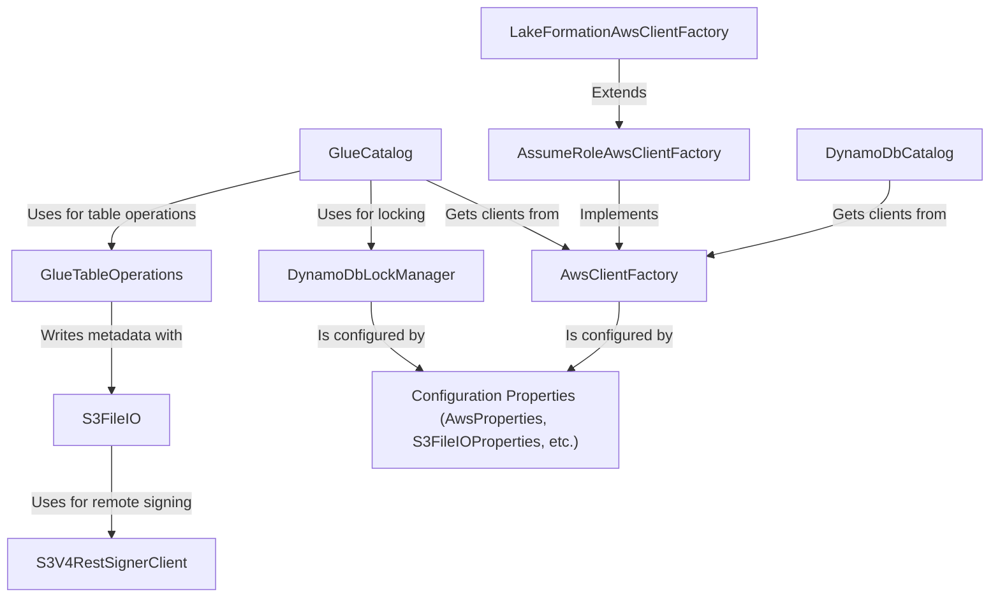

# Tutorial: aws

This project enables Apache Iceberg to use *Amazon Web Services (AWS)* as its foundation. It allows you to store your table data in **Amazon S3** and manage your table's *metastore* using either the **AWS Glue Data Catalog** or **Amazon DynamoDB**. The system is highly configurable, supporting various security models like assuming IAM roles or integrating with **AWS Lake Formation** for fine-grained access control. It ensures data consistency and transactional integrity through atomic commits and distributed locking, making it possible to build reliable, large-scale data lakes on AWS.

**Source Repository:** [None](None)

## Chapters

1. [Configuration Properties (AwsProperties, S3FileIOProperties, etc.)
](01_configuration_properties__awsproperties__s3fileioproperties__etc___.md)
2. [GlueCatalog
](02_gluecatalog_.md)
3. [GlueTableOperations
](03_gluetableoperations_.md)
4. [S3FileIO
](04_s3fileio_.md)
5. [DynamoDbLockManager
](05_dynamodblockmanager_.md)
6. [DynamoDbCatalog
](06_dynamodbcatalog_.md)
7. [AwsClientFactory
](07_awsclientfactory_.md)
8. [AssumeRoleAwsClientFactory
](08_assumeroleawsclientfactory_.md)
9. [LakeFormationAwsClientFactory
](09_lakeformationawsclientfactory_.md)
10. [S3V4RestSignerClient
](10_s3v4restsignerclient_.md)

---

Generated by [AI Codebase Knowledge Builder](https://github.com/The-Pocket/Tutorial-Codebase-Knowledge)