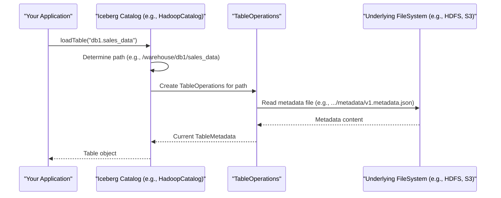

# Chapter 1: Catalog (`Catalog`, `BaseMetastoreCatalog`)

Welcome to your first step in understanding Apache Iceberg's core concepts! In this chapter, we'll explore the **Catalog**.

Imagine you're in a massive library filled with thousands of books. How would you find a specific book? You'd probably look it up in the library's catalog, which tells you where each book is located. In the world of data, especially big data, an Iceberg **Catalog** plays a very similar role.

## What Problem Does a Catalog Solve?

Let's say you're working with a data warehouse. You might have hundreds or even thousands of datasets, which we call "tables" in Iceberg. These tables could be about customer orders, product inventory, website logs, and so on.

Without a catalog, managing these tables would be a nightmare!
*   How would you find a table named `prod_db.fact_sales`?
*   How would you know where its data files are actually stored?
*   How would you create a new table or delete an old one in an organized way?

This is where the Iceberg Catalog comes in. It acts as the central **directory** or **librarian** for all your Iceberg tables.

## Key Ideas about Catalogs

1.  **Manages Tables and Namespaces**:
    *   A **Table** in Iceberg is a collection of data organized with a schema (like columns in a spreadsheet).
    *   A **Namespace** is like a folder or a database that groups related tables. For example, you might have a namespace `marketing` for all marketing-related tables, and another `sales` for sales data. A table's full name, like `sales.quarterly_reports`, includes its namespace (`sales`) and its name (`quarterly_reports`). This full name is often called a `TableIdentifier`.

2.  **Core Operations**: The Catalog is responsible for fundamental actions:
    *   **Creating tables**: When you want to store new data.
    *   **Loading tables**: When you need to read or write data to an existing table.
    *   **Dropping tables**: When a table is no longer needed.
    *   **Listing tables**: To see what tables exist in a particular namespace.
    *   It can also manage **views**, which are like saved queries over tables.

3.  **Different Types of Catalogs**: Iceberg is designed to work with various existing data systems. Because of this, there are different *implementations* of the Catalog:
    *   `HadoopCatalog`: Manages tables directly on a file system like HDFS or S3, organizing them as directories.
    *   `HiveCatalog`: Integrates with Apache Hive Metastore, allowing you to manage Iceberg tables using Hive's existing infrastructure.
    *   `RESTCatalog`: Communicates with an Iceberg REST service, often used in cloud environments.
    *   And others like `JdbcCatalog`, `GlueCatalog` (for AWS), etc.

    The beauty is, no matter which catalog implementation you use, you interact with it through a common `Catalog` interface in Iceberg. This means your code to load a table looks the same whether it's a `HadoopCatalog` or a `HiveCatalog`.

## How to Use a Catalog

Let's look at some common ways you'd interact with a catalog. We'll use a conceptual example. Imagine we want to use a `HadoopCatalog`, which stores tables as directories in a file system.

### 1. Getting a Catalog Instance

First, you need to tell Iceberg what kind of catalog you want to use and how to configure it. `CatalogUtil` is a helper class for this.

```java
// main/java/org/apache/iceberg/CatalogUtil.java
// (Simplified snippet focusing on usage)
import org.apache.iceberg.catalog.Catalog;
import java.util.Map;
import org.apache.iceberg.hadoop.HadoopCatalog; // Specific catalog example
import org.apache.iceberg.relocated.com.google.common.collect.ImmutableMap;

// ... other imports

public class CatalogUtil {
  // ... other methods

  public static Catalog buildIcebergCatalog(String name, Map<String, String> options, Object conf) {
    String catalogImpl = options.get(CatalogProperties.CATALOG_IMPL);
    if (catalogImpl == null) {
      String catalogType = PropertyUtil.propertyAsString(options, ICEBERG_CATALOG_TYPE, ICEBERG_CATALOG_TYPE_HIVE);
      // Logic to determine catalogImpl based on 'catalogType' (e.g., "hadoop", "hive")
      // For "hadoop", catalogImpl becomes "org.apache.iceberg.hadoop.HadoopCatalog"
      // ...
    }
    // ...
    return loadCatalog(catalogImpl, name, options, conf);
  }

  public static Catalog loadCatalog(
      String impl, String catalogName, Map<String, String> properties, Object hadoopConf) {
    // ... loads the class specified by 'impl', initializes and returns it
    // For our example, this would create and initialize a HadoopCatalog instance.
    // We'll skip the dynamic loading details for simplicity.
    if ("org.apache.iceberg.hadoop.HadoopCatalog".equals(impl)) {
        HadoopCatalog catalog = new HadoopCatalog();
        // In a real scenario, 'hadoopConf' would be a Hadoop Configuration object
        if (hadoopConf != null) {
            catalog.setConf(hadoopConf);
        }
        catalog.initialize(catalogName, properties);
        return catalog;
    }
    return null; // Simplified
  }
}
```
You would typically use `CatalogUtil.buildIcebergCatalog` like this:

```java
// Your application code
import org.apache.iceberg.CatalogUtil;
import org.apache.iceberg.catalog.Catalog;
import org.apache.iceberg.CatalogProperties;
import java.util.HashMap;
import java.util.Map;

// Configuration for our HadoopCatalog
Map<String, String> properties = new HashMap<>();
properties.put(CatalogProperties.CATALOG_IMPL, "org.apache.iceberg.hadoop.HadoopCatalog"); // For older versions or direct impl
// Or using the type shorthand (preferred for newer versions)
// properties.put(CatalogUtil.ICEBERG_CATALOG_TYPE, CatalogUtil.ICEBERG_CATALOG_TYPE_HADOOP);
properties.put(CatalogProperties.WAREHOUSE_LOCATION, "file:///tmp/iceberg_warehouse");
// 'hadoopConf' would be your Hadoop Configuration object, or null if not needed/using local fs
Object hadoopConf = null; // Or new org.apache.hadoop.conf.Configuration();

Catalog catalog = CatalogUtil.buildIcebergCatalog("my_local_catalog", properties, hadoopConf);
System.out.println("Catalog loaded: " + catalog.name());
```
This code tells Iceberg to create a `HadoopCatalog` named `my_local_catalog` that will store its tables under the `/tmp/iceberg_warehouse` directory on your local filesystem.

### 2. Listing Tables

Once you have a catalog, you can ask it to list tables in a specific namespace.

```java
import org.apache.iceberg.catalog.Namespace;
import org.apache.iceberg.catalog.TableIdentifier;
import java.util.List;

// Assume 'catalog' is the instance from the previous step

Namespace myNamespace = Namespace.of("database1");
List<TableIdentifier> tables = catalog.listTables(myNamespace);

if (tables.isEmpty()) {
    System.out.println("No tables found in namespace: " + myNamespace);
} else {
    System.out.println("Tables in " + myNamespace + ":");
    for (TableIdentifier tableId : tables) {
        System.out.println("- " + tableId.name());
    }
}
```
This would print the names of all tables found within the `database1` namespace (which, for `HadoopCatalog`, corresponds to the `/tmp/iceberg_warehouse/database1/` directory).

### 3. Loading a Table

To work with a specific table (e.g., read its data or schema), you load it using its `TableIdentifier`.

```java
import org.apache.iceberg.Table;
import org.apache.iceberg.catalog.TableIdentifier;
// Assume 'catalog' is the instance

TableIdentifier tableId = TableIdentifier.of("database1", "my_table");
try {
    Table table = catalog.loadTable(tableId);
    System.out.println("Loaded table: " + table.name());
    System.out.println("Table location: " + table.location());
    // Now you can work with the 'table' object, e.g., read its schema, data, etc.
    // This involves other Iceberg concepts like TableOperations and TableMetadata,
    // which we'll cover in [Chapter 2: Table Operations (`TableOperations`)](02_table_operations___tableoperations___.md)
    // and [Chapter 3: Table Metadata (`TableMetadata`)](03_table_metadata___tablemetadata___.md).
} catch (org.apache.iceberg.exceptions.NoSuchTableException e) {
    System.err.println("Table not found: " + tableId);
}
```
This attempts to load the table `database1.my_table`. If it exists, you get a `Table` object.

### 4. Creating a Table

To create a new table, you need to define its structure, called a [Schema (`Schema`, `SchemaParser`, `SchemaUpdate`)](04_schema___schema____schemaparser____schemaupdate___.md).

```java
import org.apache.iceberg.Schema;
import org.apache.iceberg.types.Types;
// Assume 'catalog' is the instance and 'tableId' is defined

// Define a simple schema for our new table
Schema schema = new Schema(
    Types.NestedField.required(1, "id", Types.LongType.get(), "Unique ID"),
    Types.NestedField.optional(2, "data", Types.StringType.get(), "Data value")
);

try {
    Table newTable = catalog.createTable(tableId, schema);
    System.out.println("Created new table: " + newTable.name());
} catch (org.apache.iceberg.exceptions.AlreadyExistsException e) {
    System.err.println("Table already exists: " + tableId);
}
```
This creates a new Iceberg table named `my_table` in the `database1` namespace with two columns: `id` and `data`.

### 5. Dropping a Table

```java
// Assume 'catalog' is the instance and 'tableId' is defined

boolean dropped = catalog.dropTable(tableId, true); // 'true' to purge data
if (dropped) {
    System.out.println("Table dropped: " + tableId);
} else {
    System.out.println("Table not found or not dropped: " + tableId);
}
```
This removes the table `database1.my_table` from the catalog. The `true` argument means "also delete all the data files associated with this table."

## Under the Hood: `BaseMetastoreCatalog` and Implementations

Many Iceberg catalog implementations, like `HadoopCatalog` or `HiveCatalog`, extend a common abstract class called `BaseMetastoreCatalog`. This class provides a lot of the shared logic for how catalogs operate.

```java
// src/main/java/org/apache/iceberg/BaseMetastoreCatalog.java
// Simplified to show core idea
public abstract class BaseMetastoreCatalog implements Catalog /* ... */ {
    // ... other methods and fields

    @Override
    public Table loadTable(TableIdentifier identifier) {
        // 1. Check if the identifier is valid (e.g., not a metadata table initially)
        if (isValidIdentifier(identifier)) {
            // 2. Get the specific "TableOperations" for this table.
            //    This is where concrete catalogs (like HadoopCatalog) define HOW to access table metadata.
            TableOperations ops = newTableOps(identifier);

            // 3. Check if the table metadata actually exists
            if (ops.current() == null) { // ops.current() gives the current TableMetadata
                // (Logic to handle if it's a metadata table name, or throw NoSuchTableException)
                // ...
                throw new NoSuchTableException("Table does not exist: %s", identifier);
            } else {
                // 4. Create a Table object using the operations and name.
                //    MetricsReporter is for collecting metrics, covered later.
                return new BaseTable(ops, fullTableName(name(), identifier), metricsReporter());
            }
        }
        // ... (logic for loading special metadata tables, or throwing exception)
        throw new NoSuchTableException("Invalid table identifier: %s", identifier);
    }

    // Concrete catalogs MUST implement this to define how to get TableOperations
    protected abstract TableOperations newTableOps(TableIdentifier tableIdentifier);

    // Concrete catalogs MUST implement this to define the default storage path for a table
    protected abstract String defaultWarehouseLocation(TableIdentifier tableIdentifier);

    // ... other helper methods like isValidIdentifier, fullTableName etc.
}
```
The key things to note:
*   `BaseMetastoreCatalog` defines a template for loading tables.
*   The `newTableOps(identifier)` method is abstract. Each specific catalog (like `HadoopCatalog`) must provide its own way to create [Table Operations (`TableOperations`)](02_table_operations___tableoperations___.md). This `TableOperations` object knows how to read and write the table's [Table Metadata (`TableMetadata`)](03_table_metadata___tablemetadata___.md).
*   Similarly, `defaultWarehouseLocation(identifier)` tells the catalog where a table's files should be stored if not specified otherwise.

Let's see how `HadoopCatalog` implements `defaultWarehouseLocation`:

```java
// src/main/java/org/apache/iceberg/hadoop/HadoopCatalog.java
// Simplified snippet
public class HadoopCatalog extends BaseMetastoreCatalog /* ... */ {
    private String warehouseLocation; // e.g., "file:///tmp/iceberg_warehouse"
    // ... constructor, initialize method sets warehouseLocation ...

    @Override
    protected String defaultWarehouseLocation(TableIdentifier tableIdentifier) {
        String tableName = tableIdentifier.name();
        StringBuilder sb = new StringBuilder();

        // Starts with the main warehouse path
        sb.append(warehouseLocation).append('/');
        // Adds namespace levels (database parts)
        for (String level : tableIdentifier.namespace().levels()) {
            sb.append(level).append('/');
        }
        // Finally, appends the table name
        sb.append(tableName);

        // Example: if warehouseLocation is "/tmp/warehouse",
        // and tableIdentifier is "db1.sales",
        // this returns "/tmp/warehouse/db1/sales"
        return sb.toString();
    }

    // HadoopCatalog also implements newTableOps to return HadoopTableOperations
    // which knows how to read/write metadata files from the Hadoop FileSystem.
    // ...
}
```
So, when you call `catalog.loadTable(TableIdentifier.of("db1", "sales"))` on a `HadoopCatalog` configured with warehouse `/tmp/warehouse`:
1.  `BaseMetastoreCatalog.loadTable` is called.
2.  It calls `HadoopCatalog.newTableOps(TableIdentifier.of("db1", "sales"))`.
3.  `HadoopCatalog.newTableOps` internally uses `defaultWarehouseLocation` to figure out the table path is `/tmp/warehouse/db1/sales`. It then creates a `HadoopTableOperations` object pointing to this path.
4.  `HadoopTableOperations` reads the metadata file (e.g., `/tmp/warehouse/db1/sales/metadata/vN.metadata.json`).
5.  A `Table` object is returned to you.

Here's a simplified sequence of what happens:



### Enhancing Catalogs: `CachingCatalog`

Sometimes, loading table metadata can be slow, especially if it involves network calls (like with `HiveCatalog` or `RESTCatalog`). Iceberg provides a `CachingCatalog` that can wrap another catalog to speed things up.

```java
// src/main/java/org/apache/iceberg/CachingCatalog.java
// Simplified
public class CachingCatalog implements Catalog {
    private final Catalog catalog; // The "real" catalog being wrapped
    private final Cache<TableIdentifier, Table> tableCache; // The cache

    private CachingCatalog(Catalog catalog, /* ... other params ... */) {
        this.catalog = catalog;
        this.tableCache = Caffeine.newBuilder() /* ... configure cache ... */ .build();
    }

    public static Catalog wrap(Catalog catalog, long expirationIntervalMillis) {
        // ...
        return new CachingCatalog(catalog, true, expirationIntervalMillis);
    }

    @Override
    public Table loadTable(TableIdentifier ident) {
        // 1. Try to get the table from the cache
        Table cached = tableCache.getIfPresent(ident);
        if (cached != null) {
            return cached; // Cache hit! Return quickly.
        }

        // 2. If not in cache, load from the real catalog and put it in the cache
        Table table = tableCache.get(ident, catalog::loadTable); // catalog::loadTable is like () -> catalog.loadTable(ident)
        // ... (logic for special metadata tables)
        return table;
    }

    // Other methods (createTable, dropTable, etc.) will also interact with the
    // underlying catalog and potentially invalidate cache entries.
    // ...
}
```
You can use `CachingCatalog.wrap(myExistingCatalog, cacheExpirationTime)` to easily add caching to any catalog you're using, making subsequent loads of the same table much faster.

## Conclusion

The Catalog is your gateway to interacting with Iceberg tables. It provides a unified way to manage tables (and views) regardless of where or how their metadata is actually stored. It handles the "librarian" tasks of finding, creating, and organizing your datasets.

Key takeaways:
*   Catalogs manage tables within namespaces.
*   They provide fundamental operations like `loadTable`, `createTable`, `listTables`, and `dropTable`.
*   Different implementations (`HadoopCatalog`, `HiveCatalog`, `RESTCatalog`, etc.) allow Iceberg to integrate with various metastore services.
*   `BaseMetastoreCatalog` provides a common structure for many catalog types, delegating specific storage interactions to methods like `newTableOps`.
*   Wrappers like `CachingCatalog` can enhance catalog functionality.

Now that you understand how Iceberg finds and accesses tables via the Catalog, the next step is to learn what happens once a table is "loaded." This involves understanding its internal structure and how operations are performed on it.

Ready to dive deeper? Let's move on to [Chapter 2: Table Operations (`TableOperations`)](02_table_operations___tableoperations___.md).

---

Generated by [AI Codebase Knowledge Builder](https://github.com/The-Pocket/Tutorial-Codebase-Knowledge)