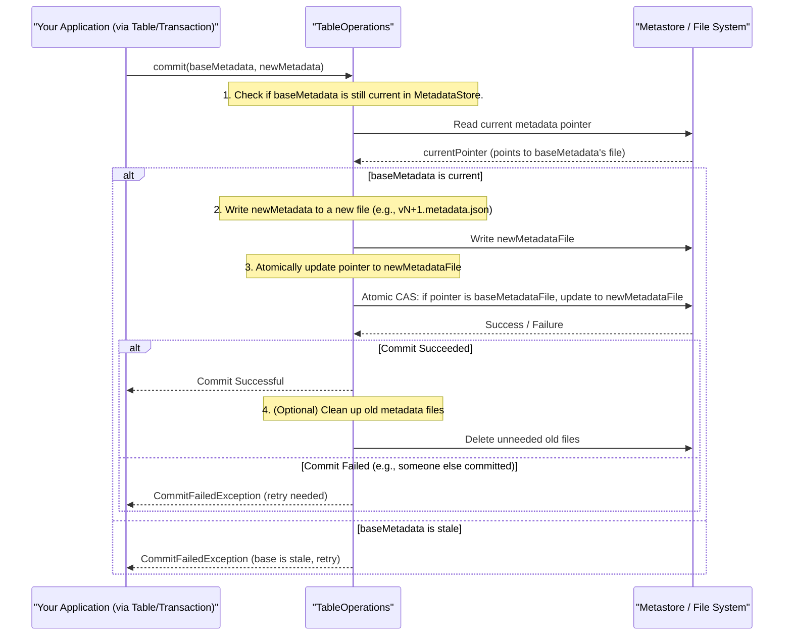

# Chapter 2: Table Operations (`TableOperations`)

Welcome back! In [Chapter 1: Catalog (`Catalog`, `BaseMetastoreCatalog`)](01_catalog___catalog____basemetastorecatalog___.md), we learned how Iceberg uses a Catalog to find and manage your tables, much like a library's main directory helps you find a book collection. Now, once the Catalog has helped us "locate" a specific table, what's next? How does Iceberg manage the *actual content and state* of that individual table?

That's where **`TableOperations`** comes in. Think of it as the **chief librarian specifically responsible for one single book collection (an Iceberg table)**. This librarian doesn't just know where the collection is; they manage its entire lifecycle and current state.

## What Problem Does `TableOperations` Solve?

Imagine our "book collection" (the table) is very active.
*   New "books" (data files) are constantly being added.
*   Sometimes, the "index card" (schema or properties) for the collection needs to be updated.
*   Multiple "assistant librarians" (different users or processes) might be trying to update the collection at the same time.

How do we ensure that:
1.  Everyone always knows what the most up-to-date version of the collection's index card ([Table Metadata (`TableMetadata`)](03_table_metadata___tablemetadata___.md)) is?
2.  When changes are made (like adding new data or updating the schema), they happen reliably and completely (atomically)? We don't want a half-updated index card that causes confusion!
3.  If multiple assistants try to update the index card simultaneously, they don't mess up each other's work or corrupt the card?

`TableOperations` is the engine that handles these critical tasks for an individual table. It abstracts the "how" of interacting with a table's state, regardless of where that table's information is stored.

## Key Responsibilities of `TableOperations`

The `TableOperations` interface defines a contract for how Iceberg interacts with a table's underlying metadata. Here are its main jobs:

1.  **Reading the Current State (`current()` method):**
    *   It knows how to fetch the table's current [Table Metadata (`TableMetadata`)](03_table_metadata___tablemetadata___.md). This metadata is like the master description of the table, including its schema, partitioning, snapshots, etc.
    *   When you first load a table, `TableOperations` provides its last known state.

2.  **Refreshing to the Latest State (`refresh()` method):**
    *   Tables can change if other users or processes modify them. The `refresh()` method checks for any updates to the table's metadata and returns the absolute latest version.

3.  **Atomically Committing Changes (`commit()` method):**
    *   This is the most crucial part! When you make changes to a table (like adding data, deleting data, or altering the schema), these changes result in a new version of the [Table Metadata (`TableMetadata`)](03_table_metadata___tablemetadata___.md).
    *   `TableOperations` ensures that "committing" this new metadata is an **atomic operation**. This means the change either succeeds entirely, or it fails entirely, leaving the table in its previous valid state. There's no in-between, half-done state. This is vital for preventing data corruption, especially when multiple operations happen concurrently.

4.  **Providing File System Access (`io()` method):**
    *   It provides a [FileIO (`FileIO`)](09_fileio___fileio___.md) object, which is Iceberg's way of reading and writing files (data files, manifest files, metadata files) regardless of the underlying storage system (like HDFS, S3, local disk).

5.  **Managing Metadata File Locations (`metadataFileLocation()` method):**
    *   It knows where to read and write the table's metadata files. For example, `v1.metadata.json`, `v2.metadata.json`, etc.

6.  **Generating New Snapshot IDs (`newSnapshotId()` method):**
    *   Each change to a table creates a new [Snapshot (`Snapshot`, `BaseSnapshot`)](05_snapshot___snapshot____basesnapshot___.md). `TableOperations` is responsible for generating unique IDs for these snapshots.

## How `TableOperations` Fits In

Remember from Chapter 1 how a `Catalog` loads a table?
When you call `catalog.loadTable(...)`, the catalog doesn't just give you raw files. It figures out *which* `TableOperations` implementation to use for that specific table (based on catalog type, e.g., `HadoopCatalog` uses `HadoopTableOperations`). Then, it creates a `Table` object, passing this specialized `TableOperations` instance to it.

```java
// Simplified from BaseMetastoreCatalog.loadTable (as seen in Chapter 1)
// Catalog determines the right 'ops' for the table
TableOperations ops = newTableOps(identifier); // e.g., new HadoopTableOperations(...)

// Catalog then creates a Table object, giving it these operations
Table table = new BaseTable(ops, tableName);
```
Now, the `Table` object you interact with uses its internal `TableOperations` instance to manage its state.

```java
// Simplified concept of how a Table object uses TableOperations
// (Actual class is often BaseTable or a similar implementation)
public class MyTableRepresentation { // Represents the 'Table' object you use
    private final TableOperations ops; // The specific "librarian" for this table
    private TableMetadata currentMetadata;

    public MyTableRepresentation(TableOperations ops) {
        this.ops = ops;
        this.currentMetadata = ops.current(); // Get initial metadata
    }

    public TableMetadata getCurrentMetadata() {
        return this.currentMetadata;
    }

    public TableMetadata refreshMetadata() {
        // Ask the "librarian" to check for the newest index card
        this.currentMetadata = ops.refresh();
        return this.currentMetadata;
    }

    // When you perform actions that change the table (e.g., adding data),
    // those actions (often via a Transaction) will eventually call:
    // ops.commit(oldMetadata, newProposedMetadata);
    // to make the changes official and atomic.
}
```
So, you, as a user of the `Table` object, typically don't call `TableOperations` methods directly. Instead, the `Table` object (or a `Transaction` object working on that table) uses `TableOperations` behind the scenes.

## The `TableOperations` Interface

Let's look at the core `TableOperations` interface to see its contract.

```java
// src/main/java/org/apache/iceberg/TableOperations.java
// (Simplified for brevity)
package org.apache.iceberg;

import org.apache.iceberg.io.FileIO;
import org.apache.iceberg.io.LocationProvider;

public interface TableOperations {

  // Get the currently loaded metadata. Might not be the absolute latest.
  TableMetadata current();

  // Get the latest metadata, checking for updates.
  TableMetadata refresh();

  // Atomically commit changes from a 'base' metadata to a 'new' metadata.
  void commit(TableMetadata base, TableMetadata metadata);

  // Get the FileIO for this table's storage.
  FileIO io();

  // Get the full path for a metadata file (e.g., "v3.metadata.json").
  String metadataFileLocation(String fileName);

  // Get a provider for new data file locations.
  LocationProvider locationProvider();

  // Get a new, unique ID for a snapshot.
  long newSnapshotId();

  // ... other methods like encryption(), temp()
}
```
This interface clearly defines the key actions our "chief librarian" must be able to perform.

## Inside an Atomic Commit: The Heart of `TableOperations`

The `commit(TableMetadata base, TableMetadata metadata)` method is where the magic happens for ensuring data integrity. How does it work?

Most `TableOperations` implementations use a strategy similar to **optimistic concurrency control with an atomic swap**. Here's a simplified idea:

1.  **Start with a base:** You have the current `TableMetadata` (let's call it `base`).
2.  **Prepare changes:** Your operation (e.g., adding data files) creates a new proposed `TableMetadata` (let's call it `metadata`) that includes these changes. This new `metadata` also references the `base` it was derived from.
3.  **Write new metadata file:** The `TableOperations` implementation writes this new `metadata` object to a uniquely named file in a temporary or pending location (e.g., `s3://bucket/table/metadata/uuid.metadata.json`).
4.  **Atomic Swap:** This is the critical step. `TableOperations` attempts to atomically update a central pointer (which could be a file, a database record, or an entry in a metastore like Hive Metastore or a REST service) to now point to this new metadata file.
    *   **Check:** Before swapping, it usually re-checks if the `base` metadata it started with is *still* the current one. If someone else committed a change in the meantime, our `base` is stale, and the commit usually fails, forcing the operation to retry with the newer base.
    *   **Swap:** If the `base` is still current, the pointer is updated. This update itself must be atomic (all or nothing).
5.  **Cleanup (Optional but good practice):** Old, now-unreferenced metadata files might be cleaned up.

Here's a visual:



This atomic swap ensures that there's never a moment when the table is in an inconsistent state. Users always see a valid, complete version of the table.

## Different "Librarians": `TableOperations` Implementations

Iceberg provides different `TableOperations` implementations to work with various storage and catalog systems:

*   **`BaseMetastoreTableOperations`**:
    *   This is an abstract class (found in `src/main/java/org/apache/iceberg/BaseMetastoreTableOperations.java`) that provides common logic for operations that interact with a central metastore (like Hive Metastore, or a custom one).
    *   It handles much of the retry logic for reading metadata and the general structure of a commit.
    *   The actual atomic commit step (`doCommit()`) and metadata refresh (`doRefresh()`) are often left to concrete subclasses.

    ```java
    // src/main/java/org/apache/iceberg/BaseMetastoreTableOperations.java (Conceptual Snippet)
    public abstract class BaseMetastoreTableOperations implements TableOperations {
        private TableMetadata currentMetadata;
        // ...

        @Override
        public void commit(TableMetadata base, TableMetadata metadata) {
            if (base != current()) { // Check if base is stale
                throw new CommitFailedException("Cannot commit: stale table metadata");
            }
            if (base == metadata) return; // No changes

            // Concrete implementation does the actual atomic pointer swap
            doCommit(base, metadata);

            // Mark that we need to refresh to see our own commit
            requestRefresh();
        }

        // Subclasses must implement this atomic part
        protected abstract void doCommit(TableMetadata base, TableMetadata metadata);
        // Subclasses must implement how to get the latest metadata from the store
        protected abstract void doRefresh();
        // ...
    }
    ```

*   **`HadoopTableOperations`**:
    *   Used with `HadoopCatalog` or when table metadata is stored directly on a Hadoop-compatible file system (like HDFS, S3 with S3A, local FS).
    *   Its "atomic swap" for commits often relies on an **atomic rename** operation if the file system supports it, or by writing to a `version-hint.txt` file.
    *   It writes metadata files like `v1.metadata.json`, `v2.metadata.json` in a `metadata` subdirectory of the table.

    ```java
    // src/main/java/org/apache/iceberg/hadoop/HadoopTableOperations.java (Conceptual Snippet)
    public class HadoopTableOperations implements TableOperations {
        private final Path location; // Table's root path
        // ...

        @Override
        public void commit(TableMetadata base, TableMetadata metadata) {
            // ... (staleness checks similar to BaseMetastoreTableOperations) ...

            // 1. Write new metadata to a temporary unique file
            Path tempMetadataFile = /* ... unique path ... */ ;
            TableMetadataParser.write(metadata, io().newOutputFile(tempMetadataFile.toString()));

            // 2. Determine the final path for the next version
            int nextVersion = currentVersion() + 1;
            Path finalMetadataFile = /* ... path for v{nextVersion}.metadata.json ... */ ;

            // 3. Atomically rename temp file to final file (the "commit")
            // This relies on filesystem's atomic rename. If it fails, table state is unchanged.
            boolean success = fs.rename(tempMetadataFile, finalMetadataFile);
            if (!success) {
                throw new CommitFailedException("Failed to rename metadata file");
            }

            // (Optionally) Update a version hint file for faster loads next time
            writeVersionHint(nextVersion);
            // ...
        }
        // ...
    }
    ```

*   **`RESTTableOperations`**:
    *   Used with the `RESTCatalog`. It communicates with an Iceberg REST server to fetch metadata and commit changes.
    *   The atomic commit is handled by the REST server, which typically uses its own backend database or locking mechanism.

    ```java
    // src/main/java/org/apache/iceberg/rest/RESTTableOperations.java (Conceptual Snippet)
    class RESTTableOperations implements TableOperations {
        private final RESTClient client; // HTTP client
        private final String tablePath;  // API path for the table
        // ...

        @Override
        public void commit(TableMetadata base, TableMetadata metadata) {
            // ... (staleness checks and request preparation) ...

            // 1. Prepare an UpdateTableRequest with new metadata and requirements
            UpdateTableRequest request = new UpdateTableRequest(requirements, updates);

            // 2. Send POST request to the REST server
            // The server performs the atomic commit.
            LoadTableResponse response = client.post(tablePath, request, ...);

            // 3. Update local 'current' metadata based on server's response
            updateCurrentMetadata(response);
        }
        // ...
    }
    ```

*   **`StaticTableOperations`**:
    *   A special case. It's used to load a table as of a *specific metadata file location*.
    *   It's read-only: `commit()` operations will fail. This is useful for looking at historical versions of a table without worrying about changes.

    ```java
    // src/main/java/org/apache/iceberg/StaticTableOperations.java
    public class StaticTableOperations implements TableOperations {
        private final String metadataFileLocation; // Path to a specific metadata.json
        // ...

        @Override
        public TableMetadata current() {
            // Reads and returns metadata from the fixed metadataFileLocation
            return TableMetadataParser.read(io, metadataFileLocation);
        }

        @Override
        public TableMetadata refresh() {
            return current(); // It's static, so refresh does nothing.
        }

        @Override
        public void commit(TableMetadata base, TableMetadata metadata) {
            // This is a read-only view of a specific metadata file.
            throw new UnsupportedOperationException("Cannot modify a static table");
        }
        // ...
    }
    ```

The beauty of the `TableOperations` interface is that the `Table` object, and your application code, doesn't need to know these nitty-gritty details. It just interacts with the standard `TableOperations` contract, and the specific implementation handles the rest.

## Why is this "Atomic Commit" So Important?

Imagine two users trying to add data to the same table at nearly the same time.
*   User A reads table state (version 10).
*   User B reads table state (version 10).
*   User A adds data, creates new metadata (based on v10, will become v11), and commits. The table is now at v11.
*   User B, unaware of User A's change, tries to commit their changes based on v10.

Without atomic commits and staleness checks, User B's commit might overwrite User A's changes, leading to data loss or an inconsistent table!
`TableOperations` prevents this by:
1.  Ensuring User B's `commit(v10_metadata, new_v10_based_metadata)` will likely fail because the table is no longer at v10 (it's at v11).
2.  User B's application would then typically `refresh()` to get v11, re-apply its changes on top of v11, and attempt to commit again (to create v12).

This mechanism is fundamental to Iceberg's ability to provide ACID-like transaction guarantees on data lakes.

## Conclusion

`TableOperations` is the unsung hero that works diligently behind the scenes for every Iceberg table. It's the engine ensuring that a table's state is managed reliably, changes are applied atomically, and concurrent operations don't lead to chaos. It's the specialized librarian meticulously maintaining the integrity of their assigned book collection.

Key Takeaways:
*   `TableOperations` manages the lifecycle and state of a single Iceberg table.
*   It provides methods to get current metadata (`current()`), refresh to the latest (`refresh()`), and atomically commit changes (`commit()`).
*   The `commit()` operation is crucial for data integrity and handling concurrent updates.
*   Different implementations (`HadoopTableOperations`, `RESTTableOperations`, etc.) adapt these operations to various backend storage and catalog systems.
*   You typically interact with `TableOperations` indirectly through a `Table` object or a `Transaction`.

Now that we understand how a table's state is managed and committed, what exactly *is* this "state"? What information is contained within the [Table Metadata (`TableMetadata`)](03_table_metadata___tablemetadata___.md) that `TableOperations` works so hard to protect? Let's find out in the next chapter!

Next up: [Chapter 3: Table Metadata (`TableMetadata`)](03_table_metadata___tablemetadata___.md)

---

Generated by [AI Codebase Knowledge Builder](https://github.com/The-Pocket/Tutorial-Codebase-Knowledge)