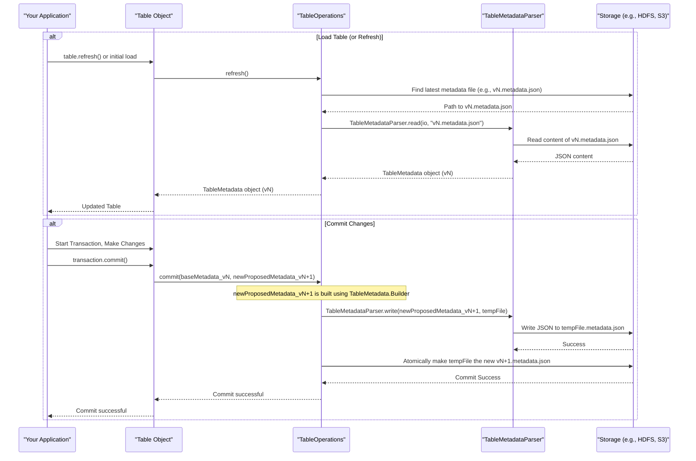

# Chapter 3: Table Metadata (`TableMetadata`)

In [Chapter 2: Table Operations (`TableOperations`)](02_table_operations___tableoperations___.md), we learned about `TableOperations` as the "chief librarian" for a single Iceberg table, responsible for managing its state and ensuring changes are made safely (atomically). But what exactly *is* this "state" that `TableOperations` manages? What information does this librarian so carefully protect and update?

That's where **`TableMetadata`** comes in. Think of it as the **master blueprint or the comprehensive instruction manual for an Iceberg table**. It's a single, self-contained document that tells Iceberg everything it needs to know about a specific dataset.

## What is Table Metadata? The Blueprint of Your Data

Imagine you're building a complex LEGO model. You wouldn't just start snapping bricks together randomly, right? You'd use the instruction booklet! This booklet shows you:
*   What the final model should look like.
*   A list of all the pieces (parts list).
*   Step-by-step instructions on how to assemble it.
*   Maybe even different versions if it's a "3-in-1" model.

`TableMetadata` is precisely this for an Iceberg table. It's a file (usually in JSON format) that holds all the critical information about your table. Let's see what kind of information it contains:

1.  **Schema**:
    *   What are the columns in your table (e.g., `user_id`, `product_name`, `timestamp`)?
    *   What are their data types (e.g., `long`, `string`, `timestamp`)?
    *   Are some columns required, while others can be optional?
    *   This is like the "parts list" of your LEGO model, defining each component. We'll dive deep into schemas in [Chapter 4: Schema (`Schema`, `SchemaParser`, `SchemaUpdate`)](04_schema___schema____schemaparser____schemaupdate___.md).

2.  **Partition Specification (Partition Spec)**:
    *   How is the data in the table organized or divided into smaller, more manageable chunks?
    *   For example, a table of sales data might be partitioned by `year` and `month`. This helps queries run faster by only looking at relevant data.
    *   This is like knowing how the LEGO model is divided into major sections in the instructions.

3.  **Snapshots (and the Current Snapshot)**:
    *   Iceberg keeps track of every version of your table's data. Each version is called a **Snapshot**.
    *   When you add data, delete data, or change data, a new snapshot is created.
    *   `TableMetadata` stores a list of all these snapshots and, most importantly, tells you which snapshot is the **current** one (the live version of your table).
    *   This is like having instructions for different versions of your LEGO model, or saved checkpoints as you build it. We'll explore snapshots in [Chapter 5: Snapshot (`Snapshot`, `BaseSnapshot`)](05_snapshot___snapshot____basesnapshot___.md).

4.  **Sort Orders**:
    *   Within each data file, how is the data sorted? For instance, data might be sorted by `timestamp` to speed up time-based queries.
    *   `TableMetadata` can store information about these sort orders.

5.  **History of Changes**:
    *   It maintains a log of all previous snapshots, allowing you to "time travel" back to earlier versions of your table.
    *   It also keeps a log of previous `TableMetadata` files themselves, tracking how the table's structure (like its schema) has evolved over time.

6.  **Table Properties**:
    *   Various settings and configurations for the table, like default file formats, compression settings, etc.

7.  **Location**: The root path where the table's data and metadata files are stored.

8.  **Unique Table UUID**: A unique identifier for this table, ensuring it's not confused with any other table.

Here's a simplified view of what `TableMetadata` holds:

```mermaid
graph TD
    TableMetadata["TableMetadata (Blueprint)"] --> A["UUID (Unique ID)"]
    TableMetadata --> B["Location (Where it lives)"]
    TableMetadata --> C["Current Schema (Columns & Types)"]
    TableMetadata --> D["List of All Schemas (Evolution History)"]
    TableMetadata --> E["Current Partition Spec (How data is divided)"]
    TableMetadata --> F["List of All Partition Specs"]
    TableMetadata --> G["Current Snapshot ID (Which data version is live)"]
    TableMetadata --> H["List of All Snapshots (Data version history)"]
    TableMetadata --> I["List of Sort Orders"]
    TableMetadata --> J["Properties (Settings)"]
    TableMetadata --> K["History of Metadata Files"]
```



## Immutability: The Golden Rule

A super important concept for `TableMetadata` is **immutability**. This means that once a `TableMetadata` file is written, it is **never changed**.

Think about it: if you make a change directly to the LEGO instruction booklet (like scribbling out a step), you might corrupt it, and anyone else using that booklet would be confused.

Instead, if you want to change the table (add data, modify the schema, etc.):
1.  Iceberg takes the *current* `TableMetadata`.
2.  It applies your changes to create a *brand new version* of the `TableMetadata`.
3.  This new `TableMetadata` file is written out (e.g., `v2.metadata.json`, then `v3.metadata.json`, and so on).
4.  The "current" pointer for the table is then updated to point to this new metadata file.

This immutability is crucial for:
*   **Data Consistency**: Everyone always sees a consistent view of the table.
*   **Time Travel**: Since old `TableMetadata` files (and their corresponding data snapshots) are kept, you can easily query past versions of your table.
*   **Schema Evolution**: You can change your table's schema (e.g., add a column) without rewriting all your old data. The old metadata points to old data with the old schema, and new metadata points to new data (and potentially old data adapted) with the new schema.

## How is `TableMetadata` Used?

You, as a user, typically don't directly manipulate `TableMetadata` files. Instead, you use higher-level Iceberg operations:

*   When you **load a table**, the [Catalog (`Catalog`, `BaseMetastoreCatalog`)](01_catalog___catalog____basemetastorecatalog___.md) uses [Table Operations (`TableOperations`)](02_table_operations___tableoperations___.md) to find and read the *current* `TableMetadata` file. This tells your application what the table looks like and where its data is.
*   When you **commit a change** (e.g., adding new data files, or altering the schema using a [Transaction (`Transaction`, `BaseTransaction`)](08_transaction___transaction____basetransaction___.md)):
    1.  Iceberg starts with the current `TableMetadata` (let's say `vN.metadata.json`).
    2.  It figures out what the *new* `TableMetadata` should look like based on your changes (this will become `vN+1.metadata.json`). This involves creating new [Snapshot (`Snapshot`, `BaseSnapshot`)](05_snapshot___snapshot____basesnapshot___.md) entries, possibly new [Schema (`Schema`, `SchemaParser`, `SchemaUpdate`)](04_schema___schema____schemaparser____schemaupdate___.md) entries, etc.
    3.  [Table Operations (`TableOperations`)](02_table_operations___tableoperations___.md) writes this new `TableMetadata` to a new file.
    4.  `TableOperations` then atomically updates the table's "pointer" to say that `vN+1.metadata.json` is now the current one.

This process ensures that changes are all-or-nothing.

## A Peek Inside: The `TableMetadata` Object and its JSON File

While the actual `TableMetadata` object in Java (from `org.apache.iceberg.TableMetadata`) has many methods and fields, it essentially represents the information stored in a JSON file. This file usually resides in a `metadata` subdirectory within your table's main directory (e.g., `/path/to/table/metadata/v3.metadata.json`).

Here's a *very simplified* conceptual snippet of what a `TableMetadata` JSON file might look like:

```json
{
  "format-version": 2,
  "table-uuid": "a1b2c3d4-e5f6-7890-1234-567890abcdef",
  "location": "file:///tmp/my_iceberg_table",
  "last-updated-ms": 1678886400000,
  "last-column-id": 3,
  "schemas": [
    { "schema-id": 0, "type": "struct", "fields": [
      { "id": 1, "name": "id", "required": true, "type": "long" },
      { "id": 2, "name": "data", "required": false, "type": "string" }
    ]},
    { "schema-id": 1, "type": "struct", "fields": [
      { "id": 1, "name": "id", "required": true, "type": "long" },
      { "id": 2, "name": "data", "required": false, "type": "string" },
      { "id": 3, "name": "category", "required": false, "type": "string" } // New column added
    ]}
  ],
  "current-schema-id": 1, // Using the schema with the 'category' column
  "partition-specs": [
    { "spec-id": 0, "fields": [ /* ... definition of how data is partitioned ... */ ] }
  ],
  "default-spec-id": 0,
  "sort-orders": [
    { "order-id": 0, "fields": [] } // Unsorted
  ],
  "default-sort-order-id": 0,
  "properties": {
    "owner": "data_team",
    "comment": "My first Iceberg table"
  },
  "current-snapshot-id": 12345, // ID of the current snapshot
  "snapshots": [
    { "snapshot-id": 12340, "parent-snapshot-id": -1, "timestamp-ms": 1678880000000, /* ... */ },
    { "snapshot-id": 12345, "parent-snapshot-id": 12340, "timestamp-ms": 1678886400000, /* ... */ }
  ],
  "snapshot-log": [ // History of which snapshot was current at what time
    { "timestamp-ms": 1678880000000, "snapshot-id": 12340 },
    { "timestamp-ms": 1678886400000, "snapshot-id": 12345 }
  ],
  "metadata-log": [ // History of previous metadata files
    { "timestamp-ms": 1678880000000, "metadata-file": "v1.metadata.json" },
    { "timestamp-ms": 1678886400000, "metadata-file": "v2.metadata.json" }
  ]
}
```
This JSON structure contains all the key pieces of information we discussed earlier.

### Reading and Writing: `TableMetadataParser`

Iceberg uses a helper class called `TableMetadataParser` to read these JSON files into `TableMetadata` Java objects and to write `TableMetadata` objects back out to JSON files.

```java
// src/main/java/org/apache/iceberg/TableMetadataParser.java
// Conceptual Usage
import org.apache.iceberg.TableMetadata;
import org.apache.iceberg.io.FileIO;
import org.apache.iceberg.io.InputFile;
import org.apache.iceberg.io.OutputFile;

public class TableMetadataParserExample {

    public static TableMetadata readMetadata(FileIO io, String metadataFilePath) {
        InputFile inputFile = io.newInputFile(metadataFilePath);
        return TableMetadataParser.read(io, inputFile);
        // This reads the JSON, parses it, and returns a TableMetadata object.
    }

    public static void writeMetadata(TableMetadata metadata, FileIO io, String newMetadataFilePath) {
        OutputFile outputFile = io.newOutputFile(newMetadataFilePath);
        TableMetadataParser.write(metadata, outputFile);
        // This converts the TableMetadata object into JSON and writes it to the new file.
        // Note: For atomic commits, operations like HadoopTableOperations handle writing to
        // a temporary file first, then an atomic rename.
    }
}
```
The `TableOperations` implementations (like `HadoopTableOperations` or `RESTTableOperations` from Chapter 2) use `TableMetadataParser` internally as part of their `refresh()` and `commit()` logic.

Here's how it generally flows when you load a table or commit changes:



### Creating New Metadata Versions: `TableMetadata.Builder`

When changes occur (like adding a snapshot after a data write, or evolving the schema), Iceberg doesn't modify the existing `TableMetadata` object. Instead, it creates a new one using `TableMetadata.Builder`.

The builder takes an existing `TableMetadata` object (the "base") and allows you to apply modifications to create a new, distinct `TableMetadata` instance.

```java
// Conceptual example of using the builder
import org.apache.iceberg.TableMetadata;
import org.apache.iceberg.Schema;
import org.apache.iceberg.Snapshot;
// Assume 'currentTableMetadata' is the TableMetadata for vN
// Assume 'newSnapshot' is a newly created Snapshot object

// Start building from the current metadata
TableMetadata.Builder builder = TableMetadata.buildFrom(currentTableMetadata);

// Let's say we added a new snapshot
builder.addSnapshot(newSnapshot);
// If it's the main branch, set it as current
builder.setBranchSnapshot(newSnapshot, SnapshotRef.MAIN_BRANCH); // Or setRef(...)

// Maybe we also updated the schema (e.g., added a column)
// Schema newSchema = ... ;
// builder.setCurrentSchema(newSchema, newSchema.highestFieldId());

// Finalize the new metadata
TableMetadata newTableMetadata = builder.build();
// 'newTableMetadata' is now ready to be written as vN+1.metadata.json
```
This builder pattern is what happens behind the scenes when you use Iceberg's [Transaction (`Transaction`, `BaseTransaction`)](08_transaction___transaction____basetransaction___.md) API to make changes. The transaction collects all your intended modifications, uses the builder to construct the next `TableMetadata`, and then asks `TableOperations` to commit it.

The `TableMetadata` class itself (`src/main/java/org/apache/iceberg/TableMetadata.java`) contains all the fields to store the blueprint information, like:
*   `formatVersion`, `uuid`, `location`
*   `currentSchemaId`, `schemas` (a list of all schema versions)
*   `defaultSpecId`, `specs` (a list of all partition spec versions)
*   `currentSnapshotId`, `snapshots` (a list of `Snapshot` objects)
*   `properties`, `snapshotLog`, `previousFiles` (metadata log)

It provides methods to access all these parts of the blueprint.

## Conclusion

`TableMetadata` is the heart of an Iceberg table. It's the definitive blueprint that describes everything about the table: its structure, its organization, its history, and its current state. Its immutability, combined with the atomic commit mechanism of [Table Operations (`TableOperations`)](02_table_operations___tableoperations___.md), provides the foundation for Iceberg's reliability, consistency, and powerful features like time travel and schema evolution.

Key Takeaways:
*   `TableMetadata` is the complete blueprint for an Iceberg table.
*   It contains the schema, partition specs, snapshot history, current snapshot, sort orders, properties, and metadata history.
*   It is **immutable**: every change creates a new `TableMetadata` version.
*   `TableMetadataParser` is used to read/write these metadata files (typically JSON).
*   `TableMetadata.Builder` is used to create new versions of metadata when changes are applied.
*   This blueprint is critical for ensuring data consistency and enabling advanced features.

Now that we understand what `TableMetadata` is and why it's important, we're ready to look more closely at one of its most fundamental components: the [Schema (`Schema`, `SchemaParser`, `SchemaUpdate`)](04_schema___schema____schemaparser____schemaupdate___.md). Let's explore how Iceberg defines the structure of your data in the next chapter!

Next up: [Chapter 4: Schema (`Schema`, `SchemaParser`, `SchemaUpdate`)](04_schema___schema____schemaparser____schemaupdate___.md)

---

Generated by [AI Codebase Knowledge Builder](https://github.com/The-Pocket/Tutorial-Codebase-Knowledge)