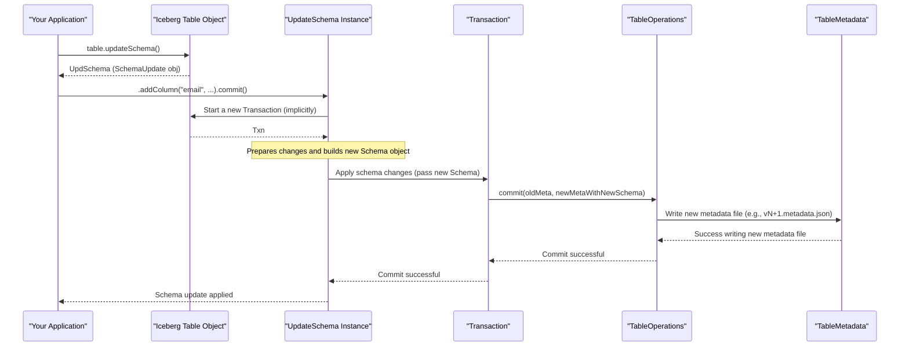

# Chapter 4: Schema (`Schema`, `SchemaParser`, `SchemaUpdate`)

Welcome back! In [Chapter 3: Table Metadata (`TableMetadata`)](03_table_metadata___tablemetadata___.md), we learned that `TableMetadata` is the master blueprint for an Iceberg table. It contains everything Iceberg needs to know, including a critical piece: the **Schema**.

Think of a schema as the detailed floor plan for a house. The `TableMetadata` is the whole binder of architectural drawings, and the schema is the specific page that shows you how many rooms there are, what they're called (e.g., "kitchen," "bedroom"), and perhaps some details about each room (like "kitchen has a sink"). For data, a schema defines the structure: what columns your table has, their names, their data types, and more.

## What's the Big Deal About a Schema?

Imagine you have a spreadsheet or a CSV file. How do you know what each column means? Usually, there's a header row: `product_id,product_name,price,quantity_on_hand`. This header is a basic form of a schema.

In Iceberg, the `Schema` is much more powerful and formally defined. It's the blueprint that dictates:
*   **Column Names**: What each piece of data is called (e.g., `user_id`, `event_timestamp`).
*   **Data Types**: What kind of data each column holds (e.g., a number like `integer` or `long`, text like `string`, a date, or even more complex structures like a `struct` (a group of named fields), a `list` of items, or a `map` of key-value pairs).
*   **Required or Optional**: Whether a column *must* have a value for every row (required) or if it can be empty (optional, i.e., contain a `null` value).
*   **Unique Field IDs**: This is Iceberg's secret sauce! Each column in an Iceberg schema has a unique, persistent ID number. This ID never changes, even if you rename the column.

Why are these unique field IDs so important? They enable **schema evolution** without needing to rewrite your entire dataset. You can:
*   Add new columns.
*   Remove columns.
*   Rename existing columns.
*   Reorder columns.
*   Even change a column's data type (e.g., from an `integer` to a `long`, if it's a compatible change).

Because Iceberg uses these internal IDs to track columns, it can still understand old data files written with a previous version of the schema. It's like knowing that "Room #3" is the kitchen, even if you later decide to call it "Culinary Center" on your floor plan.

## Defining a Schema: The `Schema` Object

In Iceberg, a schema is represented by the `org.apache.iceberg.Schema` class. You typically define it by listing its columns, which are `Types.NestedField` objects from the `org.apache.iceberg.types` package.

Let's create a simple schema for a table that stores user information:

```java
import org.apache.iceberg.Schema;
import org.apache.iceberg.types.Types;

// Define a schema for a 'users' table
Schema userSchema = new Schema(
    Types.NestedField.required(1, "id", Types.LongType.get(), "Unique user ID"),
    Types.NestedField.optional(2, "username", Types.StringType.get(), "Login name"),
    Types.NestedField.optional(3, "registration_date", Types.DateType.get(), "Date of registration"),
    Types.NestedField.optional(4, "preferences",
        Types.MapType.ofOptional(5, 6, // Field IDs for key and value
            Types.StringType.get(),    // Key type: preference name (e.g., "theme")
            Types.StringType.get()     // Value type: preference value (e.g., "dark")
        ), "User preferences"
    )
);

System.out.println("User Schema:");
System.out.println(userSchema.toString());
```

When you run this, you'll see a textual representation of your schema:

```
User Schema:
table {
  1: id: required long (Unique user ID)
  2: username: optional string (Login name)
  3: registration_date: optional date (Date of registration)
  4: preferences: optional map<string, string> (User preferences)
     5: key: optional string
     6: value: optional string
}
```

Let's break down `Types.NestedField.required(1, "id", Types.LongType.get(), "Unique user ID")`:
*   `required`: This field must have a value. You can also use `optional`.
*   `1`: This is the **unique field ID**. It's crucial!
*   `"id"`: The name of the column.
*   `Types.LongType.get()`: The data type of the column (a long integer). Iceberg provides many types in `org.apache.iceberg.types.Types` (like `StringType`, `IntegerType`, `TimestampType`, `StructType`, `ListType`, `MapType`).
*   `"Unique user ID"`: An optional comment or documentation for the field.

Notice the `preferences` map also has field IDs for its key (`5`) and value (`6`). Every part of the schema that represents data gets an ID.

A `Schema` object can also define a set of **identifier fields**, which are like a primary key, uniquely identifying rows. This is a more advanced topic, but the schema holds this information too.

## Saving and Loading Schemas: `SchemaParser`

Since schemas are part of the [Table Metadata (`TableMetadata`)](03_table_metadata___tablemetadata___.md), they need to be stored in those metadata files (which are usually JSON). Iceberg uses `org.apache.iceberg.SchemaParser` to convert `Schema` objects into JSON strings and vice-versa.

```java
import org.apache.iceberg.SchemaParser;
// Assume 'userSchema' is the Schema object from the previous example

// Convert the Schema object to a JSON string
String schemaAsJson = SchemaParser.toJson(userSchema);
System.out.println("\nSchema as JSON:\n" + schemaAsJson);

// Convert the JSON string back to a Schema object
Schema parsedSchema = SchemaParser.fromJson(schemaAsJson);

// Check if the original and parsed schemas are the same
System.out.println("\nIs parsed schema identical to original? " + userSchema.sameSchema(parsedSchema));
```

The output JSON would look something like this (simplified for clarity):

```json
{
  "type" : "struct",
  "fields" : [ {
    "id" : 1, "name" : "id", "required" : true, "type" : "long", "doc" : "Unique user ID"
  }, {
    "id" : 2, "name" : "username", "required" : false, "type" : "string", "doc" : "Login name"
  }, {
    "id" : 3, "name" : "registration_date", "required" : false, "type" : "date", "doc" : "Date of registration"
  }, {
    "id" : 4, "name" : "preferences", "required" : false,
    "type" : {
      "type" : "map", "key-id" : 5, "key" : "string", "value-id" : 6, "value" : "string", "value-required" : false
    }, "doc" : "User preferences"
  } ]
}
```
And the program confirms:
```
Is parsed schema identical to original? true
```
`SchemaParser` ensures that the detailed structure of your schema can be reliably saved and loaded.

## Changing Schemas: `UpdateSchema`

Tables evolve. You might need to add a new column, rename an existing one, or drop one that's no longer used. Iceberg handles these changes through the `UpdateSchema` interface (typically an instance of the `SchemaUpdate` class).

You get an `UpdateSchema` object by calling `table.updateSchema()` on an Iceberg `Table` object. After defining your changes, you call `commit()` to apply them. This commit operation is part of a larger [Transaction (`Transaction`, `BaseTransaction`)](08_transaction___transaction____basetransaction___.md) that updates the table's metadata to reflect the new schema.

Let's see some common schema evolution operations. Assume `table` is an already loaded Iceberg table whose current schema is `userSchema` from our earlier example.

```java
// For these examples, assume 'table' is an Iceberg Table object
// and it has been initialized, e.g., created with 'userSchema'.
// In a real program, you'd get 'table' from a Catalog.
// Table table = catalog.loadTable(TableIdentifier.of("mydb", "users"));

// 1. Add a new optional column 'last_login_ip' (ID will be auto-assigned, e.g., 7)
// table.updateSchema()
//      .addColumn("last_login_ip", Types.StringType.get(), "IP address of last login")
//      .commit();
// System.out.println("Schema after adding 'last_login_ip':\n" + table.schema());

// 2. Rename 'registration_date' to 'signup_timestamp'
//    (Field ID 3 remains the same, only the name changes)
// table.updateSchema()
//      .renameColumn("registration_date", "signup_timestamp")
//      .commit();
// System.out.println("\nSchema after renaming 'registration_date':\n" + table.schema());

// 3. Make the 'username' column required
//    CAUTION: This is an incompatible change if existing data has null usernames.
//    You might need .allowIncompatibleChanges() if you're sure, or handle data migration.
// table.updateSchema()
//      .requireColumn("username")
//      // .allowIncompatibleChanges() // Use with extreme care on existing data
//      .commit();
// System.out.println("\nSchema after making 'username' required:\n" + table.schema());

// 4. Drop the 'preferences' column (Field ID 4 and its children 5, 6)
// table.updateSchema()
//      .deleteColumn("preferences")
//      .commit();
// System.out.println("\nSchema after dropping 'preferences':\n" + table.schema());
```
**Note:** To run the above code, you'd need to set up a `Table` instance. For this tutorial, we'll focus on the conceptual calls. Each `commit()` would result in a new version of the table's metadata with the updated schema. For example, after adding `last_login_ip`, the schema might look like:

```
table {
  1: id: required long (Unique user ID)
  2: username: optional string (Login name)
  3: registration_date: optional date (Date of registration)
  4: preferences: optional map<string, string> (User preferences)
     5: key: optional string
     6: value: optional string
  7: last_login_ip: optional string (IP address of last login) // New column
}
```

The `UpdateSchema` interface offers methods like:
*   `addColumn(name, type, doc)`
*   `addRequiredColumn(name, type, doc)`
*   `deleteColumn(name)`
*   `renameColumn(name, newName)`
*   `updateColumn(name, newType)` (for compatible type promotions, e.g., int to long)
*   `makeColumnOptional(name)`
*   `requireColumn(name)`
*   `moveFirst(name)`, `moveBefore(name, beforeName)`, `moveAfter(name, afterName)` (to reorder columns)
*   `caseSensitive(boolean)`: Schema operations are case-sensitive by default. This can configure behavior for name lookups during updates.
*   `allowIncompatibleChanges()`: Use with caution; allows changes that might break compatibility with existing data or queries if not handled carefully (e.g., changing a type incompatibly or making an optional field with nulls required).

Each time `commit()` is called successfully, a new version of the [Table Metadata (`TableMetadata`)](03_table_metadata___tablemetadata___.md) is created, referencing this new schema. Old data files are *not* rewritten; they are still understood thanks to the persistent field IDs.

## Under the Hood: The Magic of Field IDs

How does schema evolution work without rewriting data? The **unique field IDs** are the key.

1.  **Initial State (Schema v1)**:
    *   Table `users` has columns: `id` (ID 1), `name` (ID 2).
    *   Data files are written. In these files, data for `id` is associated with ID 1, and data for `name` with ID 2.

2.  **Schema Change (Evolution to Schema v2)**:
    *   You decide to rename `name` to `full_name`.
    *   You use `table.updateSchema().renameColumn("name", "full_name").commit()`.
    *   Iceberg creates a new schema (v2). In this schema:
        *   `id` is still ID 1.
        *   `full_name` is now associated with ID 2 (the original ID of `name`).
    *   The table's metadata is updated to point to Schema v2.

3.  **Reading Data**:
    *   **Reading old data files (written with Schema v1)**: When Iceberg reads these files, it looks at the current schema (v2).
        *   It sees data tagged with ID 1. In Schema v2, ID 1 is `id`. So, it reads that data as `id`.
        *   It sees data tagged with ID 2. In Schema v2, ID 2 is `full_name`. So, it reads that data as `full_name`.
        *   Everything works! The data is correctly mapped to the current column names.
    *   **Reading new data files (written with Schema v2)**: These files are already aligned with Schema v2, so reading is straightforward.

4.  **Assigning New IDs**:
    *   When you use `addColumn()`, `SchemaUpdate` needs to assign a new, unique ID. It typically does this by looking at the `last-column-id` stored in the table's current [Table Metadata (`TableMetadata`)](03_table_metadata___tablemetadata___.md) and incrementing it. For instance, if `last-column-id` was 6, the new column gets ID 7, and `last-column-id` in the new metadata becomes 7.

Here's a simplified flow of a schema update:



### A Glimpse into `SchemaUpdate.java`

The `SchemaUpdate` class (which implements `UpdateSchema`) manages the logic for applying these changes. When you call methods like `addColumn()` or `renameColumn()`, it records these intended modifications.

Conceptually, adding a column involves something like this (from `src/main/java/org/apache/iceberg/SchemaUpdate.java`):

```java
// Simplified concept from SchemaUpdate.java
private int lastColumnId; // Initialized from current table metadata

private int assignNewColumnId() {
    this.lastColumnId += 1;
    return this.lastColumnId;
}

public UpdateSchema addColumn(String parentDotName, String name, Type type, String doc) {
    // ... (validation: find parent, check for name conflicts) ...
    int newFieldId = assignNewColumnId();
    Types.NestedField newField;
    if (/* isOptional */ true) { // Simplified
        newField = Types.NestedField.optional(newFieldId, name, type, doc);
    } else {
        newField = Types.NestedField.required(newFieldId, name, type, doc);
    }
    // Store this 'newField' as a pending addition.
    // For example: pendingAdditions.put(parentId, newField);
    return this;
}
```
When `commit()` is called, `SchemaUpdate` takes all pending changes, applies them to the current schema to produce a new `Schema` object. This new schema (along with an updated `last-column-id`) becomes part of the new [Table Metadata (`TableMetadata`)](03_table_metadata___tablemetadata___.md). The actual application of changes often involves a "visitor" pattern (like `TypeUtil.visit(schema, new ApplyChanges(...))` ) to traverse the schema structure and reconstruct it with the modifications.

### A Glimpse into `SchemaParser.java`

Serializing a schema to JSON involves iterating through its fields and writing their properties.
Conceptually, from `src/main/java/org/apache/iceberg/SchemaParser.java`:

```java
// Simplified concept from SchemaParser.toJson(Schema, JsonGenerator)
// Assume 'generator' is a Jackson JsonGenerator

// generator.writeStartObject(); // {
// generator.writeStringField("type", "struct");
// if (schema.schemaId() != null) { // schemaId usually comes from TableMetadata
//     generator.writeNumberField("schema-id", schema.schemaId());
// }
// // ... write identifier-field-ids if any ...

// generator.writeArrayFieldStart("fields"); // "fields": [
// for (Types.NestedField field : schema.columns()) {
//     generator.writeStartObject(); // {
//     generator.writeNumberField("id", field.fieldId());
//     generator.writeStringField("name", field.name());
//     generator.writeBooleanField("required", field.isRequired());
//     generator.writeFieldName("type");
//     toJson(field.type(), generator); // Recursively write type info
//     if (field.doc() != null) {
//         generator.writeStringField("doc", field.doc());
//     }
//     // ... handle default values ...
//     generator.writeEndObject(); // }
// }
// generator.writeEndArray(); // ]
// generator.writeEndObject(); // }
```
This systematic conversion ensures schemas can be reliably stored and shared.

## Conclusion

The Iceberg `Schema` is a cornerstone of its design, providing a robust and evolvable way to define your data's structure.
Key takeaways:
*   A `Schema` defines column names, data types, nullability, and unique field IDs.
*   **Unique field IDs** are fundamental to Iceberg's schema evolution capabilities, allowing changes like adding, dropping, renaming, or reordering columns without rewriting old data.
*   `SchemaParser` handles the serialization and deserialization of `Schema` objects to and from JSON, which is how they're stored in metadata files.
*   `UpdateSchema` (via `table.updateSchema()`) provides the API to modify an existing schema, with changes committed atomically to the table's metadata.

Understanding schemas is crucial because they dictate how your data is interpreted and how your tables can adapt over time. The schema, along with its history, is carefully tracked within the [Table Metadata (`TableMetadata`)](03_table_metadata___tablemetadata___.md). Each version of your table data, called a snapshot, will be associated with a specific schema version.

Next, let's explore these versions of your table: [Chapter 5: Snapshot (`Snapshot`, `BaseSnapshot`)](05_snapshot___snapshot____basesnapshot___.md).

---

Generated by [AI Codebase Knowledge Builder](https://github.com/The-Pocket/Tutorial-Codebase-Knowledge)