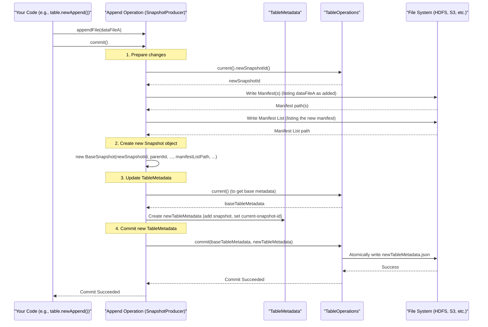

# Chapter 5: Snapshot (`Snapshot`, `BaseSnapshot`)

Welcome to Chapter 5! In [Chapter 4: Schema (`Schema`, `SchemaParser`, `SchemaUpdate`)](04_schema___schema____schemaparser____schemaupdate___.md), we learned how an Iceberg table's structure (its columns and types) is defined by a `Schema`. We also know from [Chapter 3: Table Metadata (`TableMetadata`)](03_table_metadata___tablemetadata___.md) that the `TableMetadata` is the master blueprint, holding not just the current schema, but also a history of how the table has changed over time.

But how does Iceberg track the *data* itself as it changes? What if you add new data, delete some, or even make a mistake and want to go back to how your table looked yesterday? This is where **Snapshots** come into play.

## What Problem Does a Snapshot Solve? Version Control for Your Data!

Imagine you're working on an important document. You save versions frequently: "report_v1.doc", "report_v2_with_edits.doc", "report_final.doc". This versioning helps you:
*   Go back to an older version if you make a mistake.
*   See how the document evolved.
*   Have a clear record of changes.

Now, think of your dataset as this document. Data changes all the time: new customer orders come in, product information is updated, old records are removed. How do you manage these versions for a massive table?

This is exactly what Iceberg **Snapshots** do. **A snapshot represents a specific version of your table's data at a particular point in time.**

Think of it as taking a photograph of your entire dataset. Every time you "commit" a change to your table (like adding new data, deleting records, or even changing the schema), Iceberg creates a new snapshot.

Why is this so useful?
1.  **Time Travel**: You can "look back in time" and see exactly what your data looked like at any previous snapshot. Want to know what your inventory was last Friday? If there's a snapshot for it, you can query it!
2.  **Atomic Operations**: When someone reads your table, they see the data from a *specific, complete snapshot*. They don't see a table that's half-updated while new data is being written. This ensures consistency.
3.  **Efficient Rollbacks**: Accidentally loaded bad data? If you have a snapshot from before the error, you can easily "roll back" your table to that good state. It's like restoring your document from an older saved version.

## Key Ideas about Snapshots

1.  **Creation**: A new snapshot is created every time an operation that modifies the table's state (data or metadata) is successfully committed. This includes operations like:
    *   Adding new data files (e.g., daily ingestion).
    *   Deleting data files.
    *   Overwriting parts of the table.
    *   Modifying the table's schema.

2.  **What's in a Snapshot?**: Each `Snapshot` object contains important information:
    *   A **unique ID** for that snapshot.
    *   The **ID of its parent snapshot** (this creates a lineage or history).
    *   The **timestamp** when it was created.
    *   The **operation** that created it (e.g., "append", "overwrite", "delete").
    *   A **summary** of changes (e.g., "added 10 files", "deleted 500 records").
    *   The ID of the [Schema (`Schema`, `SchemaParser`, `SchemaUpdate`)](04_schema___schema____schemaparser____schemaupdate___.md) that was active when this snapshot was created.
    *   Most importantly: A pointer to a **manifest list file**. This special file keeps track of all the [Manifests (`ManifestFile`, `ManifestEntry`, `ManifestReader`, `ManifestWriter`, `ManifestListWriter`)](06_manifests___manifestfile____manifestentry____manifestreader____manifestwriter____manifestlistwriter___.md). Manifests, in turn, list the actual data files that belong to this version of the table. We'll cover manifests in the next chapter!

    ```mermaid
    graph TD
        Snapshot["Snapshot (e.g., Snapshot 102)"]
        Snapshot --> SID["ID: 102"]
        Snapshot --> PID["Parent ID: 101"]
        Snapshot --> Time["Timestamp: 2023-10-27T10:00:00Z"]
        Snapshot --> Op["Operation: append"]
        Snapshot --> Sum["Summary: {added_files: 2, ...}"]
        Snapshot --> SchemaID["Schema ID: 3"]
        Snapshot --> ML["Manifest List File (points to manifests)"]

        ML --> Manifests["(Leads to Chapter 6: Manifests)"]
    ```

3.  **Immutability**: Just like `TableMetadata`, snapshots and their associated manifest lists and manifests are **immutable**. Once written, they are never changed. This is key to reliable time travel and rollbacks.

4.  **Current Snapshot**: The [Table Metadata (`TableMetadata`)](03_table_metadata___tablemetadata___.md) always points to one snapshot as the "current" or "live" version of the table. This is what users query by default.

## How Do You Work With Snapshots?

You usually interact with snapshots through your `Table` object.

### Listing Snapshot History

You can see the history of snapshots for a table. Each entry in the history tells you when a snapshot was made and its ID.

```java
import org.apache.iceberg.Table;
import org.apache.iceberg.HistoryEntry;
// Assume 'table' is your loaded Iceberg table

System.out.println("Snapshot history for table: " + table.name());
for (HistoryEntry entry : table.history()) {
    System.out.println("Snapshot ID: " + entry.snapshotId() +
                       ", Made at: " + new java.util.Date(entry.timestampMillis()) +
                       ", Parent ID: " + table.snapshot(entry.snapshotId()).parentId());
}
```
This might output something like:
```
Snapshot history for table: mydb.my_table
Snapshot ID: 987654321098765432, Made at: Tue Mar 12 10:00:00 PST 2024, Parent ID: null
Snapshot ID: 987654321098765433, Made at: Tue Mar 12 11:05:00 PST 2024, Parent ID: 987654321098765432
Snapshot ID: 987654321098765434, Made at: Tue Mar 12 12:15:30 PST 2024, Parent ID: 987654321098765433
```

### Getting the Current Snapshot

The `Table` object can give you its current snapshot:
```java
import org.apache.iceberg.Snapshot;
// Assume 'table' is your loaded Iceberg table

Snapshot currentSnapshot = table.currentSnapshot();
if (currentSnapshot != null) {
    System.out.println("Current Snapshot ID: " + currentSnapshot.snapshotId());
    System.out.println("Operation: " + currentSnapshot.operation());
    System.out.println("Summary: " + currentSnapshot.summary());
    // The manifest list location points to the list of manifests for this snapshot's data
    System.out.println("Manifest List: " + currentSnapshot.manifestListLocation());
} else {
    System.out.println("Table has no current snapshot (it's empty or new).");
}
```

### Rolling Back to a Previous Snapshot

This is a powerful feature! If you made a mistake (e.g., loaded bad data in snapshot `987654321098765434`), you can roll back to a previous good snapshot (e.g., `987654321098765433`).

```java
import org.apache.iceberg.Table;
// Assume 'table' is your loaded Iceberg table

long goodSnapshotId = 987654321098765433L; // Get this from table.history() or logs

try {
    table.manageSnapshots().rollbackTo(goodSnapshotId).commit();
    System.out.println("Table rolled back. Current snapshot is now: " + table.currentSnapshot().snapshotId());
} catch (Exception e) {
    System.err.println("Rollback failed: " + e.getMessage());
}
```
After this, querying the table will show the data as it was at `goodSnapshotId`. The problematic snapshot `987654321098765434` still exists in history but is no longer the "current" one.

The `manageSnapshots()` method on a `Table` object returns a `ManageSnapshots` interface (often an instance of `SnapshotManager`), which provides various snapshot management capabilities.

### Time Travel Queries (Conceptual)

Many query engines that support Iceberg (like Spark, Trino, Flink) allow you to query a table *as of* a specific snapshot ID or timestamp. The syntax varies by engine, but conceptually:

*   `SELECT * FROM my_table VERSION AS OF 987654321098765433`
*   `SELECT * FROM my_table FOR TIMESTAMP AS OF '2024-03-12 10:30:00'`

Iceberg uses the snapshot information to find the correct data files for that historical version.

## Under the Hood: `Snapshot` Interface and `BaseSnapshot`

Iceberg defines a `Snapshot` interface (`org.apache.iceberg.Snapshot`) that outlines what information a snapshot provides. The primary implementation is `BaseSnapshot` (`org.apache.iceberg.BaseSnapshot`).

A `BaseSnapshot` object holds fields like:
*   `snapshotId`: The unique ID of this snapshot.
*   `parentId`: The ID of the snapshot this one was based on.
*   `sequenceNumber`: A monotonically increasing number for each commit.
*   `timestampMillis`: When the snapshot was created.
*   `manifestListLocation`: Path to the manifest list file (critical!).
*   `operation`: String like "append", "overwrite", "delete".
*   `summary`: A map with statistics about the change.
*   `schemaId`: The ID of the schema used by this snapshot.

Here's a simplified look at `BaseSnapshot`'s constructor, showing some key parts:
```java
// Simplified from src/main/java/org/apache/iceberg/BaseSnapshot.java
// package org.apache.iceberg;
// import java.util.Map;
// import org.apache.iceberg.relocated.com.google.common.base.Preconditions;

class BaseSnapshot implements Snapshot {
    private final long snapshotId;
    private final Long parentId;
    private final long sequenceNumber;
    private final long timestampMillis;
    private final String manifestListLocation; // Key: path to the manifest list
    private final String operation;
    private final Map<String, String> summary;
    private final Integer schemaId;
    // ... other fields and methods ...

    BaseSnapshot(
            long sequenceNumber,
            long snapshotId,
            Long parentId,
            long timestampMillis,
            String operation,
            Map<String, String> summary,
            Integer schemaId,
            String manifestList // Path to the manifest list file for V2 tables
            /* ... other V3 fields ... */) {
        this.sequenceNumber = sequenceNumber;
        this.snapshotId = snapshotId;
        this.parentId = parentId;
        this.timestampMillis = timestampMillis;
        this.operation = operation;
        this.summary = summary;
        this.schemaId = schemaId;
        this.manifestListLocation = manifestList;
        // ... initialize other fields ...
    }

    @Override public long snapshotId() { return snapshotId; }
    @Override public Long parentId() { return parentId; }
    @Override public long timestampMillis() { return timestampMillis; }
    @Override public String manifestListLocation() { return manifestListLocation; }
    @Override public String operation() { return operation; }
    @Override public Map<String, String> summary() { return summary; }
    @Override public Integer schemaId() { return schemaId; }
    // ... other getter methods for sequenceNumber, allManifests(), dataManifests(), etc.
}
```
This `BaseSnapshot` object is what gets stored (in JSON form) within the list of snapshots in the [Table Metadata (`TableMetadata`)](03_table_metadata___tablemetadata___.md) file.

### How Snapshots are Created: `SnapshotProducer`

When you perform an operation like appending data or overwriting data, Iceberg uses a mechanism, often extending `SnapshotProducer` (from `org.apache.iceberg.SnapshotProducer`), to create the new snapshot.

Here's a simplified flow of what happens when you commit an operation (like adding new files):

1.  **Operation Prepares**: The operation (e.g., `AppendFiles`) determines which data files are being added or removed.
2.  **Manifests Written**: New [Manifests (`ManifestFile`, `ManifestEntry`, `ManifestReader`, `ManifestWriter`, `ManifestListWriter`)](06_manifests___manifestfile____manifestentry____manifestreader____manifestwriter____manifestlistwriter___.md) are written to list these changed data files and their statuses (added, deleted, existing).
3.  **Manifest List Written**: A new **manifest list file** is written. This file lists all the manifest files that belong to the new version of the table.
4.  **New `Snapshot` Object Created**: A new `Snapshot` object (usually `BaseSnapshot`) is created. It gets:
    *   A new, unique snapshot ID (from `TableOperations.newSnapshotId()`).
    *   The ID of the table's current snapshot as its parent.
    *   The current time as its timestamp.
    *   The path to the newly written manifest list file.
    *   The operation type (e.g., "append").
    *   A summary of changes.
5.  **`TableMetadata` Updated**:
    *   This new `Snapshot` object is added to the list of snapshots in the table's metadata.
    *   The `current-snapshot-id` in the metadata is updated to point to this new snapshot's ID.
    *   The `sequence-number` is incremented.
6.  **Commit**: The [Table Operations (`TableOperations`)](02_table_operations___tableoperations___.md) atomically commits this *new version* of the `TableMetadata`.


The `SnapshotProducer` class (in `src/main/java/org/apache/iceberg/SnapshotProducer.java`) has a method called `apply()` which is responsible for generating the list of manifest files and creating the `Snapshot` object that will be part of the commit. It also has a `commit()` method that handles the retry logic and updates the table metadata.

### Storing Snapshots: `SnapshotParser`

Within the `TableMetadata` JSON file, snapshots are stored as a list of JSON objects. Iceberg uses `SnapshotParser` (from `org.apache.iceberg.SnapshotParser`) to convert `Snapshot` objects to JSON and back.

Conceptually, `SnapshotParser.toJson(snapshot, ...)` would produce JSON like:
```json
// Simplified JSON for one snapshot in table-metadata.json
{
  "snapshot-id": 987654321098765433,
  "parent-snapshot-id": 987654321098765432,
  "sequence-number": 2,
  "timestamp-ms": 1678886400000,
  "summary": {
    "operation": "append",
    "added-data-files": "10",
    "added-records": "1000"
    /* ... other summary stats ... */
  },
  "manifest-list": "s3://bucket/table/metadata/snap-987654321098765433-1-uuid.avro",
  "schema-id": 1
}
```
And `SnapshotParser.fromJson(jsonNode)` would parse this back into a `BaseSnapshot` object when the `TableMetadata` is loaded.

## Conclusion

Snapshots are the backbone of Iceberg's version control for data. They provide a "photographic memory" of your table at different points in time.
Key takeaways:
*   A **Snapshot** represents a specific version of your table's data.
*   They are created automatically whenever you commit changes.
*   Each snapshot points to a **manifest list**, which in turn tracks the actual data files for that version.
*   Snapshots enable critical features like **time travel**, **atomic operations**, and **efficient rollbacks**.
*   The `BaseSnapshot` class is the standard implementation of the `Snapshot` interface.
*   Operations like appends and overwrites use a `SnapshotProducer` mechanism to build and commit new snapshots.
*   You can manage snapshots using `table.manageSnapshots()`, for example, to roll back to a previous state.

Snapshots tell you *which version* of the table you're looking at and give you a pointer (the manifest list location) to find its contents. But what exactly is in that manifest list? And how does it lead us to the actual data files? That's what we'll uncover in the next chapter.

Next up: [Chapter 6: Manifests (`ManifestFile`, `ManifestEntry`, `ManifestReader`, `ManifestWriter`, `ManifestListWriter`)](06_manifests___manifestfile____manifestentry____manifestreader____manifestwriter____manifestlistwriter___.md)

---

Generated by [AI Codebase Knowledge Builder](https://github.com/The-Pocket/Tutorial-Codebase-Knowledge)