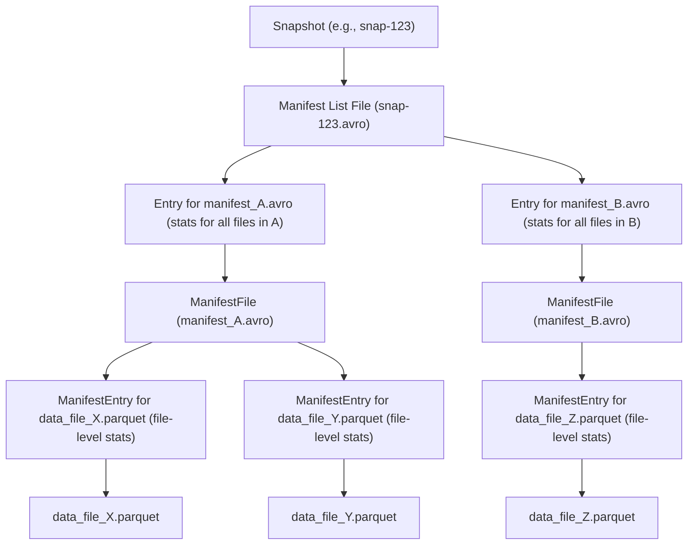

# Chapter 6: Manifests (`ManifestFile`, `ManifestEntry`, `ManifestReader`, `ManifestWriter`, `ManifestListWriter`)

Welcome back! In [Chapter 5: Snapshot (`Snapshot`, `BaseSnapshot`)](05_snapshot___snapshot____basesnapshot___.md), we learned that a **Snapshot** is like a photograph of your table at a specific moment, telling you *which version* of the table you're looking at. It even gives you a pointer to a "manifest list" file.

But what exactly is in that manifest list? And how does it lead us to the actual data files that make up that version of your table? If your table has millions of data files, how does Iceberg efficiently find the ones relevant to your query without looking at every single one? This is where **Manifests** come to the rescue!

## The Problem: Finding the Right Needles in a Giant Haystack

Imagine your Iceberg table is an enormous library with millions of books (data files). A [Snapshot (`Snapshot`, `BaseSnapshot`)](05_snapshot___snapshot____basesnapshot___.md) tells you, "You're looking at the library's contents as of last Friday." Now, if you want to find all books on "Antarctic penguins," how do you do it efficiently?
*   You don't want to pull every book off every shelf and check its title. That would take forever!
*   Ideally, you'd have some organized inventory lists that not only tell you where books are but also give you some clues about their content (like genre or keywords).

Manifests in Iceberg act as these detailed inventory lists. They help Iceberg and query engines quickly "prune" or skip over data files that couldn't possibly contain the data you're looking for.

## The Hierarchy: From Snapshot to Data Files

Iceberg uses a layered approach to track data files:

1.  **[Snapshot (`Snapshot`, `BaseSnapshot`)](05_snapshot___snapshot____basesnapshot___.md)**: Represents the table state at a point in time. Each snapshot points to one **Manifest List file**.
2.  **Manifest List file**: This is a "list of lists." It contains entries pointing to various **Manifest Files**. Think of it as the main directory in our library, telling you which aisle has which category of books.
3.  **`ManifestFile`**: This is an actual inventory list for a *subset* of the table's data files. It's like a specific shelf list in an aisle, detailing the books on that shelf. A `ManifestFile` lists individual data files (or delete files) and, crucially, includes statistics about them (like value ranges for columns).
4.  **`ManifestEntry`**: A single line item in a `ManifestFile`. It describes one specific data file: its path, its status (added, existing, or deleted), and detailed statistics for *that specific file*.
5.  **Data File / Delete File**: The actual Parquet, ORC, or Avro file on disk holding your data.



This structure allows Iceberg to quickly narrow down the search for relevant data.

## Key Concepts Explained

Let's break down the main components:

### 1. `ManifestEntry`: A Record for Each Data File

An `ManifestEntry` is like an index card for a single data file. It's the most granular piece of metadata within the manifest system.

*   **What it contains:**
    *   **File Path**: Where the actual data file (e.g., `data_file_X.parquet`) is stored.
    *   **File Format**: (e.g., PARQUET).
    *   **Status**:
        *   `ADDED`: This data file was newly added in the snapshot this manifest belongs to.
        *   `EXISTING`: This data file was present in a previous snapshot and is carried over to this one.
        *   `DELETED`: This data file was present in a previous snapshot but is marked as removed in this one (it's a logical delete; the file might still be on disk for a while for time travel).
    *   **Snapshot ID**: The ID of the snapshot when this specific data file was first added to the table.
    *   **Data Sequence Number / File Sequence Number**: Used for advanced features like tracking updates to rows within files.
    *   **File Statistics (Crucial for Pruning!)**:
        *   `record_count`: How many rows are in this data file.
        *   `column_sizes`: Size of each column in bytes.
        *   `value_counts`: Number of non-null values for each column.
        *   `null_value_counts`: Number of null values for each column.
        *   `nan_value_counts`: (For floating-point types) Number of NaN values.
        *   `lower_bounds`: The minimum value for each column in this file.
        *   `upper_bounds`: The maximum value for each column in this file.

*   **Why are stats important?**
    Imagine a query `SELECT * FROM sales WHERE product_category = 'Electronics' AND sale_date > '2023-01-01'`.
    When Iceberg reads a `ManifestEntry` for `data_file_A.parquet`:
    *   If `data_file_A.parquet`'s `upper_bounds` for `product_category` is 'Clothing' (and its `lower_bounds` is 'Accessories'), then 'Electronics' cannot be in this file. **Skip this file!**
    *   If its `upper_bounds` for `sale_date` is '2022-12-31', then no sales after '2023-01-01' can be in this file. **Skip this file!**
    This is **file pruning**, and it's a huge performance booster.

The `ManifestEntry` interface (from `src/main/java/org/apache/iceberg/ManifestEntry.java`) defines these properties. `GenericManifestEntry` is a common implementation.

```java
// src/main/java/org/apache/iceberg/ManifestEntry.java (Interface Excerpt)
interface ManifestEntry<F extends ContentFile<F>> {
    enum Status { EXISTING, ADDED, DELETED }
    Status status();
    Long snapshotId(); // Snapshot when file was added
    Long dataSequenceNumber();
    F file(); // The actual DataFile or DeleteFile object
    // ... other methods
}

// src/main/java/org/apache/iceberg/ContentFile.java (Interface for DataFile/DeleteFile - Excerpt)
// F file() in ManifestEntry returns an object implementing this
interface ContentFile<T> {
    String path();
    FileFormat format();
    StructLike partition(); // Partition values for this file
    Long recordCount();
    // Methods to get lower_bounds, upper_bounds, null_value_counts etc. for columns
    // Example: Map<Integer, ByteBuffer> lowerBounds(); (Map of column_id to serialized min value)
}
```
These interfaces show what information each entry provides. The `GenericManifestEntry` (from `src/main/java/org/apache/iceberg/GenericManifestEntry.java`) is the concrete class that holds this data, often read from Avro files.

### 2. `ManifestFile`: A List of `ManifestEntry`s

A `ManifestFile` (represented by the `org.apache.iceberg.ManifestFile` interface) is an actual file (usually in Avro format) that contains a list of `ManifestEntry` objects.

*   **What it contains:**
    *   Its own path and length.
    *   The ID of the [Partition Spec (`TableMetadata`)](03_table_metadata___tablemetadata___.md) used for the data files it lists.
    *   Whether it lists `DATA` files or `DELETES` files (`ManifestContent`).
    *   Sequence numbers associated with its creation.
    *   The `snapshotId` that added this manifest file to the table.
    *   Counts of added/existing/deleted files and rows *within this manifest file*.
    *   **Partition Summaries**: For all data files listed in *this* manifest, what are the overall ranges of partition values? This allows for pruning entire manifest files if their partition ranges don't match a query's filter.
    *   Key metadata if the manifest file is encrypted.

Think of it as a chapter in your library's inventory. If the chapter is "Books published in Asia", and you're looking for "Books published in Europe", you can skip reading that entire chapter (manifest file).

`GenericManifestFile` (from `src/main/java/org/apache/iceberg/GenericManifestFile.java`) is the typical implementation.

### 3. `ManifestListWriter`: Creating the "List of Lists"

When a [Snapshot (`Snapshot`, `BaseSnapshot`)](05_snapshot___snapshot____basesnapshot___.md) is created (e.g., after you add data to your table), Iceberg needs to record which `ManifestFile`s belong to this new snapshot. This is done by writing a **manifest list file**.

The `ManifestListWriter` (from `src/main/java/org/apache/iceberg/ManifestListWriter.java`) is responsible for creating this manifest list file.
*   For each `ManifestFile` that is part of the new snapshot, the `ManifestListWriter` adds an entry to the manifest list file. This entry includes:
    *   The path to the `ManifestFile`.
    *   Its length.
    *   Its partition spec ID.
    *   Partition summaries (min/max partition values covered by files in that manifest).
    *   Counts of added/existing/deleted files and rows that this manifest file tracks for the snapshot.

The manifest list file itself is also an Avro file. The [Snapshot (`Snapshot`, `BaseSnapshot`)](05_snapshot___snapshot____basesnapshot___.md) metadata object stores the path to this one manifest list file.

```java
// Conceptual: How a ManifestListWriter might be used by Iceberg's commit logic
// (Simplified, actual usage is within SnapshotProducer operations)

// OutputFile newManifestListLocation = table.io().newOutputFile("path/to/new-manifest-list.avro");
// long newSnapshotId = ...;
// Long parentSnapshotId = ...; // current snapshot's ID
// long sequenceNumber = ...;

// // Get the writer for the correct table format version
// ManifestListWriter writer = ManifestLists.write(
//     table.formatVersion(), newManifestListLocation, newSnapshotId, parentSnapshotId, sequenceNumber, null);

// try {
//     // For each ManifestFile that is part of this new snapshot:
//     // ManifestFile manifestA = ... ; // (Created by ManifestWriter earlier)
//     // writer.add(manifestA);
//     // ManifestFile manifestB = ... ;
//     // writer.add(manifestB);
// } finally {
//     writer.close();
// }
// String manifestListPath = writer.toManifestFile().path(); // Actually, writer.length() etc. The actual ManifestFile object is built later
// This path (newManifestListLocation.location()) is then stored in the Snapshot object.
```
The actual `ManifestFile` objects that get written into the manifest list are typically `GenericManifestFile` instances.
The `ManifestLists.java` class provides static factory methods to get these writers (e.g., `ManifestLists.write(...)`).

### 4. `ManifestWriter`: Creating Individual `ManifestFile`s

When you perform an operation that changes the data in your table (like appending new data files), Iceberg needs to create new `ManifestFile`(s) to list these new files (or update the status of existing ones).

The `ManifestWriter` (from `src/main/java/org/apache/iceberg/ManifestWriter.java`) is used for this.
*   You get a `ManifestWriter` for a specific [Partition Spec (`TableMetadata`)](03_table_metadata___tablemetadata___.md) and an output file path where the manifest will be written.
*   You then `add()` entries to it:
    *   `writer.add(dataFile)`: If `dataFile` is new, it's recorded as `ADDED`. The entry includes `dataFile`'s path and its column statistics.
    *   `writer.existing(dataFile, snapshotId, dataSeqNum, fileSeqNum)`: If `dataFile` is from a previous snapshot and is being carried forward.
    *   `writer.delete(dataFile, dataSeqNum, fileSeqNum)`: If `dataFile` is being marked as `DELETED`.
*   When `close()` is called, the manifest (Avro file) is finalized.
*   `writer.toManifestFile()` then gives you a `ManifestFile` object representing what was just written. This `ManifestFile` object can then be added to a `ManifestListWriter`.

```java
// Conceptual: How a ManifestWriter might be used
// PartitionSpec spec = table.spec();
// OutputFile newManifestLocation = table.io().newOutputFile("path/to/new-manifest-01.avro");
// Long currentSnapshotId = table.currentSnapshot().snapshotId(); // Or new snapshot ID if appending

// ManifestWriter<DataFile> writer = ManifestFiles.write(
//                             table.formatVersion(), spec, newManifestLocation, currentSnapshotId);
// try {
//     DataFile file1 = ... ; // A new data file you're adding
//     writer.add(file1); // Records file1 as ADDED with its stats

//     DataFile file2 = ... ; // Another new data file
//     // If file2 has a specific data sequence number from an operation like compaction
//     // writer.add(file2, specificDataSequenceNumber);
//     writer.add(file2);

// } finally {
//     writer.close();
// }

// ManifestFile createdManifest = writer.toManifestFile();
// Now, 'createdManifest' can be passed to a ManifestListWriter.
```
The `ManifestFiles.java` utility class (from `src/main/java/org/apache/iceberg/ManifestFiles.java`) provides static factory methods `write()` and `read()` to get `ManifestWriter` and `ManifestReader` instances, abstracting away some of the Avro details and handling different table format versions.

### 5. `ManifestReader`: Reading `ManifestFile`s for Queries

When a query engine plans a scan, it needs to read the `ManifestFile`s (obtained from the manifest list) to find out which data files to read.

The `ManifestReader` (from `src/main/java/org/apache/iceberg/ManifestReader.java`) does this.
*   It takes an `InputFile` (the path to a `ManifestFile`).
*   It can be configured with:
    *   `select(columns)`: To only project certain columns from the data files (and their stats).
    *   `filterPartitions(expression)`: To filter entries based on partition values.
    *   `filterRows(expression)`: To filter entries based on column statistics (min/max values) against the query's WHERE clause.
*   It iterates through the `ManifestEntry`s in the Avro file. For each entry:
    1.  It checks if the entry's partition data matches `filterPartitions`.
    2.  It uses the entry's column statistics (min/max values, null counts) to see if the data file *could possibly* contain rows matching `filterRows`. If not, the entry (and its data file) is skipped (pruned).
*   The reader yields the `DataFile` (or `DeleteFile`) objects from the entries that survive the filtering.

```java
// Conceptual: How a ManifestReader might be used during query planning
// ManifestFile manifestToRead = ... ; // Got this from the Manifest List
// FileIO io = table.io();
// Map<Integer, PartitionSpec> specs = table.specs();
// Expression rowFilterForQuery = Expressions.greaterThan("price", 100.0);

// ManifestReader<DataFile> reader = ManifestFiles.read(manifestToRead, io, specs);
// reader.filterRows(rowFilterForQuery); // Apply filter based on 'price'
// reader.select(Arrays.asList("product_id", "price", "quantity")); // Only need these columns

// try (CloseableIterable<DataFile> dataFiles = reader) {
//     for (DataFile dataFile : dataFiles) {
//         // 'dataFile' is a candidate for scanning.
//         // Its 'price' column stats indicated it *might* have prices > 100.
//         System.out.println("Plan to scan: " + dataFile.path());
//         System.out.println("  Record count: " + dataFile.recordCount());
//         // Column stats are available on dataFile object if selected in manifest read
//     }
// }
```
The `ManifestReader` effectively acts as a filter, reducing the number of data files that the query engine needs to actually open and process.

## The Big Picture: How Manifests Enable Efficient Queries

Let's trace a query like `SELECT COUNT(*) FROM my_table WHERE event_date = '2023-03-15' AND category = 'TypeA'`:

1.  **Load Table**: Iceberg loads `my_table`. The [Catalog (`Catalog`, `BaseMetastoreCatalog`)](01_catalog___catalog____basemetastorecatalog___.md) provides [Table Operations (`TableOperations`)](02_table_operations___tableoperations___.md) which reads the latest [Table Metadata (`TableMetadata`)](03_table_metadata___tablemetadata___.md).
2.  **Get Snapshot**: The `TableMetadata` points to the current [Snapshot (`Snapshot`, `BaseSnapshot`)](05_snapshot___snapshot____basesnapshot___.md).
3.  **Read Manifest List**: The `Snapshot` contains the path to its manifest list file (e.g., `snap-XYZ.avro`). Iceberg reads this file (using `ManifestLists.read` or similar internal logic). This gives a list of `ManifestFile` objects.
    *   **Pruning Step 1 (Manifest List Level)**: The entries in the manifest list file themselves contain partition summaries for each `ManifestFile` they point to. If a `ManifestFile` only contains data for `event_date` in `2022`, it can be skipped entirely without even opening it!
4.  **Read ManifestFiles**: For each potentially relevant `ManifestFile` from the list:
    *   A `ManifestReader` is created.
    *   It's configured with filters: `event_date = '2023-03-15'` and `category = 'TypeA'`.
    *   **Pruning Step 2 (Manifest File Level)**: The `ManifestReader` iterates through its `ManifestEntry`s. For each entry:
        *   It checks the entry's partition information (if the table is partitioned by `event_date` and/or `category`). If the partition doesn't match, the entry is skipped.
        *   It checks the column statistics (min/max values for `event_date` and `category`) stored *within the `ManifestEntry`* for its specific data file. If `event_date` in the file only goes up to `2023-03-14`, or if `category` is only 'TypeB', this data file is skipped.
5.  **Plan Scan**: The `DataFile` objects from `ManifestEntry`s that survive all pruning steps are the ones the query engine will actually read.
6.  **Execute Query**: The engine reads these data files and computes the count.

This multi-level pruning (at manifest list level and manifest file/entry level) is what makes Iceberg queries efficient, even on massive datasets.

## Under the Hood: File Formats and Parsing

*   **Manifest List Files** and **Manifest Files** are typically stored in **Apache Avro format**.
*   Avro is a row-oriented binary format that is efficient for storage and allows for schema evolution.
*   `ManifestWriter` and `ManifestListWriter` use Avro writers to serialize `ManifestEntry` and `ManifestFile` objects into these Avro files.
    *   For example, in `ManifestWriter.java`, subclasses like `V1Writer`, `V2Writer` (for different Iceberg table format versions) configure an Avro `FileAppender` with the correct Avro schema for manifest entries.
    ```java
    // Simplified concept from ManifestWriter.java (e.g., V2Writer)
    // protected FileAppender<ManifestEntry<DataFile>> newAppender(
    //     PartitionSpec spec, OutputFile file) {
    //   Schema manifestAvroSchema = V2Metadata.entrySchema(spec.partitionType()); // Gets Avro schema
    //   try {
    //     return InternalData.write(FileFormat.AVRO, file) // Using Iceberg's internal Avro writer
    //         .schema(manifestAvroSchema)
    //         .named("manifest_entry")
    //         // ... add metadata like format-version, spec, schema ...
    //         .overwrite()
    //         .build();
    //   } catch (IOException e) { /* ... */ }
    // }
    ```
*   `ManifestReader` uses Avro readers to deserialize these files.
    ```java
    // Simplified concept from ManifestReader.java's open() method
    // CloseableIterable<ManifestEntry<F>> reader =
    //     InternalData.read(format, file) // Uses Iceberg's internal Avro reader
    //         .project(ManifestEntry.wrapFileSchema(projectedStructType)) // Avro projection
    //         .setRootType(GenericManifestEntry.class) // Class to deserialize into
    //         // ... other configurations ...
    //         .build();
    ```
The schemas for these Avro files are defined within Iceberg (e.g., in classes like `V1Metadata`, `V2Metadata`, or directly by constructing them from `ManifestFile.schema()` and `ManifestEntry.getSchema()`).

## Conclusion

Manifests are the detailed workhorses behind Iceberg's efficient data management and query performance. They provide a hierarchical and statistically-rich index to your data files.

Key Takeaways:
*   A **`ManifestFile`** is an inventory (Avro file) listing data files (or delete files).
*   An **`ManifestEntry`** is a single item in that inventory, detailing one data file and its column statistics (min/max values, null counts, etc.). These stats are vital for query pruning.
*   A **Manifest List File** (pointed to by a Snapshot) is an inventory of `ManifestFile`s, enabling pruning at a coarser grain.
*   **`ManifestWriter`** creates `ManifestFile`s (listing `ManifestEntry`s).
*   **`ManifestListWriter`** creates the manifest list file (listing `ManifestFile`s).
*   **`ManifestReader`** reads `ManifestFile`s, applying filters based on partition data and column statistics to identify relevant data files for a query.
*   This system allows Iceberg to quickly find and scan only the necessary data, even for very large tables.

Now that we understand how Iceberg knows *which* files to read for a given query, how does it actually plan the process of reading them, especially when dealing with filters, projections, and potential delete files? That's what we'll explore in the next chapter on [Chapter 7: Table Scan (`TableScan`, `BaseScan`, `TableScanContext`)](07_table_scan___tablescan____basescan____tablescancontext___.md).

---

Generated by [AI Codebase Knowledge Builder](https://github.com/The-Pocket/Tutorial-Codebase-Knowledge)