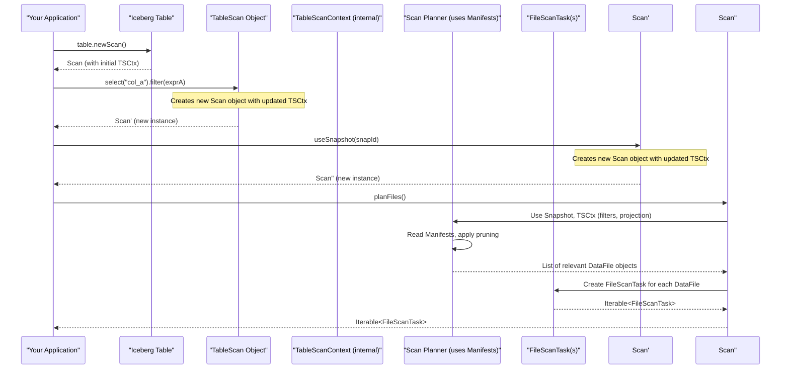

# Chapter 7: Table Scan (`TableScan`, `BaseScan`, `TableScanContext`)

Welcome to Chapter 7! In [Chapter 6: Manifests](06_manifests___manifestfile____manifestentry____manifestreader____manifestwriter____manifestlistwriter___.md), we saw how Iceberg uses manifests to keep a detailed inventory of data files, complete with statistics that help quickly find relevant files for a query. Now, how do we actually *tell* Iceberg what data we want to read and how to use those manifests to get it?

That's where **Table Scan** comes in. Think of it as formulating a precise query plan to a grand library. You don't just walk in and browse randomly; you tell the librarian (Iceberg) exactly what you're looking for, and they help you figure out which specific books (data files) to retrieve.

## What Problem Does a Table Scan Solve? Crafting Your Data Request

Imagine you have a massive table of all customer orders ever placed.
*   What if you only need orders from last month?
*   What if you only care about the `order_id` and `total_amount` columns, not the customer's full address?
*   What if you only want orders where the `total_amount` was greater than $100?

Reading the entire table for these specific needs would be incredibly inefficient. A **Table Scan** is Iceberg's mechanism for defining precisely what data you want to retrieve. It allows you to:

1.  **Specify a Version (Time Travel)**: Which [Snapshot (`Snapshot`, `BaseSnapshot`)](05_snapshot___snapshot____basesnapshot___.md) of the table do you want to read? The current one? One from last Tuesday?
2.  **Select Columns (Projection)**: Which columns are you interested in? Reading only the necessary columns saves a lot of processing.
3.  **Filter Rows (Predicates)**: What conditions must the data meet? (e.g., `order_date > '2023-01-01'`).

Once you've defined your "query plan" using a `TableScan`, Iceberg's scan planner uses the table's metadata (including [Table Metadata (`TableMetadata`)](03_table_metadata___tablemetadata___.md), [Snapshots (`Snapshot`, `BaseSnapshot`)](05_snapshot___snapshot____basesnapshot___.md), and [Manifests (`ManifestFile`, `ManifestEntry`, `ManifestReader`, `ManifestWriter`, `ManifestListWriter`)](06_manifests___manifestfile____manifestentry____manifestreader____manifestwriter____manifestlistwriter___.md)) to efficiently find the relevant data files. The end result is a set of **`FileScanTask`s**. Each `FileScanTask` is a concrete instruction for an execution engine (like Spark or Flink) to read a specific data file (or part of it).

## Your Query Request Form: `TableScanContext`

Before we dive into creating a scan, let's meet `TableScanContext`. Think of this as the **request form** you fill out for the librarian. It holds all the configurations and options for a particular scan you're about to perform.

This "form" includes details like:
*   Which snapshot ID to use (if any).
*   The filter expression (e.g., `price > 10`).
*   Whether the scan should be case-sensitive.
*   Which columns to select.
*   And other advanced options.

You usually don't create a `TableScanContext` directly. When you build a `TableScan` object and call methods like `select()` or `filter()`, Iceberg is updating an internal `TableScanContext` behind the scenes.

## How to Create and Configure a Table Scan

Let's say we have an Iceberg `Table` object named `ordersTable`.

### 1. Starting a New Scan

You begin by asking the table for a new scan object:

```java
import org.apache.iceberg.Table;
import org.apache.iceberg.TableScan;
// Assume 'ordersTable' is an initialized Iceberg Table object

TableScan scan = ordersTable.newScan();
System.out.println("Created a new scan object for the orders table.");
```
This `scan` object is now ready to be configured. It will default to reading the current snapshot of the table, all columns, and no filters.

### 2. Selecting Specific Columns (Projection)

If you only need a few columns, you can specify them using `select()`:

```java
// Continuing from the previous 'scan' object

// Let's say we only want 'order_id' and 'order_total'
TableScan projectedScan = scan.select("order_id", "order_total");
System.out.println("Scan configured to select only 'order_id' and 'order_total'.");

// Note: 'scan' is immutable. 'select' returns a NEW TableScan object.
// It's good practice to reassign:
// scan = scan.select("order_id", "order_total");
```
This tells Iceberg you're not interested in other columns like `customer_address` or `product_list` for this particular scan.

### 3. Filtering Rows

To narrow down the data, use `filter()` with an Iceberg `Expression`:

```java
import org.apache.iceberg.expressions.Expressions;
// Continuing from 'projectedScan' or reassigning 'scan'

// Let's filter for orders where 'order_status' is 'SHIPPED'
TableScan filteredScan = projectedScan.filter(
    Expressions.equal("order_status", "SHIPPED")
);
System.out.println("Scan configured to filter for SHIPPED orders.");

// And also where 'order_total' is greater than 100.0
scan = filteredScan.filter(
    Expressions.greaterThan("order_total", 100.0)
);
System.out.println("Scan further filtered for order_total > 100.0.");
```
Iceberg will use these expressions and the statistics in the manifest files to prune data files that cannot possibly contain matching rows.

### 4. Time Travel: Reading a Specific Snapshot

You can read an older version of the table using `useSnapshot()` or `asOfTime()`:

```java
// Let's say snapshot ID 1234567890123456789L represents last week's data
// scan = scan.useSnapshot(1234567890123456789L);
// System.out.println("Scan configured to read snapshot 1234567890123456789.");

// Or, read data as of a specific timestamp (milliseconds since epoch)
// long specificTimestamp = System.currentTimeMillis() - (7 * 24 * 60 * 60 * 1000); // 7 days ago
// scan = scan.asOfTime(specificTimestamp);
// System.out.println("Scan configured to read data as of " + new java.util.Date(specificTimestamp));
```
This allows you to query historical states of your table.

### 5. Planning the Scan: Getting `FileScanTask`s

Once your scan is fully configured, you "plan" it to get a list of `FileScanTask`s. These tasks are what execution engines use.

```java
import org.apache.iceberg.FileScanTask;
import org.apache.iceberg.io.CloseableIterable;

// 'scan' is our fully configured TableScan object from previous steps

System.out.println("Planning files for the configured scan...");
try (CloseableIterable<FileScanTask> tasks = scan.planFiles()) {
    int taskCount = 0;
    for (FileScanTask task : tasks) {
        taskCount++;
        // Each 'task' tells an engine:
        // - Which data file to read (task.file().path())
        // - Which part of the file (if split, using task.start() and task.length())
        // - The schema of the file (task.schema())
        // - The partition values for this file (task.file().partition())
        // - Any residual filter to apply (task.residual()) if not fully handled by pruning
        System.out.println("  Task " + taskCount + ": Read file " + task.file().path() +
                           " (Length: " + task.file().fileSizeInBytes() + " bytes)");
    }
    if (taskCount == 0) {
        System.out.println("No data files match the scan criteria.");
    } else {
        System.out.println("Generated " + taskCount + " file scan tasks.");
    }
} catch (Exception e) {
    System.err.println("Error planning scan: " + e.getMessage());
}
```
A `FileScanTask` is essentially a work unit. It says, "Read *this* specific data file (or a portion of it), and here's the schema and partition info for it." If your query also involves delete files (for row-level updates/deletes), the tasks would be more complex (e.g., `CombinedScanTask` which groups data and delete files). `planTasks()` can give you these more general tasks. For simplicity, we focus on `planFiles()`.

## Under the Hood: From `newScan()` to `FileScanTask`s

Let's look at what happens when you define and plan a scan.



1.  **`table.newScan()`**: This creates an initial `TableScan` object. Internally, this scan object holds a `TableScanContext` with default settings (e.g., current snapshot, select all columns, no filter).
2.  **Configuration Methods (`select`, `filter`, `useSnapshot`, etc.)**:
    *   These methods are typically found in the `org.apache.iceberg.BaseScan` class, which is a superclass for most scan implementations.
    *   When you call a method like `scan.select("col1")`, it doesn't modify the current `scan` object (it's immutable). Instead, it creates a *new* `TableScan` object. This new object has a *new* `TableScanContext` that's a copy of the old one but with the `select("col1")` information added.
    ```java
    // Simplified from src/main/java/org/apache/iceberg/BaseScan.java
    // abstract class BaseScan<ThisT, ...> implements Scan<ThisT, ...> {
    //     private final TableScanContext context;
    //     // ... constructor ...

    //     protected abstract ThisT newRefinedScan(Table table, Schema schema, TableScanContext context);

    //     @Override
    //     public ThisT select(Collection<String> columns) {
    //         // Creates a new context with 'columns' added
    //         TableScanContext newContext = context.selectColumns(columns);
    //         // Returns a new scan instance with the new context
    //         return newRefinedScan(table(), tableSchema(), newContext);
    //     }
    //     // Other methods like filter(), caseSensitive() work similarly
    // }
    ```
    This fluent API style makes it easy to chain configuration calls.

3.  **`TableScanContext` (The Request Form)**:
    *   Defined in `src/main/java/org/apache/iceberg/TableScanContext.java`.
    *   It's an immutable class, often generated using the Immutables library.
    *   It uses a builder pattern internally. For example, `context.selectColumns(columns)` would effectively do `ImmutableTableScanContext.builder().from(this).selectedColumns(columns).build()`.
    ```java
    // Simplified from src/main/java/org/apache/iceberg/TableScanContext.java
    // @Value.Immutable
    // abstract class TableScanContext {
    //  @Nullable public abstract Long snapshotId();
    //  @Value.Default public Expression rowFilter() { return Expressions.alwaysTrue(); }
    //  @Nullable public abstract Collection<String> selectedColumns();
    //  // ... other fields for caseSensitive, ignoreResiduals, options etc.

    //  TableScanContext selectColumns(Collection<String> columns) {
    //      // In reality, uses ImmutableTableScanContext.builder()
    //      return builder().from(this).selectedColumns(columns).build();
    //  }
    //  // ... other "wither" methods ...
    // }
    ```
    This object diligently collects all your scan preferences.

4.  **`planFiles()`**:
    *   This method triggers the actual planning.
    *   For a standard table, this might be handled by `org.apache.iceberg.DataTableScan`, which extends `org.apache.iceberg.BaseTableScan`, which in turn extends `org.apache.iceberg.SnapshotScan`.
    *   `SnapshotScan.planFiles()` (from `src/main/java/org/apache/iceberg/SnapshotScan.java`) first determines which [Snapshot (`Snapshot`, `BaseSnapshot`)](05_snapshot___snapshot____basesnapshot___.md) to use (based on `snapshotId()` from the context, or `table().currentSnapshot()` by default).
    *   Then, it calls an abstract method `doPlanFiles()`.
    *   In `DataTableScan.java`, `doPlanFiles()` is implemented:
        ```java
        // Simplified from src/main/java/org/apache/iceberg/DataTableScan.java
        // public class DataTableScan extends BaseTableScan {
        //     // ... constructor ...
        //     @Override
        //     public CloseableIterable<FileScanTask> doPlanFiles() {
        //         Snapshot snapshot = snapshot(); // Gets the chosen snapshot
        //         FileIO io = table().io();
        //         List<ManifestFile> dataManifests = snapshot.dataManifests(io);
        //         List<ManifestFile> deleteManifests = snapshot.deleteManifests(io); // If any

        //         // ManifestGroup handles reading manifests, applying filters, projection
        //         ManifestGroup manifestGroup =
        //             new ManifestGroup(io, dataManifests, deleteManifests)
        //                 .caseSensitive(isCaseSensitive()) // from context
        //                 .select(scanColumns())           // from context (e.g. ["col_a", "col_b"])
        //                 .filterData(filter())            // from context (e.g. price > 10)
        //                 .specsById(table().specs())
        //                 .ignoreDeleted(); // And other options from context

        //         // manifestGroup.planFiles() iterates through manifests,
        //         // uses ManifestReader, and yields FileScanTasks
        //         return manifestGroup.planFiles();
        //     }
        // }
        ```
        The `ManifestGroup` (which internally uses [ManifestReader](06_manifests___manifestfile____manifestentry____manifestreader____manifestwriter____manifestlistwriter___.md) as seen in Chapter 6) takes all the settings from the `TableScanContext` (like selected columns and row filters) and applies them to prune manifest files and individual manifest entries.
    *   The result is an iterable of `FileScanTask` objects, each representing a data file (or part of one) that the execution engine needs to read.

### Specialized Scans

Iceberg has different types of scans for different purposes, but they often build upon `BaseScan`:
*   `DataTableScan`: The common scan for reading data from a table, as shown above.
*   `IncrementalDataTableScan` (from `src/main/java/org/apache/iceberg/IncrementalDataTableScan.java`): Used for reading only the *changes* (appended files) between two snapshots. This is useful for incremental data processing.
    ```java
    // Example of an incremental scan
    // TableScan incrementalScan = ordersTable.newScan()
    //     .appendsBetween(previousSnapshotId, currentSnapshotId);
    // CloseableIterable<FileScanTask> newFileTasks = incrementalScan.planFiles();
    ```
    This scan (seen in `IncrementalDataTableScan.java`) has specialized logic in its `planFiles()` to find only `ADDED` files within the specified snapshot range.

The beauty of this design is that the way you configure a scan (select, filter, etc.) is consistent, and the specific scan implementation handles the details of how to find the right files based on that configuration.

## Conclusion

The **Table Scan** is your primary interface for telling Iceberg how to read data. It's like giving detailed instructions to a librarian: you specify the version of the "library" (snapshot), the information you want (columns/projection), and any specific criteria (filters).

Key Takeaways:
*   A `TableScan` is used to define how you want to read data from an Iceberg table.
*   You can configure it to select specific columns (`select()`), filter rows (`filter()`), and choose a specific table version (`useSnapshot()`, `asOfTime()`).
*   `TableScanContext` holds all these configuration options internally. `BaseScan` provides the fluent API that updates this context.
*   Calling `planFiles()` (or `planTasks()`) on a configured `TableScan` uses the table's metadata and manifests to produce a list of `FileScanTask`s.
*   These `FileScanTask`s are work units for query engines, telling them exactly which data files to read.
*   Different scan types (like `DataTableScan`, `IncrementalDataTableScan`) exist for different reading patterns but share common configuration mechanisms.

With Table Scans, you can efficiently access just the data you need. But what if you want to *change* the table? Add data, update schema, or perform multiple operations together safely? For that, Iceberg uses Transactions.

Let's explore how Iceberg manages changes to tables safely in the next chapter: [Chapter 8: Transaction (`Transaction`, `BaseTransaction`)](08_transaction___transaction____basetransaction___.md).

---

Generated by [AI Codebase Knowledge Builder](https://github.com/The-Pocket/Tutorial-Codebase-Knowledge)