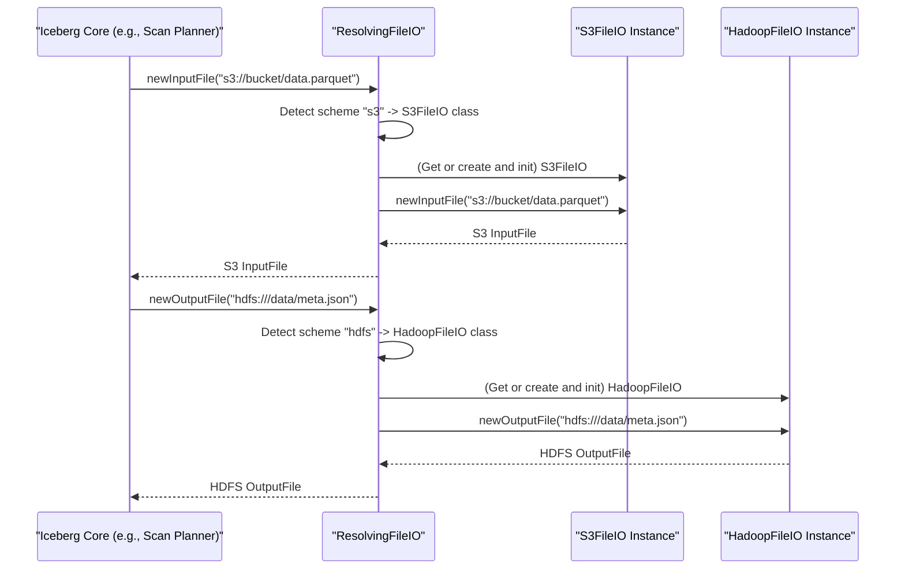

# Chapter 9: FileIO (`FileIO`)

Welcome to Chapter 9! In [Chapter 8: Transaction (`Transaction`, `BaseTransaction`)](08_transaction___transaction____basetransaction___.md), we saw how Iceberg manages changes to tables safely and atomically using transactions. These transactions involve creating or updating files – metadata files, manifest files, and even data files. But how does Iceberg actually *talk* to the storage system where these files live? Whether your files are on a distributed system like HDFS, in a cloud bucket like S3, or just on your local computer, Iceberg needs a consistent way to read and write them.

That's precisely the job of **`FileIO`**.

## What Problem Does `FileIO` Solve? The Universal Remote for Storage

Imagine you have a TV, a Blu-ray player, and a sound system, all from different brands. You could juggle three different remote controls, each with its own way of working. Or, you could use a universal remote that understands how to talk to all of them through a single, consistent interface.

In the world of data, your Iceberg table's files (data, metadata, manifests) can reside in various storage systems:
*   Hadoop Distributed File System (HDFS)
*   Amazon S3
*   Google Cloud Storage (GCS)
*   Azure Data Lake Storage (ADLS)
*   Your local computer's disk

Each of these systems has its own specific way (API) to be accessed. If Iceberg had to write separate code for each one every time it needed to read or write a file, it would be very complex and hard to maintain. More importantly, your Iceberg table wouldn't be easily "portable" – moving it from HDFS to S3 would be a major headache.

**`FileIO` acts like that universal remote.** It's an **abstraction layer** that provides a single, consistent set of commands for Iceberg to interact with files, no matter where they are stored. It hides the nitty-gritty details of each storage system.

This means:
*   Iceberg's core logic for managing tables can be written once, without worrying about *how* files are physically read or written.
*   Your Iceberg tables become highly portable. You can create a table on your local disk, then later move its data and metadata to S3, and Iceberg can still work with it seamlessly, just by using a different `FileIO` implementation configured for S3.

## Key Concepts of `FileIO`

The `FileIO` interface defines a standard contract for file operations. The main components are:

1.  **`InputFile`**:
    *   Represents a file that Iceberg needs to read.
    *   Key method: `newStream()` which returns a standard Java `InputStream` to read the file's content.
    *   Other methods: `getLength()` to get the file size, `exists()` to check if it's there.

2.  **`OutputFile`**:
    *   Represents a file that Iceberg needs to write.
    *   Key methods: `create()` or `createOrOverwrite()` which return a standard Java `OutputStream` to write content.
    *   Other methods: `location()` to get its path.

3.  **`deleteFile(String location)`**:
    *   Deletes a single file at the given path.

4.  **`deleteFiles(Iterable<String> locations)`**:
    *   Deletes multiple files. This can be more efficient than deleting one by one, especially in cloud storage.

5.  **`listPrefix(String prefix)`**:
    *   Lists all files and directories under a given prefix. This is useful for operations like finding all files in a "directory".

6.  **Implementations**:
    *   Iceberg provides various `FileIO` implementations for different storage systems.
    *   **`HadoopFileIO`**: Works with any file system compatible with Hadoop's `FileSystem` API (like HDFS, S3 via `s3a://`, local disk via `file://`).
    *   **`S3FileIO`**, **`GCSFileIO`**, **`ADLSFileIO`**: Specialized implementations for AWS S3, Google Cloud Storage, and Azure Data Lake Storage, often using native SDKs for better performance and features.
    *   **`ResolvingFileIO`**: A "smart" `FileIO` that can look at a file path (e.g., `s3://bucket/file` vs `hdfs:///path/to/file`) and automatically choose the correct underlying `FileIO` implementation to use.

## How is `FileIO` Used?

You typically don't create `FileIO` instances directly in your day-to-day table interactions. Iceberg's internal components, like [Table Operations (`TableOperations`)](02_table_operations___tableoperations___.md), manage and use `FileIO`.

When you load a table, the `TableOperations` object for that table will have an appropriate `FileIO` instance. You can access it via `table.io()` or `table.operations().io()`.

Let's see a conceptual example of how `FileIO` might be used to read a table's metadata file:

```java
import org.apache.iceberg.Table;
import org.apache.iceberg.TableMetadata;
import org.apache.iceberg.io.FileIO;
import org.apache.iceberg.io.InputFile;
import java.io.InputStream;
import java.nio.charset.StandardCharsets;
// Assume 'table' is an initialized Iceberg Table object

FileIO io = table.io(); // Get the FileIO instance for this table

// Get the location of the current metadata file
String metadataLocation = table.operations().current().metadataFileLocation();
System.out.println("Attempting to read metadata from: " + metadataLocation);

InputFile metadataInputFile = io.newInputFile(metadataLocation);

if (metadataInputFile.exists()) {
    try (InputStream stream = metadataInputFile.newStream()) {
        // Read the stream (e.g., first few bytes for demonstration)
        byte[] buffer = new byte[100];
        int bytesRead = stream.read(buffer);
        String contentStart = new String(buffer, 0, bytesRead, StandardCharsets.UTF_8);
        System.out.println("Successfully opened metadata file. Start of content:\n" + contentStart + "...");
    } catch (Exception e) {
        System.err.println("Error reading metadata file: " + e.getMessage());
    }
} else {
    System.out.println("Metadata file does not exist at: " + metadataLocation);
}
```
In this example:
1.  `table.io()` retrieves the `FileIO` configured for the `table`.
2.  `io.newInputFile(metadataLocation)` asks the `FileIO` to prepare for reading the file at `metadataLocation`. It returns an `InputFile` object.
3.  `metadataInputFile.newStream()` opens the actual connection to the file and gives an `InputStream`.
Iceberg uses this `InputStream` (often with `TableMetadataParser`) to read and parse the JSON content of the metadata file.

Similarly, when Iceberg writes a new metadata file or a manifest file, it uses an `OutputFile` from the `FileIO`:
```java
import org.apache.iceberg.io.OutputFile;
import java.io.OutputStream;
// Assume 'io' is the FileIO instance
// Assume 'newFilePath' is the path where a new file should be written

// OutputFile newOutputFile = io.newOutputFile(newFilePath);
// try (OutputStream stream = newOutputFile.createOrOverwrite()) {
//     stream.write("Hello, Iceberg FileIO!".getBytes(StandardCharsets.UTF_8));
//     System.out.println("Successfully wrote to: " + newOutputFile.location());
// } catch (Exception e) {
//     System.err.println("Error writing file: " + e.getMessage());
// }
```
Iceberg components like `ManifestWriter` or `TableMetadataParser.write()` use this `OutputStream` to write out Avro or JSON content.

## Under the Hood: Different `FileIO` Implementations

The `FileIO` interface itself (in `org.apache.iceberg.io.FileIO`) is simple:
```java
// src/main/java/org/apache/iceberg.io.FileIO.java (Interface - simplified)
public interface FileIO extends Serializable, Closeable {
  InputFile newInputFile(String location);
  InputFile newInputFile(String location, long length); // if length is known
  OutputFile newOutputFile(String location);
  void deleteFile(String location);
  // default void deleteFiles(Iterable<String> locations) { ... } // for bulk delete
  // default Iterable<FileInfo> listPrefix(String prefix) { ... }
  // default void deletePrefix(String prefix) { ... }
  // Map<String, String> properties(); // Configuration properties
  // void initialize(Map<String, String> properties);
  // void close(); // Release resources
}
```
Let's explore some important implementations:

### 1. `HadoopFileIO` (The Workhorse for Hadoop Ecosystems)

Found in `src/main/java/org/apache/iceberg/hadoop/HadoopFileIO.java`, this implementation uses Hadoop's `org.apache.hadoop.fs.FileSystem` API. This makes it compatible with HDFS, your local file system (via `file:///` paths), S3 (via `s3a:///` or `s3n:///` paths, if Hadoop AWS JARs are configured), and other Hadoop-compatible file systems.

*   **How it works**:
    *   When `newInputFile(path)` is called, `HadoopFileIO` uses `org.apache.iceberg.hadoop.Util.getFs(new Path(path), conf)` to get the appropriate Hadoop `FileSystem` instance for that path.
    *   It then wraps this in a `HadoopInputFile` object. `HadoopInputFile.newStream()` calls `fs.open(path)`.
    *   Similarly, `newOutputFile(path)` creates a `HadoopOutputFile`, and `HadoopOutputFile.create()` calls `fs.create(path)`.

```java
// Simplified concept from src/main/java/org/apache/iceberg/hadoop/HadoopFileIO.java
// public class HadoopFileIO implements ... FileIO ... {
//     private SerializableSupplier<Configuration> hadoopConf;
//     // ... constructor, initialize, setConf ...

//     @Override
//     public InputFile newInputFile(String path) {
//         // getConf() returns the Hadoop Configuration
//         return HadoopInputFile.fromLocation(path, getConf());
//     }

//     @Override
//     public OutputFile newOutputFile(String path) {
//         // Hadoop Path object for the given string path
//         org.apache.hadoop.fs.Path hadoopPath = new org.apache.hadoop.fs.Path(path);
//         return HadoopOutputFile.fromPath(hadoopPath, getConf());
//     }

//     @Override
//     public void deleteFile(String path) {
//         org.apache.hadoop.fs.Path toDelete = new org.apache.hadoop.fs.Path(path);
//         FileSystem fs = Util.getFs(toDelete, getConf());
//         try {
//             fs.delete(toDelete, false /* not recursive */);
//         } catch (IOException e) {
//             // ... handle error ...
//         }
//     }
//     // ...
// }
```
`HadoopInputFile` and `HadoopOutputFile` are simple wrappers around Hadoop's file system operations.

### 2. `ResolvingFileIO` (The Smart Dispatcher)

What if your Iceberg setup needs to work with tables stored in different places simultaneously? For example, one table might be on S3, and another on HDFS. Or, maybe you're migrating data. This is where `ResolvingFileIO` (from `src/main/java/org/apache/iceberg/io/ResolvingFileIO.java`) shines.

It acts as a router or dispatcher:
*   When you ask it to operate on a file (e.g., `newInputFile("s3://my-bucket/data.parquet")`), it first looks at the **scheme** of the path (like `s3://`, `hdfs://`, `file://`, `gs://`, `abfss://`).
*   Based on this scheme, it delegates the call to a specific `FileIO` implementation registered for that scheme.
    *   For `s3://`, it might use `S3FileIO`.
    *   For `gs://`, it might use `GCSFileIO`.
    *   For `abfss://`, it might use `ADLSFileIO`.
    *   If no specific `FileIO` is found for a scheme, or if the scheme is `hdfs://` or `file://`, it often defaults to using `HadoopFileIO`.
*   It maintains a cache of these underlying `FileIO` instances so it doesn't have to re-create them for every call.

```java
// Simplified concept from src/main/java/org/apache/iceberg/io/ResolvingFileIO.java
public class ResolvingFileIO implements FileIO /* ... */ {
    // Map of scheme (e.g., "s3") to its FileIO implementation class name (e.g., "org.apache.iceberg.aws.s3.S3FileIO")
    // private static final Map<String, String> SCHEME_TO_FILE_IO = ...;
    // private static final String FALLBACK_IMPL = "org.apache.iceberg.hadoop.HadoopFileIO";

    // Cache of actual FileIO instances (e.g., className -> S3FileIO_instance)
    // private final Map<String, DelegateFileIO> ioInstances = Maps.newConcurrentMap();
    // private Map<String, String> properties; // Config for underlying FileIOs
    // private SerializableSupplier<Configuration> hadoopConf; // Hadoop conf for HadoopFileIO

    @Override
    public InputFile newInputFile(String location) {
        return io(location).newInputFile(location); // Delegate to specific IO
    }

    // Main dispatch logic
    DelegateFileIO io(String location) {
        String implClassName = implFromLocation(location); // Determine class based on scheme
        // DelegateFileIO ioInstance = ioInstances.get(implClassName);
        // if (ioInstance == null) {
        //     ioInstance = loadAndInitializeFileIO(implClassName, properties, hadoopConf.get());
        //     ioInstances.put(implClassName, ioInstance);
        // }
        // return ioInstance;
        // Actual logic is more robust with computeIfAbsent and error handling.
        return null; // Simplified for tutorial
    }

    String implFromLocation(String location) {
        // SCHEME_TO_FILE_IO.getOrDefault(scheme(location), FALLBACK_IMPL);
        return ""; // Simplified
    }

    private static String scheme(String location) {
        int colonPos = location.indexOf(":");
        if (colonPos > 0) {
            return location.substring(0, colonPos);
        }
        return null;
    }
    // ... other methods (newOutputFile, deleteFile) also call io(location) to delegate ...
}
```
This delegation allows `ResolvingFileIO` to be a single point of contact for Iceberg, while still leveraging optimized `FileIO` implementations for different storage backends.

Here's how it might work:


### 3. Other Important Utilities

*   **`FileIOParser`** (from `src/main/java/org/apache/iceberg/io/FileIOParser.java`):
    Sometimes, the configuration of which `FileIO` to use and its specific properties (like S3 bucket region or access keys) needs to be stored, perhaps as part of a [Catalog (`Catalog`, `BaseMetastoreCatalog`)](01_catalog___catalog____basemetastorecatalog___.md)'s properties. `FileIOParser` can convert a `FileIO` instance's identifying information (its class name and properties) into a JSON string (`FileIOParser.toJson(io)`) and parse it back into a `FileIO` instance (`FileIOParser.fromJson(json, hadoopConf)`). This helps in dynamically loading the correct `FileIO` when a table is accessed.

*   **`FileIOTracker`** (from `src/main/java/org/apache/iceberg/io/FileIOTracker.java`):
    `FileIO` instances might hold resources (like client connections in cloud SDKs). It's important these resources are released when the `FileIO` is no longer needed. `FileIOTracker` is an internal utility that helps manage the lifecycle of `FileIO` instances associated with `TableOperations`, ensuring their `close()` method is called to clean up.

## Conclusion

The `FileIO` abstraction is a fundamental building block in Iceberg, providing a consistent and extensible way to interact with diverse storage systems. It's the bridge between Iceberg's logical understanding of tables and the physical reality of files stored on disk or in the cloud.

Key Takeaways:
*   `FileIO` provides a unified API (`newInputFile`, `newOutputFile`, `deleteFile`) for file operations, abstracting away underlying storage details.
*   This enables Iceberg tables to be portable across different storage environments (HDFS, S3, local disk, etc.).
*   `HadoopFileIO` is a common implementation for Hadoop-compatible file systems.
*   `ResolvingFileIO` acts as a smart dispatcher, choosing the correct `FileIO` implementation based on the file path's scheme (e.g., `s3://`, `hdfs://`).
*   Specialized `FileIO`s (like `S3FileIO`) can offer optimized performance for cloud storage.
*   Utilities like `FileIOParser` and `FileIOTracker` help manage `FileIO` configuration and lifecycle.

With `FileIO` handling the "how" of reading and writing physical files, Iceberg can focus on higher-level tasks. Now that we've covered how Iceberg manages its files and table state, you might be curious about how it tracks the performance and details of operations like table scans or commits.

Let's delve into that in our next chapter: [Chapter 10: Metrics & Reporting (`MetricsConfig`, `ScanMetrics`, `CommitMetrics`, `MetricsReporter`)](10_metrics___reporting___metricsconfig____scanmetrics____commitmetrics____metricsreporter___.md).

---

Generated by [AI Codebase Knowledge Builder](https://github.com/The-Pocket/Tutorial-Codebase-Knowledge)