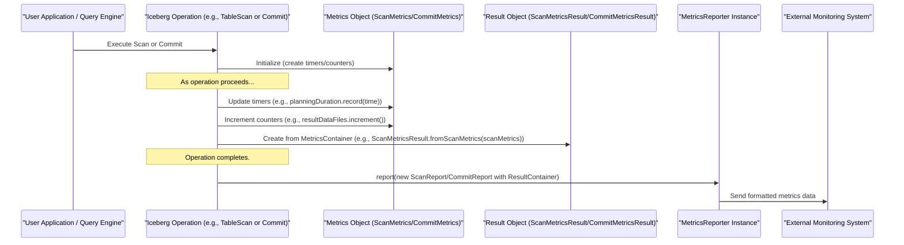

# Chapter 10: Metrics & Reporting (`MetricsConfig`, `ScanMetrics`, `CommitMetrics`, `MetricsReporter`)

Welcome to the final chapter of our journey through Iceberg's core concepts! In [Chapter 9: FileIO (`FileIO`)](09_fileio___fileio___.md), we learned how Iceberg interacts with various storage systems to read and write files. Now, let's explore how Iceberg keeps track of what happens during these operations. Ever wondered how long a query took to plan, how many files were scanned, or how much data was added in the last commit? That's where Metrics & Reporting come in!

## What's the Big Deal About Metrics? Your Table's Health Dashboard

Imagine driving a car. The dashboard tells you important things: your speed, fuel level, engine temperature. Without it, driving would be risky and inefficient. Similarly, when you work with large data tables, you need a "dashboard" to understand their health and performance.

**Metrics in Iceberg provide this dashboard.** They are measurements collected during various operations, such as:
*   Scanning a table (reading data).
*   Committing changes (writing data, updating schema).

These metrics can help you answer questions like:
*   "Why was my query slow yesterday?" (Maybe it scanned too many files, or planning took a long time.)
*   "How much new data did we add to the `orders` table last night?"
*   "Are we writing data files efficiently? What are their typical sizes?"
*   "Which columns are most frequently filtered on?" (This can help optimize data layout.)

Iceberg collects these metrics and provides a way to report them, often to external monitoring systems, so you can analyze performance and keep an eye on your table's well-being.

## Key Concepts: The Building Blocks of Iceberg Metrics

Let's break down the main components involved in Iceberg's metrics system:

### 1. `MetricsConfig`: Setting Up Your Data File Thermometers

When Iceberg writes data files (like Parquet or ORC files), it can also collect statistics *about the data within those files*. These are called **column-level statistics** or **column metrics**.
`MetricsConfig` tells Iceberg *what kind* of statistics to collect for each column in your data files. These stats are then stored in the [Manifests (`ManifestFile`, `ManifestEntry`, `ManifestReader`, `ManifestWriter`, `ManifestListWriter`)](06_manifests___manifestfile____manifestentry____manifestreader____manifestwriter____manifestlistwriter___.md) (as part of the `ManifestEntry`).

Common column-level statistics include:
*   **Value Counts**: Number of non-null values.
*   **Null Value Counts**: Number of null values.
*   **Min/Max Values**: The minimum and maximum value for a column in that file (e.g., min `order_date` and max `order_date`). This is super useful for query pruning!
*   **NaN Value Counts**: For floating point types, how many "Not a Number" values.
*   **Truncated Values**: Sometimes, for string columns, storing the full min/max values might be too large. `MetricsConfig` can specify to store only a truncated prefix (e.g., the first 16 characters).

`MetricsConfig` is usually defined by table properties. You can set a default mode for all columns and then override it for specific columns.

```java
// src/main/java/org/apache/iceberg/MetricsConfig.java
// This class isn't typically instantiated directly by users but configured via table properties.
// Example table properties that would define a MetricsConfig:

// "write.metadata.metrics.default=counts"
//   - Default: Collect only value_counts and null_value_counts for all columns.

// "write.metadata.metrics.column.event_timestamp=truncate(10)"
//   - For 'event_timestamp' column: Collect min/max values, but truncate strings to 10 chars.
//   - Also collects counts.

// "write.metadata.metrics.column.user_id=full"
//   - For 'user_id' column: Collect full min/max values (no truncation) and counts.

// "write.metadata.metrics.column.payload=none"
//   - For 'payload' column: Collect no column-level metrics.
```
These properties tell Iceberg how to populate the statistics in the `ManifestEntry` for each data file it writes. Better statistics mean better query planning and performance.

### 2. `ScanMetrics`: Tracking Your Table Reads

When you perform a [Table Scan (`TableScan`, `BaseScan`, `TableScanContext`)](07_table_scan___tablescan____basescan____tablescancontext___.md) (i.e., read data from a table), Iceberg can collect metrics about that scan operation. These are held in a `ScanMetrics` object.

`ScanMetrics` captures details like:
*   **Total Planning Duration**: How long it took to figure out which files to read.
*   **Result Data Files/Delete Files**: How many data files and delete files will actually be scanned.
*   **Scanned Data/Delete Manifests**: How many manifest files were read.
*   **Total Data/Delete Manifests**: How many manifest files exist in the snapshot.
*   **Total File Size in Bytes**: Total size of data files to be scanned.
*   **Skipped Data/Delete Files/Manifests**: How many files/manifests were skipped due to pruning (thanks to filters and manifest statistics).

```java
// src/main/java/org/apache/iceberg/metrics/ScanMetrics.java
// This object is usually populated by Iceberg during scan planning.
// Conceptual snapshot of what a ScanMetrics might hold after a scan:

// ScanMetrics {
//   totalPlanningDuration: Timer(value=500ms),
//   resultDataFiles: Counter(value=10),
//   skippedDataFiles: Counter(value=90), // Good! 90 files were pruned.
//   totalFileSizeInBytes: Counter(value=102400000) // approx 100MB
//   ... and other counters/timers ...
// }
```
This information is invaluable for understanding query performance and the effectiveness of pruning.

### 3. `CommitMetrics`: Tracking Your Table Writes

When you commit changes to a table (e.g., appending data, deleting data, schema evolution using a [Transaction (`Transaction`, `BaseTransaction`)](08_transaction___transaction____basetransaction___.md)), Iceberg collects metrics about that commit operation. These are stored in a `CommitMetrics` object.

`CommitMetrics` captures information such as:
*   **Total Duration**: How long the entire commit operation took.
*   **Attempts**: How many times Iceberg tried to commit (due to retries on concurrent updates).
*   Metrics from the [Snapshot (`Snapshot`, `BaseSnapshot`)](05_snapshot___snapshot____basesnapshot___.md) summary, like:
    *   `added-data-files`, `removed-data-files`, `total-data-files`
    *   `added-records`, `removed-records`, `total-records`
    *   `added-files-size-bytes`

```java
// src/main/java/org/apache/iceberg/metrics/CommitMetrics.java
// This object is usually populated by Iceberg during commit operations.
// Conceptual snapshot of what CommitMetrics might hold after a commit:

// CommitMetrics {
//   totalDuration: Timer(value=2500ms),
//   attempts: Counter(value=1),
//   // Data below is typically pulled from the SnapshotSummary and wrapped into a CommitMetricsResult
//   addedDataFiles: Counter(value=5),
//   addedRecords: Counter(value=50000),
//   addedFilesSizeInBytes: Counter(value=52428800) // approx 50MB
//   ... and other counters/timers ...
// }
```
These metrics help you understand the impact and performance of your write operations.

### 4. `MetricsReporter`: Sending Out the News

So Iceberg collects all these `ScanMetrics` and `CommitMetrics`. How do you actually *see* them? That's where `MetricsReporter` comes in.

A `MetricsReporter` is an interface that defines a single method: `report(MetricsReport report)`.
Its job is to take a "report" (which could be a `ScanReport` containing `ScanMetricsResult`, or a `CommitReport` containing `CommitMetricsResult`) and send it somewhere. "Somewhere" could be:
*   A logging system (like writing to SLF4J logs).
*   A dedicated metrics collection system (like Prometheus, Graphite, or a cloud provider's monitoring service like AWS CloudWatch).
*   A simple console output for debugging.

Iceberg itself doesn't dictate *where* the metrics go; it just provides the hook (`MetricsReporter`) for you to plug in your desired destination. Often, query engines or catalog configurations will allow you to specify a `MetricsReporter` implementation.

## How It All Works Together: From Collection to Reporting

Let's trace how metrics are generally handled:



1.  **Configuration (`MetricsConfig`)**: When data is written, the `MetricsConfig` (from table properties) dictates what column-level stats are collected and stored in [Manifests (`ManifestFile`, `ManifestEntry`, `ManifestReader`, `ManifestWriter`, `ManifestListWriter`)](06_manifests___manifestfile____manifestentry____manifestreader____manifestwriter____manifestlistwriter___.md). This isn't directly part of `ScanMetrics` or `CommitMetrics` but influences the data available for pruning later.

2.  **Operation Starts**: An Iceberg operation like a `TableScan.planFiles()` or `Transaction.commitTransaction()` begins.
    *   It typically obtains or creates a `MetricsContext` which is a factory for `Timer` and `Counter` objects.
    *   `ScanMetrics` or `CommitMetrics` objects are created, holding this `MetricsContext`.

3.  **During Operation**:
    *   **Timers**: Specific phases of the operation are timed. For example, `scanMetrics.totalPlanningDuration().record(durationNanos);`
    *   **Counters**: Events are counted. For example, `scanMetrics.resultDataFiles().increment();` or `scanMetrics.skippedDataFiles().increment(numSkipped);`.

4.  **Operation Completes**:
    *   The `ScanMetrics` or `CommitMetrics` now contain the final values for their timers and counters.
    *   These are often converted into immutable, serializable "result" objects:
        *   `ScanMetricsResult` (from `src/main/java/org/apache/iceberg/metrics/ScanMetricsResult.java`)
        *   `CommitMetricsResult` (from `src/main/java/org/apache/iceberg/metrics/CommitMetricsResult.java`)
        These `...Result` objects simply hold the final values (e.g., `long duration`, `long count`).

5.  **Reporting**:
    *   A "report" object is created:
        *   `ScanReport` (from `src/main/java/org/apache/iceberg/metrics/ScanReport.java`): Contains `ScanMetricsResult`, table name, snapshot ID, filter expression, etc.
        *   `CommitReport` (from `src/main/java/org/apache/iceberg/metrics/CommitReport.java`): Contains `CommitMetricsResult`, table name, snapshot ID, operation type, etc.
    *   This `MetricsReport` (either `ScanReport` or `CommitReport`) is passed to the configured `MetricsReporter.report()` method.
    *   The `MetricsReporter` then sends this information to its destination.

### `MetricsConfig` in Action

The `MetricsConfig` class (from `src/main/java/org/apache/iceberg/MetricsConfig.java`) is primarily used when writing data files. It helps decide which column stats go into the manifest entries.

```java
// src/main/java/org/apache/iceberg/MetricsConfig.java
// Typically loaded from table properties when a table is loaded or an operation is prepared.
// Table table = catalog.loadTable(tableIdent);
// MetricsConfig metricsConfig = MetricsConfig.forTable(table);

// String columnName = "user_id";
// MetricsModes.MetricsMode mode = metricsConfig.columnMode(columnName);
// System.out.println("Metrics mode for column '" + columnName + "': " + mode);
// Example output: Metrics mode for column 'user_id': Full
```
This `mode` tells the data writing part of Iceberg (e.g., when creating Parquet files and then their manifest entries) whether to compute and store "full" stats, "counts" only, "truncate(N)" stats, or "none" for the `user_id` column.

### `ScanMetrics` and `CommitMetrics` Structure

Both `ScanMetrics` (from `src/main/java/org/apache/iceberg/metrics/ScanMetrics.java`) and `CommitMetrics` (from `src/main/java/org/apache/iceberg/metrics/CommitMetrics.java`) are simple wrappers around a `MetricsContext`. They provide convenient getter methods for specific timers and counters.

```java
// Conceptual structure, from ScanMetrics.java
// public abstract class ScanMetrics {
//   public abstract MetricsContext metricsContext(); // The underlying factory for timers/counters
//
//   @Value.Derived // Means it's derived from metricsContext()
//   public Timer totalPlanningDuration() {
//     return metricsContext().timer(TOTAL_PLANNING_DURATION, TimeUnit.NANOSECONDS);
//   }
//
//   @Value.Derived
//   public Counter resultDataFiles() {
//     return metricsContext().counter(RESULT_DATA_FILES);
//   }
//   // ... other metrics ...
//
//   public static ScanMetrics of(MetricsContext metricsContext) { // Factory method
//     return ImmutableScanMetrics.builder().metricsContext(metricsContext).build();
//   }
// }
```
`CommitMetrics` has a similar structure. The `Timer` and `Counter` objects (from `org.apache.iceberg.metrics` package) are simple interfaces for recording duration or incrementing a count.

### `MetricsReporter` and `MetricsReporters` Utility

You might have multiple places you want to send metrics. The `MetricsReporters` utility class (from `src/main/java/org/apache/iceberg/metrics/MetricsReporters.java`) provides a way to combine multiple reporters.

```java
// src/main/java/org/apache/iceberg/metrics/MetricsReporters.java

// Example: Creating a simple reporter that just prints to console
// MetricsReporter consoleReporter = (report) -> {
//     System.out.println("METRICS REPORT (" + report.getClass().getSimpleName() + "):");
//     if (report instanceof ScanReport) {
//         ScanReport scanReport = (ScanReport) report;
//         System.out.println("  Table: " + scanReport.tableName());
//         System.out.println("  Snapshot ID: " + scanReport.snapshotId());
//         System.out.println("  Planning Time: " + scanReport.scanMetrics().totalPlanningDuration());
//         System.out.println("  Result Files: " + scanReport.scanMetrics().resultDataFiles());
//     } else if (report instanceof CommitReport) {
//         CommitReport commitReport = (CommitReport) report;
//         System.out.println("  Table: " + commitReport.tableName());
//         // ... print more commit details ...
//     }
// };

// MetricsReporter anotherReporter = ... ; // Maybe an SLF4J reporter

// Combine them
// MetricsReporter combinedReporter = MetricsReporters.combine(consoleReporter, anotherReporter);

// Now, when Iceberg calls combinedReporter.report(someReport),
// both consoleReporter and anotherReporter will be called.
// This is handled by CompositeMetricsReporter internally.
```
The `CompositeMetricsReporter` simply iterates over a list of registered reporters and calls `report()` on each one.

## Conclusion: Understanding Your Iceberg Tables Better

Metrics and Reporting in Iceberg provide essential visibility into how your tables are performing and changing.
*   **`MetricsConfig`** controls the fine-grained column statistics stored in manifest files, which are crucial for query pruning.
*   **`ScanMetrics`** gives you insights into the performance of your read operations, showing how much work was done and how much was avoided.
*   **`CommitMetrics`** helps you understand the impact and efficiency of your write operations.
*   **`MetricsReporter`** provides a flexible way to send these valuable metrics to your chosen monitoring or logging systems.

By leveraging these metrics, you can diagnose performance issues, understand data evolution, and make more informed decisions about managing your Iceberg tables.

This chapter concludes our tour of the `core` components of Apache Iceberg. From understanding how tables are defined and found using the [Catalog (`Catalog`, `BaseMetastoreCatalog`)](01_catalog___catalog____basemetastorecatalog___.md), to managing their state with [Table Operations (`TableOperations`)](02_table_operations___tableoperations___.md) and [Table Metadata (`TableMetadata`)](03_table_metadata___tablemetadata___.md), defining their structure with [Schema (`Schema`, `SchemaParser`, `SchemaUpdate`)](04_schema___schema____schemaparser____schemaupdate___.md), tracking versions with [Snapshot (`Snapshot`, `BaseSnapshot`)](05_snapshot___snapshot____basesnapshot___.md), indexing files with [Manifests (`ManifestFile`, `ManifestEntry`, `ManifestReader`, `ManifestWriter`, `ManifestListWriter`)](06_manifests___manifestfile____manifestentry____manifestreader____manifestwriter____manifestlistwriter___.md), planning reads with [Table Scan (`TableScan`, `BaseScan`, `TableScanContext`)](07_table_scan___tablescan____basescan____tablescancontext___.md), ensuring safe changes with [Transaction (`Transaction`, `BaseTransaction`)](08_transaction___transaction____basetransaction___.md), abstracting storage with [FileIO (`FileIO`)](09_fileio___fileio___.md), and finally, understanding operations through Metrics & Reporting, you now have a solid foundation in the fundamental building blocks of Iceberg.

We hope this journey has been enlightening and empowers you to explore and utilize Apache Iceberg more effectively!

---

Generated by [AI Codebase Knowledge Builder](https://github.com/The-Pocket/Tutorial-Codebase-Knowledge)