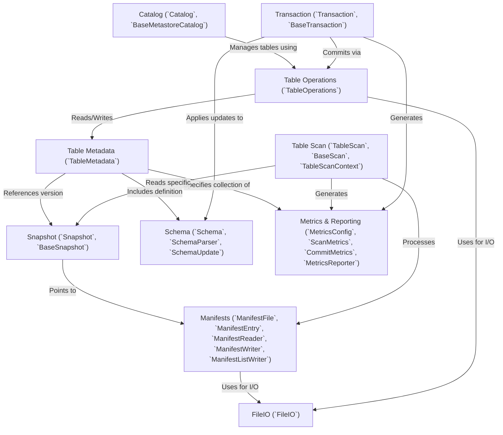

# Tutorial: core

The `core` project provides the fundamental building blocks for Apache Iceberg, a high-performance format for *huge analytic tables*. It defines how tables are structured, how data is versioned using **snapshots** for features like *time travel*, and how table metadata (including **schemas** and **partitioning** information) is managed. This core library enables **atomic operations** on tables, supports schema evolution without rewriting data, and abstracts underlying file system interactions, making Iceberg tables portable across different storage systems.

**Source Repository:** [None](None)

## Chapters

1. [Catalog (`Catalog`, `BaseMetastoreCatalog`)
](01_catalog___catalog____basemetastorecatalog___.md)
2. [Table Operations (`TableOperations`)
](02_table_operations___tableoperations___.md)
3. [Table Metadata (`TableMetadata`)
](03_table_metadata___tablemetadata___.md)
4. [Schema (`Schema`, `SchemaParser`, `SchemaUpdate`)
](04_schema___schema____schemaparser____schemaupdate___.md)
5. [Snapshot (`Snapshot`, `BaseSnapshot`)
](05_snapshot___snapshot____basesnapshot___.md)
6. [Manifests (`ManifestFile`, `ManifestEntry`, `ManifestReader`, `ManifestWriter`, `ManifestListWriter`)
](06_manifests___manifestfile____manifestentry____manifestreader____manifestwriter____manifestlistwriter___.md)
7. [Table Scan (`TableScan`, `BaseScan`, `TableScanContext`)
](07_table_scan___tablescan____basescan____tablescancontext___.md)
8. [Transaction (`Transaction`, `BaseTransaction`)
](08_transaction___transaction____basetransaction___.md)
9. [FileIO (`FileIO`)
](09_fileio___fileio___.md)
10. [Metrics & Reporting (`MetricsConfig`, `ScanMetrics`, `CommitMetrics`, `MetricsReporter`)
](10_metrics___reporting___metricsconfig____scanmetrics____commitmetrics____metricsreporter___.md)

---

Generated by [AI Codebase Knowledge Builder](https://github.com/The-Pocket/Tutorial-Codebase-Knowledge)