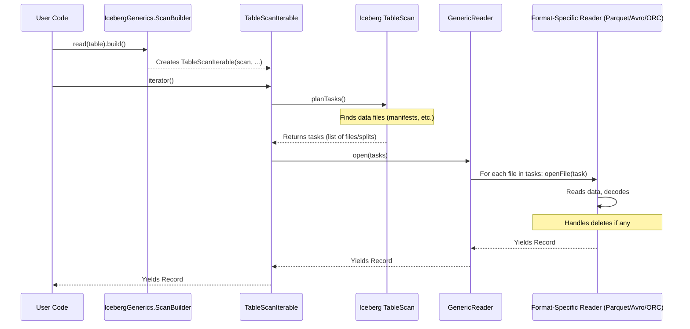

# Chapter 2: Generic Data Reading

In [Chapter 1: Generic Row Representation (`Record` & `InternalRecordWrapper`)](01_generic_row_representation___record_____internalrecordwrapper___.md), we learned how Apache Iceberg represents individual rows of data using `Record` objects and how `InternalRecordWrapper` helps with type conversions. Now, let's see how we can read many of these `Record`s from an actual Iceberg table.

## What's the Challenge with Reading Data?

Imagine you have a huge library (your Iceberg table) filled with books (data files). These books are written in different languages (file formats like Parquet, Avro, or ORC). Some pages might be marked as "to be ignored" (deleted records). If you wanted to find specific information, you'd have to:

1.  Figure out which books might contain your information.
2.  Open each relevant book.
3.  Understand the language it's written in.
4.  Skip any "to be ignored" pages.
5.  Finally, extract the information you need.

This sounds like a lot of work, right? Iceberg's "Generic Data Reading" is designed to do all this heavy lifting for you!

**Our Use Case:** Let's say we have an Iceberg table storing employee information (ID, Name, Department). We simply want to read all employee records from this table and print their names. We don't want to worry about whether the data is stored in Parquet or Avro, or if some records were recently deleted.

## Meet Your Smart Librarian: Generic Data Reading

Generic Data Reading in Iceberg acts like a super-smart librarian.
*   You tell the librarian what you're looking for using a **`TableScan`**. Think of `TableScan` as your request slip. You can specify which table to read, which columns you're interested in (projection), and any conditions the rows must meet (filters).
*   The librarian (Iceberg's reading mechanism) takes your `TableScan` and handles all the complexities:
    *   Finding the right data files (like finding the correct shelves and books).
    *   Understanding different file formats (like being multilingual).
    *   Skipping over deleted records (like knowing which pages are outdated).
*   Finally, the librarian hands you easy-to-use, generic `Record` objects, one for each row of data you requested.

This makes reading data incredibly simple for you, the user.

## How to Read Data: The `IcebergGenerics` Way

The easiest way to start reading generic `Record` objects from an Iceberg table is by using `IcebergGenerics.read(table)`.

Let's assume you have an Iceberg `Table` object named `employeesTable`.

**1. Start Your Read Request:**

You begin by telling Iceberg you want to read from your `employeesTable`:

```java
import org.apache.iceberg.Table;
import org.apache.iceberg.data.IcebergGenerics;
import org.apache.iceberg.data.Record;
import org.apache.iceberg.io.CloseableIterable;

// Assume 'employeesTable' is an existing Iceberg Table object
// Table employeesTable = ... ;

// Start building your read request
IcebergGenerics.ScanBuilder scanBuilder = IcebergGenerics.read(employeesTable);
```
This gives you a `ScanBuilder` object, which you can use to customize your read.

**2. Customize Your Scan (Optional):**

You can tell the "librarian" more specifics. For example, if you only want the "name" and "department" columns:

```java
// I only want the 'name' and 'department' columns
scanBuilder.select("name", "department");
```
You can also add filters, choose a specific snapshot of the table, etc. For now, let's keep it simple and read all columns.

**3. Build and Get the Data Iterable:**

Once you've configured your scan (or if you're happy with the defaults), you call `build()` to get something you can loop over:

```java
// Get an iterable that will give us Record objects
CloseableIterable<Record> recordsIterable = scanBuilder.build();
```
This `recordsIterable` is special. It's "closeable," meaning you should always close it when you're done to free up resources (like open files). A `try-with-resources` block is perfect for this.

**4. Loop Through Your Records:**

Now you can easily iterate through the `Record` objects:

```java
// Assuming your table has "id" (int), "name" (string), "department" (string)
try (CloseableIterable<Record> records = scanBuilder.build()) {
    for (Record record : records) {
        // Access data by field name
        String name = record.getField("name", String.class);
        String department = record.getField("department", String.class);
        // Or by position (if you know it)
        // Integer id = record.get(0, Integer.class);

        System.out.println("Employee Name: " + name + ", Department: " + department);
    }
} catch (IOException e) {
    // Handle potential errors during closing
    e.printStackTrace();
}
```
**Example Output (if your table had this data):**
```
Employee Name: Alice, Department: Engineering
Employee Name: Bob, Department: Marketing
Employee Name: Carol, Department: Engineering
```
And that's it! You didn't need to know if the data was in Parquet or ORC files, or how to handle deletes. Iceberg managed it all and gave you simple `Record` objects. Remember how we used `getField("name", String.class)`? That's the same `Record` interface we saw in [Chapter 1: Generic Row Representation (`Record` & `InternalRecordWrapper`)](01_generic_row_representation___record_____internalrecordwrapper___.md).

## What Happens Under the Hood? A Peek Inside

When you call `scanBuilder.build()` and start iterating, Iceberg performs several steps:



1.  **Planning the Scan (`scan.planTasks()`):**
    *   When `TableScanIterable` is created (usually when you call `build()`), it internally uses the `TableScan` object you configured.
    *   The `TableScan` looks at the table's metadata (manifest lists and manifest files) to find all the data files that match your query (e.g., for the current snapshot, satisfying any filters).
    *   It creates a list of "tasks" (`CloseableIterable<CombinedScanTask>`). Each task typically represents one or more data files (or parts of files) that need to be read.

2.  **Opening the Data (`reader.open(tasks)`):**
    *   The `TableScanIterable` then passes these tasks to a `GenericReader`.
    *   The `GenericReader` iterates through each `FileScanTask` (a single file to read).

3.  **Reading Each File (`GenericReader.openFile()`):**
    *   For each file:
        *   **Determine Format:** It checks the file's format (e.g., Parquet, Avro, ORC) from the task information.
        *   **Select Reader:** It picks the correct reader for that format (e.g., `GenericParquetReader`, `GenericOrcReader`).
        *   **Handle Deletes:** It sets up a [Delete Filter & Loader](04_delete_filter___loader_.md) if the file has associated delete files. This filter will automatically skip rows that have been deleted.
        *   **Read and Convert:** The format-specific reader reads raw data from the file and converts it into Iceberg `Record` objects.
        *   **Apply Residual Filters:** If there are any filter conditions that couldn't be pushed down to the file scan itself, they are applied to the `Record` objects.
        *   The `Record` objects are then streamed back to your code.

This process ensures that you get a clean, consistent stream of `Record` objects, abstracting away all the underlying complexity.

## Diving Deeper into the Code (Simplified)

Let's look at some key classes involved:

**1. `IcebergGenerics.java`**

This is your friendly entry point.

```java
// Simplified from IcebergGenerics.java
public class IcebergGenerics {
    private IcebergGenerics() {}

    public static ScanBuilder read(Table table) {
        return new ScanBuilder(table); // Creates the builder
    }

    public static class ScanBuilder {
        private TableScan tableScan;
        private boolean reuseContainers = false; // Option for performance

        public ScanBuilder(Table table) {
            this.tableScan = table.newScan(); // Starts a new scan on the table
        }

        public ScanBuilder select(String... selectedColumns) {
            this.tableScan = tableScan.select(selectedColumns); // Configures the TableScan
            return this;
        }
        // ... other methods like where(), project(), etc.

        public CloseableIterable<Record> build() {
            // Creates the TableScanIterable which does the actual work
            return new TableScanIterable(tableScan, reuseContainers);
        }
    }
}
```
The `read(table)` method gives you a `ScanBuilder`. The `ScanBuilder` configures an underlying `TableScan` object and its `build()` method creates a `TableScanIterable`.

**2. `TableScanIterable.java`**

This class takes the configured `TableScan` and makes it iterable.

```java
// Simplified from TableScanIterable.java
class TableScanIterable extends CloseableGroup implements CloseableIterable<Record> {
    private final GenericReader reader;
    private final CloseableIterable<CombinedScanTask> tasks;

    TableScanIterable(TableScan scan, boolean reuseContainers) {
        this.reader = new GenericReader(scan, reuseContainers);
        // This is where it asks the TableScan to plan which files to read
        this.tasks = scan.planTasks();
    }

    @Override
    public CloseableIterator<Record> iterator() {
        // When you start iterating, it asks the GenericReader to open the planned tasks
        CloseableIterator<Record> iter = reader.open(tasks);
        addCloseable(iter); // Keep track of it for closing later
        return iter;
    }

    // ... close() method to clean up resources ...
}
```
When you ask for an `iterator()`, it delegates to the `GenericReader`'s `open()` method, passing along the `tasks` (the list of files/file parts to read) that were planned by the `TableScan`.

**3. `GenericReader.java`**

This is where the magic of reading different file formats happens.

```java
// Simplified from GenericReader.java
class GenericReader implements Serializable {
    private final FileIO io; // For reading files
    private final Schema projection; // What columns we want
    // ... other fields ...

    GenericReader(TableScan scan, boolean reuseContainers) {
        this.io = scan.table().io();
        this.projection = scan.schema();
        // ... initialize other fields ...
    }

    // This method is called by TableScanIterable
    CloseableIterator<Record> open(CloseableIterable<CombinedScanTask> tasks) {
        // Converts combined tasks into individual file tasks and opens them
        Iterable<FileScanTask> fileTasks = Iterables.concat(
            Iterables.transform(tasks, CombinedScanTask::files));
        return CloseableIterable.concat(
            Iterables.transform(fileTasks, this::openFileTask)).iterator(); // Renamed open to openFileTask for clarity
    }

    // Method to open a single FileScanTask (renamed from 'open' in original for clarity here)
    public CloseableIterable<Record> openFileTask(FileScanTask task) {
        // 1. Setup DeleteFilter (more in a later chapter)
        DeleteFilter<Record> deletes = new GenericDeleteFilter(io, task, tableSchema, projection);
        Schema readSchema = deletes.requiredSchema(); // Schema needed for reading, considering deletes

        // 2. Open the actual data file
        CloseableIterable<Record> records = openPhysicalFile(task, readSchema); // Renamed openFile to openPhysicalFile

        // 3. Apply the delete filter
        records = deletes.filter(records);

        // 4. Apply any remaining "residual" filters
        records = applyResidual(records, readSchema, task.residual());

        return records;
    }

    // Renamed from 'openFile' in the original source to avoid confusion
    private CloseableIterable<Record> openPhysicalFile(FileScanTask task, Schema fileProjection) {
        InputFile input = io.newInputFile(task.file().path().toString());
        // ... (partition data handling omitted for brevity) ...

        switch (task.file().format()) {
            case AVRO:
                // Use Avro specific reader
                return Avro.read(input).project(fileProjection) /* ... more config ... */ .build();
            case PARQUET:
                // Use Parquet specific reader
                return Parquet.read(input).project(fileProjection) /* ... more config ... */ .build();
            case ORC:
                // Use ORC specific reader
                return ORC.read(input).project(fileProjection) /* ... more config ... */ .build();
            default:
                throw new UnsupportedOperationException("Cannot read " + task.file().format());
        }
    }
    // ... applyResidual method ...
}
```
The `GenericReader`'s `openFileTask` (conceptually similar to `open(FileScanTask task)` in the source) is key. For each file:
*   It sets up a `DeleteFilter` (we'll learn more about this in [Chapter 4: Delete Filter & Loader](04_delete_filter___loader_.md)).
*   The `openPhysicalFile` (simplified from `openFile` in the source) uses a `switch` statement to determine the file format.
*   It then calls the appropriate Iceberg library (e.g., `Avro.read()`, `Parquet.read()`, `ORC.read()`) to get a `CloseableIterable<Record>` for that specific file. These libraries are part of Iceberg's [File Format Abstraction Layer](05_file_format_abstraction_layer_.md).
*   The `DeleteFilter` wraps this iterable to remove deleted rows.
*   Finally, any `residual` filter expressions are applied.

This layered approach allows Iceberg to abstract away the details of each file format and provide you with a simple, unified way to read your data.

## Conclusion

Generic Data Reading in Iceberg is your go-to tool for pulling data out of tables. By using `IcebergGenerics.read(table)`, you get a `ScanBuilder` that lets you define what you want. Iceberg then acts as a smart librarian, figuring out which files to read, handling different formats (Parquet, Avro, ORC), and even filtering out deleted records, all while handing you simple `Record` objects. This makes your life much easier when you just want to consume data.

We've seen how to read data. But what if we want to put new data into an Iceberg table? That's exactly what we'll cover in the next chapter on [Chapter 3: Generic Data Writing](03_generic_data_writing_.md).

---

Generated by [AI Codebase Knowledge Builder](https://github.com/The-Pocket/Tutorial-Codebase-Knowledge)