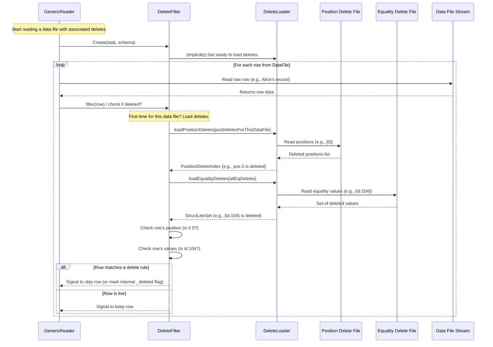

# Chapter 4: Delete Filter & Loader

In [Chapter 3: Generic Data Writing](03_generic_data_writing_.md), we learned how to add new data to our Iceberg tables by creating data files. But what happens when data becomes outdated or needs to be removed? Iceberg has a clever way to handle this without immediately rewriting huge data files. Let's explore how Iceberg makes sure you only see the "live" data!

## The Challenge: Dealing with "Ghosts" in Your Data

Imagine you have a large employee database. Over time, some employees might leave the company. You want to mark their records as "deleted" so they don't show up in current reports, but you might not want to rewrite the entire database file every time someone leaves. How does Iceberg manage this efficiently?

If Iceberg just ignored these "deleted" marks when you read the data, you'd get outdated information – like seeing an employee who left months ago as still active.

**Our Use Case:**
Let's say our `employeesTable` contains a record for an employee named "Alice."
*   Data File 1: `id: 101, name: "Alice", department: "Engineering"`
*   Data File 2: `id: 102, name: "Bob", department: "Marketing"`

Later, Alice resigns. Instead of rewriting `Data File 1`, Iceberg creates a small "delete file" that says: "The record for Alice (or the record at a specific position in `Data File 1`) is now deleted."

When we query the `employeesTable` for all employees, we expect to see only Bob, not Alice. How does Iceberg make Alice "disappear" from our query results? This is where the `DeleteLoader` and `DeleteFilter` come into play.

## Meet the Team: `DeleteLoader` and `DeleteFilter`

Think of this process like managing an archive with a very diligent archivist and a strict bouncer at the reading room.

1.  **Delete Files (The "To Be Removed" Lists):**
    *   When you delete rows in Iceberg (e.g., using a `DELETE FROM my_table WHERE ...` SQL command), Iceberg doesn't always rewrite the data files immediately. Instead, it often writes new, small files called **delete files**.
    *   These files contain information about which rows are deleted. There are mainly two kinds:
        *   **Position Deletes:** These files say, "In data file X, the row at position Y is deleted." (e.g., "In `data_file_A.parquet`, the 5th row is deleted.")
        *   **Equality Deletes:** These files say, "Any row, in any data file, where certain column values match these specific values, is deleted." (e.g., "Any row where `employee_id = 101` is deleted.")

2.  **`DeleteLoader` (The Archivist):**
    *   **What it is:** The `DeleteLoader` is like an archivist. When Iceberg needs to read a data file that might have associated deletes, the `DeleteLoader`'s job is to go and fetch the relevant "to be removed" lists (the information from those delete files).
    *   **Analogy:** If a data file is a book, the `DeleteLoader` finds all the sticky notes and memos (delete files) that say "ignore page 5" or "any chapter mentioning 'Project X' is outdated."

3.  **`DeleteFilter` (The Bouncer):**
    *   **What it is:** The `DeleteFilter` acts like a bouncer at the entrance of a club. It takes the lists of "to-be-removed" entries gathered by the `DeleteLoader`. Then, as each data row tries to "enter" (i.e., be included in your query results), the `DeleteFilter` checks it against these lists.
    *   **Analogy:** As you read a book (data file), the bouncer (DeleteFilter) stands beside you. For each page (row) you're about to read, the bouncer checks their notes (from the DeleteLoader). If the notes say "ignore page 5," the bouncer stops you from reading that page.
    *   It handles both position deletes (checking the row's position) and equality deletes (checking the row's values).
    *   The result is that your query only processes the "live" data rows.

## How It Works When You Read Data

You generally don't interact with `DeleteLoader` and `DeleteFilter` directly when just reading data. They are used internally by Iceberg's reading mechanism, like the `GenericReader` we saw in [Chapter 2: Generic Data Reading](02_generic_data_reading_.md).

Let's revisit our employee example:
*   `Data File 1`: Contains Alice (`id: 101`) and Charlie (`id: 103`).
*   `Position Delete File A`: Says "row at position 0 (Alice) in `Data File 1` is deleted."
*   `Equality Delete File B`: Says "any row where `id = 104` (David) is deleted." (Assume David was in `Data File 2`).

When your `GenericReader` starts reading `Data File 1`:
1.  It sees that `Data File 1` has `Position Delete File A` associated with it.
2.  It creates a `DeleteFilter` (e.g., `GenericDeleteFilter`).
3.  The `DeleteFilter` uses a `DeleteLoader` (e.g., `BaseDeleteLoader`) to load the information from `Position Delete File A`. This tells the filter: "for `Data File 1`, position 0 is deleted."
4.  The `GenericReader` reads the first row from `Data File 1` (Alice's record, which is at position 0).
5.  The `DeleteFilter` checks Alice's record. It sees that position 0 is marked as deleted. So, Alice's record is skipped.
6.  The `GenericReader` reads the second row from `Data File 1` (Charlie's record, at position 1).
7.  The `DeleteFilter` checks Charlie's record. Position 1 is not on the "deleted" list. So, Charlie's record is passed through.

Similarly, if it reads a `Data File 2` containing David (`id:104`), the `DeleteFilter` (after the `DeleteLoader` processes `Equality Delete File B`) would identify David's record as deleted based on his ID and filter it out.

The user simply gets the `Record` for Charlie, and any other non-deleted employees. Alice and David are filtered out automatically.

Here's a simplified conceptual code snippet showing where `DeleteFilter` fits into the `GenericReader` we discussed in [Chapter 2: Generic Data Reading](02_generic_data_reading_.md):

```java
// Conceptual part of GenericReader.java from Chapter 2
// FileScanTask task = ...; // Contains info about the data file and its delete files
// FileIO io = ...;
// Schema tableSchema = ...;
// Schema requestedSchema = ...;

// 1. Create a DeleteFilter for the task
DeleteFilter<Record> deletes = new GenericDeleteFilter(io, task, tableSchema, requestedSchema);

// 2. Open the physical data file, requesting the schema the DeleteFilter needs
// (which might include _pos if there are position deletes)
CloseableIterable<Record> records = openPhysicalDataFile(task, deletes.requiredSchema());

// 3. Apply the filter!
// This iterable will only yield records that are NOT deleted.
CloseableIterable<Record> liveRecords = deletes.filter(records);

// Now, loop through liveRecords to get your data
// for (Record record : liveRecords) { ... }
```
The `deletes.filter(records)` call is where the "bouncer" does its work, ensuring only live records pass through.

## Under the Hood: A Peek Inside

Let's see a simplified flow of how this works:



**Key Components in Code:**

1.  **`DeleteFilter.java` (The Bouncer's Rulebook)**
    *   The constructor (`DeleteFilter(...)`) takes the data file's path, a list of all `DeleteFile` objects associated with it, the table schema, and the schema requested by the user.
    *   It sorts the `DeleteFile` objects into `posDeletes` and `eqDeletes`.
    *   `requiredSchema()`: This is clever. If there are position deletes, the `DeleteFilter` needs to know the original row position from the data file. It ensures the schema used to read the data file includes `MetadataColumns.ROW_POSITION` (an internal column often aliased as `_pos`). If the read will produce a column indicating whether a row is deleted (e.g., `_deleted`), that's also handled here.
    *   `filter(CloseableIterable<T> records)`: This is the main entry point. It wraps the incoming stream of records.
        *   It calls `applyPosDeletes()` and `applyEqDeletes()` internally.
    *   `applyPosDeletes(CloseableIterable<T> records)`:
        *   If there are no position delete files, it returns the records as is.
        *   Otherwise, it calls `deletedRowPositions()` to get a `PositionDeleteIndex`.
        *   `deletedRowPositions()`: This lazily loads the position deletes by calling `deleteLoader().loadPositionDeletes(posDeletes, filePath)`. The `PositionDeleteIndex` is an efficient data structure (like a bitmap or a set of numbers) that can quickly tell if a given row position is deleted.
        *   It then returns an iterable that filters records based on this index.
    *   `applyEqDeletes(CloseableIterable<T> records)`:
        *   If there are no equality delete files, it returns records as is.
        *   Otherwise, it groups equality delete files by the set of columns they use for equality (e.g., all deletes on `employee_id`).
        *   For each group, it calls `deleteLoader().loadEqualityDeletes(deletesInGroup, deleteSchema)` to get a `StructLikeSet`. This set contains all the specific values that are marked for deletion (e.g., a set containing a `StructLike` representing `(employee_id=101)`).
        *   It builds a list of predicates. Each predicate checks if a record matches one of these `StructLikeSet`s.
        *   It then returns an iterable that filters records if they match *any* of these equality delete conditions.

    ```java
    // Simplified from DeleteFilter.java
    public abstract class DeleteFilter<T> {
        private final String filePath; // Path of the data file being read
        private final List<DeleteFile> posDeletes;
        private final List<DeleteFile> eqDeletes;
        private DeleteLoader deleteLoader; // Lazily initialized
        // ... other fields like schemas ...

        protected DeleteFilter(String filePath, List<DeleteFile> deletes, /*...schemas...*/) {
            this.filePath = filePath;
            // Sort 'deletes' into this.posDeletes and this.eqDeletes
            // ...
        }

        // Lazily creates and returns the DeleteLoader
        private DeleteLoader deleteLoader() {
            if (deleteLoader == null) {
                this.deleteLoader = newDeleteLoader(); // newDeleteLoader() is abstract
            }
            return deleteLoader;
        }

        public CloseableIterable<T> filter(CloseableIterable<T> records) {
            // Apply position deletes first, then equality deletes to the result
            return applyEqDeletes(applyPosDeletes(records));
        }

        private CloseableIterable<T> applyPosDeletes(CloseableIterable<T> records) {
            if (posDeletes.isEmpty()) return records;
            PositionDeleteIndex positions = deleteLoader().loadPositionDeletes(posDeletes, filePath);
            // Return an iterable that skips records if their 'pos(record)' is in 'positions'
            // ... uses Deletes.filterDeleted(...) or Deletes.markDeleted(...)
        }

        private CloseableIterable<T> applyEqDeletes(CloseableIterable<T> records) {
            if (eqDeletes.isEmpty()) return records;
            List<Predicate<T>> eqPredicates = Lists.newArrayList();
            // For each set of equality delete files:
            //   Schema deleteSchema = ... ; // schema of fields involved in equality delete
            //   StructLikeSet deletedValues = deleteLoader().loadEqualityDeletes(files, deleteSchema);
            //   StructProjection projectRow = StructProjection.create(requiredSchema(), deleteSchema);
            //   Predicate<T> pred = record -> deletedValues.contains(projectRow.wrap(asStructLike(record)));
            //   eqPredicates.add(pred);
            // Combine predicates and filter records
            // ... uses Deletes.filterDeleted(...) or Deletes.markDeleted(...)
        }

        // Abstract methods to be implemented by subclasses like GenericDeleteFilter
        protected abstract long pos(T record); // Gets the row position from the record
        protected abstract StructLike asStructLike(T record); // Converts record to StructLike for equality checks
        protected abstract DeleteLoader newDeleteLoader(); // Factory method for DeleteLoader
    }
    ```

2.  **`GenericDeleteFilter.java` (The Bouncer for Generic `Record`s)**
    *   This is a concrete implementation of `DeleteFilter` specifically for `Record` objects (which we learned about in [Chapter 1: Generic Row Representation (`Record` & `InternalRecordWrapper`)](01_generic_row_representation___record_____internalrecordwrapper___.md)).
    *   It implements `pos(Record record)` by getting the value of the `MetadataColumns.ROW_POSITION` field from the `Record`.
    *   It implements `asStructLike(Record record)` using an `InternalRecordWrapper` to wrap the `Record`. This is important for equality delete checks, as the `DeleteLoader` provides deleted values as `StructLike` objects.
    *   It implements `newDeleteLoader()` to typically return a `BaseDeleteLoader`.
    *   `getInputFile(String location)`: It uses a `FileIO` object (Iceberg's file system abstraction) to get an `InputFile` for a delete file's path.

    ```java
    // Simplified from GenericDeleteFilter.java
    public class GenericDeleteFilter extends DeleteFilter<Record> {
        private final FileIO io;
        private final InternalRecordWrapper asStructLikeWrapper;
        private final Accessor<StructLike> posAccessor; // For MetadataColumns.ROW_POSITION

        public GenericDeleteFilter(FileIO io, FileScanTask task, Schema tableSchema, Schema requestedSchema) {
            super(task.file().location(), task.deletes(), tableSchema, requestedSchema);
            this.io = io;
            // Wrapper for converting Record to StructLike for equality delete checks
            this.asStructLikeWrapper = new InternalRecordWrapper(requiredSchema().asStruct());
            // Accessor to get the _pos field from a Record
            this.posAccessor = requiredSchema().accessorForField(MetadataColumns.ROW_POSITION.fieldId());
        }

        @Override
        protected long pos(Record record) {
            // Get the value of the _pos field (row position)
            return (Long) posAccessor.get(record);
        }

        @Override
        protected StructLike asStructLike(Record record) {
            // Wrap the Record for equality comparisons
            return asStructLikeWrapper.wrap(record);
        }

        @Override
        protected InputFile getInputFile(String location) {
            return io.newInputFile(location); // Use FileIO to open delete files
        }

        @Override
        protected DeleteLoader newDeleteLoader() {
            // Provide a concrete DeleteLoader implementation
            return new BaseDeleteLoader(this::getInputFile);
        }
    }
    ```

3.  **`DeleteLoader.java` (The Archivist's Job Description - Interface)**
    *   This interface defines what any "archivist" must be able to do:
        *   `loadEqualityDeletes(Iterable<DeleteFile> deleteFiles, Schema projection)`: Loads equality delete values from the given delete files, projecting them to the required `projection` schema. Returns a `StructLikeSet`.
        *   `loadPositionDeletes(Iterable<DeleteFile> deleteFiles, CharSequence filePath)`: Loads position deletes relevant to the given `filePath` from the specified delete files. Returns a `PositionDeleteIndex`.

4.  **`BaseDeleteLoader.java` (A Diligent Archivist - Implementation)**
    *   This is a common implementation of `DeleteLoader`.
    *   Its constructor takes a function `loadInputFile` (to get an `InputFile` from a `DeleteFile`) and an `ExecutorService` (for potential parallel loading).
    *   `loadEqualityDeletes(...)`:
        *   It iterates through the provided `deleteFiles`.
        *   For each file, it calls `readEqDeletes()`.
        *   `readEqDeletes()` calls `openDeletes(deleteFile, projection)` to get a `CloseableIterable<Record>` of delete entries.
        *   These `Record`s (representing deleted rows/values) are then converted to `StructLike` objects and added to the `StructLikeSet`.
    *   `loadPositionDeletes(...)`:
        *   It handles "Deletion Vectors" (DVs - a newer, more compact format for position deletes) separately.
        *   For regular position delete files, it iterates through them.
        *   For each file, it calls `readPosDeletes(deleteFile, filePath)`.
        *   `readPosDeletes(...)` calls `openDeletes(deleteFile, POS_DELETE_SCHEMA, filter)` to get `Record`s. The `POS_DELETE_SCHEMA` specifies `file_path` and `pos` columns. An `Expression` filters these records for the current `filePath`.
        *   It then uses `Deletes.toPositionIndex(...)` to build the `PositionDeleteIndex` from these records.
    *   `openDeletes(DeleteFile deleteFile, Schema projection, Expression filter)`: This is crucial. It reads the actual delete file:
        *   It gets an `InputFile` for the `deleteFile`.
        *   It uses a `switch` on `deleteFile.format()` (AVRO, PARQUET, ORC).
        *   It then uses the appropriate Iceberg reader (e.g., `Avro.read()`, `Parquet.read()`, `ORC.read()`) to read the records from the delete file. This part uses the [File Format Abstraction Layer](05_file_format_abstraction_layer_.md) we'll discuss in the next chapter.
        *   The records read from the delete file are then returned.

    ```java
    // Simplified from BaseDeleteLoader.java
    public class BaseDeleteLoader implements DeleteLoader {
        private final Function<DeleteFile, InputFile> loadInputFileFunc;
        // ... workerPool for parallelism ...

        public BaseDeleteLoader(Function<DeleteFile, InputFile> loadInputFileFunc, /*...*/) {
            this.loadInputFileFunc = loadInputFileFunc;
        }

        @Override
        public StructLikeSet loadEqualityDeletes(Iterable<DeleteFile> deleteFiles, Schema projection) {
            StructLikeSet deleteSet = StructLikeSet.create(projection.asStruct());
            // For each deleteFile in deleteFiles:
            //   Iterable<StructLike> eqDeleteRows = readEqDeletes(deleteFile, projection);
            //   Iterables.addAll(deleteSet, eqDeleteRows);
            return deleteSet; // Contains all equality delete values
        }

        private Iterable<StructLike> readEqDeletes(DeleteFile deleteFile, Schema projection) {
            // CloseableIterable<Record> records = openDeletes(deleteFile, projection);
            // Convert these records to StructLike and collect them
            // ...
        }

        @Override
        public PositionDeleteIndex loadPositionDeletes(Iterable<DeleteFile> deleteFiles, CharSequence filePath) {
            // If it's a single Deletion Vector (DV), read it directly.
            // Otherwise, for multiple position delete files:
            //   List<PositionDeleteIndex> indexes = new ArrayList<>();
            //   For each deleteFile in deleteFiles:
            //     indexes.add(readPosDeletes(deleteFile, filePath));
            //   return PositionDeleteIndexUtil.merge(indexes); // Merge all indexes
        }

        private PositionDeleteIndex readPosDeletes(DeleteFile deleteFile, CharSequence filePath) {
            // Expression filter = Expressions.equal(MetadataColumns.DELETE_FILE_PATH.name(), filePath);
            // CloseableIterable<Record> records = openDeletes(deleteFile, POS_DELETE_SCHEMA, filter);
            // return Deletes.toPositionIndex(filePath, records, deleteFile);
        }

        private CloseableIterable<Record> openDeletes(
                DeleteFile deleteFile, Schema projection, Expression filter) {
            InputFile inputFile = loadInputFileFunc.apply(deleteFile);
            // Switch on deleteFile.format():
            //  case AVRO: return Avro.read(inputFile).project(projection)...build();
            //  case PARQUET: return Parquet.read(inputFile).project(projection).filter(filter)...build();
            //  case ORC: return ORC.read(inputFile).project(projection).filter(filter)...build();
            //  default: throw ...
        }
    }
    ```

This intricate dance between the `DeleteFilter` and `DeleteLoader` ensures that even though deletes are often stored separately from data, your queries see a consistent, clean view of only the live data.

## Conclusion

The `DeleteFilter` and `DeleteLoader` are the unsung heroes that make Iceberg's "read-on-delete" (or more accurately, "filter-on-read") strategy work seamlessly.
*   **Delete Files** store lists of deleted rows (by position or by value).
*   The **`DeleteLoader`** (the archivist) fetches these lists from delete files.
*   The **`DeleteFilter`** (the bouncer) uses these lists to check each data row, ensuring only live data makes it to your query results.

This mechanism is vital for Iceberg's performance, as it avoids costly data file rewrites for every delete operation, while still providing correct query results. Understanding this helps appreciate how Iceberg efficiently manages evolving datasets.

The `DeleteLoader` itself needs to read various file formats (Avro, Parquet, ORC) to understand the delete files. How does Iceberg handle reading and writing these different formats in a generic way? We'll dive into that in [Chapter 5: File Format Abstraction Layer](05_file_format_abstraction_layer_.md).

---

Generated by [AI Codebase Knowledge Builder](https://github.com/The-Pocket/Tutorial-Codebase-Knowledge)