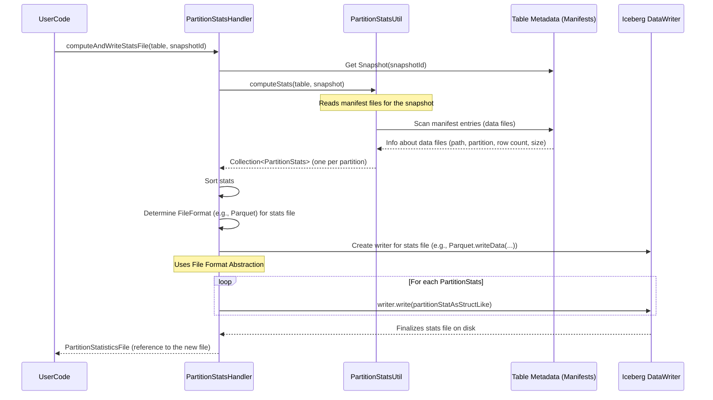

# Chapter 6: Partition Statistics Handler

In the previous chapter, we learned how Iceberg uses its [File Format Abstraction Layer](05_file_format_abstraction_layer_.md) to work with different file types like Parquet and Avro. This layer is also crucial when Iceberg needs to write and read special metadata files, such as those containing partition statistics. Now, let's explore how Iceberg keeps track of summaries for different sections of your data to help speed things up!

## Why Summarize Your Bookshelves? The Need for Partition Statistics

Imagine you have a massive library (your Iceberg table) organized into many bookshelves. Each bookshelf might represent a specific category, like "Sales in USA for 2023" or "Sales in Canada for 2023". These are like **partitions** in your data.

**Our Use Case:**
Let's say you have a table `global_sales` partitioned by `country` and `year`. It contains millions of sales records.
*   `global_sales (product_id, sale_amount, sale_date, country, year)`

If you want to find the total sales for "USA" in "2023" (`SELECT SUM(sale_amount) FROM global_sales WHERE country = 'USA' AND year = 2023;`), how does the query engine know how much data it needs to look at for just that partition? Does it have to scan every file in the table just to find the ones for USA/2023?

That would be very inefficient! What if the engine had a quick summary card for each "bookshelf" (partition)? This card might tell it:
*   "Bookshelf: USA/2023" contains:
    *   10 data files.
    *   Approximately 1,000,000 rows.
    *   Total size of files: 50MB.

This summary information is called **partition statistics**. Having these stats can help a query engine make smarter decisions, like:
*   Estimating the cost of a query.
*   Sometimes, even skipping reading a partition entirely if, for example, column-level stats (like min/max sale_date) show it can't contain relevant data.

This is where the `PartitionStatsHandler` comes in. It's like a diligent librarian who creates these summary index cards, stores them, and provides them when needed.

## Meet the `PartitionStatsHandler`: Your Data's Librarian

The `PartitionStatsHandler` is responsible for:
1.  **Calculating Statistics:** It looks at the metadata for a given table snapshot and computes summary statistics for each partition. These stats can include:
    *   Number of data files in the partition.
    *   Total number of rows in data files.
    *   Total size of data files in bytes.
    *   Counts and sizes for delete files (if any).
2.  **Writing Statistics:** It writes these calculated statistics into a dedicated **partition statistics file**. This file is associated with a specific snapshot of the table.
3.  **Reading Statistics:** It can read these statistics back from the file when a query engine or other tool needs them.

Think of the partition statistics file as a special catalog maintained by the librarian, holding all the index cards (one `PartitionStats` entry per partition).

## Using the `PartitionStatsHandler`

Typically, you won't call the `PartitionStatsHandler` methods directly in everyday application code. Iceberg operations like `RewriteDataFiles` or other maintenance tools might trigger the computation and writing of these statistics. However, understanding how it works is useful.

Let's imagine we want to manually compute and write statistics for our `global_sales` table after a new snapshot has been created.

**1. Computing and Writing Partition Statistics**

The main method for this is `PartitionStatsHandler.computeAndWriteStatsFile(Table table, long snapshotId)`.

```java
import org.apache.iceberg.Table;
import org.apache.iceberg.Snapshot;
import org.apache.iceberg.PartitionStatisticsFile;
import org.apache.iceberg.data.PartitionStatsHandler; // From the 'data' project
import java.io.IOException;

// Assume 'salesTable' is our existing Iceberg Table object for 'global_sales'
// Table salesTable = ... ;
// Assume 'latestSnapshotId' is the ID of the snapshot we want stats for
// long latestSnapshotId = salesTable.currentSnapshot().snapshotId();

try {
    System.out.println("Computing and writing partition stats for snapshot: " + latestSnapshotId);
    PartitionStatisticsFile statsFile = PartitionStatsHandler.computeAndWriteStatsFile(salesTable, latestSnapshotId);

    if (statsFile != null) {
        System.out.println("Partition statistics file created: " + statsFile.path());
        System.out.println("File size: " + statsFile.fileSizeInBytes() + " bytes");
        System.out.println("For snapshot ID: " + statsFile.snapshotId());
        // This statsFile object would then be typically linked to the snapshot's metadata.
    } else {
        System.out.println("No partition statistics were generated (e.g., table might be empty or unpartitioned).");
    }

} catch (IOException e) {
    e.printStackTrace();
}
```
**What happens?**
*   The `PartitionStatsHandler` calculates statistics for each partition in the specified `snapshotId` of `salesTable`.
*   It then writes these statistics into a new file (e.g., in Parquet or Avro format, based on table settings).
*   It returns a `PartitionStatisticsFile` object, which is a lightweight reference to the actual file on disk, containing its path, size, and the snapshot ID it belongs to.

**Example Output (Conceptual):**
```
Computing and writing partition stats for snapshot: 7891234567890123456
Partition statistics file created: s3://my-bucket/sales_table/metadata/partition-stats-7891234567890123456-uuid.parquet
File size: 10240 bytes
For snapshot ID: 7891234567890123456
```
This new file (e.g., `partition-stats-....parquet`) now contains summarized information for all partitions like `(country='USA', year=2023)`, `(country='Canada', year=2023)`, etc., for snapshot `789...`.

**2. What's Inside a Partition Statistics File? The Schema**

The `PartitionStatsHandler.schema(StructType unifiedPartitionType)` method defines the structure of the records stored within this statistics file. Each record in this file represents one partition's statistics.

```java
import org.apache.iceberg.Partitioning;
import org.apache.iceberg.Schema;
import org.apache.iceberg.types.StructType;

// StructType representing the combined way partitions are defined across all specs in the table.
// For our 'global_sales' table, this would include 'country' and 'year'.
// StructType partitionType = Partitioning.partitionType(salesTable);

// Get the schema for the partition statistics file
// Schema statsSchema = PartitionStatsHandler.schema(partitionType);

// Let's print the fields of this schema:
// statsSchema.fields().forEach(field -> System.out.println(field));
```
**Example Output (Fields in the stats file):**
```
0: partition: required struct<1000: country: optional string, 1001: year: optional int>
1: spec_id: required int
2: data_record_count: required long
3: data_file_count: required int
4: total_data_file_size_in_bytes: required long
5: position_delete_record_count: optional long
6: position_delete_file_count: optional int
7: equality_delete_record_count: optional long
8: equality_delete_file_count: optional int
9: total_record_count: optional long
10: last_updated_at: optional long
11: last_updated_snapshot_id: optional long
```
*   `partition`: The actual partition value (e.g., `StructLike` representing `(country="USA", year=2023)`).
*   `spec_id`: The ID of the partition spec used for this partition.
*   `data_record_count`: Total rows in data files for this partition.
*   And other metrics as listed.

**3. Reading Partition Statistics**

If you have a `PartitionStatisticsFile` (perhaps from a `Snapshot` object) and want to read its contents, you can use `PartitionStatsHandler.readPartitionStatsFile(Schema schema, InputFile inputFile)`.

```java
import org.apache.iceberg.io.CloseableIterable;
import org.apache.iceberg.io.InputFile;
import org.apache.iceberg.PartitionStats; // Represents stats for one partition

// Assume 'statsFile' is the PartitionStatisticsFile object from before
// Assume 'salesTable' provides the IO and schema information

// InputFile inputFile = salesTable.io().newInputFile(statsFile.path());
// StructType partitionTypeOfTable = Partitioning.partitionType(salesTable);
// Schema expectedStatsSchema = PartitionStatsHandler.schema(partitionTypeOfTable);

try (CloseableIterable<PartitionStats> partitionStatsIterable =
        PartitionStatsHandler.readPartitionStatsFile(expectedStatsSchema, inputFile)) {

    for (PartitionStats stats : partitionStatsIterable) {
        StructLike partitionValue = stats.getPartition(); // The (country, year) tuple
        Long recordCount = stats.get(PartitionStatsHandler.DATA_RECORD_COUNT.fieldId(), Long.class);
        Integer fileCount = stats.get(PartitionStatsHandler.DATA_FILE_COUNT.fieldId(), Integer.class);

        // System.out.println("Partition: " + partitionValue +
        //                    ", Records: " + recordCount +
        //                    ", Files: " + fileCount);
    }
} catch (IOException e) {
    e.printStackTrace();
}
```
**Example Output (Conceptual, if printed):**
```
Partition: [USA, 2023], Records: 1000000, Files: 10
Partition: [Canada, 2023], Records: 500000, Files: 5
Partition: [USA, 2022], Records: 800000, Files: 8
...
```
This reads the statistics file and gives you `PartitionStats` objects, which you can then inspect.

## Under the Hood: How the Librarian Works

Let's trace how `computeAndWriteStatsFile` works:



1.  **Get Snapshot:** `computeAndWriteStatsFile` first retrieves the specified `Snapshot` object from the table.
2.  **Compute Stats (`PartitionStatsUtil.computeStats`):**
    *   This is a crucial step. The `PartitionStatsUtil` class is responsible for actually calculating the statistics.
    *   It does *not* scan the actual data files (that would be too slow). Instead, it scans the **manifest files** for that snapshot. Manifest files list all data files and already contain per-file statistics like row counts and file sizes.
    *   It aggregates these per-file stats to get per-partition totals.
3.  **Sort Stats:** The collected `PartitionStats` are sorted for consistent output.
4.  **Write Statistics File (`writePartitionStatsFile` internal method):**
    *   **Determine File Format:** It figures out which file format (e.g., Parquet, Avro) to use for the statistics file. This is typically based on the table's `write.format.default` property, leveraging the [File Format Abstraction Layer](05_file_format_abstraction_layer_.md).
    *   **Create Output File:** It generates a unique name and path for the new statistics file within the table's metadata directory.
    *   **Get DataWriter:** It calls the internal `dataWriter()` method.

        ```java
        // Simplified from PartitionStatsHandler.java - dataWriter()
        private static DataWriter<StructLike> dataWriter(
                Schema dataSchema, OutputFile outputFile, FileFormat fileFormat) throws IOException {
            switch (fileFormat) {
                case PARQUET:
                    return Parquet.writeData(outputFile) // From iceberg-parquet
                        .schema(dataSchema)
                        .createWriterFunc(org.apache.iceberg.data.parquet.InternalWriter::createWriter)
                        // ... other config ...
                        .build();
                case AVRO:
                    return Avro.writeData(outputFile) // From iceberg-avro
                        .schema(dataSchema)
                        .createWriterFunc(org.apache.iceberg.avro.InternalWriter::create)
                        // ... other config ...
                        .build();
                // ORC case might be missing or throw UnsupportedOperationException
                default:
                    throw new UnsupportedOperationException("Unsupported file format:" + fileFormat.name());
            }
        }
        ```
        This method uses the appropriate Iceberg writer (e.g., `Parquet.writeData` or `Avro.writeData`) based on the chosen `fileFormat`. It configures these writers to handle `StructLike` objects (which is how `PartitionStats` are represented internally for writing).

    *   **Write Records:** It iterates through the computed `PartitionStats` objects (which are effectively `StructLike`), writing each one to the file using the `DataWriter`.
    *   **Return Reference:** After closing the writer, it creates and returns an `ImmutableGenericPartitionStatisticsFile` object that points to the newly written file.

Reading statistics via `readPartitionStatsFile` follows a similar pattern in reverse:
*   It determines the file format from the input file's name.
*   It uses an internal `dataReader()` method (symmetric to `dataWriter()`) which also employs a `switch` to select the correct Parquet or Avro reader from the [File Format Abstraction Layer](05_file_format_abstraction_layer_.md).
*   These readers produce `StructLike` objects from the file.
*   The `recordToPartitionStats()` method then converts each `StructLike` object back into a more user-friendly `PartitionStats` object.

```java
// Simplified from PartitionStatsHandler.java - dataReader()
private static CloseableIterable<StructLike> dataReader(Schema schema, InputFile inputFile) {
    FileFormat fileFormat = FileFormat.fromFileName(inputFile.location());
    // ... null check for fileFormat ...

    switch (fileFormat) {
        case PARQUET:
            return Parquet.read(inputFile) // From iceberg-parquet
                .project(schema)
                .createReaderFunc(fileSchema ->
                    org.apache.iceberg.data.parquet.InternalReader.create(schema, fileSchema))
                .build();
        case AVRO:
            return Avro.read(inputFile) // From iceberg-avro
                .project(schema)
                .createReaderFunc(fileSchema -> org.apache.iceberg.avro.InternalReader.create(schema))
                .build();
        // ORC case might be missing or throw UnsupportedOperationException
        default:
            throw new UnsupportedOperationException("Unsupported file format:" + fileFormat.name());
    }
}
```

The `PartitionStatsHandler` in the `org.apache.iceberg.data` package, as shown, provides these generic mechanisms. It's worth noting that newer Iceberg versions might centralize such functionalities in the `iceberg-core` module, but the underlying principles of calculating, writing, and reading statistics using the file format abstraction remain similar.

## Conclusion

The `PartitionStatsHandler` plays a vital role in making Iceberg queries efficient. By acting as a librarian for your data partitions, it:
*   Calculates summary information (like row counts and file sizes) for each partition.
*   Stores this information in a dedicated partition statistics file, associated with a table snapshot.
*   Provides a way to read these statistics back.

This summary information allows query engines to make more informed decisions, potentially avoiding unnecessary data scanning and speeding up your queries. It cleverly uses manifest data rather than raw data files for computing these stats, and relies on the [File Format Abstraction Layer](05_file_format_abstraction_layer_.md) to handle the actual file I/O in formats like Parquet or Avro.

Understanding these internal mechanisms helps you appreciate the sophistication behind Iceberg's performance and data management capabilities!

---

Generated by [AI Codebase Knowledge Builder](https://github.com/The-Pocket/Tutorial-Codebase-Knowledge)