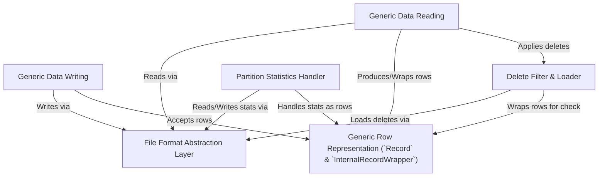

# Tutorial: data

This project provides tools for working with *Apache Iceberg tables*. It allows you to **read** data, handling various underlying *file formats* (like Parquet, Avro, ORC) and transparently skipping *deleted records*. You can also **write** new data to tables. Data rows are typically represented as generic `Record` objects, simplifying data manipulation across different formats.

**Source Repository:** [None](None)

## Chapters

1. [Generic Row Representation (`Record` & `InternalRecordWrapper`)
](01_generic_row_representation___record_____internalrecordwrapper___.md)
2. [Generic Data Reading
](02_generic_data_reading_.md)
3. [Generic Data Writing
](03_generic_data_writing_.md)
4. [Delete Filter & Loader
](04_delete_filter___loader_.md)
5. [File Format Abstraction Layer
](05_file_format_abstraction_layer_.md)
6. [Partition Statistics Handler
](06_partition_statistics_handler_.md)

---

Generated by [AI Codebase Knowledge Builder](https://github.com/The-Pocket/Tutorial-Codebase-Knowledge)