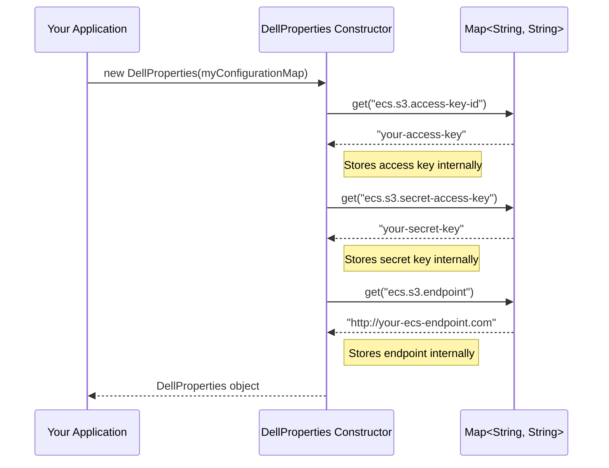

# Chapter 1: DellProperties

Welcome to your first step in learning about the `dell` project! In this chapter, we'll explore a fundamental building block: `DellProperties`.

Imagine you have a special, super-secure treasure chest (that's your Dell EMC ECS storage). To open this chest and store or retrieve treasures (your data), you need a specific set of keys and the chest's address. If anyone in your team wants to access this chest, they'd need this information.

`DellProperties` is like a digital keychain for this treasure chest. It securely holds:
1.  **The Address:** Where is your Dell EMC ECS storage located? This is known as the **endpoint URI**.
2.  **The Keys:** How do you prove you're allowed to access it? These are your **access key** and **secret key**.

Whenever any part of our `dell` system needs to talk to your Dell ECS storage, it will first look at an instance of `DellProperties` to get these crucial details. Without this "keychain," our system wouldn't know where to go or how to get in!

## What Problem Does `DellProperties` Solve?

Let's say you're building an application that needs to read and write files to your Dell EMC ECS storage. Your application needs to know three critical pieces of information:

1.  **ECS Endpoint:** The web address (URI) of your ECS system.
2.  **Access Key ID:** Your username or identifier for ECS.
3.  **Secret Access Key:** Your password for ECS.

Instead of scattering these details throughout your code, which can be messy and insecure, `DellProperties` provides a clean, organized way to store and manage them. It acts as a central configuration holder.

**Use Case:** Your application needs to connect to Dell ECS to save a new report file. Before it can do anything, it needs the connection details. It will ask a `DellProperties` object for the endpoint, access key, and secret key.

## How to Use `DellProperties`

`DellProperties` is typically created by providing it with a collection of settings. In Java, this is often done using a `Map`. Think of a `Map` as a list of pairs, where each pair has a name (a "key") and a value.

Here are the special names (keys) that `DellProperties` looks for:

*   `ecs.s3.access-key-id`: For your ECS access key.
*   `ecs.s3.secret-access-key`: For your ECS secret key.
*   `ecs.s3.endpoint`: For the ECS storage address (URI).

Let's see a tiny example of how you might prepare these properties and create a `DellProperties` object.

```java
// Import necessary class
import java.util.HashMap;
import java.util.Map;
import org.apache.iceberg.dell.DellProperties; // The class we are learning about

// In your application code...

// 1. Prepare your configuration details
Map<String, String> configuration = new HashMap<>();
configuration.put(DellProperties.ECS_S3_ACCESS_KEY_ID, "your-access-key");
configuration.put(DellProperties.ECS_S3_SECRET_ACCESS_KEY, "your-secret-key");
configuration.put(DellProperties.ECS_S3_ENDPOINT, "http://your-ecs-endpoint.com");

// 2. Create a DellProperties object
DellProperties dellConfigs = new DellProperties(configuration);

// Now, dellConfigs holds your ECS connection details!
// Other parts of the system can use it. For example:
System.out.println("Connecting to ECS at: " + dellConfigs.ecsS3Endpoint());
System.out.println("Using Access Key ID: " + dellConfigs.ecsS3AccessKeyId());
// (We wouldn't normally print the secret key, this is just for illustration)
```

**What happens?**
1.  We create a `Map` called `configuration`.
2.  We put our ECS access key, secret key, and endpoint into this map, using the special names defined in `DellProperties` (like `DellProperties.ECS_S3_ACCESS_KEY_ID`).
3.  We create a new `DellProperties` object, passing our `configuration` map to it.
4.  The `dellConfigs` object now securely stores these details.
5.  Other parts of the system can then call methods like `dellConfigs.ecsS3Endpoint()` to get the endpoint, or `dellConfigs.ecsS3AccessKeyId()` to get the access key.

This `DellProperties` object can then be passed to other components that need to interact with ECS. For example, a component responsible for file operations, like [EcsFileIO](03_ecsfileio_.md), would receive or create a `DellProperties` instance to know how to connect.

## Under the Hood: How `DellProperties` Works

`DellProperties` itself is quite straightforward. It's designed to be a simple data holder.

**Step-by-Step When You Create `DellProperties`:**

Let's imagine you call `new DellProperties(myConfigurationMap)`:



1.  **Initialization:** Your application creates a `Map` containing the ECS connection details (endpoint, access key, secret key).
2.  **Constructor Call:** Your application calls the `DellProperties` constructor, passing this map.
3.  **Data Extraction:** The `DellProperties` constructor looks inside the map for specific keys:
    *   It looks for `DellProperties.ECS_S3_ACCESS_KEY_ID` and stores the found value.
    *   It looks for `DellProperties.ECS_S3_SECRET_ACCESS_KEY` and stores the found value.
    *   It looks for `DellProperties.ECS_S3_ENDPOINT` and stores the found value.
4.  **Storing Values:** These extracted values are stored in private fields within the `DellProperties` object.
5.  **Ready to Use:** The newly created `DellProperties` object is now ready. Other parts of the system can call its "getter" methods (like `ecsS3Endpoint()`) to retrieve these stored values.

**A Peek at the Code (`DellProperties.java`):**

Let's look at the key parts of the `DellProperties.java` file.

First, you'll see some `public static final String` declarations. These are the fixed names (keys) we use to identify the properties:

```java
// From: src/main/java/org/apache/iceberg/dell/DellProperties.java

public class DellProperties implements Serializable {
  /** S3 Access key id of Dell EMC ECS */
  public static final String ECS_S3_ACCESS_KEY_ID = "ecs.s3.access-key-id";

  /** S3 Secret access key of Dell EMC ECS */
  public static final String ECS_S3_SECRET_ACCESS_KEY = "ecs.s3.secret-access-key";

  /** S3 endpoint of Dell EMC ECS */
  public static final String ECS_S3_ENDPOINT = "ecs.s3.endpoint";

  // ... (other properties like CLIENT_FACTORY might be here) ...
```
These `static final String` variables ensure that we always use the exact same text for the property names, avoiding typos.

Next, there are private fields to store the actual values:
```java
// From: src/main/java/org/apache/iceberg/dell/DellProperties.java

  private String ecsS3Endpoint;
  private String ecsS3AccessKeyId;
  private String ecsS3SecretAccessKey;
```
These are like private note cards where `DellProperties` keeps the endpoint, access key, and secret key.

The constructor is where the magic happens when you create a `DellProperties` object with a map:
```java
// From: src/main/java/org/apache/iceberg/dell/DellProperties.java

  public DellProperties(Map<String, String> properties) {
    this.ecsS3AccessKeyId = properties.get(DellProperties.ECS_S3_ACCESS_KEY_ID);
    this.ecsS3SecretAccessKey = properties.get(DellProperties.ECS_S3_SECRET_ACCESS_KEY);
    this.ecsS3Endpoint = properties.get(DellProperties.ECS_S3_ENDPOINT);
  }
```
This code says:
*   "Take the `properties` map that was given."
*   "Find the value associated with the key `DellProperties.ECS_S3_ACCESS_KEY_ID` and store it in my `ecsS3AccessKeyId` field."
*   It does the same for the secret key and the endpoint.

Finally, there are "getter" methods that allow other parts of the code to read these stored values:
```java
// From: src/main/java/org/apache/iceberg/dell/DellProperties.java

  public String ecsS3Endpoint() {
    return ecsS3Endpoint;
  }

  public String ecsS3AccessKeyId() {
    return ecsS3AccessKeyId;
  }

  public String ecsS3SecretAccessKey() {
    return ecsS3SecretAccessKey;
  }
```
If another part of the system has a `DellProperties` object (let's call it `myDellProps`), it can call `myDellProps.ecsS3Endpoint()` to get the ECS address.

You might also notice another property constant:
*   `DellProperties.CLIENT_FACTORY` (`client.factory`): This is for more advanced customization of how the connection client is created. We'll learn more about this when we discuss the [DellClientFactory](05_dellclientfactory_.md). For now, just know that `DellProperties` can also hold this setting.

## How Other Components Use `DellProperties`

You'll see `DellProperties` being used in many places. For example, when initializing file input/output operations with [EcsFileIO](03_ecsfileio_.md), it uses a `DellProperties` object:

```java
// Simplified from: src/main/java/org/apache/iceberg/dell/ecs/EcsFileIO.java

public class EcsFileIO /* ... */ {
  private DellProperties dellProperties;
  // ... other fields ...

  @Override
  public void initialize(Map<String, String> properties) {
    // Here it creates a DellProperties instance!
    this.dellProperties = new DellProperties(properties);
    // ... then uses it to set up S3 client ...
  }

  // ... methods to read/write files will use dellProperties indirectly ...
}
```
This `EcsFileIO` class, responsible for handling files in ECS, gets initialized with a map of properties. One of the first things it does is create a `DellProperties` object from that map. This `dellProperties` object is then kept and used whenever `EcsFileIO` needs to know how to connect to ECS.

Similarly, classes like `EcsInputFile` (for reading files) and `EcsOutputFile` (for writing files) will often carry a `DellProperties` object, or have access to one, so they know the connection parameters for the ECS system they are interacting with. You can see this in their constructors in files like `EcsInputFile.java` and `EcsOutputFile.java`.

## Conclusion

You've now learned about `DellProperties`, the essential "keychain" for your Dell EMC ECS storage. It's a simple but vital class that holds your connection credentials (access key, secret key) and the ECS address (endpoint URI). By centralizing this information, `DellProperties` makes it easy and secure for different parts of the `dell` project to connect to your ECS storage.

Think of it as the first, most basic piece of information you need before you can do anything else with ECS.

Now that we understand how our application knows *where* and *how* to connect to ECS, we can start looking at what we can *do* with that connection. In the next chapter, we'll explore how we can list and manage data "catalogs" within ECS using the [EcsCatalog](02_ecscatalog_.md).

---

Generated by [AI Codebase Knowledge Builder](https://github.com/The-Pocket/Tutorial-Codebase-Knowledge)