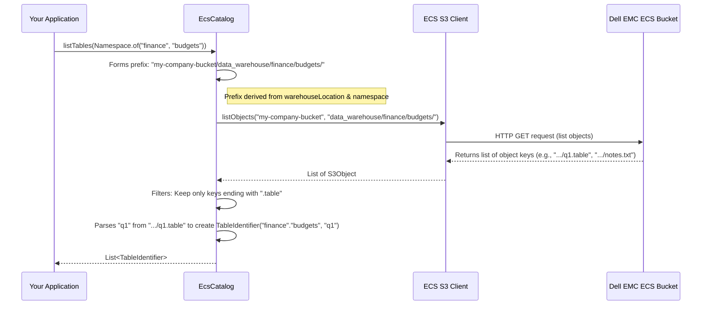

# Chapter 2: EcsCatalog - Your Data Librarian on Dell EMC ECS

Welcome back! In [Chapter 1: DellProperties](01_dellproperties_.md), we learned how our `dell` project gets the "keys" and "address" (`DellProperties`) to connect to your Dell EMC ECS storage. Now that we know *how* to connect, let's explore *what* we can manage there.

Imagine your Dell EMC ECS storage is a massive digital library. This library can hold many different collections of data (like different departments in a company) and within each collection, many individual datasets (like specific reports or logs). How do you keep track of everything? You need a librarian!

That's exactly what `EcsCatalog` is: **a librarian for your data warehouse on Dell EMC ECS.**

## What Problem Does `EcsCatalog` Solve?

Let's say you're working with Apache Iceberg, a powerful open table format. Iceberg tables store their data in files (like Parquet, ORC, Avro) on a storage system like ECS. But just having data files isn't enough. You need a way to:

1.  **Organize tables:** Group related tables together (e.g., all "sales" tables, all "log" tables). These groups are called **namespaces**.
2.  **Track tables:** Know what tables exist, what their structure (schema) is, and where their actual data files are located on ECS.
3.  **Manage tables:** Create new tables, delete old ones, or even rename them.

`EcsCatalog` provides these capabilities by acting as the **metastore** for Iceberg tables stored on Dell EMC ECS. It doesn't store the bulky data files themselves; rather, it manages small **metadata objects** (think of them as catalog cards) within a designated ECS bucket. These metadata objects tell Iceberg everything it needs to know about your tables and namespaces.

**Central Use Case:** Your team wants to create a new Iceberg table called `quarterly_revenue` within a `finance` namespace in your ECS-based data lake. Later, another team member needs to list all tables available in the `finance` namespace. `EcsCatalog` makes these operations possible.

## How `EcsCatalog` Works: The Librarian Analogy

Think of `EcsCatalog` like this:

*   **Dell EMC ECS Bucket:** This is your library building. `EcsCatalog` operates within a specific "warehouse" path inside this bucket.
*   **Namespaces:** These are like different sections or departments in your library (e.g., "Finance," "Marketing," "Engineering").
*   **Tables:** These are the individual books within each section. Each "book" is an Iceberg table.
*   **Metadata Objects (`.namespace`, `.table` files):** These are the catalog cards.
    *   A `.namespace` file marks the existence of a namespace and can store some properties about it.
    *   A `.table` file is a pointer to an Iceberg table. It doesn't contain all the table's schema and snapshot history (that's in a separate metadata file managed by [EcsTableOperations](04_ecstableoperations_.md)), but it tells Iceberg where to find that main metadata file.
*   **`EcsCatalog` itself:** The librarian. It knows how to:
    *   Create a new section (namespace).
    *   Add a new book card (table reference) to a section.
    *   Find all books in a section (list tables).
    *   Remove a book card (drop a table).
    *   Change a book's title on its card (rename a table).

All these actions involve `EcsCatalog` reading, writing, or listing these small metadata objects (`.namespace` and `.table` files) directly on ECS.

## How to Use `EcsCatalog`

Let's see how you might use `EcsCatalog` in your application.

### 1. Initializing `EcsCatalog`

First, you need to tell `EcsCatalog` where your "library" (warehouse path on ECS) is and how to access it. This involves providing configuration properties, including the ECS connection details we learned about in [Chapter 1: DellProperties](01_dellproperties_.md).

```java
// Import necessary classes
import org.apache.iceberg.dell.ecs.EcsCatalog;
import org.apache.iceberg.dell.DellProperties; // From Chapter 1
import org.apache.iceberg.CatalogProperties;
import org.apache.iceberg.catalog.Namespace;
import org.apache.iceberg.catalog.TableIdentifier;
import java.util.HashMap;
import java.util.Map;
import java.util.List;

// In your application code...

// 1. Prepare configuration for the catalog
Map<String, String> catalogProps = new HashMap<>();

// Specify the main "warehouse" location on ECS for this catalog
catalogProps.put(CatalogProperties.WAREHOUSE_LOCATION, "ecs://my-company-bucket/data_warehouse");

// ECS Connection Details (from DellProperties)
catalogProps.put(DellProperties.ECS_S3_ENDPOINT, "http://your-ecs-endpoint.com");
catalogProps.put(DellProperties.ECS_S3_ACCESS_KEY_ID, "your-access-key");
catalogProps.put(DellProperties.ECS_S3_SECRET_ACCESS_KEY, "your-secret-key");

// 2. Create and initialize the EcsCatalog instance
EcsCatalog catalog = new EcsCatalog();
catalog.initialize("myOrgCatalog", catalogProps); // "myOrgCatalog" is just a name for this catalog instance

// Now 'catalog' is ready to manage namespaces and tables!
```

**What happens?**
1.  We create a `Map` called `catalogProps`.
2.  We tell `EcsCatalog` where its main storage directory (`WAREHOUSE_LOCATION`) is within your ECS bucket (e.g., `ecs://my-company-bucket/data_warehouse`). This is where it will store its metadata "catalog cards."
3.  We provide the ECS connection details (endpoint, access key, secret key) using the constants from `DellProperties`.
4.  We create an `EcsCatalog` object and call its `initialize` method with a name and these properties.
5.  Behind the scenes, `EcsCatalog` uses these properties to set up an S3 client (via [DellClientFactory](05_dellclientfactory_.md)) to communicate with ECS and also prepares its [EcsFileIO](03_ecsfileio_.md) for file operations.

### 2. Working with Namespaces (Library Sections)

Namespaces help you organize your tables. A namespace can be simple (e.g., "sales") or hierarchical (e.g., "sales", "reports", "emea").

**Creating a Namespace:**
Let's create a namespace `finance.budgets`.

```java
// Assuming 'catalog' is initialized as shown above

Namespace budgetNamespace = Namespace.of("finance", "budgets");
Map<String, String> namespaceProps = new HashMap<>();
namespaceProps.put("contact_person", "jane.doe@example.com");
namespaceProps.put("status", "active");

catalog.createNamespace(budgetNamespace, namespaceProps);

System.out.println("Namespace " + budgetNamespace + " created.");
```
**What happens?**
`EcsCatalog` will create a small metadata object on ECS. If your warehouse is `ecs://my-company-bucket/data_warehouse`, it might create an object like:
`ecs://my-company-bucket/data_warehouse/finance/budgets.namespace`
This `.namespace` object stores the properties you provided (like `contact_person`).

**Listing Namespaces:**
You can list namespaces within another namespace (or list top-level namespaces).

```java
// List top-level namespaces in the warehouse
List<Namespace> topLevelNamespaces = catalog.listNamespaces(Namespace.empty());
System.out.println("Top-level namespaces: " + topLevelNamespaces);
// Example output: Top-level namespaces: [[finance], [hr]]

// List namespaces directly under "finance"
List<Namespace> financeSubNamespaces = catalog.listNamespaces(Namespace.of("finance"));
System.out.println("Finance sub-namespaces: " + financeSubNamespaces);
// Example output: Finance sub-namespaces: [[finance, budgets], [finance, forecasts]]
```
**What happens?**
`EcsCatalog` lists objects in the corresponding ECS path (e.g., `data_warehouse/` or `data_warehouse/finance/`) and identifies those ending with `.namespace`.

### 3. Working with Tables (Library Books)

Now let's manage the "books" – our Iceberg tables.

**Listing Tables in a Namespace:**

```java
// Assuming 'catalog' and 'budgetNamespace' (finance.budgets) are available

List<TableIdentifier> tablesInBudget = catalog.listTables(budgetNamespace);
if (tablesInBudget.isEmpty()) {
    System.out.println("No tables found in " + budgetNamespace);
} else {
    System.out.println("Tables in " + budgetNamespace + ":");
    for (TableIdentifier tableId : tablesInBudget) {
        System.out.println("- " + tableId.name());
    }
}
// Example output (if q1_expenses.table exists):
// Tables in finance.budgets:
// - q1_expenses
```
**What happens?**
`EcsCatalog` looks for objects ending with `.table` within the specified namespace path on ECS (e.g., `data_warehouse/finance/budgets/`).

**Creating a Table (Conceptual Overview):**
Creating an Iceberg table involves defining its schema (column names and types), partitioning (how data is divided), and other properties. `EcsCatalog` provides a `createTable` method.

```java
// TableIdentifier newTableId = TableIdentifier.of(budgetNamespace, "q1_expenses");
// Schema schema = ...; // Define your table schema
// PartitionSpec spec = ...; // Define your table partitioning

// catalog.createTable(newTableId, schema, spec);
// System.out.println("Table " + newTableId + " created.");
```
**What happens (simplified)?**
1.  `EcsCatalog` gets ready to add a new "catalog card" for `q1_expenses`.
2.  It uses an internal component called [EcsTableOperations](04_ecstableoperations_.md) (which we'll learn about later) to handle the specifics of creating the *initial metadata file* for the Iceberg table. This metadata file contains the schema, partition spec, etc.
3.  `EcsCatalog` then creates the `.table` object on ECS (e.g., `data_warehouse/finance/budgets/q1_expenses.table`). This `.table` object is a simple pointer, containing the location of the main Iceberg table metadata file.

**Dropping a Table:**

```java
TableIdentifier tableToDrop = TableIdentifier.of(budgetNamespace, "old_data");
boolean purged = true; // 'true' means also delete data files, 'false' means only metadata

if (catalog.tableExists(tableToDrop)) {
    catalog.dropTable(tableToDrop, purged);
    System.out.println("Table " + tableToDrop + " dropped.");
} else {
    System.out.println("Table " + tableToDrop + " does not exist.");
}
```
**What happens?**
1.  `EcsCatalog` deletes the `.table` metadata object from ECS.
2.  If `purged` is `true`, it will also use [EcsFileIO](03_ecsfileio_.md) to delete the actual data files and the main metadata files of the Iceberg table from ECS.

**Renaming a Table:**

```java
TableIdentifier oldName = TableIdentifier.of(budgetNamespace, "draft_report");
TableIdentifier newName = TableIdentifier.of(budgetNamespace, "final_report");

if (catalog.tableExists(oldName) && !catalog.tableExists(newName)) {
    catalog.renameTable(oldName, newName);
    System.out.println("Table " + oldName + " renamed to " + newName);
}
```
**What happens?**
`EcsCatalog` essentially "renames the catalog card." It copies the content of the old `.table` object to a new `.table` object with the new name, and then deletes the old `.table` object. The actual data files on ECS are not moved; only this metadata pointer changes.

## Under the Hood: How `EcsCatalog` Manages Metadata

`EcsCatalog` performs its magic by interacting with small metadata objects stored directly in your Dell EMC ECS bucket, within the configured warehouse path.

**Step-by-Step: `listTables(namespace)`**

Let's trace what happens when you call `catalog.listTables(Namespace.of("finance", "budgets"))`:



1.  **Prefix Construction:** `EcsCatalog` combines its configured `warehouseLocation` (e.g., `ecs://my-company-bucket/data_warehouse`) with the provided `namespace` (e.g., `finance.budgets`) to determine the path prefix on ECS to search within (e.g., `data_warehouse/finance/budgets/`).
2.  **ECS Interaction:** It uses its internal S3 client (which was configured using `DellProperties`) to send a "list objects" request to your ECS bucket for that specific prefix.
3.  **Filtering:** ECS returns a list of all objects under that prefix. `EcsCatalog` then filters this list, looking only for objects whose names end with the special suffix `.table` (defined as `TABLE_OBJECT_SUFFIX` in the code).
4.  **Parsing:** For each matching `.table` object, it extracts the table name from the object key and constructs a `TableIdentifier`.
5.  **Return Value:** It returns the list of `TableIdentifier`s it found.

**Metadata Object Contents:**
These `.table` and `.namespace` files are not empty.
*   A `.namespace` file stores the properties you associate with a namespace.
*   A `.table` file stores properties about the table, most importantly, a property named `iceberg_metadata_location` (from `EcsTableOperations.ICEBERG_METADATA_LOCATION`). This location points to the *actual* Iceberg table metadata JSON file (e.g., `v1.metadata.json`), which contains the schema, snapshots, etc.

`EcsCatalog` uses a utility called [PropertiesSerDesUtil](08_propertiesserdesutil_.md) to read and write the content of these `.table` and `.namespace` metadata objects in a standardized format.

**Key Snippets from `EcsCatalog.java`**

Let's look at simplified pieces of the `EcsCatalog.java` code.

*   **Initialization (Simplified `initialize` method):**
    This is where the catalog gets its settings and prepares its ECS client.
    ```java
    // From: src/main/java/org/apache/iceberg/dell/ecs/EcsCatalog.java
    private S3Client client; // For talking to ECS
    private EcsURI warehouseLocation; // e.g., ecs://my-bucket/warehouse
    private FileIO fileIO; // For file operations, see EcsFileIO chapter

    @Override
    public void initialize(String name, Map<String, String> properties) {
        String inputWarehouseLocation = properties.get(CatalogProperties.WAREHOUSE_LOCATION);
        // ... (Check if warehouseLocation is provided) ...
        this.warehouseLocation = new EcsURI(LocationUtil.stripTrailingSlash(inputWarehouseLocation));

        // Critical: Sets up the S3 client using DellProperties implicitly
        this.client = DellClientFactories.from(properties).ecsS3();

        // Initializes FileIO, potentially EcsFileIO
        this.fileIO = initializeFileIO(properties);
        // ...
    }
    ```
    The `DellClientFactories.from(properties).ecsS3()` call is where your `DellProperties` (endpoint, keys) are used to create the S3 client needed to talk to ECS.

*   **Determining Metadata Object Paths (Simplified `tableURI` and `namespaceURI`):**
    These methods figure out the exact path on ECS for a given table's or namespace's metadata object.
    ```java
    // From: src/main/java/org/apache/iceberg/dell/ecs/EcsCatalog.java
    private static final String TABLE_OBJECT_SUFFIX = ".table";
    private static final String NAMESPACE_OBJECT_SUFFIX = ".namespace";

    // Helper to get the path for a namespace's metadata file
    private String namespacePrefix(Namespace namespace) {
        if (namespace.isEmpty()) {
            return warehouseLocation.location(); // Root of the warehouse
        } else {
            // e.g., "warehouse/level1/level2"
            return String.format("%s/%s", warehouseLocation.location(), String.join("/", namespace.levels()));
        }
    }

    private EcsURI tableURI(TableIdentifier id) {
        // e.g., "warehouse/ns1/ns2/tableName.table"
        return new EcsURI(
            String.format("%s/%s%s", namespacePrefix(id.namespace()), id.name(), TABLE_OBJECT_SUFFIX));
    }

    private EcsURI namespaceURI(Namespace namespace) {
        // e.g., "warehouse/ns1/ns2.namespace"
        return new EcsURI(String.format("%s%s", namespacePrefix(namespace), NAMESPACE_OBJECT_SUFFIX));
    }
    ```
    These methods use the `warehouseLocation` and the provided identifier/namespace to construct an [EcsURI](06_ecsuri_.md) representing the full path to the metadata object in the ECS bucket.

*   **Creating a Namespace (Simplified `createNamespace` and `putNewProperties`):**
    When you call `createNamespace`, it essentially calls `putNewProperties` to write the `.namespace` object to ECS.
    ```java
    // From: src/main/java/org/apache/iceberg/dell/ecs/EcsCatalog.java
    @Override
    public void createNamespace(Namespace namespace, Map<String, String> properties) {
        EcsURI namespaceObject = namespaceURI(namespace); // Get path like ".../ns.namespace"
        if (!putNewProperties(namespaceObject, properties)) { // Try to create it
            throw new AlreadyExistsException("namespace %s already existed", namespace);
        }
    }

    // Writes properties to a new object in ECS, if it doesn't already exist.
    // Uses PropertiesSerDesUtil to convert Map to bytes.
    boolean putNewProperties(EcsURI uri, Map<String, String> properties) {
        // ... (checkURI validates the path) ...
        PutObjectRequest request =
            new PutObjectRequest(uri.bucket(), uri.name(), PropertiesSerDesUtil.toBytes(properties));
        // ... (set metadata like version, and "if-none-match" for atomic creation) ...
        try {
            client.putObject(request); // Actual ECS call to create the object
            return true;
        } catch (S3Exception e) {
            // If it already exists (PreconditionFailed due to if-none-match), return false
            if ("PreconditionFailed".equals(e.getErrorCode())) {
                return false;
            }
            throw e; // Other errors
        }
    }
    ```
    The `putNewProperties` method uses `client.putObject` to store the serialized properties as a new object on ECS. The `if-none-match` header helps ensure it only creates it if it's truly new.

## Conclusion

You've now met `EcsCatalog`, the essential "librarian" that manages your Iceberg tables and namespaces on Dell EMC ECS. It does this not by holding the massive table data itself, but by carefully managing small metadata objects (like `.table` and `.namespace` catalog cards) within a specified ECS warehouse location. `EcsCatalog` relies on the connection details from `DellProperties` to talk to ECS and uses these metadata objects to perform operations like listing, creating, dropping, and renaming your data structures.

With `DellProperties` telling us *how* to connect and `EcsCatalog` showing us *what metadata* we can manage, we're getting closer to understanding how Iceberg works with Dell ECS. But what about the actual data files and the detailed Iceberg metadata files? How are those read and written? For that, we need to look at file input/output operations.

In the next chapter, we'll explore [EcsFileIO](03_ecsfileio_.md), the component responsible for reading and writing individual files (including data and metadata files) on Dell EMC ECS.

---

Generated by [AI Codebase Knowledge Builder](https://github.com/The-Pocket/Tutorial-Codebase-Knowledge)