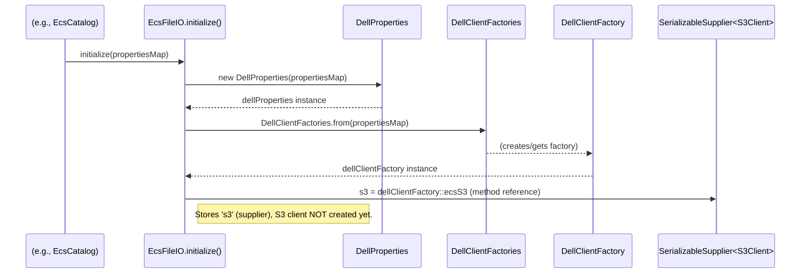
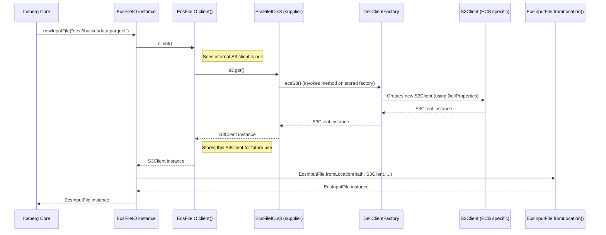

# Chapter 3: EcsFileIO - Your File Handler for Dell EMC ECS

Welcome back! In [Chapter 2: EcsCatalog](02_ecscatalog_.md), we learned how `EcsCatalog` acts as a librarian for our Iceberg tables on Dell EMC ECS, managing metadata "catalog cards" that tell us about our tables and namespaces. We saw how it knows *where* a table's main metadata file is located.

But how does Iceberg actually *read* that metadata file, or the data files (like Parquet, ORC, or Avro) that make up the table? And how does it *write* new data or metadata files to ECS? For these fundamental file operations, we need a specialized tool.

Meet `EcsFileIO`.

## What Problem Does `EcsFileIO` Solve?

Imagine you have a fancy multi-tool appliance (that's Apache Iceberg). This appliance is designed to work with various types of storage systems. Now, you want to plug this appliance into a specific power outlet: your Dell EMC ECS storage. You need an adapter that understands both Iceberg's generic requests ("I need to read a file," "I need to write a file") and the specific way Dell ECS handles files (objects).

`EcsFileIO` is exactly this **universal adapter for file operations**. It allows Iceberg to:
1.  **Read files** (like table data or metadata) from your Dell EMC ECS.
2.  **Write new files** (new data or updated metadata) to your Dell EMC ECS.
3.  **Delete files** from your Dell EMC ECS.

**Central Use Case:** Your data analysis application, using Iceberg, needs to read the latest sales data from an Iceberg table stored on Dell ECS.
1.  Iceberg, using `EcsCatalog`, finds the location of the table's metadata file (e.g., `ecs://my-bucket/sales_db/quarterly_reports/metadata/v3.metadata.json`).
2.  Then, Iceberg needs to read this `v3.metadata.json` file. It asks `EcsFileIO` to do this.
3.  The metadata file lists several data files (e.g., `ecs://my-bucket/sales_db/quarterly_reports/data/region1.parquet`).
4.  Iceberg then asks `EcsFileIO` to read these Parquet data files.

`EcsFileIO` translates Iceberg's generic requests ("read this path") into specific commands for Dell ECS, using an S3 client (a tool for talking to S3-compatible storage like ECS). This S3 client is obtained using the connection details from [Chapter 1: DellProperties](01_dellproperties_.md) via a helper called [DellClientFactory](05_dellclientfactory_.md).

## How `EcsFileIO` Works: The Adapter Analogy

Think of `EcsFileIO` as a smart adapter:

*   **Iceberg (Appliance):** Needs to perform file operations but doesn't want to know the nitty-gritty details of every storage system. It just says "read this!" or "write that!"
*   **Dell EMC ECS (Specific Power Outlet):** Your object storage system, which has its own way of doing things (using S3 API calls like `getObject`, `putObject`, `deleteObject`).
*   **`EcsFileIO` (The Adapter):**
    *   Implements Iceberg's standard `FileIO` interface, meaning it "speaks Iceberg's language."
    *   Inside, it holds an S3 client configured to talk to your specific ECS endpoint with your credentials (from `DellProperties`).
    *   When Iceberg makes a request (e.g., "give me an `InputFile` for `ecs://bucket/path/to/file.txt`"), `EcsFileIO` takes that path, uses its S3 client, and interacts with ECS to provide access to the file's content.

This means Iceberg can work seamlessly with Dell ECS without needing to be rewritten specifically for it. `EcsFileIO` handles all the translation.

## How to Use `EcsFileIO` (Usually Behind the Scenes)

You usually won't create or use `EcsFileIO` directly in your day-to-day Iceberg applications. Instead, components like `EcsCatalog` or [EcsTableOperations](04_ecstableoperations_.md) (which manages the lifecycle of a single table's metadata) will initialize and use an `EcsFileIO` instance internally.

However, understanding its key methods helps clarify its role.

### 1. Initialization

Before `EcsFileIO` can do anything, it needs to be initialized with properties, especially those needed to connect to ECS.

```java
// From: src/main/java/org/apache/iceberg/dell/ecs/EcsFileIO.java
// (Simplified for clarity)

import java.util.Map;
import com.emc.object.s3.S3Client;
import org.apache.iceberg.dell.DellProperties;
import org.apache.iceberg.dell.DellClientFactory;
import org.apache.iceberg.dell.DellClientFactories;
import org.apache.iceberg.util.SerializableSupplier;

public class EcsFileIO implements org.apache.iceberg.io.FileIO {
    private DellProperties dellProperties;
    private SerializableSupplier<S3Client> s3; // A way to get an S3 client
    private transient volatile S3Client client; // The actual S3 client, created when needed

    @Override
    public void initialize(Map<String, String> properties) {
        // 1. Store ECS connection details
        this.dellProperties = new DellProperties(properties);

        // 2. Get a factory that can create S3 clients
        DellClientFactory dellClientFactory = DellClientFactories.from(properties);

        // 3. Store a "supplier" that knows how to create the S3 client using the factory
        this.s3 = dellClientFactory::ecsS3;
        // The actual client (this.client) is not created yet! It's lazy.
    }
    // ... other methods ...
}
```
**What happens?**
1.  The `initialize` method is called with a `Map` of properties. This map includes your ECS endpoint, access key, and secret key (as discussed in [Chapter 1: DellProperties](01_dellproperties_.md)).
2.  A `DellProperties` object is created to hold these connection details.
3.  `DellClientFactories.from(properties)` creates a `DellClientFactory` (we'll learn more about this in [Chapter 5: DellClientFactory](05_dellclientfactory_.md)). This factory knows how to construct S3 clients based on the provided properties.
4.  `dellClientFactory::ecsS3` is a concise way to say "store a function that, when called, will ask `dellClientFactory` to create and give me an `ecsS3` client." This "function" (a `SerializableSupplier`) is stored in the `s3` field.
5.  Crucially, the actual `S3Client` (the `client` field) is *not* created at this point. It's set up for "lazy initialization" – it will only be created the first time it's actually needed.

### 2. Getting an Input File

When Iceberg needs to read a file from ECS (like a metadata JSON file or a Parquet data file):

```java
// From: src/main/java/org/apache/iceberg/dell/ecs/EcsFileIO.java

@Override
public org.apache.iceberg.io.InputFile newInputFile(String path) {
    // client() gets or creates the S3 client
    return EcsInputFile.fromLocation(path, client(), dellProperties, metrics);
}

// Helper method to get/create the S3 client
private S3Client client() {
    if (client == null) { // If no client yet...
        synchronized (this) { // Ensure only one thread creates it
            if (client == null) {
                this.client = s3.get(); // ...create it now using the supplier!
            }
        }
    }
    return client;
}
```
**What happens?**
1.  Some part of Iceberg (e.g., while loading a table) calls `newInputFile("ecs://my-bucket/path/to/file.parquet")`.
2.  `newInputFile` first calls the private `client()` method.
3.  The `client()` method checks if the `S3Client` (the `client` field) has already been created.
    *   If `client` is `null` (meaning it's the first time it's needed), it calls `s3.get()`. This executes the "supplier" function we stored during `initialize`, which in turn asks the `DellClientFactory` to create a new `S3Client` using your ECS connection details. This new S3 client is then stored in the `client` field.
    *   If `client` is not `null`, it just returns the existing client.
4.  `newInputFile` then creates an `EcsInputFile` object. `EcsInputFile` (which we'll touch upon with [BaseEcsFile](07_baseecsfile_.md)) is Iceberg's representation of a readable file on ECS. It's given the S3 client, the file path, and the `DellProperties`. This `EcsInputFile` object can then be used to open streams and read the file's content.

### 3. Getting an Output File

When Iceberg needs to write a new file to ECS (like a new data file or an updated metadata file):

```java
// From: src/main/java/org/apache/iceberg/dell/ecs/EcsFileIO.java

@Override
public org.apache.iceberg.io.OutputFile newOutputFile(String path) {
    // client() gets or creates the S3 client
    return EcsOutputFile.fromLocation(path, client(), dellProperties, metrics);
}
```
**What happens?**
This is very similar to `newInputFile`.
1.  Iceberg calls `newOutputFile("ecs://my-bucket/path/to/new_file.parquet")`.
2.  It gets the `S3Client` via the `client()` method (creating it if it's the first time).
3.  It then creates an `EcsOutputFile` object. `EcsOutputFile` (also related to [BaseEcsFile](07_baseecsfile_.md)) represents a writable file on ECS. It's given the S3 client, the file path, and `DellProperties`. This `EcsOutputFile` object can then be used to create output streams and write data to ECS.

### 4. Deleting a File

When Iceberg needs to delete a file from ECS (e.g., an old data file that's no longer needed):

```java
// From: src/main/java/org/apache/iceberg/dell/ecs/EcsFileIO.java

@Override
public void deleteFile(String path) {
    EcsURI uri = new EcsURI(path); // Parse the ECS path

    // client() gets or creates the S3 client
    // Then, directly use the S3 client to delete the object
    client().deleteObject(uri.bucket(), uri.name());
}
```
**What happens?**
1.  Iceberg calls `deleteFile("ecs://my-bucket/path/to/old_file.dat")`.
2.  An [EcsURI](06_ecsuri_.md) object is created to easily extract the bucket name and object key (file name within the bucket) from the path.
3.  It gets the `S3Client` via the `client()` method.
4.  It then directly calls the `deleteObject` method on the S3 client, telling ECS to remove the specified object from the bucket.

## Under the Hood: The Journey of a File Operation

Let's visualize the initialization and a subsequent file operation.

**1. Initialization of `EcsFileIO`:**
This usually happens when an `EcsCatalog` or `EcsTableOperations` object is being set up.


At this point, `EcsFileIO` knows *how* to get an S3 client but hasn't actually created one.

**2. First File Operation (e.g., `newInputFile`):**
This is when Iceberg actually needs to read a file.


Now the `S3Client` is created and cached within `EcsFileIO` for subsequent operations. Future calls to `client()` will return this cached client directly, without needing to go through the supplier and factory again, unless the client is explicitly closed and needs to be recreated.

The `EcsInputFile` (or `EcsOutputFile`) objects returned by `EcsFileIO` then use this S3 client to perform the actual reads or writes by streaming data to/from ECS.

## Conclusion

You've now explored `EcsFileIO`, the critical component that acts as a bridge, or an adapter, between Apache Iceberg's generic file operation needs and the specifics of Dell EMC ECS. It uses `DellProperties` to understand how to connect, works with `DellClientFactory` to get an S3 client, and then provides `InputFile` and `OutputFile` instances that do the heavy lifting of reading and writing data on ECS. It also handles file deletion directly.

While you might not interact with `EcsFileIO` directly very often, it's a fundamental piece of the puzzle, enabling Iceberg to treat Dell ECS as a reliable file system for storing both table data and metadata.

So far:
*   [DellProperties](01_dellproperties_.md) gave us the keys and address for ECS.
*   [EcsCatalog](02_ecscatalog_.md) acted as our librarian, managing table and namespace metadata entries.
*   `EcsFileIO` provides the hands to fetch and store the actual "books" (files) from the ECS shelves.

But how is the detailed metadata of an *individual* Iceberg table (its schema, snapshots, manifest lists, etc.) managed? How are changes to a table committed atomically? That's where our next chapter comes in. We'll look at [EcsTableOperations](04_ecstableoperations_.md), the component responsible for managing the lifecycle and metadata of a single Iceberg table on ECS.

---

Generated by [AI Codebase Knowledge Builder](https://github.com/The-Pocket/Tutorial-Codebase-Knowledge)