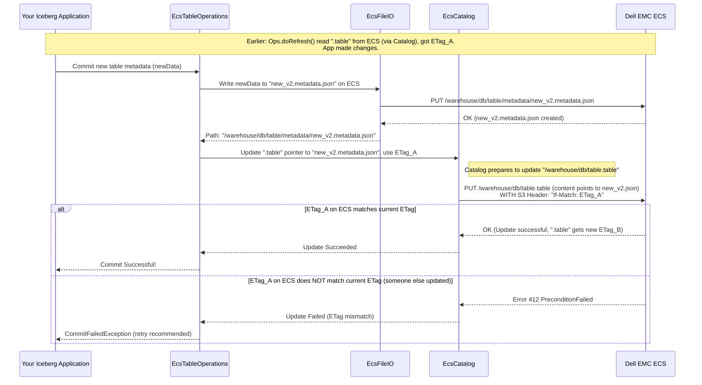

# Chapter 4: EcsTableOperations - The Administrative Assistant for Your Table

Welcome to Chapter 4! In [Chapter 3: EcsFileIO](03_ecsfileio_.md), we saw how the `dell` project gets the tools (`EcsFileIO`) to read and write individual files—like data files and metadata files—on your Dell EMC ECS storage. We know how to connect ([Chapter 1: DellProperties](01_dellproperties_.md)) and how to manage a catalog of tables ([Chapter 2: EcsCatalog](02_ecscatalog_.md)).

Now, let's zoom in on a single Iceberg table. How are its specific details—its schema, its history of changes (snapshots), and pointers to its data files—managed safely and consistently? This is where `EcsTableOperations` comes into play.

## What Problem Does `EcsTableOperations` Solve?

Imagine an Iceberg table is like an important, constantly evolving project file. This project file has many parts:
*   The blueprint (schema: what columns and data types it has).
*   A changelog (snapshots: what the table looked like at different points in time).
*   An index to all related documents (manifest lists and manifest files: pointers to the actual data files).

All this information is stored in a special file called the **table metadata file** (usually a JSON file like `v1.metadata.json`, `v2.metadata.json`, etc.).

When you make changes to your table (e.g., add data, change the schema), a *new version* of this metadata file needs to be created. The crucial challenge is: **How do you update the "official record" to point to this new metadata file without anyone else accidentally overwriting your changes, or you overwriting theirs, especially if multiple people or processes might be trying to update the table around the same time?**

`EcsTableOperations` solves this by acting as the **dedicated administrative assistant for a single Iceberg table** whose data and metadata live on Dell EMC ECS. This assistant is responsible for:

1.  **Reading the table's current state:** Finding and reading the current official metadata file.
2.  **Writing new versions of the metadata:** When changes occur, creating a new metadata file on ECS.
3.  **Atomically committing updates:** Ensuring that when the table is updated to point to a new metadata file, this happens as a single, indivisible operation. It prevents conflicts and ensures everyone sees a consistent view of the table.

**Central Use Case:**
Your data pipeline finishes processing new sales data for the day. It needs to update the `daily_sales` Iceberg table on ECS. This involves:
1.  Writing new data files (e.g., Parquet files) to ECS.
2.  Creating a *new* Iceberg table metadata file that includes these new data files and other changes.
3.  Telling the system that this *new* metadata file is now the "current" one for the `daily_sales` table.

`EcsTableOperations` handles step 2 (with help from `EcsFileIO`) and, most importantly, step 3, ensuring the switch to the new metadata is safe and reliable.

## The Table's "Pointer" File and The Actual Metadata

Let's clarify two types of "metadata" we're dealing with:

1.  **The Catalog Pointer (`.table` file):** In [Chapter 2: EcsCatalog](02_ecscatalog_.md), we learned that `EcsCatalog` manages `.table` files on ECS. For a table named `mydb.mytable` located in warehouse `ecs://bucket/warehouse/`, there might be an object `ecs://bucket/warehouse/mydb/mytable.table`. This `.table` file is very small. Its main job is to hold a property, `iceberg_metadata_location`, which contains the *path* to the actual, detailed Iceberg table metadata file. `EcsCatalog` manages this `.table` file.

2.  **The Iceberg Table Metadata File (e.g., `vN.metadata.json`):** This is a larger JSON file (e.g., `ecs://bucket/warehouse/mydb/mytable/metadata/00001-abcdef.metadata.json`). It contains the full schema, snapshot history, partition specs, and other critical information for an Iceberg table. `EcsTableOperations` is primarily concerned with managing *this* file's lifecycle.

`EcsTableOperations` works closely with `EcsCatalog` and `EcsFileIO`:
*   It asks `EcsCatalog` to read or update the `.table` pointer file.
*   It uses `EcsFileIO` to read or write the actual Iceberg `vN.metadata.json` files.

## How `EcsTableOperations` Ensures Safe Updates: Optimistic Concurrency with E-Tags

Dell EMC ECS, like many object storage systems, provides a feature called **E-Tags** (Entity Tags). An E-Tag is like a version identifier for an object. Every time an object is modified, its E-Tag changes.

`EcsTableOperations` uses E-Tags for **optimistic concurrency control** when updating the `.table` pointer file (via `EcsCatalog`):

1.  **Read:** When `EcsTableOperations` needs to refresh its knowledge of a table, it asks `EcsCatalog` to read the `.table` file. Along with the content (the path to the current `vN.metadata.json`), `EcsCatalog` also gets the E-Tag of that `.table` file. `EcsTableOperations` remembers this E-Tag.
2.  **Prepare Changes:** Your application makes changes, and a new Iceberg metadata file (`v(N+1).metadata.json`) is written to ECS using [EcsFileIO](03_ecsfileio_.md).
3.  **Attempt Commit:** `EcsTableOperations` now tells `EcsCatalog` to update the `.table` file to point to this new `v(N+1).metadata.json`. Crucially, it says: "Only update this `.table` file if its current E-Tag is still the one I remembered from step 1."
4.  **ECS Checks:**
    *   **If the E-Tag matches:** It means no one else has changed the `.table` file since we last read it. The update proceeds, and the `.table` file now points to the new metadata. The commit is successful!
    *   **If the E-Tag does *not* match:** It means someone else *did* change the `.table` file in the meantime (e.g., another process committed an update). ECS will reject the update. The commit fails. Iceberg might then retry the whole operation: re-read the (now newer) table state, re-apply its changes, and try to commit again.

This "optimistic" approach assumes conflicts are rare. It doesn't lock the table for a long time, making it efficient.

## How `EcsTableOperations` Works (The Lifecycle)

You typically don't create an `EcsTableOperations` object directly. When you use `EcsCatalog` to load or create a table, `EcsCatalog` creates an `EcsTableOperations` instance specifically for that table. This instance then manages that table's metadata lifecycle.

Let's look at the two main operations: `refresh` (reading the current state) and `commit` (applying new changes).

### 1. Refreshing Table Metadata (`doRefresh()`)

When Iceberg needs to know the current state of a table (e.g., when you run `SELECT * FROM my_table`), `EcsTableOperations.doRefresh()` is called internally.

```java
// Simplified from: org.apache.iceberg.dell.ecs.EcsTableOperations

// Fields in EcsTableOperations:
// private final EcsCatalog catalog; // Our catalog instance
// private final EcsURI tableObject; // Path to the ".table" file, e.g., "ecs://bucket/wh/db/tbl.table"
// private String eTag; // To store the E-Tag of the ".table" file

@Override
protected void doRefresh() {
    String metadataLocation; // Will hold path to "vN.metadata.json"

    // 1. Check if the ".table" pointer file exists and get its properties
    if (!catalog.objectMetadata(tableObject).isPresent()) {
        // ".table" file doesn't exist.
        // If we thought table existed, it's an error. If creating new, this is fine.
        metadataLocation = null;
        if (currentMetadataLocation() != null) { // currentMetadataLocation() is from base class
            throw new NoSuchTableException("Table %s not found, metadata object %s is absent",
                tableName(), tableObject);
        }
    } else {
        // 2. Load properties from the ".table" file (via EcsCatalog)
        EcsCatalog.Properties propsFromFile = catalog.loadProperties(tableObject);
        this.eTag = propsFromFile.eTag(); // <-- Store the E-Tag of the ".table" file!
        metadataLocation = propsFromFile.content().get(ICEBERG_METADATA_LOCATION);
        // ICEBERG_METADATA_LOCATION is "iceberg_metadata_location"

        if (metadataLocation == null) {
            throw new IllegalStateException("No metadata location for table " + tableName());
        }
    }

    // 3. Refresh from the actual Iceberg metadata file (using EcsFileIO)
    // refreshFromMetadataLocation is a helper from the base class.
    // It uses io().newInputFile(metadataLocation) to read the JSON.
    refreshFromMetadataLocation(metadataLocation);
}
```

**What happens in `doRefresh()`?**
1.  It asks `EcsCatalog` (using `catalog.objectMetadata()`) if the table's pointer file (e.g., `mytable.table`) exists on ECS.
2.  If it exists, it calls `catalog.loadProperties(tableObject)`. This method in `EcsCatalog`:
    *   Reads the `mytable.table` file from ECS.
    *   Returns its content (a map of properties) AND its current E-Tag.
    *   `EcsTableOperations` stores this **E-Tag** in its `this.eTag` field.
    *   It then gets the value of the `ICEBERG_METADATA_LOCATION` property. This value is the path to the *actual* Iceberg metadata JSON file (e.g., `ecs://bucket/warehouse/mydb/mytable/metadata/00001-abcdef.metadata.json`).
3.  Finally, it calls `refreshFromMetadataLocation(metadataLocation)`. This is a method from its parent class (`BaseMetastoreTableOperations`). This method uses the `FileIO` instance (which is our [EcsFileIO](03_ecsfileio_.md)) to read the content of the Iceberg metadata JSON file from the `metadataLocation`.
    *   The `io()` method in `EcsTableOperations` simply returns the `EcsFileIO` instance it was given when created.

After `doRefresh()`, `EcsTableOperations` knows the current schema, snapshots, etc., of the table, AND it has the E-Tag of the pointer file that led to this state.

### 2. Committing Table Changes (`doCommit()`)

After you've made changes (e.g., added data files, altered schema), Iceberg will have a new `TableMetadata` object ready. To make these changes permanent, `EcsTableOperations.doCommit()` is called.

```java
// Simplified from: org.apache.iceberg.dell.ecs.EcsTableOperations

// Fields:
// private final EcsCatalog catalog;
// private final EcsURI tableObject; // Path to ".table" file
// private String eTag; // E-Tag from the last refresh

@Override
protected void doCommit(TableMetadata base, TableMetadata metadata) {
    // 'base' is the metadata before changes, 'metadata' is the new metadata.
    boolean isNewTable = (base == null);

    // 1. Write the new Iceberg metadata JSON file (e.g., "v(N+1).metadata.json") to ECS.
    //    This uses io().newOutputFile() which gets an EcsOutputFile.
    //    writeNewMetadataIfRequired is from the base class.
    String newMetadataJsonLocation = writeNewMetadataIfRequired(isNewTable, metadata);

    // 2. Prepare properties to write into the ".table" pointer file.
    //    This map will just be: {"iceberg_metadata_location": "path/to/newMetadata.json"}
    Map<String, String> newPointerProperties = buildProperties(newMetadataJsonLocation);

    if (isNewTable) {
        // 3a. If creating a brand NEW table:
        //     Try to create the ".table" file on ECS.
        //     catalog.putNewProperties uses an "if-none-match: *" S3 condition for atomicity.
        //     It returns false if the ".table" file already exists.
        if (!catalog.putNewProperties(tableObject, newPointerProperties)) {
            throw new CommitFailedException("Table %s already exists, failed to create", tableName());
        }
    } else {
        // 3b. If UPDATING an existing table:
        String cachedETag = this.eTag; // The E-Tag we remembered from doRefresh()!
        if (cachedETag == null) {
            throw new IllegalStateException("E-Tag is null for an update commit");
        }

        //     Try to update the ".table" file on ECS, but ONLY IF its E-Tag still matches cachedETag.
        //     catalog.updatePropertiesObject uses an "if-match: <cachedETag>" S3 condition.
        //     It returns false if the E-Tag on ECS doesn't match.
        boolean success = catalog.updatePropertiesObject(tableObject, cachedETag, newPointerProperties);
        if (!success) {
            throw new CommitFailedException(
                "Commit failed for table %s: E-Tag %s mismatch, concurrent update likely",
                tableName(), cachedETag);
        }
    }
}

private Map<String, String> buildProperties(String metadataLocation) {
    return ImmutableMap.of(ICEBERG_METADATA_LOCATION, metadataLocation);
}
```

**What happens in `doCommit()`?**
1.  **Write New Metadata JSON:** The `writeNewMetadataIfRequired(...)` method (from the base class) takes the new `TableMetadata` object, serializes it to JSON, and writes it to a *new, unique file path* on ECS using [EcsFileIO](03_ecsfileio_.md) (e.g., `.../metadata/00002-uvwxyz.metadata.json`). It returns this new path.
2.  **Prepare Pointer Properties:** A small map is created containing just one entry: `{"iceberg_metadata_location": "path/to/new/00002-uvwxyz.metadata.json"}`.
3.  **Atomic Update of Pointer File:**
    *   **If it's a new table (`isNewTable` is true):**
        It calls `catalog.putNewProperties(...)`. This `EcsCatalog` method attempts to create the `mytable.table` file on ECS with the properties from step 2. It uses an S3 feature (`if-none-match: *`) which means "create this file only if it doesn't already exist." If it already exists, the operation fails, and we know someone else created the table first.
    *   **If it's an existing table (`isNewTable` is false):**
        It retrieves the `cachedETag` that was stored during the last `doRefresh()`.
        It calls `catalog.updatePropertiesObject(...)`. This `EcsCatalog` method attempts to overwrite the `mytable.table` file on ECS with the new properties. Crucially, it uses another S3 feature (`if-match: <cachedETag>`) which means "update this file only if its current E-Tag on ECS is exactly `<cachedETag>`."
        *   If the E-Tags match, ECS updates the file, and `updatePropertiesObject` returns `true`. Success!
        *   If the E-Tags *don't* match, it means another process changed `mytable.table` since we last read it. ECS rejects the update, `updatePropertiesObject` returns `false`, and a `CommitFailedException` is thrown. Iceberg will typically catch this, re-run `doRefresh()` to get the latest state, re-apply its changes on top of that, and try `doCommit()` again.

This E-Tag mechanism is key to ensuring that metadata updates are atomic and don't suffer from "lost update" problems.

## Under the Hood: The Commit Dance with E-Tags

Let's visualize a simplified commit for an existing table:



This diagram shows how `EcsTableOperations` leverages `EcsCatalog` (which in turn talks to ECS with E-Tag conditions) to ensure the critical step of updating the table's pointer is atomic and safe.

## Conclusion

You've now learned about `EcsTableOperations`, the specialized "administrative assistant" that manages the metadata lifecycle for a *single* Iceberg table on Dell EMC ECS. Its key responsibilities are:
*   Refreshing the table's state by reading the correct Iceberg metadata JSON file (whose location is found in a `.table` pointer file managed by [EcsCatalog](02_ecscatalog_.md)).
*   Committing changes by writing a new Iceberg metadata JSON file (using [EcsFileIO](03_ecsfileio_.md)) and then atomically updating the `.table` pointer file (via `EcsCatalog`) to point to this new metadata.
*   Using E-Tags provided by Dell EMC ECS to ensure these pointer updates are atomic and prevent lost updates in concurrent environments.

`EcsTableOperations` is the workhorse that makes sure your table's definition and history are maintained accurately and consistently on ECS.

So far, we've seen how to provide connection details (`DellProperties`), manage a catalog of tables (`EcsCatalog`), read/write files (`EcsFileIO`), and manage individual table metadata (`EcsTableOperations`). But how are the actual S3 clients, which these components use to talk to ECS, created and configured? That's the job of the [DellClientFactory](05_dellclientfactory_.md), which we'll explore in the next chapter.

---

Generated by [AI Codebase Knowledge Builder](https://github.com/The-Pocket/Tutorial-Codebase-Knowledge)