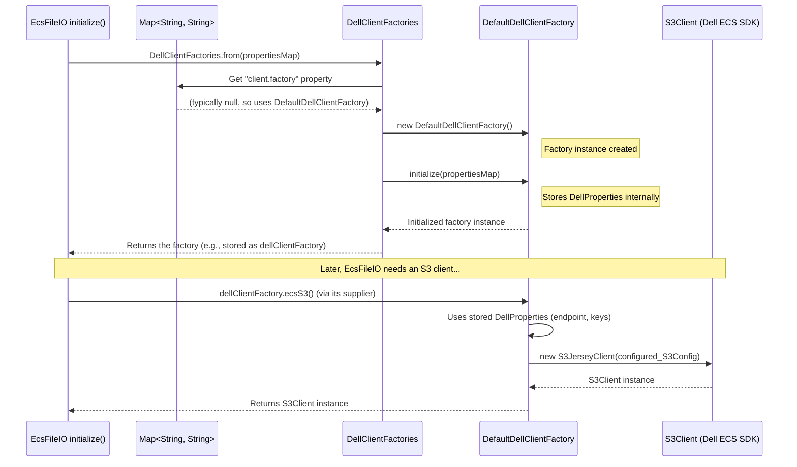

# Chapter 5: DellClientFactory - The S3 Client Workshop

Welcome to Chapter 5! In the previous chapters, we've seen how components like [EcsFileIO](03_ecsfileio_.md) (for reading/writing files) and [EcsCatalog](02_ecscatalog_.md) (for managing table metadata entries) interact with your Dell EMC ECS storage. We also know they use [DellProperties](01_dellproperties_.md) to get the necessary connection details like your ECS endpoint and access keys.

But there's a missing piece: when `EcsFileIO` needs to actually *talk* to ECS to read a file, it uses an "S3 client" object from the Dell EMC ECS SDK. How does `EcsFileIO` get this specialized client object, correctly configured with your details? That's where `DellClientFactory` comes in.

## What Problem Does `DellClientFactory` Solve?

Imagine you need a specific tool, say a special wrench, to work on your Dell EMC ECS "engine." You have the instructions (your `DellProperties` with endpoint and keys), but you need someone to actually build that wrench for you.

`DellClientFactory` is like a **specialized workshop** for building these S3 client "wrenches."
*   **You provide the workshop with your requirements:** These are the connection details found in your `DellProperties`.
*   **The workshop gives you a ready-to-use client:** A fully configured S3 client object that knows how to communicate with your specific Dell EMC ECS instance.

**Central Use Case:**
Your application is using `EcsFileIO` to read a data file from ECS.
1.  `EcsFileIO` has access to your `DellProperties` (endpoint, access key, secret key).
2.  To actually perform the read operation, `EcsFileIO` needs an `S3Client` object.
3.  Instead of `EcsFileIO` building this client itself from scratch, it asks a `DellClientFactory` to provide one.

This separation of concerns is important:
*   `EcsFileIO` focuses on *what* to do with files.
*   `DellClientFactory` focuses on *how* to create the communication tool (the S3 client) to talk to ECS.

This design allows for flexibility. For example, an advanced user might want to provide a custom factory that creates clients with special settings (like specific timeout values or connection pooling), without needing to change `EcsFileIO` itself.

## Meet `DellClientFactory` and `DellClientFactories`

There are two key parts to this:

1.  **`DellClientFactory` (The Interface - `DellClientFactory.java`):**
    This is like the blueprint for the workshop. It defines what any "S3 client workshop" must be able to do. It's an `interface`, meaning it specifies a contract:
    *   It must be able to provide an `S3Client` (the method `ecsS3()`).
    *   It must be initializable with properties (the method `initialize(Map<String, String> properties)`).

    ```java
    // From: src/main/java/org/apache/iceberg/dell/DellClientFactory.java
    package org.apache.iceberg.dell;

    import com.emc.object.s3.S3Client; // The S3 client from Dell's SDK
    import java.io.Serializable;
    import java.util.Map;

    public interface DellClientFactory extends Serializable {

      /**
       * Create a Dell EMC ECS S3 client
       * @return Dell EMC ECS S3 client
       */
      S3Client ecsS3();

      /**
       * Initialize Dell EMC ECS client factory from catalog properties.
       * @param properties catalog properties
       */
      void initialize(Map<String, String> properties);
    }
    ```
    *   `S3Client ecsS3()`: This is the main method. When called, the factory will construct and return an `S3Client` object.
    *   `void initialize(Map<String, String> properties)`: This method is called once to give the factory the configuration it needs (like your ECS endpoint and keys from `DellProperties`).
    *   `Serializable`: This means the factory can be "packaged up" and sent around, which is useful in distributed systems (you can ignore this detail for now).

2.  **`DellClientFactories` (The Utility Class - `DellClientFactories.java`):**
    This is a helper class (notice the plural "Factories") that provides a convenient way to get an actual `DellClientFactory` instance. You usually don't create a `DellClientFactory` directly; you ask `DellClientFactories` to get one for you.

    ```java
    // Simplified from: src/main/java/org/apache/iceberg/dell/DellClientFactories.java
    package org.apache.iceberg.dell;

    import java.util.Map;
    // ... other imports ...

    public class DellClientFactories {

        private DellClientFactories() {} // Cannot be instantiated directly

        public static DellClientFactory from(Map<String, String> properties) {
            // 1. Check if a custom factory class is specified in properties
            String factoryImpl = PropertyUtil.propertyAsString(
                    properties,
                    DellProperties.CLIENT_FACTORY, // Looks for "client.factory"
                    DefaultDellClientFactory.class.getName()); // Default if not found

            // 2. Load and initialize the factory
            return loadClientFactory(factoryImpl, properties);
        }

        // ... loadClientFactory method and DefaultDellClientFactory class are here ...
    }
    ```
    *   The most important method here is `DellClientFactories.from(Map<String, String> properties)`.
    *   It takes the `properties` map (which contains your `DellProperties`).
    *   It first checks if you've specified a custom factory class using the `DellProperties.CLIENT_FACTORY` property (key: `"client.factory"`).
    *   If you haven't (which is common for beginners), it defaults to using an internal class called `DefaultDellClientFactory`.
    *   It then creates an instance of this factory, initializes it with your properties, and returns it.

## How Components Use `DellClientFactory`

Let's revisit how a component like `EcsFileIO` (from [Chapter 3: EcsFileIO](03_ecsfileio_.md)) would get its S3 client.

```java
// Simplified from EcsFileIO.java, inside its initialize() method

// Map<String, String> properties; // This map is passed in, containing DellProperties

// 1. Create DellProperties to easily access connection details
this.dellProperties = new DellProperties(properties);

// 2. Get a DellClientFactory instance using DellClientFactories
this.dellClientFactory = DellClientFactories.from(properties);

// 3. Store a "supplier" that knows how to get an S3Client from the factory.
//    The s3 field is a SerializableSupplier<S3Client>.
//    dellClientFactory::ecsS3 is a short way to say:
//    "a function that, when called, will call dellClientFactory.ecsS3()"
this.s3 = dellClientFactory::ecsS3;

// Later, when an S3Client is actually needed for the first time (e.g., in client() method):
// S3Client actualClient = this.s3.get();
// This 'actualClient' is then used for file operations.
```
**What's happening?**
1.  `EcsFileIO` is initialized with a `Map` of `properties`. It creates a `DellProperties` object from this map.
2.  It calls `DellClientFactories.from(properties)`. This returns an initialized `DellClientFactory` (usually `DefaultDellClientFactory`).
3.  `EcsFileIO` doesn't necessarily create the `S3Client` immediately. It stores a "supplier" (`this.s3`) which is essentially a promise: "When I need an S3 client, I will ask `dellClientFactory.ecsS3()` for one."
4.  When `EcsFileIO` *actually* needs to perform an operation on ECS (like reading or writing a file), it will call `this.s3.get()`. This triggers the `ecsS3()` method on the factory, which builds and returns the `S3Client`. This client is then often cached within `EcsFileIO` for reuse.

This "lazy" creation of the S3 client is efficient because the client is only made when truly necessary.

## Under the Hood: How a Client is Created

Let's trace the journey when `EcsFileIO` (or any other component) asks for an S3 client.

**Step-by-Step: Getting a Factory and then a Client**



1.  **Getting the Factory (`DellClientFactories.from()`):**
    *   `EcsFileIO` calls `DellClientFactories.from(properties)`.
    *   `DellClientFactories` checks the `properties` for `DellProperties.CLIENT_FACTORY`.
    *   Assuming it's not set, it decides to use `DefaultDellClientFactory`.
    *   It creates a new `DefaultDellClientFactory` object.
    *   It calls `initialize(properties)` on this new factory object. Inside `initialize`, the `DefaultDellClientFactory` creates and stores its own `DellProperties` instance from the map.
    *   The initialized `DefaultDellClientFactory` instance is returned to `EcsFileIO`.

2.  **Getting the S3 Client (`factory.ecsS3()`):**
    *   When `EcsFileIO` needs the actual S3 client, it effectively calls `ecsS3()` on the `DefaultDellClientFactory` instance it received.
    *   The `DefaultDellClientFactory.ecsS3()` method then does the following (this is implemented inside `DellClientFactories.java`):

    ```java
    // Simplified from DellClientFactories.DefaultDellClientFactory
    // (This class is nested inside DellClientFactories.java)

    static class DefaultDellClientFactory implements DellClientFactory {
        private DellProperties dellProperties; // Set during initialize

        DefaultDellClientFactory() {} // Constructor used by DellClientFactories

        @Override
        public S3Client ecsS3() {
            // 1. Create an S3Config object using the ECS endpoint
            S3Config config = new S3Config(URI.create(dellProperties.ecsS3Endpoint()));

            // 2. Configure it with your access credentials
            config.withIdentity(dellProperties.ecsS3AccessKeyId())
                  .withSecretKey(dellProperties.ecsS3SecretAccessKey());

            // (Other ECS-specific configurations could be set on 'config' here if needed)

            // 3. Create and return the S3 client from Dell's SDK
            return new S3JerseyClient(config);
        }

        @Override
        public void initialize(Map<String, String> properties) {
            // Stores DellProperties for later use by ecsS3()
            this.dellProperties = new DellProperties(properties);
        }
    }
    ```
    *   It retrieves the ECS endpoint, access key, and secret key from its stored `dellProperties`.
    *   It creates an `S3Config` object (from the Dell EMC ECS SDK).
    *   It populates this `S3Config` with your endpoint and credentials.
    *   Finally, it instantiates an `S3JerseyClient` (the actual S3 client implementation from Dell's SDK) using this `S3Config`, and returns it.

This returned `S3Client` is now ready to make calls to your Dell EMC ECS storage.

## Why This Flexibility?

You might wonder why there's this extra layer of a "factory" instead of just creating the `S3Client` directly. For most beginner use cases, the default behavior is perfect. However, this factory pattern provides powerful benefits for more advanced scenarios:

*   **Custom Client Configurations:** If you need to set specific HTTP timeouts, proxy settings, or other advanced options on the `S3Client`, you could write your own `DellClientFactory` implementation that does this.
*   **Client Pooling:** Creating S3 clients can be somewhat expensive. A custom factory could implement client pooling, where it maintains a set of ready-to-use clients and hands them out, improving performance in high-throughput applications.
*   **Testing and Mocking:** In automated tests, you could provide a mock `DellClientFactory` that returns a fake `S3Client` which doesn't actually talk to ECS, allowing for isolated unit tests.

For now, it's enough to understand that `DellClientFactory` is the standard way the `dell` project gets its S3 clients, and `DefaultDellClientFactory` handles this for you automatically using your `DellProperties`.

## Conclusion

You've now learned about `DellClientFactory`, the "workshop" that builds the S3 client "tools" needed to interact with Dell EMC ECS. You saw that:
*   It's an interface defining how S3 clients should be created.
*   `DellClientFactories` is a utility to get an instance of a factory (usually the `DefaultDellClientFactory`).
*   The factory uses your `DellProperties` (endpoint and keys) to configure and construct a fully functional `S3Client` from the Dell EMC ECS SDK.
*   Components like `EcsFileIO` and `EcsCatalog` use this factory to obtain the S3 clients they need to perform their operations.

This mechanism ensures that client creation is centralized and configurable, even if you, as a beginner, will most often rely on the sensible defaults.

Throughout our journey, we've mentioned paths like `ecs://my-bucket/path/to/file`. How does the `dell` project parse and understand these special ECS addresses? In the next chapter, we'll look at a small but important utility for this: [Chapter 6: EcsURI](06_ecsuri_.md).

---

Generated by [AI Codebase Knowledge Builder](https://github.com/The-Pocket/Tutorial-Codebase-Knowledge)