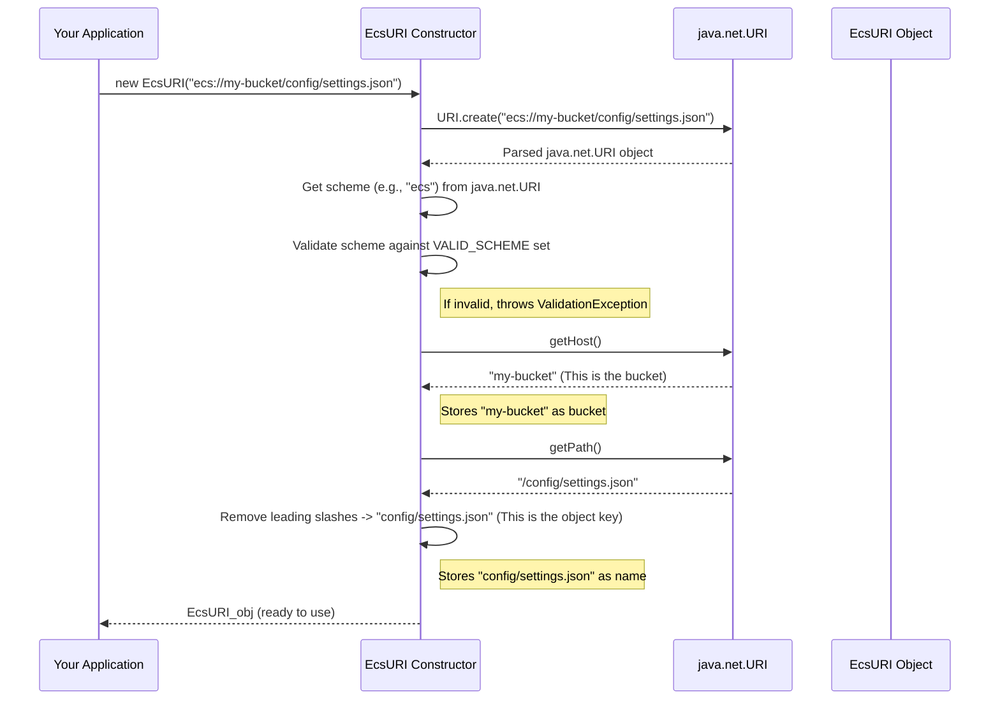

# Chapter 6: EcsURI - Your Smart Address Parser for Dell ECS

Welcome to Chapter 6! In [Chapter 5: DellClientFactory](05_dellclientfactory_.md), we learned how our `dell` project gets the specialized S3 client "tools" needed to talk to Dell EMC ECS. We know these tools need to be told *which bucket* and *which object (file)* to work with.

But often, we just have a single address string, like `ecs://my-awesome-bucket/project-data/q4_report.csv`. How does our program know that `"my-awesome-bucket"` is the bucket and `"project-data/q4_report.csv"` is the object key? This is where `EcsURI` comes to the rescue!

## What Problem Does `EcsURI` Solve?

Imagine you're a mail delivery person. You get an address like "MainTown, 123 Oak Street, Apartment 4B". To deliver the mail, you need to break this down: "MainTown" is the city, "123 Oak Street" is the street address, and "Apartment 4B" is the specific unit.

`EcsURI` is like a specialized address parser for Dell EMC ECS locations. When you give it an ECS address string (a "URI" - Uniform Resource Identifier), it can:

1.  **Understand the "ecs://" prefix:** It knows this means it's an ECS location.
2.  **Identify the bucket:** It extracts the bucket name from the address.
3.  **Identify the object key:** It figures out the full path to the object (file) within that bucket.

**Central Use Case:**
Your application needs to read a file stored at `ecs://my-company-backups/daily_logs/log_2023-10-26.txt`.
Before it can ask the S3 client (from `DellClientFactory`) to fetch this file, it needs to tell the client:
*   The bucket name is: `my-company-backups`
*   The object key (or name) is: `daily_logs/log_2023-10-26.txt`

`EcsURI` takes the full string `ecs://my-company-backups/daily_logs/log_2023-10-26.txt` and performs this breakdown for you. This ensures that locations are handled consistently and correctly whenever any part of the `dell` project interacts with ECS.

## How to Use `EcsURI`

Using `EcsURI` is very straightforward. You create an `EcsURI` object by giving it the location string, and then you can ask it for the bucket and the object key (which it calls "name").

Let's see a simple example:

```java
// Import the EcsURI class
import org.apache.iceberg.dell.ecs.EcsURI;

// Our ECS location string
String ecsLocation = "ecs://my-data-bucket/path/to/my_file.txt";

// 1. Create an EcsURI object
EcsURI parsedUri = new EcsURI(ecsLocation);

// 2. Get the bucket name
String bucketName = parsedUri.bucket();

// 3. Get the object key (referred to as "name" in EcsURI)
String objectKey = parsedUri.name();

// Let's see what we got!
System.out.println("Original Location: " + parsedUri.location()); // or just ecsLocation
System.out.println("Bucket: " + bucketName);
System.out.println("Object Key (Name): " + objectKey);
```

**What happens and what's the output?**
1.  We create an `EcsURI` object, `parsedUri`, from the string `ecs://my-data-bucket/path/to/my_file.txt`.
2.  We call `parsedUri.bucket()` which returns the bucket part of the URI.
3.  We call `parsedUri.name()` which returns the object key part of the URI.

The output will be:
```
Original Location: ecs://my-data-bucket/path/to/my_file.txt
Bucket: my-data-bucket
Object Key (Name): path/to/my_file.txt
```

As you can see, `EcsURI` correctly broke down the full location string into its essential components.

**It's Flexible with Schemes!**
`EcsURI` is also designed to understand other common S3-like URI schemes, not just `ecs://`. It will also correctly parse locations starting with:
*   `s3://`
*   `s3a://`
*   `s3n://`

So, if you had `String s3Location = "s3a://another-bucket/important/data.parquet";`, `new EcsURI(s3Location)` would work just the same, extracting `another-bucket` as the bucket and `important/data.parquet` as the object key.

## Under the Hood: How `EcsURI` Parses Addresses

`EcsURI` isn't doing overly complex magic. It cleverly uses Java's built-in `java.net.URI` class to do most of the heavy lifting for parsing.

**Step-by-Step When You Create `new EcsURI("ecs://my-bucket/config/settings.json")`:**



1.  **Input:** Your application provides the location string (e.g., `"ecs://my-bucket/config/settings.json"`).
2.  **Standard Parsing:** `EcsURI` passes this string to `java.net.URI.create()`. Java's `URI` class breaks it into parts like scheme (`ecs`), host (`my-bucket`), and path (`/config/settings.json`).
3.  **Scheme Validation:** `EcsURI` checks if the scheme (`ecs` in this case) is one of the recognized schemes (`ecs`, `s3`, `s3a`, `s3n`). If not, it signals an error.
4.  **Bucket Extraction:** It takes the "host" part from the `java.net.URI` object (which is `my-bucket`) and considers this the ECS bucket name.
5.  **Object Key Extraction:** It takes the "path" part (which is `/config/settings.json`). It then removes any leading slashes (`/`) to get the clean object key (`config/settings.json`). This is important because S3 object keys typically don't start with a slash.
6.  **Storage:** The original location, the extracted bucket, and the object key (name) are stored inside the `EcsURI` object.

**A Peek at the Code (`EcsURI.java`):**

Let's look at the key parts of the `EcsURI.java` file.

First, a set of valid schemes it recognizes:
```java
// From: src/main/java/org/apache/iceberg/dell/ecs/EcsURI.java
import java.util.Set;
import org.apache.iceberg.relocated.com.google.common.collect.ImmutableSet;
// ... other imports

class EcsURI {
  private static final Set<String> VALID_SCHEME = ImmutableSet.of("ecs", "s3", "s3a", "s3n");
  // ...
}
```
This `VALID_SCHEME` constant is used to check if the scheme in the provided location string is one that `EcsURI` understands.

The main constructor that takes a location string:
```java
// From: src/main/java/org/apache/iceberg/dell/ecs/EcsURI.java
import java.net.URI;
import java.util.Locale;
import org.apache.iceberg.exceptions.ValidationException;
import org.apache.iceberg.relocated.com.google.common.base.Preconditions;

class EcsURI {
  // ... VALID_SCHEME and fields (location, bucket, name) ...

  EcsURI(String location) {
    // Make sure location is not null (this check is slightly different in actual code)
    Preconditions.checkArgument(location != null, "Location can not be null"); // Simplified
    this.location = location;

    URI uri = URI.create(location); // Use Java's URI parser

    // Check if the scheme is valid (e.g., "ecs", "s3")
    ValidationException.check(
        VALID_SCHEME.contains(uri.getScheme().toLowerCase(Locale.ROOT)),
        "Invalid ecs location: %s",
        location);

    this.bucket = uri.getHost(); // The "host" part is our bucket
    // The "path" part is our object key, after removing any leading slashes
    this.name = uri.getPath().replaceAll("^/*", "");
  }
  // ... getter methods ...
}
```
*   It first stores the original `location` string.
*   It uses `URI.create(location)` to get a standard Java `URI` object.
*   It checks `uri.getScheme()` against its `VALID_SCHEME` set.
*   `uri.getHost()` gives the bucket name.
*   `uri.getPath().replaceAll("^/*", "")` gets the path and cleans it up to become the object key (name). The `replaceAll("^/*", "")` part is a regular expression that removes one or more slash characters (`/`) only from the beginning (`^`) of the path string.

And the simple getter methods:
```java
// From: src/main/java/org/apache/iceberg/dell/ecs/EcsURI.java
class EcsURI {
  // ... fields and constructor ...

  public String bucket() {
    return bucket;
  }

  public String name() {
    return name;
  }

  public String location() {
    return location;
  }
  // ...
}
```
These methods simply return the values that were parsed and stored during the object's creation.

There's also another constructor `EcsURI(String bucket, String name)` that does the reverse: it takes a bucket and an object key and constructs the full `ecs://bucket/name` location string. This can be useful if you have the components separately and need the full URI string.

## Why is `EcsURI` Important?

Many components within the `dell` project, like [EcsFileIO](03_ecsfileio_.md) (which handles reading and writing files) or [EcsCatalog](02_ecscatalog_.md) (which manages table metadata listings), often receive ECS locations as simple strings.

For example, when `EcsFileIO` is asked to delete a file at `ecs://my-bucket/temp/file.tmp`, it internally uses `EcsURI` like this:
```java
// Simplified concept from EcsFileIO.deleteFile(String path)
EcsURI uri = new EcsURI(path); // path is "ecs://my-bucket/temp/file.tmp"
String bucketToDeleteFrom = uri.bucket(); // "my-bucket"
String keyToDelete = uri.name();         // "temp/file.tmp"

// Now call the S3 client:
// s3Client.deleteObject(bucketToDeleteFrom, keyToDelete);
```
The S3 client (which actually talks to Dell ECS) usually requires the bucket name and the object key as separate arguments. `EcsURI` provides a reliable and consistent way to get these pieces from a full location string. Without it, each part of the code would have to parse these strings itself, leading to potential errors or inconsistencies.

## Conclusion

You've now learned about `EcsURI`, a handy utility class in the `dell` project that acts as a specialized address parser for Dell EMC ECS locations. Given a string like `ecs://my-bucket/path/to/object`, it expertly breaks it down into the `bucket` (`my-bucket`) and the `name` or object key (`path/to/object`).

This ensures that all parts of the `dell` system can correctly and consistently understand and use ECS paths. It's a small but vital cog that makes working with ECS locations much smoother and more reliable.

So far, we've seen how to get connection details ([DellProperties](01_dellproperties_.md)), manage catalogs ([EcsCatalog](02_ecscatalog_.md)), handle file I/O ([EcsFileIO](03_ecsfileio_.md)), oversee table operations ([EcsTableOperations](04_ecstableoperations_.md)), and create S3 clients ([DellClientFactory](05_dellclientfactory_.md)). Now, with `EcsURI`, we also know how locations themselves are understood.

What about the actual `InputFile` and `OutputFile` objects that `EcsFileIO` provides? They have some common characteristics when dealing with ECS. In the next chapter, we'll look at [Chapter 7: BaseEcsFile](07_baseecsfile_.md), a foundation class for these ECS file representations.

---

Generated by [AI Codebase Knowledge Builder](https://github.com/The-Pocket/Tutorial-Codebase-Knowledge)