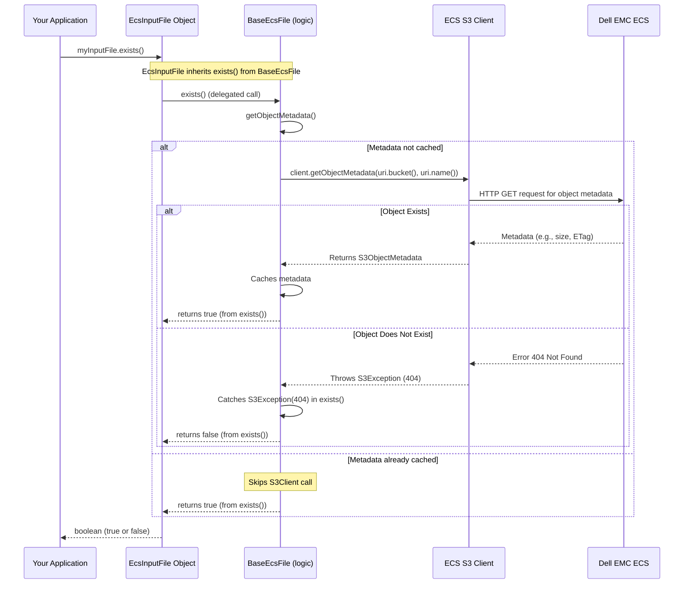

# Chapter 7: BaseEcsFile - The Common Toolkit for ECS Files

Welcome to Chapter 7! In [Chapter 6: EcsURI](06_ecsuri_.md), we learned how the `dell` project intelligently parses Dell EMC ECS location strings like `ecs://my-bucket/path/to/file` into their bucket and object key components. This is crucial because when we work with files on ECS, we always need to know "which bucket?" and "which file in that bucket?".

Now, imagine you have different types of file representations for ECS: one for reading files (`EcsInputFile`) and one for writing files (`EcsOutputFile`). Both of these would need some common information and capabilities. For example, both need to know the file's full ECS location, have access to the S3 client to talk to ECS, and might need to check if the file even exists.

Instead of writing this common code twice (once in `EcsInputFile` and once in `EcsOutputFile`), we can use a smart programming trick: create a shared "toolkit" or "blueprint." That's exactly what `BaseEcsFile` is.

## What Problem Does `BaseEcsFile` Solve?

`BaseEcsFile` is an **abstract base class** that provides common functionality for file representations (input or output) on Dell EMC ECS. Think of it as a **foundational toolkit** that `EcsInputFile` (for reading) and `EcsOutputFile` (for writing) both use.

**Central Use Case:**
You have an `EcsInputFile` object representing a file on ECS that you want to read. Before you start reading, you might want to:
1.  Know its full location string.
2.  Check if the file actually exists on ECS.
3.  Get its size (metadata).

Similarly, if you have an `EcsOutputFile` for a file you're about to write, you might want to check if a file with that name *already* exists before you try to create a new one.

Both `EcsInputFile` and `EcsOutputFile` need this kind of core functionality. `BaseEcsFile` provides it in one place, so they don't have to duplicate the logic. It encapsulates shared details such as:
*   Storing the ECS S3 client (the tool to talk to ECS).
*   Storing the [EcsURI](06_ecsuri_.md) of the file (its parsed address).
*   Storing [DellProperties](01_dellproperties_.md) (if any specific configurations are needed).
*   Providing common methods like `exists()` (to check if the file is on ECS) or `getObjectMetadata()` (to fetch details like size).

Concrete classes like `EcsInputFile` and `EcsOutputFile` then "inherit" or "build upon" this base toolkit and add their specific behaviors (like reading data or writing data).

## How Does It Work? The Blueprint Analogy

You don't typically create a `BaseEcsFile` object directly. It's "abstract," meaning it's like an incomplete blueprint. It provides the common parts, but expects other, more specific classes to fill in the details.

`EcsInputFile` and `EcsOutputFile` are those specific classes. They "extend" `BaseEcsFile`. In Java, this means they automatically get all the features and stored information from `BaseEcsFile`.

Here's a very simplified idea of how `EcsInputFile` uses `BaseEcsFile`:

```java
// This is a conceptual illustration.
// EcsInputFile.java (Simplified)
class EcsInputFile extends BaseEcsFile /* ... other interfaces ... */ {

    // Constructor for EcsInputFile
    EcsInputFile(S3Client client, EcsURI uri, DellProperties dellProps, MetricsContext metrics) {
        // Call the constructor of BaseEcsFile to store common info
        super(client, uri, dellProps, metrics);
    }

    // EcsInputFile adds its own specific methods, like for reading:
    public SeekableInputStream newStream() {
        // ... logic to create a readable stream using the S3 client and URI from BaseEcsFile ...
        // For example, it can use client() and uri() methods inherited from BaseEcsFile
        return new EcsSeekableInputStream(client(), uri(), metrics());
    }

    // It can also use methods from BaseEcsFile directly!
    // For example, to get the file length:
    public long getLength() {
        // getObjectMetadata() is a method provided by BaseEcsFile
        return getObjectMetadata().getContentLength();
    }
}
```
**What's happening?**
1.  `EcsInputFile extends BaseEcsFile`: This means `EcsInputFile` automatically inherits all the fields (like the S3 client, URI) and methods (like `exists()`, `location()`, `getObjectMetadata()`) from `BaseEcsFile`.
2.  `super(client, uri, dellProps, metrics)`: In the `EcsInputFile` constructor, `super(...)` calls the constructor of `BaseEcsFile`. This is how `BaseEcsFile` gets initialized with the S3 client, the parsed [EcsURI](06_ecsuri_.md) of the file, and any [DellProperties](01_dellproperties_.md).
3.  `EcsInputFile` then adds its own specific methods, like `newStream()` for reading.
4.  Crucially, methods in `EcsInputFile` (like `getLength()`) can directly use methods provided by `BaseEcsFile` (like `getObjectMetadata()`).

So, if you have an `EcsInputFile` object, say `myEcsFile`, and you call `myEcsFile.exists()`, the `exists()` logic actually runs from `BaseEcsFile`!

## Under the Hood: The Common Machinery

`BaseEcsFile` stores the essential components needed to interact with a file on ECS and provides methods that use these components.

### Key Components Stored in `BaseEcsFile`

When an `EcsInputFile` or `EcsOutputFile` is created, it passes the following to `BaseEcsFile`'s constructor:

*   `S3Client client`: The actual S3 client object (obtained via [DellClientFactory](05_dellclientfactory_.md)) that can send commands to ECS.
*   `EcsURI uri`: The parsed [EcsURI](06_ecsuri_.md) object representing the file's location (e.g., holding the bucket and key).
*   `DellProperties dellProperties`: An object holding configuration like ECS endpoint and credentials, as discussed in [Chapter 1: DellProperties](01_dellproperties_.md).
*   `MetricsContext metrics`: For collecting performance metrics (we can ignore this for now).

`BaseEcsFile` keeps these in its internal fields.

```java
// From: src/main/java/org/apache/iceberg/dell/ecs/BaseEcsFile.java
// (Simplified for focus)

abstract class BaseEcsFile {

  private final S3Client client; // The tool to talk to ECS
  private final EcsURI uri;      // The parsed address of the file
  private final DellProperties dellProperties; // Connection/configuration details
  private S3ObjectMetadata metadata; // Cached metadata (like size, ETag)
  // private final MetricsContext metrics; // For performance tracking

  // Constructor used by EcsInputFile and EcsOutputFile
  BaseEcsFile(S3Client client, EcsURI uri, DellProperties dellProperties, MetricsContext metrics) {
    this.client = client;
    this.uri = uri;
    this.dellProperties = dellProperties;
    // this.metrics = metrics;
    // Note: 'this.metadata' is not set here; it's fetched lazily.
  }

  // ... common methods ...
}
```
This constructor simply stores the provided client, URI, and properties so that other methods in `BaseEcsFile` can use them.

### Common Methods Provided by `BaseEcsFile`

Let's look at a couple of important methods that `BaseEcsFile` offers.

**1. Getting the File Location (`location()`):**
This method simply returns the full string representation of the file's location.

```java
// From: src/main/java/org/apache/iceberg/dell/ecs/BaseEcsFile.java

  public String location() {
    // The 'uri' object (EcsURI) already knows its full location string
    return uri.location();
  }
```
If you have an `EcsInputFile` object `myFile` for `ecs://my-bucket/data.txt`, calling `myFile.location()` would return `"ecs://my-bucket/data.txt"`.

**2. Checking if the File Exists (`exists()`):**
This is a very useful method. It checks with ECS if the file actually exists at the given location.

```java
// From: src/main/java/org/apache/iceberg/dell/ecs/BaseEcsFile.java

  public boolean exists() {
    try {
      // getObjectMetadata() tries to fetch metadata from ECS.
      // If it succeeds, the file exists.
      getObjectMetadata();
      return true;
    } catch (S3Exception e) {
      // If ECS says "Not Found" (HTTP 404), the file doesn't exist.
      if (e.getHttpCode() == 404) {
        return false;
      } else {
        // For any other error, re-throw it.
        throw e;
      }
    }
  }
```
This method calls another helper method, `getObjectMetadata()`. If `getObjectMetadata()` completes without a "404 Not Found" error from ECS, the file exists.

**3. Getting File Metadata (`getObjectMetadata()`):**
This method fetches metadata about the file from ECS, such as its size, E-Tag (version identifier), and last modified date. It also cleverly caches this metadata.

```java
// From: src/main/java/org/apache/iceberg/dell/ecs/BaseEcsFile.java
// S3ObjectMetadata is a class from the Dell ECS SDK

  protected S3ObjectMetadata getObjectMetadata() throws S3Exception {
    // If we haven't fetched metadata yet (or it was cleared)...
    if (metadata == null) {
      // ...use the stored S3 client and EcsURI to ask ECS for metadata.
      // client() returns this.client
      // uri.bucket() gives the bucket name from the EcsURI
      // uri.name() gives the object key from the EcsURI
      metadata = client().getObjectMetadata(uri.bucket(), uri.name());
    }
    // Return the (possibly cached) metadata.
    return metadata;
  }
```
*   It first checks if it already has `metadata` stored.
*   If not (i.e., `metadata == null`), it uses the stored `S3Client` (`client()`) and the `bucket()` and `name()` from its `EcsURI` (`uri()`) to make a call to ECS (`getObjectMetadata`).
*   The result from ECS (an `S3ObjectMetadata` object) is then stored in the `metadata` field for future use (caching).
*   This way, if you ask for metadata multiple times, it only contacts ECS the first time.

### How a Call to `exists()` Flows

Let's imagine your application has an `EcsInputFile` object (which extends `BaseEcsFile`) and calls the `exists()` method on it.



1.  Your application calls `myInputFile.exists()`.
2.  Since `EcsInputFile` inherits `exists()` from `BaseEcsFile`, the logic within `BaseEcsFile.exists()` runs.
3.  `BaseEcsFile.exists()` calls its own `getObjectMetadata()` method.
4.  If metadata isn't cached, `getObjectMetadata()` uses the stored `S3Client` and `EcsURI` to request object metadata from Dell EMC ECS.
5.  Dell EMC ECS responds:
    *   If the object exists, it sends back metadata. `getObjectMetadata()` caches this and returns it. `exists()` then returns `true`.
    *   If the object doesn't exist, ECS sends a 404 error. `getObjectMetadata()` throws an `S3Exception`. `exists()` catches this specific exception and returns `false`.
6.  The result (`true` or `false`) goes back to your application.

This shows how `BaseEcsFile` acts as a central hub for these common operations, using the S3 client and URI it holds.

## Conclusion

You've now explored `BaseEcsFile`, the foundational toolkit that provides shared functionality for `EcsInputFile` and `EcsOutputFile`. By encapsulating common elements like the S3 client, the file's [EcsURI](06_ecsuri_.md), [DellProperties](01_dellproperties_.md), and essential methods like `exists()` and `location()`, `BaseEcsFile` promotes code reuse and consistency.

It ensures that whether you're preparing to read a file or write one, the basic interactions with ECS (like checking existence or getting metadata) are handled in a standard way. You don't use `BaseEcsFile` directly, but its capabilities are automatically available through the `EcsInputFile` and `EcsOutputFile` objects you get from [EcsFileIO](03_ecsfileio_.md).

We've seen that components like `EcsCatalog` and `EcsTableOperations` store their metadata (like `.namespace` or `.table` files) as simple text-based property files on ECS. How are these properties read from and written to those files in a structured way? That's where our next and final chapter in this introductory series comes in. We'll look at [Chapter 8: PropertiesSerDesUtil](08_propertiesserdesutil_.md), a utility for serializing and deserializing these property maps.

---

Generated by [AI Codebase Knowledge Builder](https://github.com/The-Pocket/Tutorial-Codebase-Knowledge)