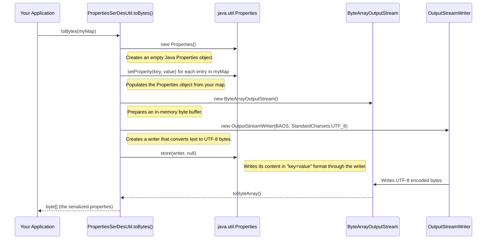
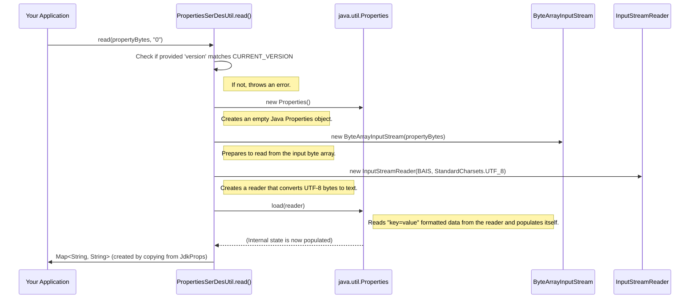

# Chapter 8: PropertiesSerDesUtil - Your Map-to-Bytes Translator

Welcome to the final chapter in our introductory series on the `dell` project! In [Chapter 7: BaseEcsFile](07_baseecsfile_.md), we saw how `EcsInputFile` and `EcsOutputFile` share a common toolkit (`BaseEcsFile`) for basic file operations on Dell EMC ECS. We've also learned that components like [EcsCatalog](02_ecscatalog_.md) store small metadata files (like `.namespace` or `.table` files) on ECS. These files often contain simple key-value pairs, like settings or pointers.

But how do we take a collection of key-value pairs, which in Java is often a `Map<String, String>`, and turn it into a sequence of bytes that can be saved in a file? And how do we read that file back and reconstruct the original map? This is where `PropertiesSerDesUtil` comes in handy.

## What Problem Does `PropertiesSerDesUtil` Solve?

Imagine you have a list of important settings for a project, for example:
*   `project_owner = "Alice"`
*   `status = "active"`
*   `version = "1.2"`

In Java, you might store this as a `Map<String, String>`. Now, you want to save this information as a small text file on your Dell EMC ECS storage. You can't just save the `Map` object directly; you need to convert it into a standardized byte format. Later, when you read the file back, you need to convert those bytes back into your `Map`.

`PropertiesSerDesUtil` is a **specialized translator** that does exactly this:
1.  **Serialization (Ser):** Converts a Java `Map<String, String>` (your properties) into a compact array of bytes (`byte[]`). This byte array can then be easily written to a file on ECS.
2.  **Deserialization (Des):** Converts an array of bytes (read from a file on ECS) back into a Java `Map<String, String>`.

**Central Use Case:**
The [EcsCatalog](02_ecscatalog_.md) needs to store properties for a newly created namespace called `marketing`. These properties might include `contact_email = "team@example.com"` and `region = "EMEA"`.
1.  `EcsCatalog` has these properties in a `Map<String, String>`.
2.  To store them in the `marketing.namespace` file on ECS, it uses `PropertiesSerDesUtil` to convert this map into bytes.
3.  These bytes are then written as the content of the `marketing.namespace` object on ECS.
4.  Later, when another user wants to see the properties of the `marketing` namespace, `EcsCatalog` reads the bytes from `marketing.namespace` and uses `PropertiesSerDesUtil` to turn them back into a `Map`.

This utility ensures that properties are saved and loaded in a consistent, standard format.

## How to Use `PropertiesSerDesUtil`

`PropertiesSerDesUtil` is a utility class, meaning it's a collection of helpful functions (static methods in Java). You don't create an "instance" of it; you just call its methods directly.

It has two main methods:
*   `toBytes(Map<String, String> value)`: Takes your map of properties and returns a `byte[]`.
*   `read(byte[] content, String version)`: Takes a `byte[]` (and a version string, which we'll touch on) and returns a `Map<String, String>`.

It also has a helper:
*   `currentVersion()`: Returns the version string of the format `PropertiesSerDesUtil` currently uses. This is useful for "version-stamping" the data when you save it.

Let's see a quick example:

```java
import java.util.HashMap;
import java.util.Map;
import org.apache.iceberg.dell.ecs.PropertiesSerDesUtil; // The utility we are learning

// In your application code...

// 1. Prepare some properties
Map<String, String> myProperties = new HashMap<>();
myProperties.put("username", "jane_doe");
myProperties.put("theme_color", "blue");
myProperties.put("notifications_enabled", "true");

// 2. Serialize: Convert the map to bytes
byte[] propertyBytes = PropertiesSerDesUtil.toBytes(myProperties);

// 'propertyBytes' now holds the byte representation of our map.
// You could save these bytes to a file.
System.out.println("Serialized " + myProperties.size() + " properties into " + propertyBytes.length + " bytes.");

// --- Imagine these bytes were saved and later read from a file ---

// 3. Deserialize: Convert bytes back to a map
// We need the version string that was used to serialize.
// Typically, you'd store this version alongside the data.
String version = PropertiesSerDesUtil.currentVersion(); // For this example, assume it's current
Map<String, String> loadedProperties = PropertiesSerDesUtil.read(propertyBytes, version);

// Now 'loadedProperties' should be identical to 'myProperties'
System.out.println("Loaded properties: " + loadedProperties);
System.out.println("Username from loaded map: " + loadedProperties.get("username"));
```

**What happens and what's the output?**
1.  We create a sample `Map` called `myProperties`.
2.  `PropertiesSerDesUtil.toBytes(myProperties)` converts this map into a `byte[]`. The content of these bytes will look similar to a standard Java `.properties` file format (e.g., `key=value` on each line).
3.  We then simulate reading these bytes back.
4.  `PropertiesSerDesUtil.read(propertyBytes, version)` takes the byte array and the expected format version. It parses the bytes and reconstructs the `Map`.

The output would be something like:
```
Serialized 3 properties into [some_number] bytes.
Loaded properties: {username=jane_doe, theme_color=blue, notifications_enabled=true}
Username from loaded map: jane_doe
```
(The exact number of bytes depends on the keys and values).

You can see that the `loadedProperties` map successfully recovered the original data. This is precisely what [EcsCatalog](02_ecscatalog_.md) does when it saves and loads properties for namespaces and table pointers.

## Under the Hood: The Translation Process

`PropertiesSerDesUtil` cleverly uses Java's built-in `java.util.Properties` class, which is designed to handle key-value property lists and read/write them from/to streams in a standard text format.

### Serialization: `Map` to `byte[]` (`toBytes` method)

When you call `PropertiesSerDesUtil.toBytes(yourMap)`:



1.  **Create `java.util.Properties`:** An empty `java.util.Properties` object is created.
2.  **Populate:** Your input `Map<String, String>` is iterated, and each key-value pair is added to the `java.util.Properties` object using `setProperty(key, value)`.
3.  **Prepare Output Stream:** A `ByteArrayOutputStream` is created. This is like a flexible, in-memory container for bytes.
4.  **Create Writer:** An `OutputStreamWriter` is set up to write to this `ByteArrayOutputStream`, configured to use `UTF-8` encoding. This ensures characters are converted to bytes correctly.
5.  **Store Properties:** The `store(writer, null)` method of the `java.util.Properties` object is called. This method writes out all the properties in the standard format (e.g., `key=value\n`) to the provided `writer`. The `null` argument means no comments are added to the output.
6.  **Get Bytes:** Finally, `toByteArray()` is called on the `ByteArrayOutputStream` to get the actual `byte[]` containing the serialized properties.

### Deserialization: `byte[]` to `Map` (`read` method)

When you call `PropertiesSerDesUtil.read(propertyBytes, version)`:



1.  **Version Check:** The provided `version` string is compared against `PropertiesSerDesUtil.CURRENT_VERSION`. If they don't match, it means the data might be in an old, incompatible format, so an error is typically thrown.
2.  **Create `java.util.Properties`:** An empty `java.util.Properties` object is created.
3.  **Prepare Input Stream:** A `ByteArrayInputStream` is created, wrapping your input `byte[]`. This allows the bytes to be read like a stream.
4.  **Create Reader:** An `InputStreamReader` is set up to read from this `ByteArrayInputStream`, configured to interpret the bytes as `UTF-8` encoded characters.
5.  **Load Properties:** The `load(reader)` method of the `java.util.Properties` object is called. This method reads the property data (expecting `key=value` lines) from the `reader` and populates the `java.util.Properties` object.
6.  **Convert to Map:** The `java.util.Properties` object (which is a bit different from a `Map<String, String>`) is then converted into a new `HashMap<String, String>` by iterating through its property names and values.
7.  **Return Map:** This newly created `Map` is returned.

### A Peek at the Code (`PropertiesSerDesUtil.java`)

Let's look at the key parts of the `PropertiesSerDesUtil.java` file.

First, the `CURRENT_VERSION` constant:
```java
// From: src/main/java/org/apache/iceberg/dell/ecs/PropertiesSerDesUtil.java
public class PropertiesSerDesUtil {

  private PropertiesSerDesUtil() {} // Private constructor - it's a utility class!

  /** Version of current implementation. */
  private static final String CURRENT_VERSION = "0";
  // ...
}
```
This version string helps manage compatibility if the storage format ever needs to change in the future.

The `toBytes` method (simplified):
```java
// From: src/main/java/org/apache/iceberg/dell/ecs/PropertiesSerDesUtil.java
import java.io.ByteArrayOutputStream;
import java.io.OutputStreamWriter;
import java.io.Writer;
import java.nio.charset.StandardCharsets;
import java.util.Map;
import java.util.Properties; // Java's built-in Properties class

public class PropertiesSerDesUtil {
  // ... CURRENT_VERSION ...

  public static byte[] toBytes(Map<String, String> value) {
    Properties jdkProperties = new Properties();
    // Copy all entries from the input Map to the Properties object
    for (Map.Entry<String, String> entry : value.entrySet()) {
      jdkProperties.setProperty(entry.getKey(), entry.getValue());
    }

    try (ByteArrayOutputStream output = new ByteArrayOutputStream();
        // Use UTF-8 for consistent character encoding
        Writer writer = new OutputStreamWriter(output, StandardCharsets.UTF_8)) {
      // 'store' writes the properties in "key=value" format to the writer
      jdkProperties.store(writer, null); // 'null' for no comments
      return output.toByteArray();
    } catch (IOException e) {
      // Handle error, e.g., by logging and re-throwing
      throw new UncheckedIOException(e);
    }
  }
  // ... read method and currentVersion method ...
}
```
This code directly implements the steps described in the "Serialization" diagram above.

The `read` method (simplified):
```java
// From: src/main/java/org/apache/iceberg/dell/ecs/PropertiesSerDesUtil.java
import java.io.ByteArrayInputStream;
import java.io.InputStreamReader;
import java.io.Reader;
import java.nio.charset.StandardCharsets;
import java.util.Map;
import java.util.Properties;
import org.apache.iceberg.relocated.com.google.common.base.Preconditions;
import org.apache.iceberg.relocated.com.google.common.collect.Maps;


public class PropertiesSerDesUtil {
  // ... CURRENT_VERSION, toBytes method ...

  public static Map<String, String> read(byte[] content, String version) {
    // Check if the data version matches what this code expects
    Preconditions.checkArgument(
        CURRENT_VERSION.equals(version), "Properties version is not match", version);

    Properties jdkProperties = new Properties();
    try (Reader reader =
        new InputStreamReader(new ByteArrayInputStream(content), StandardCharsets.UTF_8)) {
      // 'load' reads the "key=value" formatted data from the reader
      jdkProperties.load(reader);
    } catch (IOException e) {
      throw new UncheckedIOException(e);
    }

    // Convert the populated Properties object into a standard Map<String, String>
    Map<String, String> properties = Maps.newHashMap();
    for (String name : jdkProperties.stringPropertyNames()) {
      properties.put(name, jdkProperties.getProperty(name));
    }
    // Return an unmodifiable map so callers can't accidentally change it
    return Collections.unmodifiableMap(properties);
  }

  public static String currentVersion() {
    return CURRENT_VERSION;
  }
}
```
This implements the steps from the "Deserialization" diagram, including the version check and conversion back to a standard `Map`.

## How `EcsCatalog` Uses `PropertiesSerDesUtil`

As mentioned, [EcsCatalog](02_ecscatalog_.md) is a primary user of this utility.
*   When `EcsCatalog` creates a new namespace or table pointer, it has a `Map<String, String>` of properties. It calls `PropertiesSerDesUtil.toBytes()` to get the `byte[]` to store as the object content on ECS. It also gets `PropertiesSerDesUtil.currentVersion()` and stores this version string as user metadata on the ECS object (using a key like `PROPERTIES_VERSION_USER_METADATA_KEY`).
*   When `EcsCatalog` needs to load properties for an existing namespace or table, it reads the object's content (`byte[]`) from ECS and also fetches its user metadata to get the stored version string. It then calls `PropertiesSerDesUtil.read(bytes, version)` to reconstruct the `Map<String, String>`.

This ensures that the "catalog cards" managed by `EcsCatalog` are stored and retrieved reliably.

## Conclusion

You've now learned about `PropertiesSerDesUtil`, a straightforward but essential utility in the `dell` project. It acts as a translator, converting Java `Map<String, String>` objects into a byte array format suitable for storage (serialization) and reversing the process to read them back (deserialization). This is crucial for components like [EcsCatalog](02_ecscatalog_.md) to manage structured metadata (like namespace or table pointer properties) as small files on Dell EMC ECS.

With this chapter, our introductory journey through the key components of the `dell` project comes to an end. We started by understanding how to provide connection details with [DellProperties](01_dellproperties_.md). We then saw how [EcsCatalog](02_ecscatalog_.md) manages the "big picture" of tables and namespaces. [EcsFileIO](03_ecsfileio_.md) showed us how individual files are read and written, while [EcsTableOperations](04_ecstableoperations_.md) focused on the lifecycle of a single table's metadata. The [DellClientFactory](05_dellclientfactory_.md) provided the S3 clients for ECS communication, [EcsURI](06_ecsuri_.md) parsed ECS locations, and [BaseEcsFile](07_baseecsfile_.md) provided a common foundation for ECS file objects. Finally, `PropertiesSerDesUtil` ensures that map-based properties are handled correctly.

Hopefully, this series has given you a good foundational understanding of how these pieces fit together to enable Apache Iceberg to work effectively with Dell EMC ECS!

---

Generated by [AI Codebase Knowledge Builder](https://github.com/The-Pocket/Tutorial-Codebase-Knowledge)