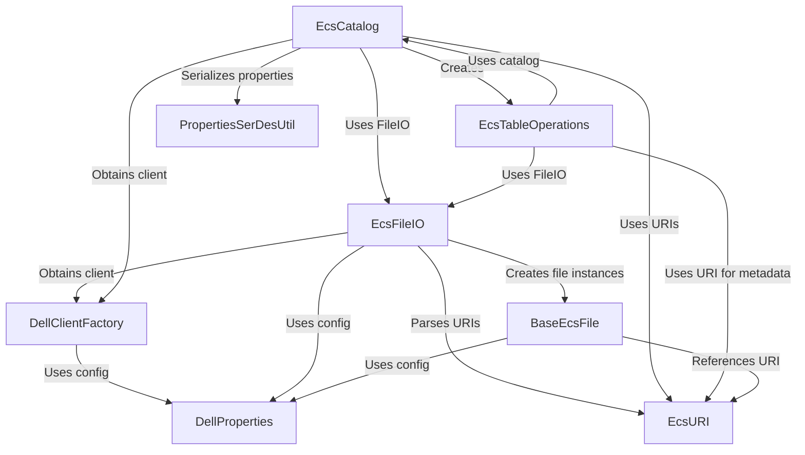

# Tutorial: dell

This project enables using *Dell EMC ECS S3* storage as a backend for *Apache Iceberg*. It allows users to define and manage Iceberg *tables* and *namespaces* directly on ECS. The system handles *file operations* (reading, writing, deleting data and metadata files) and ensures *atomic metadata updates* for table consistency, all configured through specific Dell ECS properties.

**Source Repository:** [None](None)

## Chapters

1. [DellProperties
](01_dellproperties_.md)
2. [EcsCatalog
](02_ecscatalog_.md)
3. [EcsFileIO
](03_ecsfileio_.md)
4. [EcsTableOperations
](04_ecstableoperations_.md)
5. [DellClientFactory
](05_dellclientfactory_.md)
6. [EcsURI
](06_ecsuri_.md)
7. [BaseEcsFile
](07_baseecsfile_.md)
8. [PropertiesSerDesUtil
](08_propertiesserdesutil_.md)

---

Generated by [AI Codebase Knowledge Builder](https://github.com/The-Pocket/Tutorial-Codebase-Knowledge)