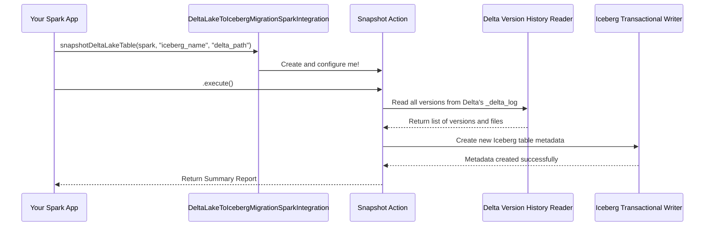

# Chapter 1: Spark Integration and Testing

Welcome to the user manual for the Delta Lake to Iceberg migration tool! If you have a data warehouse full of Delta Lake tables and want to start using Apache Iceberg, you're in the right place. This tool helps you make that switch smoothly.

This first chapter is a little different. Instead of starting with a single, isolated feature, we're going to look at the whole process from start to finish. We'll explore how the migration tool works within a real Apache Spark environment by looking at its integration tests.

Think of it like buying a piece of furniture. You could start by studying every single screw, dowel, and wood panel (the individual APIs). Or, you could look at the fully assembled bookshelf in the showroom. Seeing the final product helps you understand how all the little parts are *meant* to fit together. The integration tests are our "fully assembled bookshelf." They are the best place to see a complete, working example.

### The Goal: Migrating a Delta Table in Spark

Our main goal is simple:
*   **We have:** A table stored in the Delta Lake format.
*   **We want:** An Apache Iceberg table that points to the exact same data, with all of its version history preserved.
*   **The environment:** We'll do all of this inside an Apache Spark application.

Let's see how the integration tests accomplish this.

### Step 1: Setting Up the Spark Environment

Before we can do anything, we need a Spark session that understands both Delta Lake and Iceberg. The tests handle this in a setup file called `SparkDeltaLakeSnapshotTestBase.java`.

Here’s a simplified look at how it creates a Spark session:

```java
// In the test setup, we create a SparkSession
spark = SparkSession.builder()
    .master("local[2]")
    // Configure Spark to understand the "delta" format
    .config("spark.sql.extensions", "io.delta.sql.DeltaSparkSessionExtension")
    // ... other configurations ...
    .enableHiveSupport() // Use a Hive Metastore to store table info
    .getOrCreate();
```

This code snippet creates a local Spark session. The most important part is the `spark.sql.extensions` configuration, which plugs Delta Lake's capabilities directly into Spark.

Next, we need to tell Spark where to find our Iceberg tables. The tests configure an Iceberg "catalog," which is like an address book for tables.

```java
// Tell Spark about our Iceberg catalog named "iceberg_hive"
spark.conf().set("spark.sql.catalog.iceberg_hive",
    "org.apache.iceberg.spark.SparkCatalog");

// Configure the catalog to use the Hive Metastore
spark.conf().set("spark.sql.catalog.iceberg_hive.type", "hive");
```

Now Spark is ready! It knows how to speak "Delta" and where to find and create "Iceberg" tables.

### Step 2: Creating a Sample Delta Table

To test a migration, we first need a Delta table to migrate. The tests include a helper function that creates a simple Delta table and saves it.

```java
// A helper method in the test file
private void writeDeltaTable(Dataset<Row> df, String identifier, String path) {
    // Save the data in "delta" format at the given path
    // and register it as a table with the given name (identifier)
    df.write()
        .format("delta")
        .mode(SaveMode.Append)
        .option("path", path)
        .saveAsTable(identifier);
}
```

This is standard Spark code. It takes some data (`df`), saves it to a directory (`path`), and registers it in the metastore with a name like `delta_conversion_test.unpartitioned_table`.

### Step 3: Running the Migration

This is the main event! With our environment set up and a Delta table ready, we can finally perform the migration. The test `testBasicSnapshotUnpartitioned` from `TestSnapshotDeltaLakeTable.java` shows us exactly how.

```java
// 1. Define where our Delta table's files are located.
String deltaTableLocation = "file:///path/to/delta/table";

// 2. Define the name for our new Iceberg table.
String newTableIdentifier = "iceberg_hive.delta_conversion_test.iceberg_table";

// 3. Run the migration action!
SnapshotDeltaLakeTable.Result result =
    DeltaLakeToIcebergMigrationSparkIntegration.snapshotDeltaLakeTable(
            spark, newTableIdentifier, deltaTableLocation)
        .execute();
```

Look at how clear that is! We call a single function, `snapshotDeltaLakeTable`, and tell it three things:
1.  The `spark` session to use.
2.  The desired `newTableIdentifier` for our Iceberg table.
3.  The `deltaTableLocation` where the source Delta table's data lives.

Calling `.execute()` kicks off the whole process. When it's done, `result` will contain a summary of the migration, like how many data files were imported.

### Step 4: Checking the Results

How do we know it worked? The test compares the data in the original Delta table with the data in the new Iceberg table.

```java
// Read all rows from the original Delta table
List<Row> deltaTableContents =
    spark.sql("SELECT * FROM delta_conversion_test.unpartitioned_table").collectAsList();

// Read all rows from the new Iceberg table
List<Row> icebergTableContents =
    spark.sql("SELECT * FROM iceberg_hive.delta_conversion_test.iceberg_table").collectAsList();

// Assert that the contents are identical
assertThat(icebergTableContents).containsExactlyInAnyOrderElementsOf(deltaTableContents);
```

If the rows in both tables match perfectly, the migration was a success! The test also checks that the Iceberg table was created in the correct location and that its version history matches the Delta table's history.

### Under the Hood: How Does It Work?

You've seen *how* to run a migration, but what is actually happening when you call `.execute()`? Let's trace the process.

The `snapshotDeltaLakeTable` method doesn't do the migration itself. It acts as a builder to prepare the real workhorse: the [Snapshot Action API](02_snapshot_action_api_.md).

Here is a simplified diagram of the components involved:



1.  **You Call the Integration Helper:** Your Spark code calls `snapshotDeltaLakeTable`, providing the Spark session and table information.
2.  **The Action is Prepared:** The integration helper uses your information to create and configure a `SnapshotDeltaLakeTable` action. This is the main "engine" of the migration, which we'll cover in the [Snapshot Action API](02_snapshot_action_api_.md) chapter.
3.  **Execution Begins:** When you call `.execute()`, the `SnapshotAction` takes over.
4.  **Reading History:** The action uses the [Delta Version History Reader](04_delta_version_history_reader_.md) to scan the Delta table's `_delta_log` directory. It reads every transaction to build a complete picture of the table's history.
5.  **Writing Metadata:** Finally, it uses the [Iceberg Transactional Writer](06_iceberg_transactional_writer_.md) to create a brand new set of Iceberg metadata files. This new metadata points to the *existing* Parquet data files from your Delta table. **No data is copied or moved!** It also translates every Delta version into a corresponding Iceberg snapshot, preserving the full history.

Let's look at the integration code from `DeltaLakeToIcebergMigrationSparkIntegration.java` that sets this up.

```java
static SnapshotDeltaLakeTable snapshotDeltaLakeTable(
    SparkSession spark, String newTableIdentifier, String deltaTableLocation) {

  // ... some setup code to find the right Iceberg catalog ...

  // Prepare the snapshot action
  return DeltaLakeToIcebergMigrationActionsProvider.defaultActions()
      .snapshotDeltaLakeTable(deltaTableLocation) // Tell it WHERE the Delta table is
      .as(TableIdentifier.parse(...)) // Tell it WHAT to name the Iceberg table
      .icebergCatalog(...); // Tell it WHICH catalog to create the table in
}
```

This code is a "factory" for the migration action. It connects the user-friendly Spark environment to the powerful underlying migration APIs, which we will explore in the coming chapters.

### Conclusion

You've just seen a complete, end-to-end example of migrating a Delta Lake table to Iceberg within a Spark application. The integration tests serve as a live, working blueprint for how to use this tool. They show how to:
1.  Configure a `SparkSession` for both Delta and Iceberg.
2.  Instantiate and execute a migration action.
3.  Verify the results.

You now have a high-level view of the entire process. In the next chapter, we will zoom in on the core of this process and take a closer look at the main entry point for migrations.

Ready to dive deeper? Let's move on to [Chapter 2: Snapshot Action API](02_snapshot_action_api_.md).

---

Generated by [AI Codebase Knowledge Builder](https://github.com/The-Pocket/Tutorial-Codebase-Knowledge)