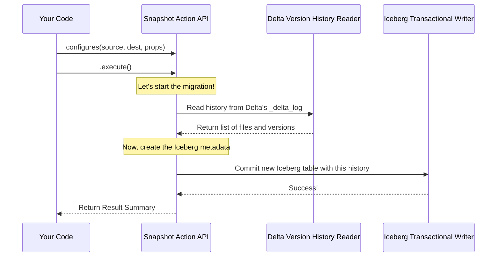

# Chapter 2: Snapshot Action API

In [Chapter 1: Spark Integration and Testing](01_spark_integration_and_testing_.md), we saw a complete, high-level view of a migration, like watching a professional moving company work from across the street. We saw them arrive, load everything up, and leave.

Now, let's step inside and become the customer who hires them. How do we give them instructions? How do we tell them where our old house is, where the new one is, and whether to handle any boxes with special care? This is the job of the **Snapshot Action API**. It's the command center for the entire migration process.

### The Problem: Giving Clear Instructions for a Migration

Imagine you want to migrate a Delta table. You need to specify a few key things:
*   **Source:** Where are the files for your existing Delta Lake table?
*   **Destination:** What will you name your new Iceberg table, and where will it be registered?
*   **Customization:** Do you want to add any special metadata or properties to the new Iceberg table?

The Snapshot Action API provides a clean and simple way to package all of these instructions together before you press the "go" button.

### Meet the Builder: Configuring Your Migration Step-by-Step

The `SnapshotDeltaLakeTable` action uses a popular design pattern called the "builder" pattern. Think of it like ordering a custom sandwich. You don't say everything at once. You tell the sandwich artist what you want step-by-step: "I'll start with sourdough bread... add turkey... some provolone cheese... and a little mustard." Each instruction builds on the last one.

The Snapshot Action works the same way. You start with the most basic information and then chain on additional configuration details. Let's look at the "ingredients" you can add.

#### Step 1: Where is the Delta Table?

First, you need to tell the action where your original Delta table lives. This is the starting point for every migration.

```java
// Get a provider for our migration actions
DeltaLakeToIcebergMigrationActionsProvider actions =
  DeltaLakeToIcebergMigrationActionsProvider.defaultActions();

// Start building the action by specifying the source Delta table's location
actions.snapshotDeltaLakeTable("s3://my-bucket/path/to/delta/table");
```
This line creates a new "snapshot" instruction and tells it the location of the source Delta table data.

#### Step 2: What is the New Iceberg Table's Name?

Next, you need to give your new Iceberg table a name. This is its official identifier in the Iceberg catalog.

```java
// An Iceberg table identifier has two parts: a namespace and a name
TableIdentifier newIcebergTableName = TableIdentifier.of("my_db", "new_table");

// Chain the `.as()` method to set the destination name
actions.snapshotDeltaLakeTable(...)
    .as(newIcebergTableName);
```
Here, we're telling the action, "The new Iceberg table should be named `new_table` inside the `my_db` database." This is a required step!

#### Step 3: Which Catalog Should We Use?

An Iceberg "catalog" is like an address book for your tables. You need to tell the action which catalog to register the new table in. In the previous chapter, we saw how to configure a Hive-based catalog in Spark.

```java
// Get the catalog object from your environment (e.g., Spark)
Catalog icebergCatalog = ... ; // Your catalog instance

// Chain the `.icebergCatalog()` method to specify the catalog
actions.snapshotDeltaLakeTable(...)
    .as(...)
    .icebergCatalog(icebergCatalog);
```
This is also a required step. The action needs to know where to create the new table's entry.

#### Step 4: Add Special Instructions (Optional Properties)

What if you want to add some extra information to your new Iceberg table? For example, you might want to add a comment or set a custom property that your team uses.

```java
// Chain the `.tableProperty()` method for special instructions
actions.snapshotDeltaLakeTable(...)
    .as(...)
    .icebergCatalog(...)
    .tableProperty("comment", "Migrated from Delta on 2023-10-26")
    .tableProperty("owner", "data-engineering-team");
```
You can chain as many of these as you like. They are the "special handling" instructions for the movers.

### Putting It All Together: Executing the Action

Once you've chained together all your instructions, you have a fully configured plan. The final step is to tell the action to execute the plan.

```java
// A complete, configured action
SnapshotDeltaLakeTable action = actions
    .snapshotDeltaLakeTable("file:///tmp/delta-table")
    .as(TableIdentifier.of("default", "iceberg_table"))
    .icebergCatalog(myCatalog) // Assume myCatalog is configured
    .deltaLakeConfiguration(new Configuration()) // Hadoop config
    .tableProperty("migrated-by", "tutorial");

// Tell the action to "Go!"
SnapshotDeltaLakeTable.Result result = action.execute();
```
Calling `.execute()` kicks off the migration. When it's finished, it returns a `Result` object.

This `result` object gives you a summary of what happened. For example, you can find out how many data files were successfully included in the new Iceberg table.

```java
// Check the summary report
System.out.println(
  "Successfully migrated " + result.snapshotDataFilesCount() + " data files."
);
```

### Under the Hood: From Instructions to Action

So what actually happens when you call `.execute()`? Your configured `SnapshotDeltaLakeTable` action acts as a project manager, coordinating with other specialized components to get the job done.

Here’s a simplified look at the workflow:



1.  **You call `execute()`**: This is the trigger.
2.  **The Action Coordinates**: The `SnapshotAction` you built is now in charge.
3.  **Read Delta History**: The action first calls the [Delta Version History Reader](04_delta_version_history_reader_.md). This component's only job is to read the `_delta_log` directory of your source table and create a full list of all data files and table versions.
4.  **Write Iceberg Metadata**: Once it has the complete history, the action passes that information to the [Iceberg Transactional Writer](06_iceberg_transactional_writer_.md). This writer creates the new Iceberg table metadata, including a new snapshot for every version of the Delta table. Crucially, it points to the *exact same data files*, so no data is copied.
5.  **Return the Result**: After the writer successfully commits the new table to the catalog, the action creates the `Result` summary and returns it to your code.

The action itself is defined in the `SnapshotDeltaLakeTable.java` interface. It's a formal contract that lists all the configuration methods we just discussed.

```java
// From: src/main/java/org/apache/iceberg/delta/SnapshotDeltaLakeTable.java

public interface SnapshotDeltaLakeTable
    extends Action<SnapshotDeltaLakeTable, SnapshotDeltaLakeTable.Result> {

  // Sets the identifier of the newly created Iceberg table.
  SnapshotDeltaLakeTable as(TableIdentifier identifier);

  // Sets a table property in the newly created Iceberg table.
  SnapshotDeltaLakeTable tableProperty(String name, String value);

  // ... other configuration methods ...
}
```
This interface is the public-facing "control panel" that you interact with. The actual logic for reading logs and writing metadata is delegated to other components, keeping the API clean and focused.

### Conclusion

You've now learned about the core command center of the migration tool: the **Snapshot Action API**. You've seen how its builder-style interface allows you to create a clear, step-by-step plan for your migration.

You know how to:
*   Specify the source Delta table location.
*   Define the new Iceberg table's name and catalog.
*   Add custom properties for special handling.
*   Execute the action and review the summary.

You also have a mental model of how the action coordinates with other components behind the scenes to perform the migration without moving any data.

But how does the action actually execute this plan? What is the engine that drives the process after you call `execute()`? Let's find out in the next chapter.

Next up: [Chapter 3: Migration Execution Engine](03_migration_execution_engine_.md).

---

Generated by [AI Codebase Knowledge Builder](https://github.com/The-Pocket/Tutorial-Codebase-Knowledge)