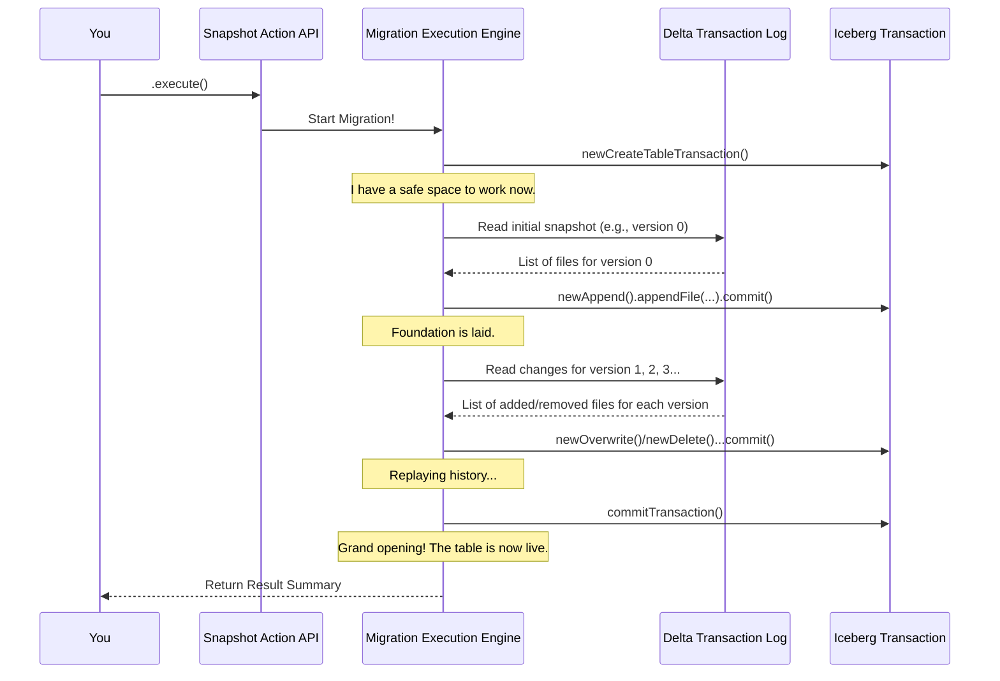

# Chapter 3: Migration Execution Engine

In [Chapter 2: Snapshot Action API](02_snapshot_action_api_.md), you played the role of a customer hiring a moving company. You used the `SnapshotDeltaLakeTable` action to create a detailed "work order," specifying exactly which Delta table to migrate and what to name the new Iceberg table.

Now, let's go behind the scenes and meet the project manager who takes that work order and makes it happen. This is the **Migration Execution Engine**. It's the engine room of our migration tool, where the instructions you provide are turned into a real, fully-functional Iceberg table.

### The Problem: From a Plan to a Finished Product

Having a plan is great, but a plan doesn't move furniture by itself. You need an engine to do the actual work. In our case, the "work" is a complex process:
*   Read the original Delta table's entire history.
*   Understand every change—every file added, every file removed.
*   Create a brand new Iceberg table that mirrors this history exactly.
*   Do all of this **safely**, so that if anything goes wrong halfway through, you aren't left with a broken, half-finished table.

The Migration Execution Engine is the component responsible for orchestrating this entire process from start to finish. It's the code that runs when you call `.execute()`.

### The Project Manager's Workflow

Think of the execution engine as a very meticulous project manager building a new house based on the blueprints of an old one. It doesn't just copy the final house; it reconstructs its entire history to ensure everything is perfect.

Here’s a high-level look at the steps the engine takes when you call `.execute()`:

1.  **Check the Paperwork**: It first validates all the instructions you gave it. Does the Delta table actually exist at the location you provided? Is the Iceberg catalog properly configured? This prevents starting a job that's doomed to fail.
2.  **Start a "Safe Zone"**: It creates an **Iceberg Transaction**. This is like putting up construction tape around the new building site. No changes will be visible to the outside world until the entire job is complete. This guarantees the migration is an "all-or-nothing" operation.
3.  **Find the Foundation**: It finds the oldest available version of the Delta table to use as a starting point. It reads all the data files from this initial version.
4.  **Lay the Foundation**: It commits this first set of files to the Iceberg transaction, creating the very first snapshot of the new table.
5.  **Replay History, Brick by Brick**: It then reads every subsequent change from the Delta transaction log (`_delta_log`). For each version, it asks, "What happened here? Were files added? Were files removed?" It then "replays" that exact change in the Iceberg transaction, creating a new snapshot for each step.
6.  **The Grand Opening**: Once every single version from the Delta table's history has been replayed, the engine commits the Iceberg transaction. The construction tape comes down, and the brand new, fully-migrated Iceberg table becomes visible in your catalog.

This process is orchestrated within a single class: `BaseSnapshotDeltaLakeTableAction.java`. While the "Action" is what you configure, this class also contains the `execute()` method, which is our engine.



### A Look Under the Hood: The `execute()` Method

Let's peek inside `BaseSnapshotDeltaLakeTableAction.java` to see how this workflow is implemented in code. We'll simplify it to focus on the key steps.

#### Step 1: Initialization and Starting the Transaction

The `execute()` method begins by checking your configuration and then immediately starting an Iceberg transaction.

```java
// From: BaseSnapshotDeltaLakeTableAction.java
@Override
public SnapshotDeltaLakeTable.Result execute() {
    // 1. Check that the catalog and table name were provided.
    Preconditions.checkArgument(icebergCatalog != null && newTableIdentifier != null, "...");

    // 2. Start a "create table" transaction. This is our safe zone.
    Transaction icebergTransaction = icebergCatalog.newCreateTableTransaction(...);

    // ... more work happens here ...

    // Finally, commit everything.
    icebergTransaction.commitTransaction();

    return ... // Return a summary report
}
```
This `icebergTransaction` object holds all our pending changes. If the program crashes before `commitTransaction()` is called, no Iceberg table will be created. This is our safety net. We'll learn more about this in [Chapter 6: Iceberg Transactional Writer](06_iceberg_transactional_writer_.md).

#### Step 2: Committing the First Version

Next, the engine needs a starting point. It finds the earliest available version of the Delta table and commits all of its files.

```java
// From: BaseSnapshotDeltaLakeTableAction.java's execute() method
// ... after starting the transaction
long startVersion =
    commitInitialDeltaSnapshotToIcebergTransaction(
        updatedSnapshot.getVersion(), icebergTransaction, ...);
```

This helper method, `commitInitialDeltaSnapshotToIcebergTransaction`, does the important work of reading the Delta table's state. Its job is handled by the component we will discuss in the [Delta Version History Reader](04_delta_version_history_reader_.md) chapter. It translates the Delta files into Iceberg `DataFile` objects and appends them to our transaction.

#### Step 3: Looping Through History

With the foundation in place, the engine iterates through the rest of the Delta table's history, one version at a time.

```java
// From: BaseSnapshotDeltaLakeTableAction.java's execute() method
// Get an iterator for all changes after our starting version
Iterator<VersionLog> versionLogIterator =
    deltaLog.getChanges(startVersion + 1, ...);

// Loop over each version
while (versionLogIterator.hasNext()) {
    VersionLog versionLog = versionLogIterator.next();
    // Replay this specific version's changes in our Iceberg transaction
    commitDeltaVersionLogToIcebergTransaction(versionLog, icebergTransaction, ...);
}
```
For each `versionLog` (which represents one commit to the Delta table), it calls another helper method to apply the changes.

#### Step 4: Applying Each Change

The `commitDeltaVersionLogToIcebergTransaction` method is the heart of the history replay. It looks at the actions in a single Delta commit (`AddFile` or `RemoveFile`) and translates them to the correct Iceberg operation.

```java
// From: commitDeltaVersionLogToIcebergTransaction(...)
// ... simplified logic ...

if (!filesToAdd.isEmpty() && !filesToRemove.isEmpty()) {
    // This was an UPDATE or MERGE in Delta
    OverwriteFiles overwriteFiles = transaction.newOverwrite();
    filesToAdd.forEach(overwriteFiles::addFile);
    filesToRemove.forEach(overwriteFiles::deleteFile);
    overwriteFiles.commit();
} else if (!filesToAdd.isEmpty()) {
    // This was a simple INSERT in Delta
    AppendFiles appendFiles = transaction.newAppend();
    filesToAdd.forEach(appendFiles::appendFile);
    appendFiles.commit();
}
```
Every time `.commit()` is called on an operation like `AppendFiles` or `OverwriteFiles`, it doesn't make the change public. It just adds a new snapshot to our private `icebergTransaction`, waiting for the final green light.

### Conclusion

You've now seen the powerful engine that drives the migration. The **Migration Execution Engine** is the orchestrator that takes your simple instructions from the [Snapshot Action API](02_snapshot_action_api_.md) and executes a complex but safe workflow.

You learned that it:
*   Acts like a project manager, following a precise set of steps.
*   Uses an **Iceberg Transaction** to guarantee the migration is an "all-or-nothing" operation.
*   Works by first establishing a baseline from an initial Delta snapshot.
*   Then meticulously replays the entire history of the Delta table, version by version.
*   Finally commits all the work at once, making the new Iceberg table appear.

We've mentioned several times that the engine needs to "read the Delta transaction log." But how does it actually do that? How does it understand the files and structure of the `_delta_log` directory? That is the job of our next component.

Let's dive deeper into the first step of the process in [Chapter 4: Delta Version History Reader](04_delta_version_history_reader_.md).

---

Generated by [AI Codebase Knowledge Builder](https://github.com/The-Pocket/Tutorial-Codebase-Knowledge)