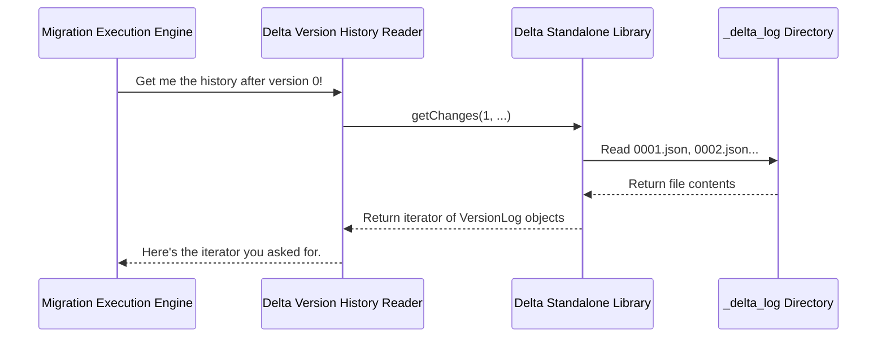

# Chapter 4: Delta Version History Reader

In the [previous chapter on the Migration Execution Engine](03_migration_execution_engine_.md), we learned that the migration process works by "replaying" the entire history of a Delta Lake table. But how does our tool read that history in the first place? How can it possibly know every single file that was added or removed since the table was created?

This is the job of the **Delta Version History Reader**. Think of it as the project's official historian or archaeologist. Its one and only task is to explore the source Delta table's records, decipher them, and report back exactly what happened at every stage of its life.

### The Problem: Reconstructing the Past

Imagine you have a video game save file that doesn't just store your final position, but every single move you made from the very beginning. To perfectly replicate your gameplay, someone would need to read that history file and follow every step you took.

A Delta Lake table works in a very similar way. It doesn't just know its current state; it keeps a detailed log of every transaction. Our problem is: how do we read this log and turn it into a step-by-step list of changes that the [Migration Execution Engine](03_migration_execution_engine_.md) can understand?

### The Source of Truth: The `_delta_log` Directory

Every Delta Lake table has a special subdirectory named `_delta_log`. This directory is the table's "history book." It contains a series of files that, together, describe every version of the table.

Let's look at what's inside:
*   `00000000000000000000.json`: The very first transaction. It defines the initial schema and lists the first data files.
*   `00000000000000000001.json`: The second transaction. It might describe new files that were added.
*   `00000000000000000002.json`: The third transaction. It might describe some files being removed and new ones being added (an `UPDATE`).
*   `...` and so on.

Each JSON file contains "actions." For our migration, we care about two main types:
*   `add`: An `AddFile` action, which says "this new data file is now part of the table."
*   `remove`: A `RemoveFile` action, which says "this old data file is no longer part of the table."

By reading these JSON files in order, we can perfectly reconstruct the state of the table at any version.

### Our Historian: The Delta Standalone Library

Reading and parsing all these JSON files, and occasionally large "checkpoint" files that summarize history, would be complicated. Thankfully, we don't have to do it ourselves. We use a specialized tool called the **Delta Standalone library**.

This library is our expert historian. We simply point it at the `_delta_log` directory, and it gives us easy-to-use tools to ask questions about the table's history. We don't need to know the fine details of the file formats; we can just ask, "What changed in version 5?"

### How We Use the History Reader

The migration engine uses the Delta Standalone library to get an iterator that walks through the table's history, one version at a time.

Let's look at a simplified example of how the engine gets this history.

```java
// 1. Point the Delta Standalone library to the table's location
// This gives us a "DeltaLog" object to interact with.
DeltaLog deltaLog = DeltaLog.forTable(conf, "s3://my-bucket/delta-table");

// 2. Ask for an iterator of all changes starting after version 0
Iterator<VersionLog> versionLogIterator = deltaLog.getChanges(1, ...);
```

This code snippet is the heart of the reader's function.
1.  `DeltaLog.forTable(...)` "opens" the history book for our Delta table.
2.  `deltaLog.getChanges(...)` gives us an iterator that will return each version's changes, one by one. A `VersionLog` is simply an object representing one of those JSON commit files.

Once the engine has this iterator, it can loop through it to get the details for each version.

```java
// 3. Loop through each version's log
while (versionLogIterator.hasNext()) {
    VersionLog versionLog = versionLogIterator.next();

    // 4. Get the list of actions (AddFile, RemoveFile) for this version
    List<Action> actions = versionLog.getActions();

    // Now, the engine can inspect the actions to see what happened.
}
```

For each `versionLog`, the engine can check the list of `actions` to find all the `AddFile` and `RemoveFile` records. This gives it the exact list of files to add and remove to perfectly mirror the Delta transaction in Iceberg.

### Under the Hood: From Files to Actions

When the [Migration Execution Engine](03_migration_execution_engine_.md) asks for the history, the Delta Version History Reader (using the Delta Standalone library) performs a few steps to deliver it.



1.  **The Engine Asks:** The engine needs to replay history, so it asks the reader for it.
2.  **The Reader Delegates:** Our code doesn't parse the files itself. It delegates the hard work to the `delta-standalone` library.
3.  **The Library Reads the Log:** The library knows how to find and read the correct JSON and checkpoint files from the `_delta_log` directory on the file system.
4.  **The Library Translates:** It parses the raw text from the files into structured Java objects (`VersionLog`, `AddFile`, `RemoveFile`) that are easy to work with.
5.  **The Engine Receives:** The engine gets a clean, simple iterator that it can use to replay history, without ever needing to know about the JSON file details.

Let's look at the actual code in `BaseSnapshotDeltaLakeTableAction.java` that does this.

First, it establishes a starting point by reading the *initial* state of the table.

```java
// From: commitInitialDeltaSnapshotToIcebergTransaction(...)
// Get the state of the table at a specific starting version
List<AddFile> initDataFiles =
    deltaLog.getSnapshotForVersionAsOf(startVersion).getAllFiles();
```
This gets a list of all active data files for the first version we are migrating.

Then, it gets the iterator for all *subsequent* changes.

```java
// From: execute() in BaseSnapshotDeltaLakeTableAction.java
// Get an iterator for all changes AFTER our starting version
Iterator<VersionLog> versionLogIterator =
    deltaLog.getChanges(constructableStartVersion + 1, ...);
```

This is the exact call that kicks off the process in the diagram above. The engine then uses this iterator to feed the information to the [Iceberg Transactional Writer](06_iceberg_transactional_writer_.md), which creates a corresponding Iceberg snapshot for each Delta version.

### Conclusion

You've now met the historian of our project: the **Delta Version History Reader**. It is a specialized component that has one critical responsibility: to read the `_delta_log` and provide a clear, step-by-step history of all data changes.

You learned that:
*   The entire history of a Delta table is stored in its `_delta_log` directory.
*   We use the **Delta Standalone library** as our expert "historian" to read this log for us.
*   The reader provides the migration engine with a simple iterator of `VersionLog` objects.
*   Each `VersionLog` contains `AddFile` and `RemoveFile` actions, which are the raw ingredients needed to perfectly replay the table's history.

The historian doesn't just tell us about data files; it also tells us about the table's schema (the column names and data types). But what if Delta's data types don't perfectly match Iceberg's? We need a translator.

Next up, we'll see how we handle that challenge in [Chapter 5: Schema and Type Translator](05_schema_and_type_translator_.md).

---

Generated by [AI Codebase Knowledge Builder](https://github.com/The-Pocket/Tutorial-Codebase-Knowledge)