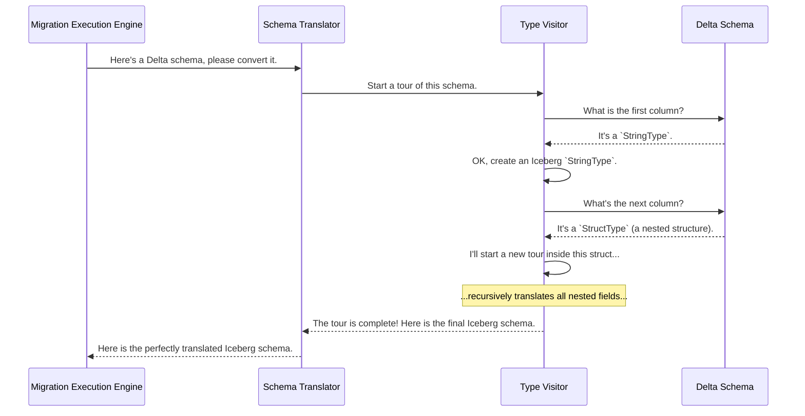

# Chapter 5: Schema and Type Translator

In [Chapter 4: Delta Version History Reader](04_delta_version_history_reader_.md), we met the project's historian, which meticulously reads the `_delta_log` to understand a table's history. That history includes two key things: the list of data files in each version, and the table's **schema**—its structure of columns and data types.

But there's a small challenge. Delta Lake and Apache Iceberg are different systems, built by different teams. They each have their own way of describing a table's blueprint. How do we ensure that a table's structure is perfectly preserved during migration? We need a translator.

### The Problem: Speaking Two Different Languages

Imagine you have an architectural blueprint written using the metric system (meters, centimeters). You need to give it to a construction crew that only understands the imperial system (feet, inches). You can't just hand them the blueprint; they won't be able to build the house correctly. You need a translator to convert every measurement precisely.

This is exactly the problem our **Schema and Type Translator** solves.
*   **Delta Lake's "language"**: Describes a table schema using its own set of types, like `StringType`, `ArrayType`, and `StructType`.
*   **Iceberg's "language"**: Describes schemas using its own corresponding types, like `Types.StringType`, `Types.ListType`, and `Types.StructType`.

The Schema and Type Translator is our universal translator. Its job is to read a schema in Delta's language and produce an identical, perfectly converted schema in Iceberg's language.

### How it Works: A Guided Tour of the Schema

To translate the schema, we can't just look at it from a distance. We need to examine every single part of it, piece by piece. To do this, the translator uses a clever technique called the **Visitor Pattern**.

Think of the visitor as a professional tour guide for our schema. The schema is like a big, complex museum with many rooms (structs), hallways (arrays), and exhibits (individual columns). The tour guide's job is to visit every single item in the museum in a specific order and "translate" its description for us.

The tour goes like this:
1.  The tour starts at the main entrance (the top-level schema).
2.  It looks at the first column. If it's a simple type like `string`, it translates it directly.
3.  If it encounters a complex type like a `struct` (a column containing other columns), the tour guide says, "Okay, let's go inside this room and translate everything in here first," and recursively starts a sub-tour.
4.  Once the sub-tour is complete, the guide comes back out and continues the main tour.

This systematic process ensures that every single field, no matter how deeply nested, is visited and translated correctly.

### Under the Hood: The Translation Process

When the [Migration Execution Engine](03_migration_execution_engine_.md) starts a migration, one of its first steps is to get the Delta table's schema from the [Delta Version History Reader](04_delta_version_history_reader_.md). It then hands this schema to our translator.



This entire process is handled by two main Java classes:
*   `DeltaLakeDataTypeVisitor.java`: This is the "tour guide" logic. It defines the path of the tour—how to navigate structs, arrays, and maps.
*   `DeltaLakeTypeToType.java`: This is the "translator" who goes on the tour. It contains the specific rules for converting each Delta type into its Iceberg equivalent.

Let's look at how the visitor directs the tour.

--- File: `src/main/java/org/apache/iceberg/delta/DeltaLakeDataTypeVisitor.java` ---

```java
// This is the main "visit" method that starts the tour.
public static <T> T visit(DataType type, DeltaLakeDataTypeVisitor<T> visitor) {
    if (type instanceof StructType) {
        // If it's a struct, visit all its fields first...
        // ... then call the visitor's struct() method.
        return visitor.struct((StructType) type, fieldResults);

    } else if (type instanceof ArrayType) {
        // If it's an array, visit its element type first...
        return visitor.array((ArrayType) type, ...);

    } else {
        // If it's a simple type (string, int), just visit it.
        return visitor.atomic(type);
    }
}
```
This code acts like a traffic cop. It looks at the type of the current schema part and tells the visitor (our translator) which specialized method to use.

Now, let's see how our translator, `DeltaLakeTypeToType`, handles these instructions.

#### Translating Simple Types

When the visitor encounters a simple, or "atomic," type, the translation is straightforward.

--- File: `src/main/java/org/apache/iceberg/delta/DeltaLakeTypeToType.java` ---

```java
@Override
public Type atomic(DataType atomic) {
    if (atomic instanceof StringType) {
        return Types.StringType.get(); // Delta String -> Iceberg String
    } else if (atomic instanceof IntegerType) {
        return Types.IntegerType.get(); // Delta Integer -> Iceberg Integer
    } else if (atomic instanceof DateType) {
        return Types.DateType.get(); // Delta Date -> Iceberg Date
    }
    // ... and so on for all other simple types
}
```
This is the simplest part of the translation. It's a direct, one-to-one mapping from a Delta type to an Iceberg type.

#### Assembling Complex Types

When the visitor is done touring a `struct`, it comes back with a list of all the translated fields. The `struct` method then assembles them into a final Iceberg struct.

--- File: `src/main/java/org/apache/iceberg/delta/DeltaLakeTypeToType.java` ---

```java
@Override
public Type struct(StructType struct, List<Type> types) {
    // This method receives the original Delta struct and a list of
    // already-translated Iceberg types for its fields.

    List<Types.NestedField> newFields = Lists.newArrayList();
    for (int i = 0; i < fields.length; i += 1) {
        // For each field, create a new Iceberg field with a unique ID.
        newFields.add(Types.NestedField.optional(id, field.getName(), type, ...));
    }

    return Types.StructType.of(newFields);
}
```
This method rebuilds the structure in the "Iceberg language." A critical step here is assigning a **unique ID** to every field. This is a core requirement of Iceberg schemas that helps with schema evolution (like renaming or dropping columns) later on. Our translator handles this automatically.

### Conclusion

You've just learned about the project's expert linguist: the **Schema and Type Translator**. It plays a small but absolutely critical role in ensuring that the new Iceberg table is a perfect structural clone of the original Delta table.

You learned that:
*   Delta Lake and Iceberg have their own ways of defining table schemas.
*   The translator uses a **Visitor Pattern** to systematically "tour" the entire Delta schema.
*   It translates simple types (like `string` and `integer`) directly.
*   It recursively translates complex types (like `struct`) and rebuilds them in the Iceberg format, assigning the required unique IDs along the way.

Now that we have a translated Iceberg schema and the complete list of data files from every version, we have all the ingredients we need. The final step is to take these ingredients and use them to construct the actual Iceberg table metadata. How is that done safely and transactionally?

Let's find out in the final chapter of our tour: [Chapter 6: Iceberg Transactional Writer](06_iceberg_transactional_writer_.md).

---

Generated by [AI Codebase Knowledge Builder](https://github.com/The-Pocket/Tutorial-Codebase-Knowledge)