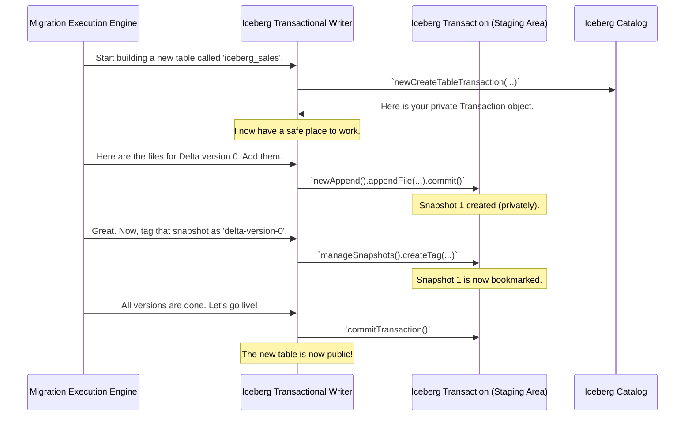

# Chapter 6: Iceberg Transactional Writer

We've reached the final chapter in our journey through the Delta Lake to Iceberg migration tool! In [Chapter 5: Schema and Type Translator](05_schema_and_type_translator_.md), we saw how the tool creates a perfect, translated blueprint (the schema) for our new Iceberg table. The [Delta Version History Reader](04_delta_version_history_reader_.md) gave us the complete list of data files for every version.

We now have all the ingredients. We have the blueprint and all the building materials. The final step is to actually construct the new Iceberg table. This is the job of the **Iceberg Transactional Writer**. Think of it as the master builder who takes all the prepared materials and assembles the final product safely and precisely.

### The Problem: Building a House Without Risk

Imagine you're building a house. What if a major storm hits when you only have three walls up? You're left with a useless, ruined structure. The work and materials are wasted. When building something complex, you want the process to be "all or nothing." You either end up with a complete, perfect house, or you end up with all your materials still safely packed away, as if you never started.

This is the exact problem the Iceberg Transactional Writer solves for our migration. A migration can take time, especially for tables with a long history. If the process crashes halfway through, we absolutely cannot leave behind a corrupted, half-migrated table. The writer ensures the entire process—from creating the table to adding every single historical version—is **atomic**. It either succeeds completely, or it fails cleanly, leaving no trace.

### The Secret Weapon: Iceberg Transactions

The writer achieves this safety using a core feature of Apache Iceberg: **Transactions**. An Iceberg transaction is like creating a private, temporary "staging area." Our master builder can do all their work in this area:
*   Lay the foundation (create the table metadata).
*   Add the first set of files.
*   Add the next set, and the next...

No one in the outside world can see this work-in-progress. The table doesn't appear in any queries. It's invisible. Only when the builder is 100% finished with every single step do they "commit" the transaction. In a single, instant operation, the entire finished product becomes public and visible.

If anything goes wrong before that final commit—the server crashes, an error occurs—the entire staging area is simply discarded. It's like the work never happened. This gives us our "all-or-nothing" guarantee.

### Under the Hood: The Construction Process

The [Migration Execution Engine](03_migration_execution_engine_.md) directs the writer's work. It doesn't just ask the writer to build the final version of the table; it instructs it to rebuild the *entire history*.

Here's a step-by-step look at how the writer constructs the new table inside its transactional safe zone.



This process is handled within the `BaseSnapshotDeltaLakeTableAction.java` class, which acts as both the engine and the director for the writer.

#### Step 1: Starting the Transaction

The very first step in the `execute()` method is to create the transaction. This opens our "safe zone".

```java
// From: BaseSnapshotDeltaLakeTableAction.java
// Ask the Iceberg Catalog for a new "create table" transaction.
Transaction icebergTransaction =
    icebergCatalog.newCreateTableTransaction(
        newTableIdentifier,
        schema,
        partitionSpec,
        newTableLocation,
        tableProperties);
```
From this point on, all work will be done using the `icebergTransaction` object. Nothing will be visible to other users until we're finished.

#### Step 2: Adding Data and Creating Snapshots

As the engine reads each version from the Delta log, it tells the writer what changes to make. For a simple `INSERT` in Delta, the writer performs an `AppendFiles` operation in Iceberg.

```java
// From: commitDeltaVersionLogToIcebergTransaction(...) in BaseSnapshotDeltaLakeTableAction.java
// Create a new "append" operation within our transaction.
AppendFiles appendFiles = transaction.newAppend();
filesToAdd.forEach(appendFiles::appendFile);

// Commit the append. This creates a new Iceberg snapshot,
// but it's still private to our transaction.
appendFiles.commit();
```
Each time `.commit()` is called on an operation like `AppendFiles` or `OverwriteFiles`, a new snapshot is added to our chain of history inside the transaction.

#### Step 3: Creating the Audit Trail with Tags

After committing a snapshot that corresponds to a Delta version, the writer adds a "tag". A tag is a permanent, human-readable bookmark in Iceberg's history. This creates a crystal-clear audit trail.

```java
// From: tagCurrentSnapshot(...) in BaseSnapshotDeltaLakeTableAction.java
private void tagCurrentSnapshot(long deltaVersion, Transaction transaction) {
    long currentSnapshotId = transaction.table().currentSnapshot().snapshotId();
    ManageSnapshots manageSnapshots = transaction.manageSnapshots();

    // Create a tag like "delta-version-42" pointing to the new snapshot.
    manageSnapshots.createTag(DELTA_VERSION_TAG_PREFIX + deltaVersion, currentSnapshotId);
    manageSnapshots.commit();
}
```
If you later inspect the Iceberg table's history, you can see exactly which snapshot corresponds to `delta-version-0`, `delta-version-1`, and so on.

#### Step 4: The Final Commit

After the engine has looped through the entire Delta history and every version has been replayed as a new snapshot in our transaction, the final and most important step occurs.

```java
// From: execute() in BaseSnapshotDeltaLakeTableAction.java
// All the work is done. Make it public!
icebergTransaction.commitTransaction();
```
This is the moment of truth. The `commitTransaction()` call atomically publishes all the work we've done—the table creation, all snapshots, and all tags. The new Iceberg table instantly appears in the catalog, complete and ready to be queried.

### Conclusion

Congratulations! You have completed the tour of the Delta Lake to Iceberg migration tool. You've now met the master builder: the **Iceberg Transactional Writer**. This component is the final actor in the migration, responsible for safely and reliably constructing the new Iceberg table.

You've learned that it:
*   Uses **Iceberg Transactions** to guarantee the migration is an "all-or-nothing" atomic operation.
*   Builds the new table in a private "staging area," invisible to the outside world until the work is complete.
*   Faithfully replays the entire history of the Delta table, creating a new Iceberg snapshot for every Delta version.
*   Creates **Tags** to build a clear audit trail, linking each new Iceberg snapshot back to its original Delta version.

Over the last six chapters, we've gone from a 30,000-foot view with the [Spark Integration and Testing](01_spark_integration_and_testing_.md) down to the nitty-gritty of how metadata is written. You've seen how each specialized component—the reader, the translator, and the writer—plays a critical role in making a complex migration simple, safe, and reliable. You are now equipped with the knowledge to understand, use, and even contribute to this powerful tool.

---

Generated by [AI Codebase Knowledge Builder](https://github.com/The-Pocket/Tutorial-Codebase-Knowledge)