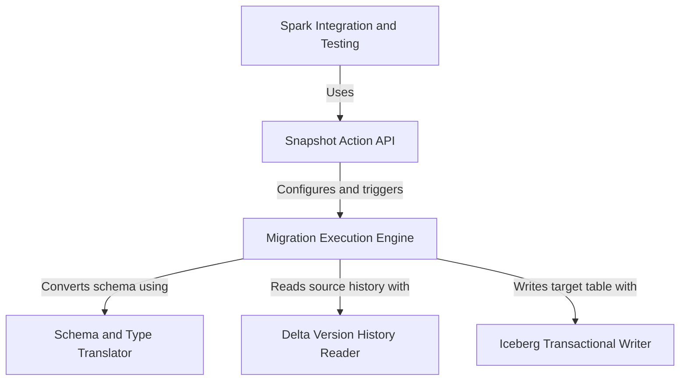

# Tutorial: delta-lake

This project provides a tool to **migrate** a *Delta Lake* table into an *Apache Iceberg* table.
It works by taking a "snapshot" of the entire Delta table, including its full version history, and recreating it as a new Iceberg table. The entire process is **transactional**, ensuring the migration either succeeds completely or fails without leaving a partially created table. This allows users to safely and reliably convert their data from one modern table format to another.

**Source Repository:** [None](None)

## Chapters

1. [Spark Integration and Testing
](01_spark_integration_and_testing_.md)
2. [Snapshot Action API
](02_snapshot_action_api_.md)
3. [Migration Execution Engine
](03_migration_execution_engine_.md)
4. [Delta Version History Reader
](04_delta_version_history_reader_.md)
5. [Schema and Type Translator
](05_schema_and_type_translator_.md)
6. [Iceberg Transactional Writer
](06_iceberg_transactional_writer_.md)

---

Generated by [AI Codebase Knowledge Builder](https://github.com/The-Pocket/Tutorial-Codebase-Knowledge)