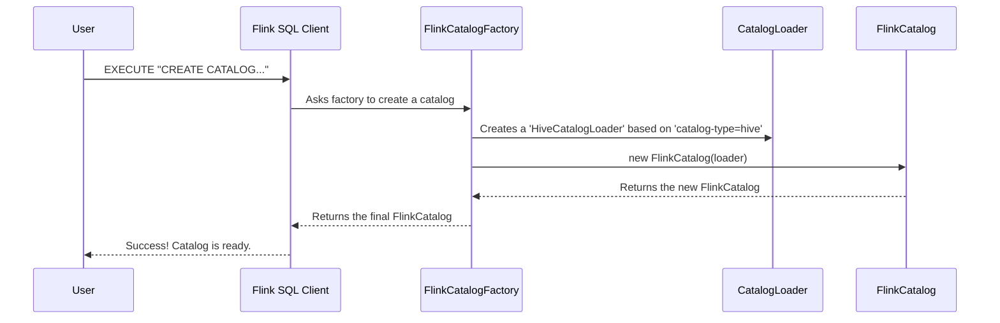

# Chapter 1: FlinkCatalog

Welcome to your first step in using Apache Iceberg with Apache Flink! Before we can read or write any data, we first need to teach Flink how to find our Iceberg tables. This is where `FlinkCatalog` comes in.

## What's the Big Idea?

Imagine you're in a library (that's Flink) and you want to borrow a book from a different, specialized library across town (that's your Iceberg data warehouse). You can't just walk over to Flink's shelves and expect to find the book. You need a special librarian who knows how to connect to the other library, look up its catalog, and make those books available to you.

**`FlinkCatalog` is that special librarian.**

It's the bridge that connects Flink to your existing Iceberg catalog, such as a Hive Metastore or a simple directory on a file system. Once this bridge is built, you can use standard Flink SQL commands like `SHOW TABLES` or `SELECT * FROM ...` to interact with your Iceberg tables as if they were native Flink tables.

Our goal in this chapter is simple: **Register an existing Iceberg catalog in Flink so we can see our tables.**

## Using the FlinkCatalog

Let's say you already have some Iceberg tables managed by a Hive Metastore. To make these tables visible in Flink, you just need to run one SQL command in the Flink SQL Client.

This command tells Flink: "Hey, create a new catalog connection for me named `my_iceberg_catalog`. It's an `iceberg` type catalog, and you can find it by talking to the Hive Metastore at `thrift://metastore-host:9083`."

```sql
-- In your Flink SQL Client
CREATE CATALOG my_iceberg_catalog WITH (
  'type'         = 'iceberg',
  'catalog-type' = 'hive',
  'uri'          = 'thrift://metastore-host:9083',
  'warehouse'    = 's3://my-bucket/my-warehouse'
);
```

After running this, you can immediately start using it:

```sql
-- Switch to our newly created catalog
USE CATALOG my_iceberg_catalog;

-- See all the tables inside!
SHOW TABLES;
```

**What Happens?**

Flink will connect to your Hive Metastore and list all the Iceberg tables it finds in the `my-warehouse` directory. You've successfully built the bridge! Now you can run `DESCRIBE my_table;` or even simple `SELECT` queries.

## How It Works: A Look Under the Hood

That `CREATE CATALOG` command seems simple, but it kicks off a neat process behind the scenes. Let's trace what happens.

The key players are:
*   **Flink SQL Client**: Where you execute the command.
*   `FlinkCatalogFactory`: A "factory" that knows how to build things when it sees `'type' = 'iceberg'`.
*   `CatalogLoader`: A small, portable helper that knows the specific details for connecting to Hive, Hadoop, etc.
*   `FlinkCatalog`: The final bridge object that Flink will use.

Here is the sequence of events:



The most important idea here is the `CatalogLoader`. It's **serializable**, which is a technical term meaning it can be neatly packaged up and sent across the network. This is crucial because your Flink job runs on many different machines (workers), and each worker needs to know how to connect to the Iceberg catalog. The `CatalogLoader` is that portable set of instructions.

### Diving into the Code

Let's look at a few simplified snippets to see how this is implemented.

**1. The Factory Decides What to Build**

When you run `CREATE CATALOG`, Flink finds the `FlinkCatalogFactory` because you specified `'type' = 'iceberg'`. The factory then looks at the `'catalog-type'` property to decide which kind of `CatalogLoader` to create.

```java
// Simplified from: flink/src/main/java/org/apache/iceberg/flink/FlinkCatalogFactory.java
static CatalogLoader createCatalogLoader(
      String name, Map<String, String> properties, Configuration hadoopConf) {
    
    String catalogType = properties.getOrDefault("catalog-type", "hive");

    switch (catalogType) {
      case "hive":
        // If it's Hive, create a Hive loader.
        return CatalogLoader.hive(name, hadoopConf, properties);

      case "hadoop":
        // If it's Hadoop, create a Hadoop loader.
        return CatalogLoader.hadoop(name, hadoopConf, properties);
      
      // ... and so on for other types
    }
}
```
This code acts like a dispatcher, choosing the right tool for the job based on your configuration.

**2. The Portable `CatalogLoader`**

The `CatalogLoader` is a simple interface with different implementations for Hive, Hadoop, etc. Its main job is to create the actual catalog connection whenever it's needed. Notice that it's `Serializable`, making it perfect for distributed systems like Flink.

```java
// Simplified from: flink/src/main/java/org/apache/iceberg/flink/CatalogLoader.java
public interface CatalogLoader extends Serializable {

  // This method does the actual work of connecting.
  Catalog loadCatalog();

  // A helper to easily create a Hive loader.
  static CatalogLoader hive(String name, Configuration conf, Map<String, String> props) {
    return new HiveCatalogLoader(name, conf, props);
  }
}
```

**3. The `FlinkCatalog` Puts It All Together**

Finally, the `FlinkCatalog` object is created. It holds onto the `CatalogLoader` and uses it to establish the connection. When you run a command like `SHOW TABLES`, the `FlinkCatalog` uses the underlying `icebergCatalog` to fulfill your request.

```java
// Simplified from: flink/src/main/java/org/apache/iceberg/flink/FlinkCatalog.java
public class FlinkCatalog extends AbstractCatalog {
  private final CatalogLoader catalogLoader;
  private final Catalog icebergCatalog;

  public FlinkCatalog(String name, ..., CatalogLoader catalogLoader, ...) {
    this.catalogLoader = catalogLoader;
    // The connection is made right here!
    this.icebergCatalog = catalogLoader.loadCatalog();
  }

  @Override
  public List<String> listTables(String databaseName) {
    // It delegates the call to the real Iceberg catalog.
    return icebergCatalog.listTables(toIdentifier(databaseName));
  }
}
```

You might also notice another helper called `TableLoader`. It works on the same principle as `CatalogLoader` but is responsible for loading a *single table's* information. When a Flink worker needs to read data from a specific table, it gets a lightweight, serializable `TableLoader` to do the job.

## Conclusion

You've just learned about the most fundamental piece of the Iceberg-Flink integration: the `FlinkCatalog`. It's the bridge that makes your Iceberg tables available within the Flink ecosystem, allowing you to use familiar SQL to see and manage them.

We've seen how a simple `CREATE CATALOG` statement kicks off a factory process that results in a `FlinkCatalog` ready to delegate commands to your real Iceberg catalog, like Hive Metastore.

Now that we can *see* our tables, how do we actually *read* data from them? In the next chapter, we'll explore just that.

Next up: [IcebergSource](02_icebergsource_.md)

---

Generated by [AI Codebase Knowledge Builder](https://github.com/The-Pocket/Tutorial-Codebase-Knowledge)