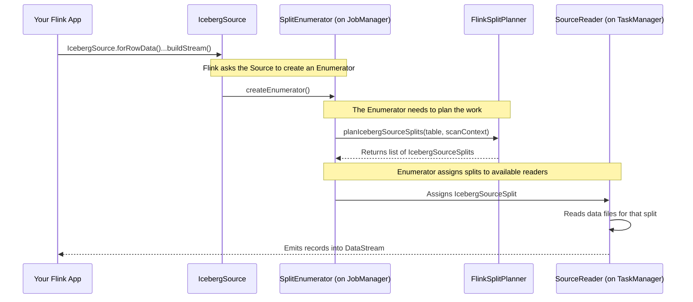

# Chapter 2: IcebergSource

In the last chapter, we used the [FlinkCatalog](01_flinkcatalog_.md) to build a bridge between Flink and our Iceberg data warehouse. Now that Flink can *see* our tables, the next logical step is to *read* data from them. How do we do that?

## What's the Big Idea?

Imagine you're the head of a research team, and you need to retrieve specific information from a massive, well-organized library (your Iceberg table). You wouldn't just send your entire team in to wander around aimlessly. Instead, you would:

1.  **Create a detailed plan:** Specify exactly which books to get (columns), which sections to search (filters), and which edition of the library to use (the snapshot).
2.  **Break the plan into small assignments:** Give each team member a specific, manageable task, like "Go to the 3rd floor, aisle B, and get the first 5 books on the top shelf."
3.  **Dispatch the team:** Send your researchers (Flink's parallel workers) to execute their assignments.

**`IcebergSource` is that research team leader.**

It's the primary tool in Flink for reading data from an Iceberg table and turning it into a `DataStream`—Flink's fundamental building block for processing data. It orchestrates the entire "expedition" to retrieve your data, whether you want to grab a snapshot of the table all at once (batch mode) or continuously read new data as it arrives (streaming mode).

Our goal in this chapter is simple: **Use `IcebergSource` to read data from an Iceberg table into a Flink job.**

## The Key Players in Our Expedition

`IcebergSource` doesn't work alone. It relies on a few key helpers:

*   **`ScanContext`**: This is your **expedition plan**. It's a simple object that holds all your query parameters: which columns you want (`projection`), which rows to filter (`filter`), and any time-travel options (`snapshot-id`, `as-of-timestamp`).
*   **`FlinkSplitPlanner`**: This is your **logistics coordinator**. It takes the `ScanContext` and the table metadata to figure out exactly which data files contain the information you need. It then breaks this work down into smaller, parallelizable chunks.
*   **`IcebergSourceSplit`**: This is a single **work assignment**. Each split tells a Flink reader exactly which data files (or parts of files) it's responsible for reading.

## Using IcebergSource for a Batch Read

Let's do something simple. We want to read the first 100 rows from our `logs` table. We'll use the `IcebergSource` builder to construct a `DataStream`.

```java
// In your Flink DataStream application
StreamExecutionEnvironment env = StreamExecutionEnvironment.getExecutionEnvironment();
TableLoader tableLoader = TableLoader.fromHadoopTable("s3://my-bucket/my-warehouse/logs");

DataStream<RowData> stream = IcebergSource.forRowData()
    .tableLoader(tableLoader)
    .limit(100L)
    .buildStream(env);

// Now you can process the stream
stream.print();

env.execute("Read Iceberg Table");
```

Let's break down this builder:
*   `IcebergSource.forRowData()`: We start building a source that will produce `RowData`, Flink's internal representation for rows.
*   `.tableLoader(...)`: We tell the source how to load the metadata for our `logs` table.
*   `.limit(100L)`: We add a parameter to our "expedition plan" (`ScanContext`) to only fetch 100 records.
*   `.buildStream(env)`: This finalizes the source and plugs it into the Flink execution environment, creating a `DataStream`.

When you run this Flink job, `IcebergSource` will plan the read, Flink will execute it in parallel, and you'll see the first 100 rows from your table printed to the console.

## How It Works: A Look Under the Hood

That simple builder pattern kicks off a sophisticated, distributed process. Let's follow the journey from your code to the data being read.

The main components are the **JobManager** (the Flink cluster's coordinator) and one or more **TaskManagers** (the workers that execute tasks).



Here's the step-by-step story:
1.  **Planning the Read**: When your Flink job starts, the `IcebergSource` creates a `SplitEnumerator`. This component lives on the JobManager and acts as "mission control."
2.  **Creating Assignments**: The enumerator's first job is to call the `FlinkSplitPlanner`. The planner looks at your table's metadata and your `ScanContext` (with the `limit=100` option) to create a list of `IcebergSourceSplit` work assignments.
3.  **Distributing Work**: The enumerator then hands these splits out to the `SourceReader` tasks running on the TaskManagers.
4.  **Executing the Read**: Each `SourceReader` receives a split, opens the data files specified in its assignment, and starts reading the records, sending them into the `DataStream`.

### Diving into the Code

Let's peek at the code that makes this happen.

**1. Building the `ScanContext`**

The `IcebergSource.Builder` is responsible for collecting all your read options and putting them into a `ScanContext`.

```java
// Simplified from: flink/src/main/java/org/apache/iceberg/flink/source/IcebergSource.java
public IcebergSource<T> build() {
    // ...
    // The builder gathers all your settings (limit, snapshot, etc.)
    // from the 'readOptions' map.
    contextBuilder.resolveConfig(table, readOptions, flinkConfig);
    ScanContext context = contextBuilder.build();
    // ...
    return new IcebergSource<>(tableLoader, context, ...);
}
```
The `ScanContext` is just a simple, serializable container for these settings, making it easy to send the "expedition plan" over the network to the planner.

**2. Planning the Splits**

The `SplitEnumerator` uses `FlinkSplitPlanner` to do the heavy lifting of figuring out which files to read.

```java
// Simplified from: flink/src/main/java/org/apache/iceberg/flink/source/FlinkSplitPlanner.java
public static List<IcebergSourceSplit> planIcebergSourceSplits(
    Table table, ScanContext context, ExecutorService workerPool) {
  
  // 1. Create a scan based on the user's plan (ScanContext)
  TableScan scan = table.newScan();
  // ... apply filters, projections, etc. from context ...

  // 2. This is the magic! Iceberg finds the data files.
  try (CloseableIterable<CombinedScanTask> tasks = scan.planTasks()) {
    
    // 3. Convert each Iceberg task into a Flink-specific split
    return Lists.newArrayList(
        CloseableIterable.transform(tasks, IcebergSourceSplit::fromCombinedScanTask));
  }
}
```
The `scan.planTasks()` method is the core of Iceberg's planning logic. It uses the table metadata to efficiently find every data file that matches your query without ever having to list files in a directory.

**3. Reading a Split**

Finally, on a worker machine, the `IcebergSourceSplitReader` gets a split and starts reading.

```java
// Simplified from: flink/src/main/java/org/apache/iceberg/flink/source/reader/IcebergSourceSplitReader.java
class IcebergSourceSplitReader<T> {
  private final Queue<IcebergSourceSplit> splits;
  private CloseableIterator<...> currentReader;

  public RecordsWithSplitIds<...> fetch() throws IOException {
    // If we don't have a split to read, get the next one from the queue.
    if (currentReader == null) {
      IcebergSourceSplit nextSplit = splits.poll();
      if (nextSplit != null) {
        // The function here knows how to open the files in the split.
        currentReader = openSplitFunction.apply(nextSplit);
      }
    }
    
    // Read and return records from the current split.
    if (currentReader.hasNext()) {
      return currentReader.next();
    }
    // ...
  }
}
```
This reader simply processes the splits it receives one by one, creating an iterator for the data files in each split and feeding the records into your Flink `DataStream`.

## What About Streaming?

The same `IcebergSource` can be used for streaming! You just need to tell it you want to stream:

```java
DataStream<RowData> stream = IcebergSource.forRowData()
    .tableLoader(tableLoader)
    .streaming(true) // The only change needed!
    .buildStream(env);
```

In streaming mode, the `SplitEnumerator` doesn't just plan once. It continuously monitors the Iceberg table for *new* snapshots (i.e., new data being committed). Each time it finds new data, it runs the `FlinkSplitPlanner` only for that new data and sends the resulting splits to the readers. This allows your Flink job to run forever, processing new records as they arrive in the table.

## Conclusion

You've now learned about the `IcebergSource`, the powerful and flexible engine for reading Iceberg data in Flink. You've seen how it uses a `ScanContext` as a query plan and a `FlinkSplitPlanner` to create `IcebergSourceSplit` assignments for Flink's parallel readers. Whether for a one-time batch job or a continuous streaming application, the `IcebergSource` provides a unified and efficient way to turn your table data into a `DataStream`.

Now that we can read data, what about writing it? In the next chapter, we'll explore the other side of the coin.

Next up: [IcebergSink](03_icebergsink_.md)

---

Generated by [AI Codebase Knowledge Builder](https://github.com/The-Pocket/Tutorial-Codebase-Knowledge)