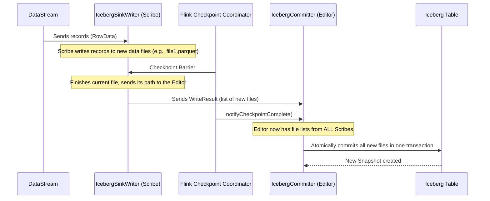

# Chapter 3: IcebergSink

In the last chapter, we learned how to use the [IcebergSource](02_icebergsource_.md) to read data from our tables and create a Flink `DataStream`. Now, let's learn how to do the reverse: how do we write a `DataStream` *into* an Iceberg table?

## What's the Big Idea?

Imagine you are leading a team of scribes and an editor tasked with adding a new chapter to a very important book. The book must always be in a perfect, readable state; you can't have readers seeing a half-written, messy chapter.

To manage this, you'd use a careful process:
1.  **Drafting in Parallel:** You give each of your scribes (the parallel writers) a portion of the new chapter to write. They work independently, creating their own draft pages (new data files).
2.  **Collecting the Drafts:** Once a section is complete (at a Flink checkpoint), the scribes hand their finished draft pages to the editor.
3.  **Atomic Publishing:** The editor gathers all the pages from all the scribes. When everything is ready, the editor adds the entire new chapter to the book in a single, instantaneous action (an atomic commit). Readers now see the new, complete chapter, and never the messy drafts.

**`IcebergSink` is this entire coordinated writing system.**

It's the primary API for writing a Flink `DataStream` into an Iceberg table. It uses a two-phase commit process to ensure that writes are **transactional** and **all-or-nothing**. This guarantees that your table is always in a consistent state, even if failures occur mid-write.

Our goal in this chapter is simple: **Use `IcebergSink` to write a stream of data into an Iceberg table.**

## The Key Players in Our Writing Team

The `IcebergSink` is composed of two main roles that map perfectly to our analogy:

*   **`IcebergSinkWriter` (The Scribe):** These run in parallel across your Flink cluster. Each writer receives a subset of the incoming data and writes it to new data files in your storage (like S3 or HDFS). They are the workhorses doing the actual writing.
*   **`IcebergCommitter` (The Editor):** This is a single, centralized component. After each Flink checkpoint, it collects a list of all the new files created by all the `IcebergSinkWriter`s. Once Flink confirms the checkpoint was successful, the committer updates the Iceberg table's metadata to officially include all those new files in a new table snapshot.

## Using the IcebergSink

Let's say we have a simple stream of `RowData` that we want to append to our `logs` table. The `IcebergSink` builder makes this straightforward.

```java
// In your Flink DataStream application
StreamExecutionEnvironment env = StreamExecutionEnvironment.getExecutionEnvironment();
DataStream<RowData> myStream = createSomeDataStream(env);
TableLoader tableLoader = TableLoader.fromHadoopTable("s3://my-bucket/my-warehouse/logs");

// Build the IcebergSink and attach it to our stream
IcebergSink.forRowData(myStream)
    .tableLoader(tableLoader)
    .append();

env.execute("Write to Iceberg Table");
```

Let's break down this builder chain:
*   `IcebergSink.forRowData(myStream)`: We start building a sink, telling it that we'll be writing a `DataStream` of `RowData`.
*   `.tableLoader(...)`: We provide a `TableLoader`, just like we did for the source. This tells the sink's components (especially the Committer) how to find and load the `logs` table metadata.
*   `.append()`: This is the final action. It constructs the sink and connects it to the Flink job graph.

When this Flink job runs, `myStream` will start flowing. The `IcebergSink` will automatically distribute the records to its parallel writers, which create data files. At every checkpoint, the committer will add the new files to the `logs` table.

## How It Works: A Look Under the Hood

The simple `.append()` call orchestrates a sophisticated, fault-tolerant process between the Scribes (Writers) and the Editor (Committer).

Here is the sequence of events for a single checkpoint:



Here's the story step-by-step:
1.  **Writing Data:** Records from the `DataStream` flow to the `IcebergSinkWriter` tasks. Each writer opens a new data file and starts writing the records it receives.
2.  **Checkpoint Trigger:** Flink's Checkpoint Coordinator periodically sends a "barrier" through the data stream. This is the signal for everyone to save their progress.
3.  **Writer Pre-Commit:** When a writer receives the barrier, it stops writing to its current data file, closes it, and sends a message called a `WriteResult` to the `IcebergCommitter`. This `WriteResult` is just a list containing the names and stats of the files it just created.
4.  **Commit:** The `IcebergCommitter` collects `WriteResult`s from *all* the parallel writers. It waits until Flink notifies it that the checkpoint was globally successful. Once it gets that green light, it performs a single, atomic commit to the Iceberg table, creating a new snapshot that points to all the new data files.

If anything fails before the commit is complete, the transaction is aborted, and the new files are treated as orphans (and later cleaned up), leaving the table in its previous, consistent state.

### Diving into the Code

Let's see simplified versions of the key components in action.

**1. The `IcebergSinkWriter` (The Scribe)**

The writer's job is to write data and report back what it wrote during a checkpoint. Its two most important methods are `write()` and `prepareCommit()`.

```java
// Simplified from: flink/src/main/java/org/apache/iceberg/flink/sink/IcebergSinkWriter.java
class IcebergSinkWriter implements CommittingSinkWriter<RowData, WriteResult> {
  private TaskWriter<RowData> writer;
  // ...

  @Override
  public void write(RowData element, Context context) throws IOException {
    // The "scribe" writes the record to a file on disk.
    writer.write(element);
  }

  @Override
  public Collection<WriteResult> prepareCommit() throws IOException {
    // Flink's checkpoint barrier arrived. Finish the current file.
    WriteResult result = writer.complete();
    // Start a new file for the next checkpoint.
    this.writer = taskWriterFactory.create();
    // Send the list of completed files to the "editor" (Committer).
    return Lists.newArrayList(result);
  }
}
```

**2. The `IcebergCommitter` (The Editor)**

The committer's job is to collect all the file lists and perform the final, atomic commit to the table.

```java
// Simplified from: flink/src/main/java/org/apache/iceberg/flink/sink/IcebergCommitter.java
class IcebergCommitter implements Committer<IcebergCommittable> {
  private Table table;
  
  @Override
  public void commit(Collection<CommitRequest<IcebergCommittable>> commitRequests) {
    // The "editor" receives file lists from all "scribes".
    List<DataFile> allNewFiles = ... // extract from commitRequests
    
    // Create an "append" operation on the table.
    AppendFiles append = table.newAppend();
    
    // Add every new data file to the operation.
    for (DataFile file : allNewFiles) {
      append.appendFile(file);
    }
    
    // Publish the new "chapter" by creating a new snapshot. This is atomic.
    append.commit();
  }
}
```
The `append.commit()` call is the magic moment where the new data becomes officially part of the table and visible to all queries.

## Conclusion

You've now seen how `IcebergSink` provides a robust and transactional way to write data from Flink to Iceberg. By using a two-phase system of parallel `IcebergSinkWriter`s and a central `IcebergCommitter`, it ensures that your data is written safely and your tables are always consistent. This "scribe and editor" model is fundamental to how Iceberg achieves reliable writes in a distributed environment.

So far, we've let Flink decide how to send data to the writers. But what if our data is arriving out of order? Can we organize it better before writing to improve performance? In the next chapter, we'll explore exactly that.

Next up: [Data Shuffling for Writes](04_data_shuffling_for_writes_.md)

---

Generated by [AI Codebase Knowledge Builder](https://github.com/The-Pocket/Tutorial-Codebase-Knowledge)