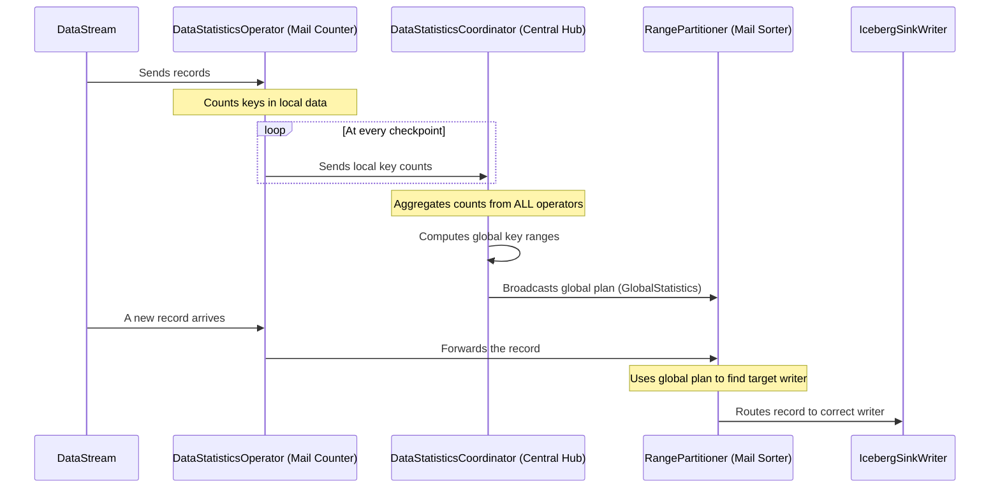

# Chapter 4: Data Shuffling for Writes

In the previous chapter, we learned how the [IcebergSink](03_icebergsink_.md) reliably writes data to our tables using a "scribe and editor" model. This is great for correctness, but what about performance? If data arrives in a random order, our parallel writers might create lots of small, disorganized files, which can really slow down future reads.

## What's the Big Idea?

Imagine a large mail distribution center. If you just gave each mail carrier a random stack of letters for the entire city, they would all be driving to the same neighborhoods, getting in each other's way, and delivering just one or two letters per stop. It would be incredibly inefficient.

A real mail center does something much smarter first: **it sorts the mail.** All letters for zip code 90210 go into one bin, all letters for 10001 go into another, and so on. Then, each carrier gets a well-organized batch for a specific area.

**Data Shuffling for Writes is Iceberg's mail sorting room.**

Instead of letting data flow randomly to the sink writers, Iceberg can insert a special "sorting" step. This step looks at the data, figures out how to group it (e.g., by a `user_id` or `event_date`), and then sends all related records to the *same* writer. This ensures that the writer can create a single, large, well-organized file for that group, dramatically improving read performance later.

Our goal in this chapter is simple: **Understand how Iceberg intelligently shuffles data to create larger, more efficient files.**

## The Key Players in Our Sorting Room

This mail sorting process involves a few specialized roles working together:

*   **`DataStatisticsOperator` (The Mail Counter):** This operator sits right in the data stream. As each record ("letter") flows past, it peeks at its "zip code" (the sort key) and keeps a running tally. For example: "I've seen 50 records for `user_A` and 120 for `user_B`."
*   **`DataStatisticsCoordinator` (The Central Hub):** This is the manager of the sorting room. It collects the tallies from *all* the parallel `DataStatisticsOperator`s. It then creates a master plan, deciding things like: "Okay, `user_A` through `user_F` will all be handled by Writer 1, `user_G` through `user_M` by Writer 2, and so on."
*   **`RangePartitioner` (The Mail Sorter):** This component gets the master plan from the Central Hub. Now, as new records arrive, it looks at their sort key and, using the plan, directs them to the correct downstream writer subtask.

## How to Enable Data Shuffling

You don't need to write any special Java or Python code to use this feature. You typically enable it by setting a table property in SQL. Let's say we want to cluster our `logs` table by the `level` column.

```sql
-- Tell Iceberg to use range distribution for writes
ALTER TABLE my_iceberg_catalog.my_db.logs SET (
  'write.distribution-mode' = 'range',
  'write.sort-order' = 'level'
);
```

That's it! The next time your Flink job runs an `INSERT INTO logs ...`, Flink and Iceberg will automatically wire up the "mail sorting" components behind the scenes.

**What Happens?**

The `DataStream` heading to the [IcebergSink](03_icebergsink_.md) will first pass through the shuffling components. Records with `level = 'INFO'` might all be routed to writer #1, while records with `level = 'ERROR'` are routed to writer #2. The result is that you get fewer, larger files, with all the `INFO` logs clustered together and all the `ERROR` logs clustered together.

## How It Works: A Look Under the Hood

Enabling `write.distribution-mode = 'range'` kicks off a continuous, adaptive process. It's not a one-time sort; it constantly adjusts to the data flowing through your system.

Here's the sequence of events during a Flink job:



Let's walk through that:
1.  **Local Counting:** Data flows from your source into the `DataStatisticsOperator`. Each parallel instance of this operator counts the sort keys it sees *locally*.
2.  **Reporting to the Hub:** At every Flink checkpoint, each `DataStatisticsOperator` sends its local counts to the one-and-only `DataStatisticsCoordinator`.
3.  **Global Planning:** The `DataStatisticsCoordinator` gathers the reports from everyone and builds a global picture. It then calculates the best way to divide the keys among the available writers and creates a `GlobalStatistics` object.
4.  **Broadcasting the Plan:** The coordinator broadcasts this `GlobalStatistics` plan to all the `RangePartitioner`s in the cluster.
5.  **Routing the Data:** The `RangePartitioner` now has the plan. When it receives a data record, it inspects its sort key, looks up the plan, and sends the record to the correct downstream `IcebergSinkWriter`.

### Diving into the Code

Let's peek at the simplified code that powers this process.

**1. The `DataStatisticsOperator` Counts Records**

The operator's main job is to process elements and collect statistics.

```java
// Simplified from: flink/src/main/java/org/apache/iceberg/flink/sink/shuffle/DataStatisticsOperator.java
public class DataStatisticsOperator {
    private transient DataStatistics localStatistics;

    @Override
    public void processElement(StreamRecord<RowData> streamRecord) {
      // Get the sort key from the incoming record.
      sortKey.wrap(rowDataWrapper.wrap(streamRecord.getValue()));
      // Add it to our local count.
      localStatistics.add(sortKey);
      // Pass the record downstream.
      output.collect(new StreamRecord<>(StatisticsOrRecord.fromRecord(record)));
    }
}
```
At checkpoint time, it sends its `localStatistics` to the coordinator.

**2. The `DataStatisticsCoordinator` Aggregates and Plans**

The coordinator receives events from all operators and aggregates them.

```java
// Simplified from: flink/src/main/java/org/apache/iceberg/flink/sink/shuffle/DataStatisticsCoordinator.java
class DataStatisticsCoordinator {
  private transient AggregatedStatisticsTracker aggregatedStatisticsTracker;

  @Override
  public void handleEventFromOperator(int subtask, OperatorEvent event) {
    // Receive the local stats from an operator.
    StatisticsEvent statsEvent = (StatisticsEvent) event;
    
    // Add the local stats to our global tracker and check if we are done for this checkpoint.
    CompletedStatistics completed = aggregatedStatisticsTracker.updateAndCheckCompletion(subtask, statsEvent);
    
    if (completed != null) {
      // If done, compute the global plan...
      GlobalStatistics globalPlan = globalStatistics(completed, ...);
      // ...and send it back to the operators.
      sendGlobalStatisticsToSubtasks(globalPlan);
    }
  }
}
```

**3. The `RangePartitioner` Routes the Data**

The partitioner is where the plan is put into action. It receives both data records and statistics updates.

```java
// Simplified from: flink/src/main/java/org/apache/iceberg/flink/sink/shuffle/RangePartitioner.java
public class RangePartitioner implements Partitioner<StatisticsOrRecord> {
  private transient Partitioner<RowData> delegatePartitioner;

  @Override
  public int partition(StatisticsOrRecord wrapper, int numPartitions) {
    if (wrapper.hasStatistics()) {
      // This is a plan update from the coordinator.
      // Create a new partitioner based on the new plan.
      this.delegatePartitioner = delegatePartitioner(wrapper.statistics());
      return 0; // Does not matter, just needs to be valid.
    } else {
      // This is a real data record. Use the plan to route it.
      return delegatePartitioner.partition(wrapper.record(), numPartitions);
    }
  }
}
```

## Conclusion

You've just learned about one of Iceberg's most powerful performance features: Data Shuffling for Writes. By adding an intelligent "mail sorting" step before the final write, Iceberg avoids the common "small file problem" in distributed systems. This process of collecting local statistics, aggregating them globally, and routing data based on a master plan ensures your data is well-clustered and ready for high-speed reads.

So far, we've explored how Flink finds, reads from, and writes to Iceberg tables. But a key part of this whole system is the schema. How does Flink's understanding of data types get translated to Iceberg's? In our final chapter, we'll look at the utility that handles this crucial conversion.

Next up: [FlinkSchemaUtil](05_flinkschemautil_.md)

---

Generated by [AI Codebase Knowledge Builder](https://github.com/The-Pocket/Tutorial-Codebase-Knowledge)