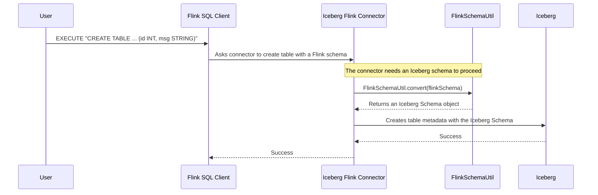

# Chapter 5: FlinkSchemaUtil

In our previous chapters, we've explored how Flink finds tables with [FlinkCatalog](01_flinkcatalog_.md), reads them with [IcebergSource](02_icebergsource_.md), writes to them with [IcebergSink](03_icebergsink_.md), and even optimizes those writes with [Data Shuffling for Writes](04_data_shuffling_for_writes_.md). But we've skipped over one of the most fundamental questions: how do Flink and Iceberg agree on what the data *looks like*?

## What's the Big Idea?

Imagine you have two people who need to work together on a document. One person speaks only French, and the other speaks only Japanese. They both understand the *concept* of a "document," but they describe its structure—chapters, paragraphs, sentences—using completely different words and grammar. To get any work done, they need a translator who can perfectly convert the document's structure back and forth between French and Japanese.

**`FlinkSchemaUtil` is that expert translator.**

Flink describes data structures using its own "language" of types like `RowType` and `TableSchema`. Iceberg, on the other hand, uses its own language, primarily the `Schema` object. `FlinkSchemaUtil` is a critical utility that acts as a Rosetta Stone, providing the logic to translate schemas from Flink's format to Iceberg's, and vice versa. Without it, the Flink connector would be like our two colleagues, unable to understand each other's work.

Our goal in this chapter is simple: **Understand how `FlinkSchemaUtil` translates data schemas between Flink and Iceberg.**

## Why is Translation Necessary?

You might think that a `STRING` is just a `STRING`, or an `INTEGER` is just an `INTEGER`. While that's often true, the details matter.

*   **Flink:** Might have `VARCHAR(10)` (a string with a specific length).
*   **Iceberg:** Simply has a `StringType`.
*   **Flink:** Has a `TIMESTAMP` and a `LOCALZONEDTIMESTAMP`.
*   **Iceberg:** Has a `TimestampType` without a time zone, and one with a time zone.

`FlinkSchemaUtil` handles these subtle but important differences. It ensures that when you tell Flink to write a `VARCHAR`, Iceberg knows to store it as a `String`. And when Flink reads an Iceberg `TimestampType` with a time zone, it knows to create a `LOCALZONEDTIMESTAMP` for you.

## How It Works: A Look Under the Hood

You will almost never call `FlinkSchemaUtil` directly. It's a helper class used internally by the connector. When you perform an action like creating a table or writing data, the connector calls on `FlinkSchemaUtil` to do the translation.

Let's trace what happens when you create a new Iceberg table using Flink SQL.



1.  **You Define the Schema in Flink's Language:** You write a standard `CREATE TABLE` statement with Flink data types (`INT`, `STRING`).
2.  **The Connector is Called:** Flink passes this request to the Iceberg connector, along with the Flink `ResolvedSchema`.
3.  **Translation Time:** The connector can't talk to Iceberg using Flink's schema. It hands the `ResolvedSchema` to `FlinkSchemaUtil`.
4.  **The Magic Happens:** `FlinkSchemaUtil` walks through the Flink schema, field by field, and builds a corresponding Iceberg `Schema`.
5.  **The Final Step:** The connector now has a schema in Iceberg's native language, which it uses to create the table metadata.

### Diving into the Code

The translation logic is powered by a classic software design element called the **Visitor Pattern**. Think of it as a tour guide (`FlinkTypeToType`) walking through a museum (`RowType`). At each exhibit (each data type), the tour guide knows exactly what to say about it.

**1. The Main `convert` Method**

This is the entry point. It takes a Flink `ResolvedSchema` and kicks off the "tour" by creating a visitor.

```java
// Simplified from: flink/src/main/java/org/apache/iceberg/flink/FlinkSchemaUtil.java
public static Schema convert(ResolvedSchema flinkSchema) {
  // First, get the schema as a Flink RowType object.
  RowType root = (RowType) DataTypes.ROW(...).getLogicalType();
  
  // Create a visitor and ask it to "accept" the RowType.
  // This starts the translation tour.
  Type converted = root.accept(new FlinkTypeToType(root));
  
  // The result is an Iceberg Schema!
  return new Schema(converted.asStructType().fields());
}
```
This method orchestrates the process, but the real work happens inside the visitor.

**2. The Visitor: `FlinkTypeToType`**

This class has a `visit` method for every possible Flink data type. When the "tour" encounters a type, it calls the matching method.

```java
// Simplified from: flink/src/main/java/org/apache/iceberg/flink/FlinkTypeToType.java
class FlinkTypeToType extends FlinkTypeVisitor<Type> {
  // When the visitor sees a Flink IntType...
  @Override
  public Type visit(IntType intType) {
    // ...it returns an Iceberg IntegerType.
    return Types.IntegerType.get();
  }

  // When the visitor sees a Flink VarCharType...
  @Override
  public Type visit(VarCharType varCharType) {
    // ...it returns an Iceberg StringType.
    return Types.StringType.get();
  }
}
```
This is the heart of the translation. It's a simple, clear mapping for each individual type.

**3. The Other Way Around: `TypeToFlinkType`**

Of course, translation needs to work in both directions! When you read from an Iceberg table using the [IcebergSource](02_icebergsource_.md), the connector uses another visitor, `TypeToFlinkType`, to convert the Iceberg schema back into a Flink `RowType`.

```java
// Simplified from: flink/src/main/java/org/apache/iceberg/flink/TypeToFlinkType.java
class TypeToFlinkType extends TypeUtil.SchemaVisitor<LogicalType> {
  // When visiting a primitive Iceberg type...
  @Override
  public LogicalType primitive(Type.PrimitiveType primitive) {
    switch (primitive.typeId()) {
      // If it's an Iceberg LONG...
      case LONG:
        // ...return a Flink BigIntType.
        return new BigIntType();
      // If it's an Iceberg BOOLEAN...
      case BOOLEAN:
        // ...return a Flink BooleanType.
        return new BooleanType();
      // etc...
    }
  }
}
```
This ensures that when Flink reads your Iceberg data, it gets structured in a way that Flink's `DataStream` API can natively understand.

## Conclusion

You've now seen the "Rosetta Stone" of the Flink-Iceberg connector: the `FlinkSchemaUtil`. This powerful utility works tirelessly behind the scenes, using a visitor pattern to translate schemas between Flink's world and Iceberg's world. It's the silent hero that makes all the reading, writing, and table management we've discussed possible.

This concludes our tour of the core concepts in the Iceberg Flink connector (`v2.0`). We've journeyed from discovering tables with `FlinkCatalog`, to reading and writing data with `IcebergSource` and `IcebergSink`, to optimizing those writes, and finally, to understanding how the two systems speak the same language via `FlinkSchemaUtil`. You are now equipped with the foundational knowledge to confidently build robust and efficient data pipelines with Apache Flink and Apache Iceberg. Congratulations

---

Generated by [AI Codebase Knowledge Builder](https://github.com/The-Pocket/Tutorial-Codebase-Knowledge)