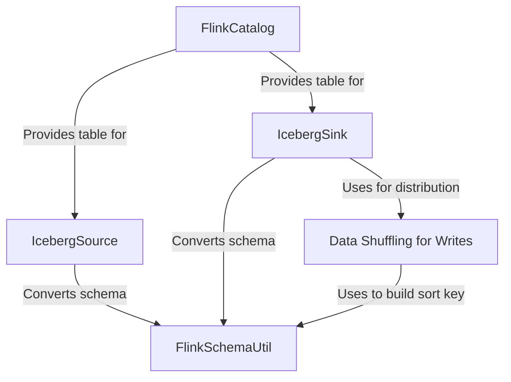

# Tutorial: v2.0

This project provides a powerful connector that allows Apache **Flink** to read from and write to Apache **Iceberg** tables. It acts as a bridge, enabling users to perform both *real-time streaming* and large-scale *batch processing* directly on data stored in a data lake. The connector integrates seamlessly with Flink SQL through a `FlinkCatalog`, provides an `IcebergSource` for reading data, an `IcebergSink` for transactional writes, and includes advanced features like automatic schema translation and intelligent data shuffling to optimize performance.

**Source Repository:** [None](None)

## Chapters

1. [FlinkCatalog
](01_flinkcatalog_.md)
2. [IcebergSource
](02_icebergsource_.md)
3. [IcebergSink
](03_icebergsink_.md)
4. [Data Shuffling for Writes
](04_data_shuffling_for_writes_.md)
5. [FlinkSchemaUtil
](05_flinkschemautil_.md)

---

Generated by [AI Codebase Knowledge Builder](https://github.com/The-Pocket/Tutorial-Codebase-Knowledge)