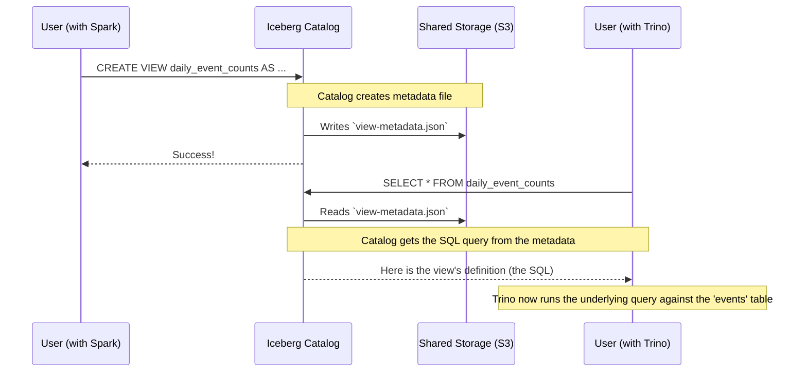

# Chapter 1: Iceberg View

Welcome to the first chapter of our journey into the Apache Iceberg format! We're going to start with a concept that's both simple and incredibly powerful: the **Iceberg View**.

### The Problem: My Saved Queries Don't Talk to Each Other

Imagine you're a data analyst. You often work with a huge table of user `events`. A very common task is to count how many events happen each day. You write a query for this, and it works perfectly.

Since you run this query all the time, you decide to save it as a "view" in your favorite data tool, let's say Apache Spark. You name it `daily_event_counts`. Now, instead of typing the long query, you can just ask for data from `daily_event_counts`. Easy!

But here's the problem: your coworker, who uses a different tool called Trino, wants to use your handy `daily_event_counts` view. When she tries to access it... she can't. Trino has no idea what it is. The "saved query" you made is locked inside Spark's own system.

This is a common headache. Views are traditionally tied to the specific tool that created them. This creates data silos and means people end up rewriting the same logic over and over again in different systems.

### The Solution: A Universal Bookmark for Queries

An Iceberg View solves this problem by acting like a **universal, shared bookmark for your query**.

Think of it this way: instead of saving the query in a format only Spark understands, an Iceberg View saves the query's definition in a standardized, open-source format. This format is stored in a special metadata file that any compatible engine—like Spark, Trino, Flink, and more—can read and understand.

An Iceberg View doesn't store any data itself. It only stores the *recipe* (the SQL query) for how to get the data. This makes it a portable, lightweight, and powerful way to share data logic across your entire organization.

### Creating Your First Iceberg View

Let's solve our analyst's problem using an Iceberg View. The SQL command looks almost the same as a regular `CREATE VIEW` statement.

```sql
CREATE VIEW daily_event_counts (
    event_date,
    event_count COMMENT 'Total daily events'
) AS
SELECT
    CAST(event_ts AS DATE),
    COUNT(1)
FROM events
GROUP BY 1
```

When you run this command with an Iceberg-enabled engine, something special happens. It doesn't just save the view in a private catalog. It creates a **view metadata file**. This file is the key to everything.

### What's Inside the Magic Metadata File?

This metadata file is a simple JSON file that holds all the information about our view. It's the "universal bookmark" we talked about.

Let's peek inside a simplified version of this file for our `daily_event_counts` view.

```json
{
  "view-uuid": "a1b2c3d4-e5f6-7890-ghij-klmnopqrstuv",
  "location": "s3://warehouse/db/daily_event_counts",
  "current-version-id": 1,
  "versions": [
    {
      "version-id": 1,
      "representations": [
        {
          "type": "sql",
          "sql": "SELECT CAST(event_ts AS DATE), COUNT(1) FROM events GROUP BY 1",
          "dialect": "spark"
        }
      ]
    }
  ]
}
```

Let's break this down:

*   `view-uuid`: A unique ID for the view, like a fingerprint.
*   `location`: Tells Iceberg where to find metadata files for this view.
*   `current-version-id`: Points to which version of the view is the "current" one. (More on versions in the next chapter!)
*   `representations`: This is the heart of the view! It holds the actual query definition.
    *   `type: "sql"`: Says this representation is a SQL query.
    *   `sql: "SELECT ..."`: Contains the exact SQL text of our query.
    *   `dialect: "spark"`: Notes which flavor of SQL this is. We could add another representation with `"dialect": "trino"` for the same view!

Because this file is in a standard format and stored in a shared location (like S3, GCS, or HDFS), any tool that speaks "Iceberg" can find it, read it, and understand exactly how to run the query.

### How It All Connects

Let's visualize how this works when different tools use the same Iceberg View.



As you can see, the Iceberg Catalog acts as the central traffic cop. It knows where to find the view's "bookmark" (the metadata file) in shared storage. When any tool asks for the view, the catalog retrieves the recipe, and the tool can then execute it. No more being locked into one system!

### What Happens When You Change a View?

Let's say you want to update your view to filter out a specific type of event.

```sql
CREATE OR REPLACE VIEW daily_event_counts (
    event_date,
    event_count COMMENT 'Total daily events'
) AS
SELECT
    CAST(event_ts AS DATE),
    COUNT(1)
FROM events
WHERE event_type != 'test' -- Our new change!
GROUP BY 1
```

When you do this, Iceberg doesn't just overwrite the old metadata file. Instead, it creates a brand new one and updates the catalog to point to this new version.

```
/daily_event_counts/metadata/00001-abc.metadata.json  <- Old version
/daily_event_counts/metadata/00002-def.metadata.json  <- New version
```

The old file is kept, creating a history of every change made to the view. This is an incredibly powerful feature that enables time travel and auditing, which we'll explore soon.

### Conclusion

You've just learned the core concept of an Iceberg View! It's not just a saved query; it's a **standardized, portable recipe for a query** that breaks down walls between different data processing engines. By storing its definition in a shared, open-format metadata file, it allows everyone in your ecosystem to work from a single source of truth.

We saw that updating a view creates a new version, preserving the old one. This concept of versioning is fundamental to Iceberg's reliability. In our next chapter, we will explore exactly how this works.

Ready to learn more? Let's dive into [View Versioning](02_view_versioning_.md).

---

Generated by [AI Codebase Knowledge Builder](https://github.com/The-Pocket/Tutorial-Codebase-Knowledge)