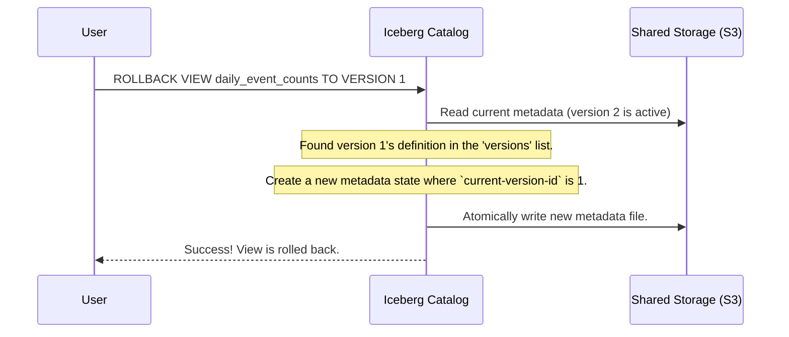

# Chapter 2: View Versioning

In the last chapter, on the [Iceberg View](01_iceberg_view_.md), we briefly saw that updating a view creates a new metadata file instead of overwriting the old one. This simple action is the key to one of Iceberg's most powerful safety features: **View Versioning**.

### The Problem: "Oops, I Broke the Dashboard!"

Imagine you're an analyst, and you're in charge of a very important company dashboard that shows daily user activity. This dashboard is powered by the `daily_event_counts` view we created in the last chapter.

One morning, you decide to update the view to filter out some internal test events. You run this command:

```sql
-- Oops! A mistake in the logic
CREATE OR REPLACE VIEW daily_event_counts AS
SELECT
    CAST(event_ts AS DATE),
    COUNT(1)
FROM events
WHERE event_type = 'test' -- Mistake: This SHOULD have been '!='
GROUP BY 1
```

A few minutes later, you get a frantic message: the dashboard is blank! You realize your mistake. You meant to *exclude* test events, but you accidentally wrote the query to *only include* them. With a traditional view system, the old, correct SQL logic is gone forever. You'd have to scramble to remember or find the old query to fix it.

### The Solution: A Time Machine for Your SQL

Iceberg's View Versioning is the solution to this scary scenario. Think of it as a **built-in time machine** for your view's SQL definition.

Every time you run `CREATE OR REPLACE VIEW`, Iceberg doesn't throw away the old version. Instead, it carefully archives the old definition and creates a new, numbered version. This gives you a complete, unchangeable history of your view's logic.

If you make a mistake, you don't have to panic. You can simply tell Iceberg: "Take me back to the previous version."

### How to Travel Back in Time

Let's fix our broken dashboard. When we ran the bad `CREATE OR REPLACE VIEW` command, Iceberg created "Version 2" of our view and made it the current one. The original, correct logic is still safe as "Version 1".

To roll back, we can use a command to tell Iceberg to make Version 1 the current version again. The exact syntax might vary slightly between engines like Spark or Trino, but the concept is the same.

```sql
-- This is a conceptual command. Syntax may vary by engine.
CALL system.rollback_view('daily_event_counts', 1);
```

After running this, Iceberg instantly points `daily_event_counts` back to the old, correct SQL. The dashboard is fixed! You didn't have to rewrite a single line of SQL.

### What's Happening Under the Hood?

So how does this magic work? It's all managed within the view's metadata file. Let's look at how the metadata changes.

When we made our mistake, a new metadata file was created. If we peek inside, we'll see that it now contains a list of *all* versions.

```json
{
  "view-uuid": "a1b2c3d4-...",
  "location": "s3://warehouse/db/daily_event_counts",
  "current-version-id": 2, // <-- Now points to the new, broken version
  "versions": [
    {
      "version-id": 1, // <-- The original, good version
      "timestamp-ms": 1678886400000,
      "sql": "SELECT CAST(event_ts AS DATE), COUNT(1) FROM events GROUP BY 1"
    },
    {
      "version-id": 2, // <-- The new, broken version
      "timestamp-ms": 1678887000000,
      "sql": "SELECT ... FROM events WHERE event_type = 'test' GROUP BY 1"
    }
  ],
  "version-log": [
    { "timestamp-ms": 1678886400000, "version-id": 1 },
    { "timestamp-ms": 1678887000000, "version-id": 2 } // <-- A new entry logs the change
  ]
}
```

Let's break down the key parts:

1.  **`versions` list**: This is no longer a single item but a list. It holds the complete definition for every version of the view that has ever existed.
2.  **`current-version-id`**: This is a simple pointer. It tells any query engine which version in the list is the "current" or "live" one. After our mistake, it points to `2`.
3.  **`version-log`**: This is an audit log. It records a timestamp every time the `current-version-id` changes, giving you a perfect history of when each version became active.

When we perform a rollback, Iceberg does not delete anything. It simply creates a *new* metadata file where the `current-version-id` is set back to `1`.



### Another Big Benefit: Query Stability

Versioning also protects long-running jobs. Imagine a data science job starts running a query against `daily_event_counts` (Version 1). While it's running, an analyst updates the view to Version 2.

Without versioning, this could cause the data science job to fail or, worse, return inconsistent results.

With Iceberg, this is not a problem. The data science job "locks on" to the version that was current when it started (Version 1). It will continue to use Version 1's logic for its entire duration, completely unaffected by the update to Version 2. This ensures that queries are repeatable and reliable.

### Conclusion

You've just learned about View Versioning, Iceberg's built-in safety net. It's like having version control for your SQL, giving you:

*   **A full history** of every change made to a view.
*   The ability to **instantly roll back** to any previous version if a mistake is made.
*   **Guaranteed stability** for long-running queries, protecting them from concurrent changes.

This simple but powerful feature makes managing data logic safer and more reliable for everyone.

So far, we've discussed how Iceberg manages logical information like SQL queries. But Iceberg also has clever ways of storing physical information, like statistics about the data, to make queries faster. In our next chapter, we'll begin to explore this by looking at the [Puffin File Format](03_puffin_file_format_.md).

---

Generated by [AI Codebase Knowledge Builder](https://github.com/The-Pocket/Tutorial-Codebase-Knowledge)