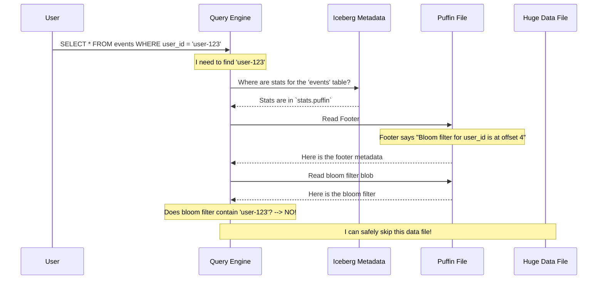

# Chapter 3: Puffin File Format

In our last chapter on [View Versioning](02_view_versioning_.md), we saw how Iceberg safely manages the *logic* of a query. Now, let's switch gears and look at how Iceberg helps speed up the *execution* of that query. To do this, we need to understand a special type of file called the **Puffin File Format**.

### The Problem: Finding a Needle in a Haystack

Imagine your `events` table is massive, stored across hundreds of large data files. You run a simple query to find all events for a single user:

```sql
SELECT * FROM events WHERE user_id = 'user-123';
```

How does the query engine find these events? Without any extra help, it has to be pessimistic. It must open and read *every single data file*, just in case `user-123`'s events are inside. This is like searching for a specific book in a library by pulling every single book off the shelf. It's slow and inefficient.

### The Solution: An Appendix for Your Data

A **Puffin file** is like an **appendix or an index for your data files**. It's a separate, smaller file that holds auxiliary information—extra data *about* your data—that helps the query engine work smarter, not harder.

Instead of storing the data itself, a Puffin file stores things like:

*   **Statistics:** Such as a "bloom filter," which can quickly tell you if a value (like `'user-123'`) *might* be in a data file, or if it's *definitely not* there.
*   **Indexes:** A map to help locate data faster.
*   **Deletion Markers:** A list of rows that have been deleted from a data file (since data files in Iceberg are immutable and can't be changed in place).

By checking this small Puffin file first, the query engine can often realize, "Hey, `user-123` is definitely not in these 95 files, so I'll just skip them entirely!" This can dramatically speed up your queries.

### The Anatomy of a Puffin File

At its core, a Puffin file is a simple container. Think of it as a box with a few items inside and a label on the outside describing the contents.

The file has three main parts, laid out one after another:

```
[Magic Number] [A Bunch of Blobs] [Footer]
```

1.  **Magic Number**: This is a special 4-byte code at the very beginning of the file (`PFA1`). It's like a secret handshake that says, "Hi, I'm a Puffin file, version 1." This allows tools to quickly identify the file type without relying on the filename.

2.  **Blobs**: These are the actual chunks of useful information. A "blob" (Binary Large Object) is just a generic term for a piece of data. One blob might be a bloom filter, another might be a list of deleted rows. We'll explore these in detail in the next chapter on the [Puffin Blob](04_puffin_blob_.md).

3.  **Footer**: This is the most important part for understanding the file. The footer is the **table of contents**. It's located at the end of the file and contains a JSON description of all the blobs inside: what they are, which data file they apply to, and where to find them within the Puffin file itself.

### The Footer: A Table of Contents in JSON

The footer's job is to describe the blobs. It contains a JSON object that lists metadata for every blob in the file. Let's look at a simplified example.

```json
{
  "blobs": [
    {
      "type": "apache-datasketches-theta-v1",
      "snapshot-id": 87654321,
      "offset": 4,
      "length": 512,
      "properties": { "for-column": "user_id" }
    },
    {
      "type": "deletion-vector-v1",
      "snapshot-id": 87654321,
      "offset": 516,
      "length": 128,
      "properties": { "referenced-data-file": "s3://.../file1.parquet" }
    }
  ]
}
```

Let's break down the metadata for the first blob:

*   `"type"`: Tells us what kind of information this is. In this case, it's a type of statistical sketch.
*   `"snapshot-id"`: Links this information to a specific version of our Iceberg table.
*   `"offset"`: Tells the reader where this blob starts inside the Puffin file (e.g., "start reading 4 bytes in").
*   `"length"`: Tells the reader how long the blob is (e.g., "read for 512 bytes").
*   `"properties"`: Contains extra details, like which column or data file this blob is for.

With this "table of contents," a query engine can jump directly to the blob it needs without having to scan the whole Puffin file.

### How It All Connects

Let's revisit our query for `user-123` and see how a query engine uses a Puffin file.



As you can see, the engine reads the tiny Puffin file, consults the footer, checks the relevant blob (the bloom filter), and makes a smart decision to skip reading the huge data file entirely. This is the power of Puffin in action!

### Conclusion

You've just learned about the Puffin file format, Iceberg's specialized container for performance-boosting metadata. Think of it as an **appendix for your data files**.

Key takeaways:

*   Puffin files store auxiliary data like statistics and deletion markers, not the table's raw data.
*   Their purpose is to help query engines optimize performance by skipping irrelevant data.
*   A Puffin file consists of a `Magic` number, a series of `Blobs`, and a `Footer`.
*   The `Footer` acts as a table of contents, describing each blob so the engine can find what it needs quickly.

Puffin is the box that holds these useful pieces of information. But what do these pieces of information—the blobs—actually look like? In our next chapter, we will open the box and take a closer look at the [Puffin Blob](04_puffin_blob_.md).

---

Generated by [AI Codebase Knowledge Builder](https://github.com/The-Pocket/Tutorial-Codebase-Knowledge)