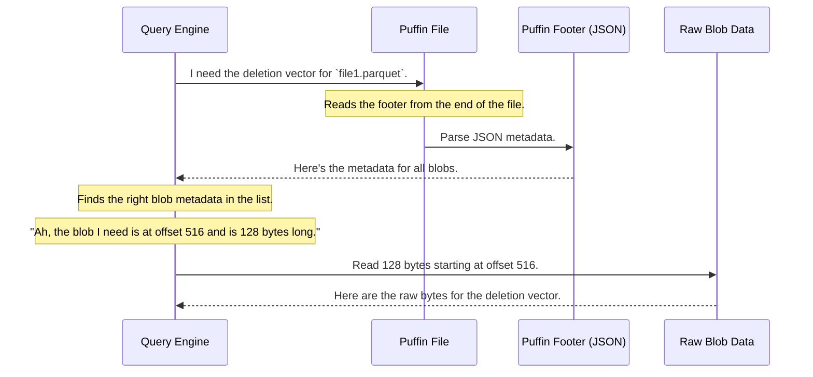

# Chapter 4: Puffin Blob

In our last chapter on the [Puffin File Format](03_puffin_file_format_.md), we learned that a Puffin file is like an appendix for our data tables. It's a container for useful statistics and indexes. But what exactly are the items *inside* this appendix? That's where the **Puffin Blob** comes in.

### The Problem: One Appendix, Many Different Charts

Imagine you're creating an appendix for a book. You don't just dump all the information onto the pages randomly. You organize it. You might have:

*   A bar chart showing sales per month.
*   A table listing all company office locations.
*   A pie chart showing market share.

Each of these is a distinct piece of information with a specific purpose. How do you store different kinds of statistical data in a single Puffin file without it becoming a jumbled mess?

### The Solution: Self-Describing Chunks of Data

A **Puffin Blob** is an individual piece of statistical or index data stored within a Puffin file. It’s like a single chart or table within our book's appendix.

Think of it as a labeled container. Each blob has two parts:
1.  **The Data Itself**: The raw bytes of the information (e.g., the data for the bar chart).
2.  **The Metadata**: A label that describes the data (e.g., "Bar Chart: Sales per Month, 2023").

This "label" is stored in the Puffin file's footer, and it tells a query engine everything it needs to know to understand and use the blob's data. Let's look at a couple of examples.

#### Example 1: Estimating Unique Users

**Use Case:** You want to quickly estimate how many unique `user_id`s are in a data file without reading the whole file.

A Puffin file can store a **Theta sketch** for this. A Theta sketch is a very small, clever data structure that can estimate the number of unique items in a huge dataset. This sketch is stored as a blob.

Its metadata in the Puffin footer might look like this:

```json
{
  "type": "apache-datasketches-theta-v1",
  "snapshot-id": 87654321,
  "offset": 4,
  "length": 512,
  "properties": { "for-column": "user_id" }
}
```

This is the blob's "label". It tells us:
*   `type`: "This is a Theta sketch."
*   `snapshot-id`: "This sketch was created from a specific version (snapshot) of the table."
*   `offset` & `length`: "You can find the actual sketch data 4 bytes into the file, and it is 512 bytes long."
*   `properties`: "This sketch is for the `user_id` column."

#### Example 2: Marking Deleted Rows

**Use Case:** In Iceberg, data files are never changed. When you delete rows, Iceberg marks them as deleted in a separate file. How does it do that?

It uses a **deletion vector**, which is basically a list of deleted row positions. This list is stored as a blob.

Its metadata would look something like this:

```json
{
  "type": "deletion-vector-v1",
  "snapshot-id": 87654321,
  "offset": 516,
  "length": 128,
  "properties": { "referenced-data-file": "s3://.../file1.parquet" }
}
```

This label tells us:
*   `type`: "This is a deletion vector."
*   `offset` & `length`: "The deletion data starts at byte 516 and is 128 bytes long."
*   `properties`: "These deletions apply specifically to the data file `file1.parquet`."

### How a Query Engine Uses Blobs

The beauty of this system is that the Puffin file's footer acts as a complete "table of contents" for all the blobs. When a query engine needs a specific piece of information, it doesn't have to guess. It follows a simple, two-step process.



1.  **Read the Table of Contents**: The engine first reads the footer and looks at the list of all blob metadata.
2.  **Jump to the Data**: It finds the metadata for the blob it needs (e.g., the one with `"type": "deletion-vector-v1"` and the correct filename). Then, it uses the `offset` and `length` to jump to that exact position in the file and read the blob's data.

This makes the Puffin format incredibly efficient and flexible. You can add new types of blobs in the future, and as long as query engines know how to read their `type`, they can be easily supported without changing the file format itself.

### A Look Inside the `puffin-spec.md`

The structure for this blob metadata is formally defined in the specification. If we look at the `puffin-spec.md` file, we see the definition for `BlobMetadata`:

| Field Name | Type | Required | Description |
|---|---|---|---|
| `type` | string | yes | The type of the blob, e.g., `apache-datasketches-theta-v1`. |
| `offset` | long | yes | The offset in the file where the blob contents start. |
| `length` | long | yes | The length of the blob stored in the file. |
| `snapshot-id` | long | yes | The table snapshot this blob was computed from. |
| ... | ... | ... | ... |

This standard structure ensures that any tool that can read Puffin files will understand how to locate and identify every blob inside.

### Conclusion

You've now learned what a Puffin Blob is! It's not a complex concept, but it's fundamental to how Puffin works.

*   A **blob** is a single, self-contained piece of information (like a chart or a list) inside a Puffin file.
*   Each blob has **metadata** in the file's footer that acts like a label, describing what the blob is, what it's for, and where to find it.
*   This design allows a Puffin file to hold many different kinds of statistics and indexes in an organized and efficient way.

Puffin ensures our statistical data is organized and easy to access. But what if this information, or the data itself, is sensitive and needs to be kept private? In our next chapter, we will explore how Iceberg handles data security by looking at the [AES GCM Stream Format](05_aes_gcm_stream_format_.md).

---

Generated by [AI Codebase Knowledge Builder](https://github.com/The-Pocket/Tutorial-Codebase-Knowledge)