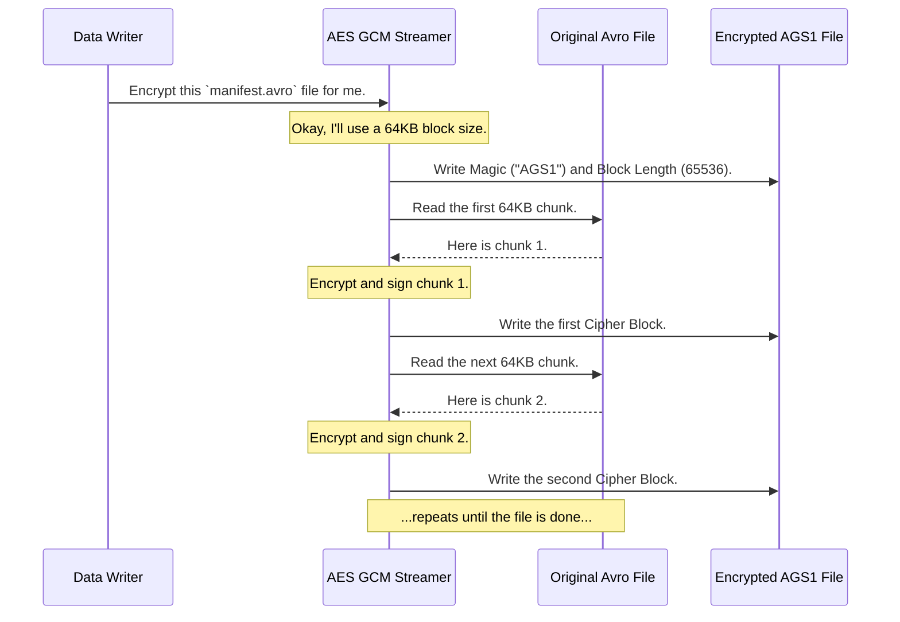

# Chapter 5: AES GCM Stream Format

In the last chapter on the [Puffin Blob](04_puffin_blob_.md), we saw how Iceberg organizes performance-boosting statistics into neat, labeled chunks. But what if the information in those blobs—or in any other Iceberg metadata file—is sensitive? What if we need to ensure no one can snoop on it or tamper with it? That brings us to a critical security feature: the **AES GCM Stream Format**.

### The Problem: Our Files are Unlocked and Unsealed

Imagine you have a manifest file for your `customers` table. This manifest file, typically in a format like Avro, contains a list of data files. For each data file, it also stores min/max statistics for the columns inside.

Now, what if one of those columns is `social_security_number`? The min/max values in your manifest file could expose real, sensitive customer data. Furthermore, the file formats for Iceberg metadata—like Avro and JSON—don't have a built-in way to encrypt their contents. This leaves them vulnerable.

An attacker could potentially:
1.  **Read the file:** Snooping on the sensitive min/max values.
2.  **Modify the file:** Secretly changing a file path in the manifest to point to a malicious data file, corrupting your table without you realizing it.

We need a way to lock our files (for privacy) and seal them (to prove they haven't been tampered with).

### The Solution: A Security Wrapper for Any File

The **AES GCM Stream Format** is a security wrapper that can be placed around *any* file to provide both confidentiality and integrity.

Think of it like this: you need to mail a long, important document. Instead of putting it in one big envelope, you take a more secure approach:
1.  **Chunking:** You break the document into individual pages.
2.  **Encrypting (Confidentiality):** You put each page into its own small, opaque security envelope, so no one can read it. This is **encryption**.
3.  **Signing (Integrity):** On the outside of each security envelope, you write the page number (e.g., "Page 5 of 120") and add your signature. This proves that no pages have been added, removed, or reordered. This is **tamper-proofing**.

The AES GCM Stream format does exactly this for a digital file. It breaks the file into chunks, encrypts each one, and adds a cryptographic signature to ensure its authenticity. This is crucial for protecting Iceberg metadata files that lack their own security features.

### How It Works: The Structure of a Wrapped File

A file protected by this format has a simple, clear structure. It's not the original file anymore; it's a new file containing the original data in this secure, chunked format.

The file is laid out as follows:

```
[Magic Number] [Block Length] [Cipher Block 1] [Cipher Block 2] ... [Cipher Block N]
```

Let's break that down:

*   `Magic Number`: A 4-byte signature (`AGS1`) at the very start of the file. This acts as a secret handshake, telling any reader, "Hi, I'm an AES GCM Stream file, version 1."
*   `Block Length`: A number that defines how big each chunk (or "page" in our analogy) is before it gets encrypted. For example, 65536 bytes (64KB).
*   `Cipher Block`: This is the encrypted and signed chunk—our sealed, numbered security envelope. Each one contains the encrypted data for that piece of the file.

### Visualizing the Encryption Process

Let's see how an ordinary Avro manifest file is transformed into an AES GCM Stream file.



The process is straightforward: the Streamer reads the original file piece by piece, encrypts and signs each piece, and writes the resulting secure [Cipher Block](06_cipher_block_.md) to the new output file.

### Under the Hood: The Importance of a Signature

The "signing" part is just as important as the encryption. Encrypting a chunk stops people from reading it, but it doesn't stop them from swapping it.

Imagine an attacker has two files encrypted with the same key. They could potentially take an encrypted block from `file_A` and use it to replace a block in `file_B`. To prevent this, AES GCM uses something called **Additional Authenticated Data (AAD)**.

This AAD is like the "Page 5 of 120" label we wrote on our envelope. Before encrypting each block, the Streamer creates a unique label for it that includes the file's unique ID and the block's sequence number (e.g., "file-uuid-abc, block-5"). This label is not encrypted, but it's included in the cryptographic signature.

When decrypting, the reader checks this signature. If someone swapped block 5 with block 8, the reader would expect the label for block 5 but find the signature for block 8. The check would fail, and the tampering would be instantly detected. This is how Iceberg achieves end-to-end tamper-proofing. We'll explore this concept more in the chapter on [Additional Authenticated Data (AAD)](07_additional_authenticated_data__aad__.md).

### The Official Specification

The structure of this format is formally defined in the project's specification. The `gcm-stream-spec.md` file lays out the structure of a file:

```
Magic BlockLength CipherBlock₁ CipherBlock₂ ... CipherBlockₙ
```

It also defines the structure of each [Cipher Block](06_cipher_block_.md), which we will look at next. This specification ensures that any tool implementing Iceberg's security features will create and read encrypted files in the exact same way.

### Conclusion

You've just learned about the AES GCM Stream Format, Iceberg's powerful tool for securing files. It acts as a universal security wrapper that provides:

*   **Confidentiality:** By encrypting file contents in chunks.
*   **Integrity:** By cryptographically signing each chunk to prevent tampering, reordering, or swapping.

This mechanism is what allows Iceberg to protect sensitive information in metadata files (like Avro manifests or Puffin files) that don't have native encryption support, giving you a fully secured data platform.

We've talked a lot about the "Cipher Block"—the sealed security envelope. But what exactly is inside it? How are the encrypted data, the signature, and other pieces arranged? In our next chapter, we will finally tear open the envelope and examine the [Cipher Block](06_cipher_block_.md).

---

Generated by [AI Codebase Knowledge Builder](https://github.com/The-Pocket/Tutorial-Codebase-Knowledge)