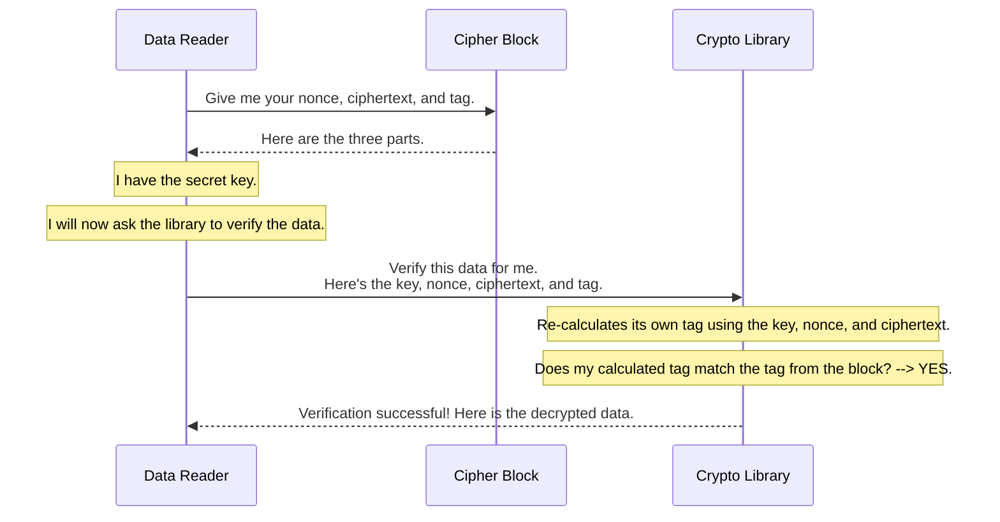

# Chapter 6: Cipher Block

In our last chapter on the [AES GCM Stream Format](05_aes_gcm_stream_format_.md), we learned how Iceberg can wrap any file in a secure, encrypted stream. We used the analogy of breaking a document into pages and putting each page into its own sealed security envelope.

Now, it's time to carefully tear open one of those envelopes and see exactly what's inside. This "envelope" is what we call a **Cipher Block**.

### The Problem: How Do You Securely Package a Single Chunk of Data?

Imagine you've taken a small 64KB chunk from a file and encrypted it. You now have a block of scrambled, unreadable data. Great! But this isn't enough to be useful.

Later, when you want to read this chunk back, you'll have some critical questions:
1.  **How do I decrypt it?** Encryption isn't a one-way street. I need some information about *how* this specific chunk was encrypted.
2.  **How do I know it's the *right* chunk?** What if an attacker swapped this chunk with another one from a different file?
3.  **How do I know it hasn't been changed?** How can I be 100% sure that not a single byte has been maliciously flipped?

Simply having the encrypted data isn't enough. We need to package it with everything required to answer these questions.

### The Solution: A Self-Contained Security Package

A **Cipher Block** is the fundamental, self-contained unit of an encrypted file in the AES GCM Stream format. It's a single, securely sealed package that contains not just the encrypted data, but also the information needed to securely decrypt and verify it.

Think of it as sending a valuable item via a high-security courier. The package you receive contains three things:
1.  The **item itself** in a locked box (`ciphertext`).
2.  A unique **tracking number** on the outside (`nonce`), which was used in the locking process.
3.  A **tamper-evident seal** on the box (`tag`). If the seal is broken, you know not to trust the contents.

A Cipher Block is structured in exactly the same way. It's just a sequence of these three components written one after the other in the file.

### The Anatomy of a Cipher Block

Every Cipher Block consists of three essential parts, laid out in a simple, fixed structure:

| Part | Description | Analogy |
|---|---|---|
| `nonce` | A unique number used once for this specific block's encryption. | The unique tracking number. |
| `ciphertext` | The encrypted chunk of your original data. | The item in the locked box. |
| `tag` | A cryptographic "signature" that proves the data is authentic. | The tamper-evident seal. |

Let's break these down:

*   **Nonce (Number used once):** This is a 12-byte random number. It's essential because the AES GCM algorithm requires a unique input for every single encryption operation. Using a unique nonce ensures that if you encrypt the exact same data chunk twice, you get two completely different-looking ciphertexts. This is crucial for security. The nonce isn't secret; it's stored in plaintext right in the block.

*   **Ciphertext:** This is the encrypted version of a chunk of your original file. Its length is the same as the original chunk's length (e.g., 64KB). By itself, it's just meaningless gibberish.

*   **Tag:** This is the magic security seal. It's a 16-byte value generated during the encryption process. The tag is a cryptographic signature of the `nonce`, the `ciphertext`, and the secret encryption key. It's what allows us to verify the integrity of the data.

### How It All Works: Verification Before Decryption

The most important rule when working with a Cipher Block is: **always verify before you trust**. When a reader wants to decrypt a block, it doesn't just jump straight to decryption. It performs a critical verification step first.

Here's how a data reader would process a single Cipher Block to get the original data back:



1.  **Read the Parts:** The reader reads the `nonce`, `ciphertext`, and `tag` from the file.
2.  **Ask for Verification:** It passes these three parts, along with the secret encryption key, to a cryptographic library (like one built into Java or Go).
3.  **The Magic Check:** The library uses the key, nonce, and ciphertext to *re-calculate* what the tag *should* be.
4.  **Compare Tags:** It compares its newly calculated tag with the `tag` that was stored in the block.
    *   **If they match:** The data is authentic! The library knows it hasn't been tampered with and returns the decrypted plaintext data.
    *   **If they DO NOT match:** The security seal is broken! The library immediately throws an error, and the reader aborts. This protects you from using corrupt or malicious data.

### A Look at the Specification

This simple but powerful structure is defined in the `gcm-stream-spec.md` file. It's as straightforward as it sounds.

```
| nonce | ciphertext | tag |
```

The specification also defines the exact sizes for the fixed parts:
*   `nonce`: 12 bytes long.
*   `tag`: 16 bytes long.

Because the `nonce` and `tag` have fixed lengths, and the `ciphertext` length is known from the file header, it's very easy for a program to parse these blocks one after another from the encrypted stream.

### Conclusion

You've now peered inside the secure envelope and understand the **Cipher Block**. It's the cornerstone of the AES GCM Stream format.

Key takeaways:
*   A Cipher Block is a self-contained, secure package for a chunk of data.
*   It contains three parts: the `nonce` (unique ID), `ciphertext` (encrypted data), and `tag` (security seal).
*   The `tag` is a cryptographic signature that allows a reader to verify that the data is authentic and has not been tampered with.
*   Verification *always* happens before decryption, providing a critical safety check.

The `tag` is powerful because it verifies that the block's contents are internally consistent. But what about protecting against an attacker swapping entire (but valid) blocks around? To do that, the tag's calculation needs to include information about *where* the block belongs. This is done using [Additional Authenticated Data (AAD)](07_additional_authenticated_data__aad__.md), which we will explore in our final chapter.

---

Generated by [AI Codebase Knowledge Builder](https://github.com/The-Pocket/Tutorial-Codebase-Knowledge)