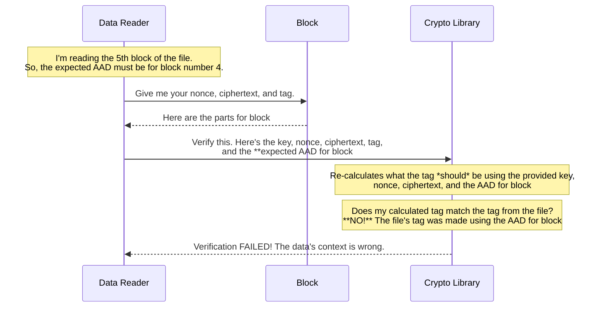

# Chapter 7: Additional Authenticated Data (AAD)

In our last chapter on the [Cipher Block](06_cipher_block_.md), we saw how each chunk of data is sealed in a secure package with a tamper-evident `tag`. This `tag` is fantastic at proving that the contents of a single block haven't been altered.

But what if an attacker is clever? What if they don't try to change the *contents* of a block, but instead change its *position*?

### The Problem: The Swapped Envelope Attack

Imagine you have an encrypted file with 100 blocks. An attacker gets a copy of this file. They can't read the blocks, but they know what they are. What if they take the encrypted data for block #73 and use it to overwrite block #5?

Each block is still perfectly valid on its own. Block #73 has a valid `nonce` and a valid `tag`. When the reader gets to the fifth position, it will read block #73's data, check its tag, and the verification will pass! The reader will happily decrypt the data and pass it along, completely unaware that it has just received the wrong piece of the file. The file is now silently corrupted.

This is like an attacker swapping the envelopes for "Page 5" and "Page 73" of a secret document. Each envelope is still sealed, but the document's order is now dangerously wrong.

### The Solution: Labeling the Outside of the Envelope

**Additional Authenticated Data (AAD)** is the solution to this problem. It's a security mechanism that acts as an **integrity check on the *context*** of the encrypted data.

Think of it this way: before sealing our security envelope (`Cipher Block`), we write some crucial information on the outside:
*   The **File ID**: Which document does this page belong to? (e.g., "Annual Report 2023")
*   The **Sequence Number**: Which page is this? (e.g., "Page 5 of 100")

This external information is the AAD. It is **not encrypted**, but it is **authenticated**. This means the AAD is cryptographically tied into the `tag` (the security seal). If the context doesn't match, the seal breaks.

Now, if an attacker tries to swap block #73 into position #5, the reader will perform a check: "I am reading the 5th block of 'Annual Report 2023'. Let me verify the seal." The cryptographic algorithm will see that the seal was created for "Page 73", not "Page 5". The verification will fail instantly, and the attack is stopped.

### How AAD Works in the AES GCM Stream

In the [AES GCM Stream Format](05_aes_gcm_stream_format_.md), the AAD for each block is constructed from two simple pieces of information:

1.  **AAD Prefix**: A unique identifier for the entire file. This prevents an attacker from swapping a block from a different file (`sensitive_salaries.dat`) into this one.
2.  **AAD Suffix**: The block's sequence number within the file (e.g., 0, 1, 2, 3...). This is a simple counter that prevents reordering blocks within the same file.

These two pieces are combined to form the AAD string for a specific block. For example, for the 5th block (which has a sequence number of 4, since we start at 0) of a file with the ID `file-uuid-abc`, the AAD would be:

```
"file-uuid-abc" + "4" (represented as 4 bytes)
```

This AAD string is then fed into the AES GCM encryption algorithm along with the secret key, the `nonce`, and the plaintext data. The resulting `tag` now authenticates both the data *and* its context.

### Visualizing the Verification Process

Let's see how AAD protects us from the swapped block attack.



As you can see, the reader's expectation about the block's position (its AAD) is the crucial final ingredient. Because the `tag` was created using the AAD for block #72, it can only be verified successfully if the reader also provides the AAD for block #72. Since the reader expected block #4, the check fails, and the data is rejected.

### A Look at the Specification

The official `gcm-stream-spec.md` file describes this process clearly. It defines how the AAD is constructed, ensuring that any program implementing this security feature does it the same way.

From `gcm-stream-spec.md`:
> AES GCM Stream constructs a block AAD from two components: an AAD prefix - a string provided by Iceberg for the file (with the file ID), and an AAD suffix - the block sequence number in the file, as an int in a 4-byte little-endian form. The block AAD is a direct concatenation of the prefix and suffix parts.

This simple rule is what gives the entire encrypted file its structural integrity.

### Conclusion

Congratulations! You've reached the end of our journey through Iceberg's file format and security features. You've just learned about **Additional Authenticated Data (AAD)**, the final piece of the security puzzle.

*   AAD provides **contextual integrity**, ensuring encrypted blocks cannot be swapped or reordered.
*   It works by creating a "label" for each block (file ID + sequence number) that is authenticated as part of the block's `tag`.
*   While the AAD itself is not secret, it is tamper-proof, because any change to it would invalidate the `tag`.

Together, the [AES GCM Stream Format](05_aes_gcm_stream_format_.md), the [Cipher Block](06_cipher_block_.md), and **Additional Authenticated Data** provide robust, end-to-end security for Iceberg files, giving you both confidentiality (no one can read your data) and integrity (no one can tamper with your data).

---

Generated by [AI Codebase Knowledge Builder](https://github.com/The-Pocket/Tutorial-Codebase-Knowledge)