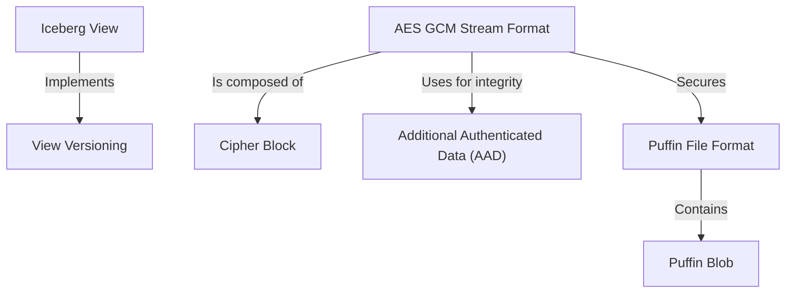

# Tutorial: format

This project defines a collection of standardized formats for managing and securing data assets in a large-scale data ecosystem. It introduces the **Iceberg View**, a *portable recipe* for virtual tables that can be shared across different query engines, complete with built-in versioning. To accelerate queries, it specifies the **Puffin File Format**, a container for auxiliary performance data like statistics and indexes. Finally, it provides the **AES GCM Stream Format**, a critical security layer that encrypts and tamper-proofs any file, protecting these metadata formats that lack native encryption.

**Source Repository:** [None](None)

## Chapters

1. [Iceberg View
](01_iceberg_view_.md)
2. [View Versioning
](02_view_versioning_.md)
3. [Puffin File Format
](03_puffin_file_format_.md)
4. [Puffin Blob
](04_puffin_blob_.md)
5. [AES GCM Stream Format
](05_aes_gcm_stream_format_.md)
6. [Cipher Block
](06_cipher_block_.md)
7. [Additional Authenticated Data (AAD)
](07_additional_authenticated_data__aad__.md)

---

Generated by [AI Codebase Knowledge Builder](https://github.com/The-Pocket/Tutorial-Codebase-Knowledge)