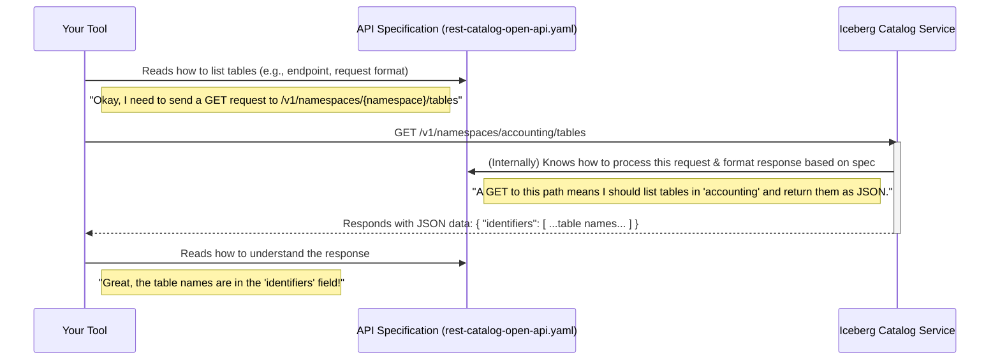

# Chapter 1: API Specification

Welcome to the `open-api` project tutorial! We're excited to help you understand how different software components can work together seamlessly to manage an Iceberg data catalog. In this first chapter, we'll explore the foundational concept: the **API Specification**.

## What's the Big Deal with an API Specification?

Imagine you're building a house with a team of people. One person is in charge of plumbing, another of electricity, and another of framing. If everyone just does their own thing without a common plan, you'll end up with a chaotic mess! Pipes might go where wires should be, and walls might not support the roof.

An **API Specification** is like the master blueprint for a software project where different parts need to communicate. In our case, we're talking about managing an Iceberg data catalog. Various tools and services might need to:
*   List all available datasets (tables).
*   Get details about a specific table.
*   Create new tables.
*   Update existing tables.

Without a clear "blueprint," each tool would have to guess how to talk to the catalog service, and the catalog service would have to guess how to respond. This would be incredibly inefficient and error-prone.

The API Specification solves this by defining a clear, standardized contract for communication.

**Think of it as an architect's detailed blueprint for a building:**
*   It shows every **room (endpoint/command)**: What operations are possible? (e.g., "list tables", "get table details").
*   It details what **materials are needed (request data)** for each operation: What information must you provide to the service? (e.g., to get table details, you need the table's name).
*   It shows what the **finished parts look like (response data)**: How will the service reply? What will the information look like? (e.g., a list of table names, or the full structure of a table).

This blueprint ensures that everyone – whether they're building a tool that uses the catalog or building the catalog service itself – is working from the same set of rules. This is crucial for a project like Apache Iceberg, which aims to be an open standard.

## How Does It Work in `open-api`?

In the `open-api` project, the API Specification defines how software components communicate to manage an Iceberg data catalog using a REST interface (a common way for web services to talk to each other). It details:

1.  **All available commands (endpoints):** These are like specific URLs you can send requests to. For example, there might be an endpoint to list all namespaces, or another to get information about a specific table.
2.  **Required information for requests:** For each command, what data do you need to send? This could be path parameters (part of the URL), query parameters (added to the end of the URL), or a request body (often in JSON format).
3.  **Expected format of responses:** How will the server reply? What will the data structure look like? This is usually also in JSON format.

This ensures all interactions are standardized, so different client applications (tools you build) can reliably interact with any Iceberg catalog server that implements this specification.

## A Simple Use Case: Listing Tables

Let's say you want to build a simple command-line tool that lists all the tables within a specific "accounting" namespace in your Iceberg data lake.

1.  **Your tool (the client)** would first consult the API Specification.
2.  It would find the endpoint for "List Tables in a Namespace" (e.g., something like `GET /v1/namespaces/accounting/tables`).
3.  The specification would tell your tool if any specific information needs to be sent in the request (perhaps nothing extra beyond the namespace in the URL).
4.  The specification would also describe what the response will look like (e.g., a JSON list of table identifiers).
5.  Your tool sends the request to the Iceberg catalog service.
6.  The **catalog service (the server)**, which also adheres to the API Specification, understands the request.
7.  The catalog service processes the request and sends back a response containing the list of tables, formatted exactly as described in the specification.
8.  Your tool receives the response and, because it "read the blueprint," knows how to interpret the data and display the table names to you.

This clear contract prevents misunderstandings and makes development much smoother.

## Under the Hood: The `rest-catalog-open-api.yaml` File

The actual API Specification for the Iceberg REST catalog is defined in a file named `rest-catalog-open-api.yaml`. This file is written using the **OpenAPI Specification standard** (formerly known as Swagger), which is a widely adopted format for describing REST APIs.

You don't need to be an expert in YAML or OpenAPI to understand the concept, but it's good to know that this file is the single source of truth for how communication happens.

Let's visualize the interaction:



This `rest-catalog-open-api.yaml` file is not just for humans to read. Tools can also process it!

### Validating the Blueprint: Linting

It's important that our blueprint is correctly drawn. The project uses a tool to "lint" or validate the `rest-catalog-open-api.yaml` file. This ensures it follows the OpenAPI standard correctly.

You can see this in the `Makefile`:
```makefile
# ... (other parts of Makefile) ...
lint:
	openapi-spec-validator --errors all rest-catalog-open-api.yaml
```
This command checks our API specification file for any errors or inconsistencies, much like a spell-checker for code. If there are problems, it tells us so we can fix them.

### Generating Helpful Code from the Blueprint

The `rest-catalog-open-api.yaml` file can also be used to automatically generate code! This is super helpful for developers. The `Makefile` includes a command for this:

```makefile
# ... (other parts of Makefile) ...
generate:
	datamodel-codegen \
                --enum-field-as-literal all \
	        --target-python-version 3.9 \
	        # ... other options ...
	        --input rest-catalog-open-api.yaml \
	        --output rest-catalog-open-api.py
```
This `generate` command reads the API specification and creates Python code (in `rest-catalog-open-api.py`) that defines data models. These models represent the structure of requests and responses.

For example, if the API specification says an error response looks like this:
*   `message`: a string
*   `type`: a string
*   `code`: an integer

The `datamodel-codegen` tool would generate a Python class like this:

```python
# Snippet from the generated rest-catalog-open-api.py
from pydantic import BaseModel, Field
from typing import Optional, List

class ErrorModel(BaseModel):
    """
    JSON error payload returned in a response with further details on the error
    """
    message: str = Field(..., description='Human-readable error message')
    type: str = Field(
        ...,
        description='Internal type definition of the error',
        example='NoSuchNamespaceException',
    )
    code: int = Field(
        ..., description='HTTP response code', example=404, ge=400, le=600
    )
    stack: Optional[List[str]] = None
```
This Python code isn't what the catalog service runs directly for its main job, but it's incredibly useful for:
*   **Developers:** To understand the exact structure of data being exchanged.
*   **Client Libraries:** Can use these generated models to easily construct requests and parse responses in Python.
*   **Testing:** To ensure that any client or server implementation correctly adheres to the specification.
*   **Documentation:** The generated code itself acts as a form of documentation.

## Conclusion

The API Specification is the cornerstone of the `open-api` project. It's the master plan, the contract, and the blueprint that ensures all software components can communicate effectively and reliably when managing an Iceberg data catalog. By defining endpoints, request formats, and response formats in the `rest-catalog-open-api.yaml` file (using the OpenAPI standard), we enable interoperability and make development easier. Tools can then validate this specification and even generate helpful code from it.

Now that you understand the overall blueprint, we can start looking at some specific "rooms" and "materials" defined within it. In the next chapter, we'll dive into a fundamental concept for organizing your data: the [Namespace](02_namespace_.md).

---

Generated by [AI Codebase Knowledge Builder](https://github.com/The-Pocket/Tutorial-Codebase-Knowledge)