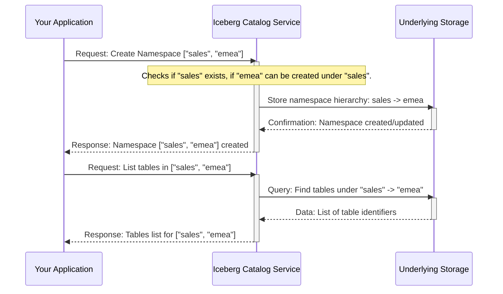

# Chapter 2: Namespace

Welcome to Chapter 2! In [Chapter 1: API Specification](01_api_specification_.md), we learned that the API Specification is like a master blueprint that defines how different software components talk to each other to manage an Iceberg data catalog. It tells us what commands are available and how data should be structured for requests and responses.

Now, let's dive into one of the fundamental ways we organize data within that catalog: the **Namespace**.

## Why Do We Need to Organize Data?

Imagine your computer's "Documents" folder. What if every single file you ever created – essays, spreadsheets, photos, code – was dumped directly into that one folder without any subfolders? It would be a chaotic mess! Finding a specific file from last year would be a nightmare. You might even accidentally save two different files with the same name, like `report.docx`, overwriting one with the other.

Data catalogs can face a similar problem. A catalog might store information about hundreds or even thousands of tables and views (which are like saved queries over tables). Without a good organizational system, it becomes very difficult to:
*   Find the data you need.
*   Understand how different datasets relate to each other.
*   Avoid accidentally using the same name for two different tables (e.g., an `employees` table for the HR department and another `employees` table for customer representatives in the sales department).

This is where **Namespaces** come to the rescue!

## What is a Namespace?

A **Namespace** is a hierarchical structure used for organizing tables and views within the catalog.

**Think of namespaces as folders and subfolders on your computer.** They provide a way to neatly arrange your data "files" (which in our case are tables and views).

This organization offers several key benefits:

1.  **Logical Grouping:** You can group related data assets together. For example, all sales-related tables can go into a `sales` namespace, and all human resources tables can go into an `hr` namespace.
2.  **Preventing Naming Conflicts:** If the HR department has a table named `reports` and the marketing department also has a table named `reports`, namespaces allow them to coexist peacefully. They would be `hr.reports` and `marketing.reports` – clearly distinct!
3.  **Managing Access Control (Simplified):** Namespaces can help in defining who has permission to see or modify certain data. For instance, you might give the sales team access to everything in the `sales` namespace but not the `hr` namespace.

### Anatomy of a Namespace

A namespace can have multiple levels, just like folders inside other folders. Each level is typically represented by a name, and these names are joined together, often by a dot (`.`), to form the full namespace.

For example: `sales.regional.us_orders`

*   `sales`: This could be the top-level "folder" or namespace for all sales data.
*   `regional`: Inside `sales`, there might be a sub-namespace for regional data.
*   `us_orders`: This would be the actual table name, located within the `sales.regional` namespace.

So, the namespace for the `us_orders` table is `sales.regional`.

## How Do We Work With Namespaces?

Just like our API Specification blueprint from Chapter 1 defines how to list tables, it also defines how to work with namespaces. Common operations include:

*   Creating a new namespace.
*   Listing all namespaces.
*   Getting properties of a specific namespace.
*   Listing tables or views within a namespace.

Let's look at a couple of conceptual examples.

### Example: Creating a "Marketing" Namespace

Suppose we want to create a new top-level namespace for our marketing data.

1.  **Our Goal:** Create a namespace called `marketing`.
2.  **The "Blueprint":** We'd consult the [API Specification](01_api_specification_.md) to find the right command (endpoint) for creating namespaces. It might be something like `POST /v1/namespaces`.
3.  **What We Send (Request):** The specification would tell us we need to provide the namespace we want to create. The data we send might look like this in JSON:
    ```json
    {
      "namespace": ["marketing"],
      "properties": {
        "department_contact": "jane.doe@example.com"
      }
    }
    ```
    Here, `["marketing"]` represents the namespace itself. We can also often set properties (like key-value pairs) for the namespace.

4.  **What We Get Back (Response):** If successful, the catalog service would respond, confirming the creation. The response might look like:
    ```json
    {
      "namespace": ["marketing"],
      "properties": {
        "department_contact": "jane.doe@example.com",
        "created_by": "admin_user"
      }
    }
    ```

### Example: Listing Tables in "sales.regional"

Let's say we want to see all the tables within the `sales.regional` namespace.

1.  **Our Goal:** List tables in `sales.regional`.
2.  **The "Blueprint":** The [API Specification](01_api_specification_.md) would define an endpoint for this, perhaps `GET /v1/namespaces/sales.regional/tables`. (Note: In a real URL, `sales.regional` might be encoded or handled differently, but this shows the idea).
3.  **What We Get Back (Response):** The catalog service would return a list of table identifiers within that namespace:
    ```json
    {
      "next-page-token": null,
      "identifiers": [
        { "namespace": ["sales", "regional"], "name": "us_orders" },
        { "namespace": ["sales", "regional"], "name": "eu_orders" },
        { "namespace": ["sales", "regional"], "name": "apac_orders_summary_view" }
      ]
    }
    ```
    This response shows three data assets: `us_orders` (a table), `eu_orders` (a table), and `apac_orders_summary_view` (could be a view), all neatly organized under `sales.regional`.

## How is a Namespace Represented in `open-api`?

In Chapter 1, we saw that the `rest-catalog-open-api.yaml` file can be used to generate Python code representing data structures. The `Namespace` itself has a very simple but powerful representation.

Looking at the generated `rest-catalog-open-api.py` file (which we won't show in full here), we find the `Namespace` model:

```python
# Snippet from rest-catalog-open-api.py

class Namespace(BaseModel):
    """
    Reference to one or more levels of a namespace
    """

    __root__: List[str] = Field(
        ...,
        description='Reference to one or more levels of a namespace',
        example=['accounting', 'tax'],
    )
```

Let's break this down for beginners:
*   `class Namespace(BaseModel):`: This defines a new data structure (or "model") called `Namespace`.
*   `__root__: List[str]`: This is the core part! It means a `Namespace` is fundamentally a **list of strings**.
    *   `List`: Indicates it's an ordered collection of items.
    *   `str`: Indicates each item in the list is a string (text).
*   `example=['accounting', 'tax']`: This shows an example. The namespace `accounting.tax` would be represented as the list `["accounting", "tax"]`.

So, `sales.regional.us_orders` would involve a `TableIdentifier` where its `namespace` field would be `["sales", "regional"]`, and its `name` field would be `"us_orders"`.

This list-of-strings approach makes it easy to represent hierarchies of any depth.
*   `["db1"]` represents a top-level namespace `db1`.
*   `["db1", "schemaA"]` represents `db1.schemaA`.
*   `["db1", "schemaA", "areaX"]` represents `db1.schemaA.areaX`.

## A Peek Under the Hood: Conceptual Flow

When you ask the catalog service to do something with a namespace, like creating one or listing its contents, a few things happen conceptually:



1.  **Your Application (ClientApp)** sends a request (like "create namespace" or "list tables in namespace") to the **Iceberg Catalog Service**. This request follows the rules defined in the [API Specification](01_api_specification_.md).
2.  The **Catalog Service** receives the request. It understands what a namespace is and how it's structured (e.g., as `["level1", "level2"]`).
3.  The Catalog Service then interacts with its **Underlying Storage** (where it actually keeps track of all these namespaces, tables, etc.). This could be a database, a file system, or another system.
4.  The Catalog Service gets a result from the storage (e.g., "namespace created" or the list of tables) and sends it back to your application, again, formatted according to the API Specification.

## Conclusion

Namespaces are a simple yet vital concept for keeping your data catalog organized. By acting like folders and subfolders, they allow you to:
*   Group related tables and views.
*   Avoid naming collisions.
*   Provide a basis for managing data access.

In `open-api`, a namespace is elegantly represented as a list of strings (e.g., `["sales", "regional"]`), defining its hierarchical path. The [API Specification](01_api_specification_.md) clearly defines how clients can interact with these namespaces to create, list, and manage them.

Now that we understand how tables and views can be organized into these "folders," we're ready to look at what's *inside* those folders. In the next chapter, we'll explore the details of individual data assets by looking at [Table Metadata](03_table_metadata_.md).

---

Generated by [AI Codebase Knowledge Builder](https://github.com/The-Pocket/Tutorial-Codebase-Knowledge)