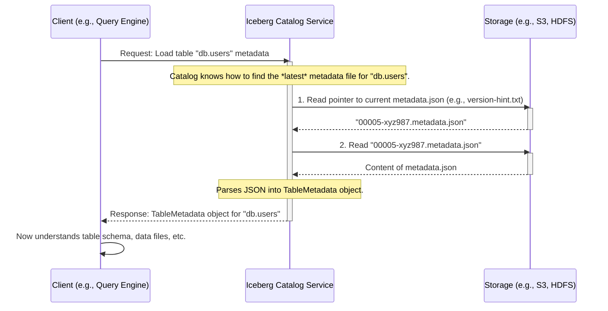

# Chapter 3: Table Metadata

Welcome to Chapter 3! In [Chapter 2: Namespace](02_namespace_.md), we learned how namespaces help organize our tables and views, much like folders on a computer. Now that we know how to find our way to a "folder" (namespace), let's look at what defines the actual "files" (tables) inside them.

Imagine you're an explorer who has just discovered an ancient library. You find a beautifully bound book, but just by looking at its cover, you don't know its title, author, language, what it's about, or even how many pages it has. You need a "table of contents" or an "index card" for that book.

In the world of data, especially with Apache Iceberg, this "index card" or "master guide" for a table is called **Table Metadata**.

## What's the Big Deal with Table Metadata?

Let's say you have a data lake full of files. You might find a file at `s3://my-company-data/sales_data/2023/01/data_part_001.parquet`.
*   What data does this file actually contain?
*   What are the column names? What are their data types (text, numbers, dates)?
*   Is this the only file for the January 2023 sales, or are there others?
*   How has this "sales data" changed over time?
*   How is this data organized for fast searching?

Trying to answer these questions by just looking at raw data files would be incredibly difficult and inefficient. This is the problem **Table Metadata** solves.

**Table Metadata is the core abstraction that encapsulates all defining information about an Iceberg table.** It's the authoritative source of a table's state.

Think of it as a **comprehensive passport for your table**:
*   **Identity:** Its unique name (within a namespace) and a globally unique ID (UUID).
*   **Physical Description (Schema):** What it looks like – its column structure, data types.
*   **Travel History (Snapshots):** How it has changed over time, allowing you to revisit past versions.
*   **Home Address (Location):** Where its physical data files are stored.
*   **Special Instructions (Partitioning, Properties):** How it's organized and other important settings.

With this "passport," any system (like a query engine or a data processing tool) can understand and interact with the table correctly and efficiently.

## Key Components of Table Metadata

Let's break down the key information held within Table Metadata:

1.  **`table-uuid` (Unique Identifier):**
    *   Every Iceberg table gets a unique ID, like a social security number. Even if you rename the table `sales_data` to `archived_sales`, its UUID stays the same. This helps systems track the table reliably.

2.  **`location` (Physical Data Location):**
    *   This tells Iceberg where the table's data files and other metadata files (like manifests, which we'll touch upon) are stored. It's like the table's home address on your data lake (e.g., `s3://my-bucket/warehouse/db_name/table_name/`).

3.  **`schemas` and `current-schema-id` (Column Structure):**
    *   The **schema** defines the columns of your table: their names (e.g., `product_id`, `customer_name`, `order_date`), their data types (e.g., integer, string, timestamp), and whether they can be empty (nullable).
    *   Iceberg tables support schema evolution, meaning you can add, remove, or change columns over time. Each version of the schema gets an ID.
    *   `current-schema-id` points to the ID of the schema that the table currently uses.
    *   *Analogy: The blueprint of your table's structure, which can be revised over time.*

4.  **`snapshots` and `current-snapshot-id` (History of Changes):**
    *   Every time you write data to an Iceberg table (add, update, delete), Iceberg creates a new **snapshot**. A snapshot represents the state of the table at a specific point in time.
    *   Each snapshot has an ID, a timestamp, and a pointer (called a `manifest-list`) to the list of data files that make up that version of the table.
    *   `current-snapshot-id` points to the ID of the most recent snapshot, representing the current state of the table.
    *   This snapshot system allows for powerful features like time-travel (querying the table as it was yesterday) and rollbacks.
    *   *Analogy: Version control for your data, like Git commits for your code.*

5.  **`partition-specs` and `default-spec-id` (Partitioning Rules):**
    *   Partitioning is a way to organize table data into smaller, more manageable chunks based on the values in one or more columns (e.g., partitioning sales data by `order_date`). This can dramatically speed up queries that filter on those partition columns.
    *   Table Metadata stores how the table is partitioned. A table can even have multiple ways it *could* be partitioned defined (specs), with one set as the default.
    *   *Analogy: Organizing files in a large filing cabinet into drawers and folders based on dates or categories.*

6.  **`sort-orders` and `default-sort-order-id` (Sorting Rules):**
    *   This defines how data *within* data files might be sorted. This can help optimize certain types of queries.

7.  **`properties` (Other Configuration):**
    *   A set of key-value pairs for storing other table-specific configurations or custom information (e.g., `owner=data_engineering_team`).

## How Query Engines Use Table Metadata

Imagine a query engine like Spark or Trino needs to run a query: `SELECT customer_name, order_total FROM sales_data WHERE order_date = '2023-01-15';`

Here's a simplified way it uses Table Metadata:

1.  **Ask the Catalog:** The query engine asks the Iceberg [Catalog Service](01_api_specification_.md) (which we learned about in Chapter 1) for the `sales_data` table.
2.  **Get Metadata:** The Catalog Service finds the current Table Metadata file for `sales_data` and sends it back to the query engine. This communication follows the [API Specification](01_api_specification_.md).
3.  **Understand the Table:** The query engine reads the Table Metadata:
    *   It finds the `current-schema-id` and looks up the schema to understand columns like `customer_name`, `order_total`, and `order_date`, and their types.
    *   It finds the `current-snapshot-id` to know which version of the table to read.
    *   From that snapshot, it finds the `manifest-list`, which points to manifest files, which in turn list the actual data files (e.g., Parquet files).
    *   It checks the `partition-spec` to see if the table is partitioned by `order_date`. If so, it can smartly skip reading data for other dates, making the query much faster!
4.  **Read Data:** The engine now knows exactly which data files to read from the table's `location` and how to interpret them.
5.  **Process Query:** It reads the necessary data and returns the results.

Without Table Metadata, the query engine would be flying blind!

## The Table Metadata File (Often JSON)

All this defining information is typically stored in a JSON file. For an Iceberg table, there will be one such `N.metadata.json` file for each version N of the table state (e.g., `00000-abcdef.metadata.json`, `00001-ghijkl.metadata.json`). A special pointer file (like `version-hint.txt`) usually tells Iceberg which one is the latest.

Here's a *very simplified, conceptual* snippet of what parts of a `table-metadata.json` file might look like:

```json
{
  "format-version": 2,
  "table-uuid": "a1b2c3d4-e5f6-7890-1234-567890abcdef",
  "location": "s3://my-data-lake/warehouse/db/users_table",
  "last-updated-ms": 1678886400000,
  "current-schema-id": 1,
  "schemas": [
    {
      "schema-id": 1,
      "type": "struct",
      "fields": [
        { "id": 1, "name": "user_id", "type": "long", "required": true },
        { "id": 2, "name": "username", "type": "string", "required": true }
      ]
    }
  ],
  "current-snapshot-id": 101,
  "snapshots": [
    {
      "snapshot-id": 101,
      "timestamp-ms": 1678886400000,
      "manifest-list": "s3://.../snap-101-manifest-list.avro",
      "summary": { "operation": "append" }
    }
  ],
  "properties": {
    "owner": "data_team"
  }
  // ... other sections like partition-specs, sort-orders ...
}
```

This JSON file is the tangible "passport" for the table. It's human-readable (though often large and complex for real tables) and machine-parsable.

## Table Metadata in `open-api`

Our `open-api` project defines a Python model for this structure, so when systems communicate about tables using the API, they agree on what `TableMetadata` looks like. This model is generated from the `rest-catalog-open-api.yaml` specification.

Here's a small glimpse of the `TableMetadata` class from the generated `rest-catalog-open-api.py` file:

```python
# Snippet from rest-catalog-open-api.py
# (Many other fields are part of the actual class)

class TableMetadata(BaseModel):
    format_version: int = Field(..., alias='format-version', ge=1, le=2)
    table_uuid: str = Field(..., alias='table-uuid')
    location: Optional[str] = None
    last_updated_ms: Optional[int] = Field(None, alias='last-updated-ms')
    properties: Optional[Dict[str, str]] = None
    schemas: Optional[List[Schema]] = None # Schema itself is a complex type!
    current_schema_id: Optional[int] = Field(None, alias='current-schema-id')
    # ... partition_specs, default_spec_id ...
    snapshots: Optional[List[Snapshot]] = None # Snapshot is also a complex type!
    current_snapshot_id: Optional[int] = Field(None, alias='current-snapshot-id')
    # ... and many other important fields!
```
This Python class ensures that when a client requests table metadata from a server, or when a server sends it, both sides understand the structure perfectly. The `Schema` and `Snapshot` types within `TableMetadata` are themselves detailed structures, which we'll explore more in concepts like [Data Models](04_data_models_.md).

## Under the Hood: How is Table Metadata Accessed?

When a system needs the metadata for a table, say `db.users`:



1.  **Request:** The client (e.g., Spark, Trino, or your application) asks the [Catalog Service](01_api_specification_.md) to "load" the table `db.users`. This request adheres to the [API Specification](01_api_specification_.md).
2.  **Locate Current Metadata File:** The Catalog Service needs to find the *most recent* `N.metadata.json` file for that table. It usually does this by:
    *   Looking for a `version-hint.txt` file in the table's metadata directory (e.g., `s3://.../table_name/metadata/version-hint.txt`). This file simply contains the filename of the latest metadata JSON.
    *   Or, by listing files in the metadata directory and picking the one with the highest version number.
3.  **Read Metadata File:** The Catalog Service reads the identified JSON file (e.g., `00005-xyz987.metadata.json`) from the underlying storage (like S3, HDFS, etc.).
4.  **Parse and Return:** The Catalog Service parses this JSON content into a `TableMetadata` object (matching the structure defined in `rest-catalog-open-api.py`). It then sends this object back to the client.
5.  **Client Uses Metadata:** The client now has the complete "passport" for the table. It knows the schema, which snapshot to use, where the data files are, how they are partitioned, and more. It can then proceed to read the actual data files from the table's `location`.

## Conclusion

Table Metadata is the heart and soul of an Apache Iceberg table. It's a comprehensive "passport" or "instruction manual" containing everything a system needs to know to correctly and efficiently interact with the table: its structure (schema), history (snapshots), physical location, organization (partitioning), and other properties.

This metadata, typically stored in versioned JSON files, is crucial for query engines, data processing frameworks, and any tool that works with Iceberg tables. The `open-api` project defines a standard Python representation (`TableMetadata` model) for this information, ensuring smooth communication between different components of an Iceberg ecosystem.

Understanding Table Metadata is key to understanding Iceberg itself. Now that we have a good grasp of what defines a table as a whole, we're ready to zoom in on how the actual data structure (the columns and their types) is represented. In the next chapter, we'll explore [Data Models](04_data_models_.md), which includes a deeper look at schemas.

---

Generated by [AI Codebase Knowledge Builder](https://github.com/The-Pocket/Tutorial-Codebase-Knowledge)