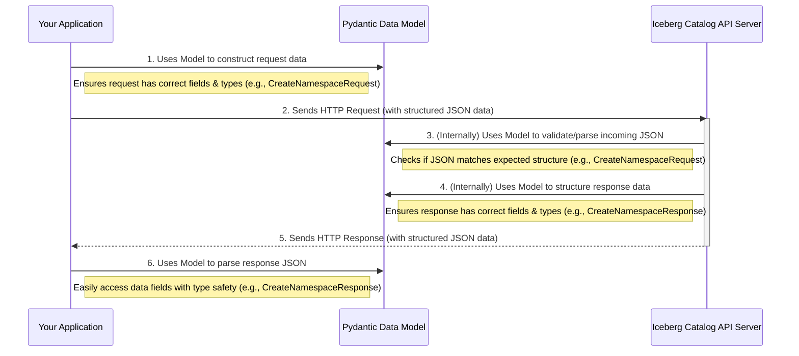

# Chapter 4: Data Models

Welcome to Chapter 4! In the previous chapter, [Chapter 3: Table Metadata](03_table_metadata_.md), we explored the "passport" for an Iceberg table, which contains all its defining information. We saw that this metadata is often a complex JSON structure.

Now, imagine you're building a program that needs to read this table metadata, or perhaps send information to create a new table. How does your program know exactly what fields to expect or what fields it needs to send? If the program sends data in the wrong format, or if it misinterprets the data it receives, things can go wrong quickly! This is where **Data Models** come in.

## What are Data Models? The Lego Brick Analogy

Think of **Data Models** in the `open-api` project as perfectly shaped molds for different types of Lego bricks.
*   Each **mold (data model)** defines the exact shape, size, and features a specific type of Lego brick must have. For example, a "2x4 red brick" mold is different from a "1x1 blue plate" mold.
*   Each **Lego brick (data instance)** created from a mold will perfectly match that mold's specifications.
*   Because all bricks of a certain type are identical in form, they **fit together properly** with other bricks.

In our API, data is constantly being exchanged: your application might send a request to the server to create a namespace, or the server might send back details about a table. Data Models ensure that this data has the correct "shape" and "features."

Specifically, these Data Models are Python classes that use a library called **Pydantic**. They precisely define the structure of data for things like:
*   `TableMetadata` (the table's passport we just learned about)
*   `ErrorModel` (how errors are described)
*   `Namespace` (how we organize tables)
*   `Snapshot` (a point-in-time version of a table)
*   And many others!

## Why Do We Need These "Molds"?

Using Data Models offers several key advantages:

1.  **Data Consistency:** Everyone (your client application, the server, other tools) agrees on what the data looks like. If the API says it will send you `TableMetadata`, the Data Model for `TableMetadata` tells you exactly what fields to expect (e.g., `table-uuid`, `location`, `schemas`). There's no guesswork.

2.  **Data Validation:** If your program tries to send data that doesn't fit the "mold" (e.g., providing text where a number is expected, or forgetting a required field), Pydantic (the library behind these models) will automatically raise an error. This helps catch bugs early.
    *   *Imagine trying to force a round peg into a square hole – the mold (Data Model) prevents this!*

3.  **Ease of Use for Developers:**
    *   **Clear Structure:** When writing code, you know exactly what attributes an object has.
    *   **Autocomplete & Type Hinting:** Modern code editors can use these models to provide suggestions and catch type errors as you type.
    *   **Parsing & Serialization:** Pydantic makes it easy to convert JSON data from the API into Python objects, and vice-versa.

## A Quick Peek at Pydantic Models

Pydantic models are Python classes that inherit from `BaseModel`. You define the fields of your data structure as class attributes with type hints.

Here's a very simple, general example (not directly from `open-api` yet):

```python
from pydantic import BaseModel
from typing import List

class Author(BaseModel):
    name: str
    email: str

class Book(BaseModel):
    title: str
    author: Author # A nested model!
    tags: List[str] # A list of strings
    pages: int
```
This `Book` model clearly defines that a book must have a `title` (string), an `author` (which itself is structured according to the `Author` model), a list of `tags`, and a number of `pages`.

If you tried to create a `Book` object without a `title`, or with `pages` as text like `"one hundred"`, Pydantic would complain!

## Data Models in `open-api`

In [Chapter 1: API Specification](01_api_specification_.md), we learned that the `rest-catalog-open-api.yaml` file is the blueprint for our API. We also saw that a command `datamodel-codegen` can generate Python code from this blueprint.

The **Data Models** we're talking about in this chapter are precisely the Python classes generated by that `datamodel-codegen` process. They are all collected in a file named `rest-catalog-open-api.py`.

Let's look at a few examples we've encountered conceptually in previous chapters, now as simplified Pydantic models:

1.  **`ErrorModel`** (Seen in [Chapter 1: API Specification](01_api_specification_.md)):
    ```python
    # Snippet from rest-catalog-open-api.py
    from pydantic import BaseModel, Field
    from typing import Optional, List

    class ErrorModel(BaseModel):
        message: str = Field(..., description='Human-readable error message')
        type: str = Field(..., description='Internal type definition of the error')
        code: int = Field(..., description='HTTP response code')
        stack: Optional[List[str]] = None # Optional field
    ```
    This model defines that an error message from the API will always have a `message`, `type`, and `code`. It *might* also have a `stack` trace.

2.  **`Namespace`** (Seen in [Chapter 2: Namespace](02_namespace_.md)):
    ```python
    # Snippet from rest-catalog-open-api.py
    class Namespace(BaseModel):
        __root__: List[str] = Field(
            ...,
            description='Reference to one or more levels of a namespace',
            example=['accounting', 'tax'],
        )
    ```
    This shows that a `Namespace` is fundamentally represented as a list of strings.

3.  **`TableIdentifier`** (Used to uniquely name a table):
    ```python
    # Snippet from rest-catalog-open-api.py
    class TableIdentifier(BaseModel):
        namespace: Namespace # Uses the Namespace model!
        name: str
    ```
    A `TableIdentifier` combines a `Namespace` object and a table `name` (string). This shows how models can be composed of other models.

4.  **`Snapshot`** (A part of [Table Metadata](03_table_metadata_.md)):
    ```python
    # Snippet from rest-catalog-open-api.py
    # Simplified for brevity
    class Summary(BaseModel):
        operation: str # e.g., 'append', 'overwrite'

    class Snapshot(BaseModel):
        snapshot_id: int = Field(..., alias='snapshot-id')
        timestamp_ms: int = Field(..., alias='timestamp-ms')
        manifest_list: str = Field(..., alias='manifest-list')
        summary: Summary # Another nested model
        # ... other fields like parent-snapshot-id, schema-id ...
    ```
    A `Snapshot` has its own ID, a timestamp, a link to its manifest list (which describes its data files), and a `summary` of the operation that created it.

These Pydantic classes are the "molds" that ensure data consistency when your application talks to the Iceberg catalog API.

## How Data Models Work in Practice

Let's imagine your application wants to create a new namespace called "marketing" with a property "owner" set to "Alice".

**1. Constructing a Request (Client-Side):**
Your Python code would use the `CreateNamespaceRequest` model (defined in `rest-catalog-open-api.py`) to build the request data:

```python
# Your application code
from open_api_module import CreateNamespaceRequest, Namespace # Assuming models are here

# Define the namespace as a list of strings
marketing_ns_levels = ["marketing"]
marketing_namespace = Namespace(__root__=marketing_ns_levels)

# Create the request object
request_data = CreateNamespaceRequest(
    namespace=marketing_namespace,
    properties={"owner": "Alice"}
)

# Now, convert this Pydantic object to JSON to send to the API
json_to_send = request_data.json()
print(json_to_send)
# Output might be:
# {"namespace": ["marketing"], "properties": {"owner": "Alice"}}
```
Here, Pydantic ensures `request_data` matches the `CreateNamespaceRequest` structure. If you missed `namespace` or gave `properties` the wrong type, you'd get an error *before* even sending the request.

**2. Validating the Request (Server-Side - Conceptual):**
When the API server receives this JSON data, it would (conceptually) use the *same* `CreateNamespaceRequest` model to parse and validate it. If the JSON is malformed or missing required fields, the server knows immediately.

**3. Parsing a Response (Client-Side):**
Now, suppose the server responds successfully, confirming the namespace creation. It might send back JSON like this:
`{"namespace": ["marketing"], "properties": {"owner": "Alice", "created_by": "api_service"}}`

Your application can use the `CreateNamespaceResponse` model to parse this JSON into a Python object:

```python
# Your application code
from open_api_module import CreateNamespaceResponse

# Assume raw_json_response is the JSON string from the server
raw_json_response = '{"namespace": ["marketing"], "properties": {"owner": "Alice", "created_by": "api_service"}}'

# Parse the JSON into a Pydantic object
response_object = CreateNamespaceResponse.parse_raw(raw_json_response)

# Now you can easily access the data with type safety
print(f"Namespace created: {response_object.namespace.__root__}")
print(f"Owner: {response_object.properties['owner']}")
print(f"Created by: {response_object.properties['created_by']}")
```
If the server sent back an unexpected field or missed a required one (according to `CreateNamespaceResponse`), `parse_raw` would raise an error, alerting you to a mismatch.

## The "Shape Mold" in Action

This flow highlights how Data Models act as a contract at each step of communication:



## A Closer Look at the Generated `rest-catalog-open-api.py`

The file `rest-catalog-open-api.py` is the home for all these "Lego molds." It's automatically generated from the master `rest-catalog-open-api.yaml` specification. While it can be quite long, it's very systematically structured.

Let's look at `ErrorModel` again, but this time notice the `Field` import and its usage:

```python
# Snippet from rest-catalog-open-api.py
from pydantic import BaseModel, Field # Field is important!
from typing import Optional, List

class ErrorModel(BaseModel):
    """
    JSON error payload returned in a response with further details on the error
    """
    message: str = Field(..., description='Human-readable error message')
    type: str = Field(
        ...,
        description='Internal type definition of the error',
        example='NoSuchNamespaceException', # Provides an example value
    )
    code: int = Field(
        ..., description='HTTP response code', example=404, ge=400, le=600 # Validation: code >= 400 and <= 600
    )
    stack: Optional[List[str]] = None
```
*   `Field(...)`: The `...` (ellipsis) indicates that this field is required.
*   `description`: Provides a human-readable explanation of the field. This comes directly from the API specification.
*   `example`: Shows an example value, also from the specification.
*   `ge=400, le=600`: These are validation rules! Pydantic will ensure the `code` is greater than or equal to 400 and less than or equal to 600.

Models like `TableMetadata` (from [Chapter 3: Table Metadata](03_table_metadata_.md)) are also defined in this file. They are more complex because they often nest other models (like `Schema`, `Snapshot`, `PartitionSpec`), but they follow the same Pydantic principles. Each part of the table's "passport" has its own precise "mold."

## Conclusion: The Importance of Well-Defined Shapes

Data Models are the unsung heroes of robust API communication. By defining the precise structure and rules for data exchanged between your application and the Iceberg API server, these Pydantic-based models ensure:
*   **Consistency:** Everyone agrees on the format of data.
*   **Validation:** Errors due to misshapen data are caught early.
*   **Developer Productivity:** Code is easier to write, read, and maintain, with benefits like autocompletion and type checking.

Think of them as the grammar and vocabulary rules for the "language" spoken between the client and the server. Without these rules, communication would be chaotic and error-prone.

Now that we understand *what* our data (like [Table Metadata](03_table_metadata_.md)) looks like thanks to Data Models, we're ready to see how we can tell the API to *change* this metadata. In the next chapter, we'll explore [Metadata Updates](05_metadata_updates_.md).

---

Generated by [AI Codebase Knowledge Builder](https://github.com/The-Pocket/Tutorial-Codebase-Knowledge)