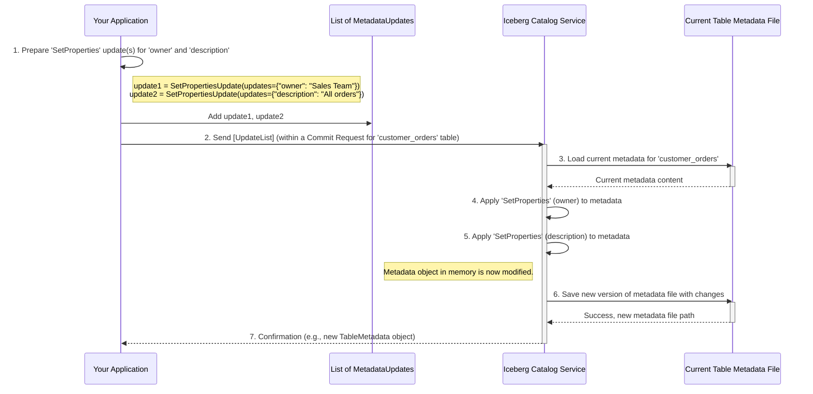

# Chapter 5: Metadata Updates

Welcome to Chapter 5! In [Chapter 4: Data Models](04_data_models_.md), we learned how Pydantic models act like "Lego brick molds," ensuring that all data exchanged with the Iceberg API, such as [Table Metadata](03_table_metadata_.md), has a consistent and predictable structure.

Now that we understand what table metadata *is* and how its structure is defined, how do we actually *change* it? If you want to add a new column to your table, change its description, or record a new version of its data, you need a way to tell the Iceberg catalog about these changes. This is where **Metadata Updates** come into play.

## Editing Your Table's "Passport"

Imagine your table's [Table Metadata](03_table_metadata_.md) is like its official passport. This passport contains all crucial information: its schema (columns and types), its location, its properties (like owner or description), and a history of its versions (snapshots).

What if you need to make a change to this passport?
*   Maybe the table's owner has changed.
*   Perhaps you've added a new column to your data.
*   You might have loaded new data, creating a new "version" (snapshot) of the table.
*   Or you decided to move the table's data files to a new storage location.

You can't just scribble on the passport directly! You need specific, official procedures to request these changes. **Metadata Updates** are these precise, individual operations that modify the metadata of a table or view.

## Your Toolkit for Modifying Metadata

Think of Metadata Updates as a set of specialized tools in a toolkit for editing a very important document (your table's metadata). Each tool performs one specific kind of change:

*   **`AddSchemaUpdate`**: Like a tool for adding a new paragraph defining a new section (adding a new schema definition with new columns).
*   **`SetPropertiesUpdate`**: Similar to a tool that changes the font size or author name in the document's header (modifying table properties like `owner` or `comment`).
*   **`AddSnapshotUpdate`**: Acts like a "Save As New Version" tool, registering a new state of the table after data has been written.
*   **`SetLocationUpdate`**: Like a tool to update the document's stored address (changing where the table's data files are physically located).

Each update represents a distinct, well-defined change. You pick the right tool (the specific update type) for the job you want to do.

Common examples of metadata updates include:
*   Assigning a unique ID (UUID) to a new table.
*   Upgrading the table's format version.
*   Adding a new schema or changing the current schema.
*   Adding new rules for how data is partitioned (`PartitionSpec`).
*   Adding new rules for how data is sorted (`SortOrder`).
*   Registering a new snapshot (a new version of the table).
*   Setting or removing table properties.
*   Changing the table's physical storage location.

## Using Metadata Updates: An Example

Let's say we have a table named `customer_orders`, and we want to add a property to it: `owner: 'Sales Team'`.

1.  **Identify the Goal:** We want to modify a table property.
2.  **Choose the Right Tool:** Looking at our "toolkit," the `SetPropertiesUpdate` is the correct tool for this.
3.  **Prepare the Update:** We need to specify what property to add or change. The update itself would look something like this (conceptually):
    *   **Action:** `set-properties`
    *   **Updates:** `{'owner': 'Sales Team'}`

This single, precise instruction tells the Iceberg catalog exactly what we want to do: "For the table I'm working with, set (or update) its properties. The property to set is 'owner', and its value should be 'Sales Team'."

If we also wanted to add a new column, say `order_priority`, we'd use a different tool, an `AddSchemaUpdate`, in conjunction with this `SetPropertiesUpdate`. These updates are usually bundled together and applied in what's called a [Commit Operation](06_commit_operations_.md), which we'll explore in the next chapter. For now, let's focus on what these individual update "tools" look like.

## Metadata Updates in `open-api` (The Pydantic "Molds")

Just like other data structures, Metadata Updates are defined as Pydantic models in the `rest-catalog-open-api.py` file. This ensures that when your application tells the API server what changes to make, the instructions are perfectly clear.

All specific update types (like `SetPropertiesUpdate`, `AddSchemaUpdate`, etc.) are variations of a `BaseUpdate` model. A key field in each update is `action`, which is a string that tells the server what kind of update it is.

Let's look at simplified Pydantic models for a few common update "tools":

1.  **`SetPropertiesUpdate`**: For adding or changing table properties.
    ```python
    # Snippet from rest-catalog-open-api.py (simplified)
    class SetPropertiesUpdate(BaseUpdate):
        action: str = Field('set-properties', const=True) # Identifies the update type
        updates: Dict[str, str] # A dictionary of properties to set
    ```
    *   `action: str = Field('set-properties', const=True)`: This field clearly states this is a "set-properties" operation. The `const=True` means this field *must* have the value `'set-properties'`.
    *   `updates: Dict[str, str]`: This field holds the actual properties you want to add or change, like `{"owner": "Sales Team", "description": "Tracks customer orders"}`.

2.  **`AddSchemaUpdate`**: For adding a new schema definition to the table.
    ```python
    # Snippet from rest-catalog-open-api.py (simplified)
    class AddSchemaUpdate(BaseUpdate):
        action: str = Field('add-schema', const=True)
        schema_: Schema = Field(..., alias='schema') # The new schema to add
        # last_column_id: Optional[int] ... (omitted for simplicity)
    ```
    *   `schema_`: This field would contain a full `Schema` object (another Pydantic model we saw in [Data Models](04_data_models_.md)) defining the new table structure.

3.  **`AddSnapshotUpdate`**: For registering a new snapshot (a new version of the table).
    ```python
    # Snippet from rest-catalog-open-api.py (simplified)
    class AddSnapshotUpdate(BaseUpdate):
        action: str = Field('add-snapshot', const=True)
        snapshot: Snapshot # The Snapshot object to add
    ```
    *   `snapshot`: This field holds a `Snapshot` object (another Pydantic model) which describes the new state of the table, including which data files it contains.

4.  **`SetLocationUpdate`**: For changing the table's base storage location.
    ```python
    # Snippet from rest-catalog-open-api.py (simplified)
    class SetLocationUpdate(BaseUpdate):
        action: str = Field('set-location', const=True)
        location: str # The new S3/HDFS/etc. path for the table
    ```
    *   `location`: A string representing the new base path for the table's data and metadata files.

There are many other types of updates (like `AssignUUIDUpdate`, `UpgradeFormatVersionUpdate`, `SetCurrentSchemaUpdate`, etc.), each with its specific `action` string and required fields.

The `open-api` specification defines a general `TableUpdate` model which is a `Union` of all these specific update types. This means a `TableUpdate` can be *any one* of these specialized tools.

```python
# Snippet from rest-catalog-open-api.py
# (Illustrative - actual Union is much longer)
class TableUpdate(BaseModel):
    __root__: Union[
        AssignUUIDUpdate,
        UpgradeFormatVersionUpdate,
        AddSchemaUpdate,
        SetPropertiesUpdate,
        AddSnapshotUpdate,
        SetLocationUpdate,
        # ... and many other update types
    ]
```
When you want to modify a table, you'll typically prepare a list of these `TableUpdate` objects.

## How are Metadata Updates Processed? (A Sneak Peek)

While we'll dive deep into how these updates are applied in the next chapter on [Commit Operations](06_commit_operations_.md), let's get a high-level idea.

Imagine you want to update the owner of the `customer_orders` table to "Sales Team" and also add a description property.

1.  **Prepare Updates:** Your application would create two `MetadataUpdate` objects:
    *   A `SetPropertiesUpdate` with `updates: {"owner": "Sales Team"}`.
    *   Another `SetPropertiesUpdate` with `updates: {"description": "All confirmed customer orders"}`.
    (Alternatively, these could be combined into one `SetPropertiesUpdate` if the API supports updating multiple properties at once: `updates: {"owner": "Sales Team", "description": "All confirmed customer orders"}`)

2.  **Send to Server:** Your application sends this list of updates to the Iceberg Catalog Service as part of a "commit" request.

3.  **Server Action:** The Catalog Service receives the list of updates. It then:
    *   Loads the current [Table Metadata](03_table_metadata_.md) for `customer_orders`.
    *   Applies each update from your list to this metadata. In our example, it would add/update the `owner` and `description` properties.
    *   Creates a new version of the [Table Metadata](03_table_metadata_.md) file reflecting these changes.
    *   Responds to your application, usually with the new, updated table metadata.

Here's a simplified diagram of this flow:



This process ensures that changes to table metadata are explicit, trackable, and applied correctly.

## Conclusion

Metadata Updates are the individual, specific "tools" or commands used to modify a table's or view's metadata. Each update, like `AddSchemaUpdate` or `SetPropertiesUpdate`, represents a distinct change, identified by its `action` field. These updates are defined as Pydantic models in `open-api`, ensuring clear communication of intent.

While each update is a single operation, they are typically grouped together and applied atomically as part of a larger transaction. Understanding these fundamental building blocks is crucial for knowing how Iceberg tables evolve.

In the next chapter, we'll see exactly how these individual updates are packaged and applied to safely change a table's state in [Chapter 6: Commit Operations](06_commit_operations_.md).

---

Generated by [AI Codebase Knowledge Builder](https://github.com/The-Pocket/Tutorial-Codebase-Knowledge)